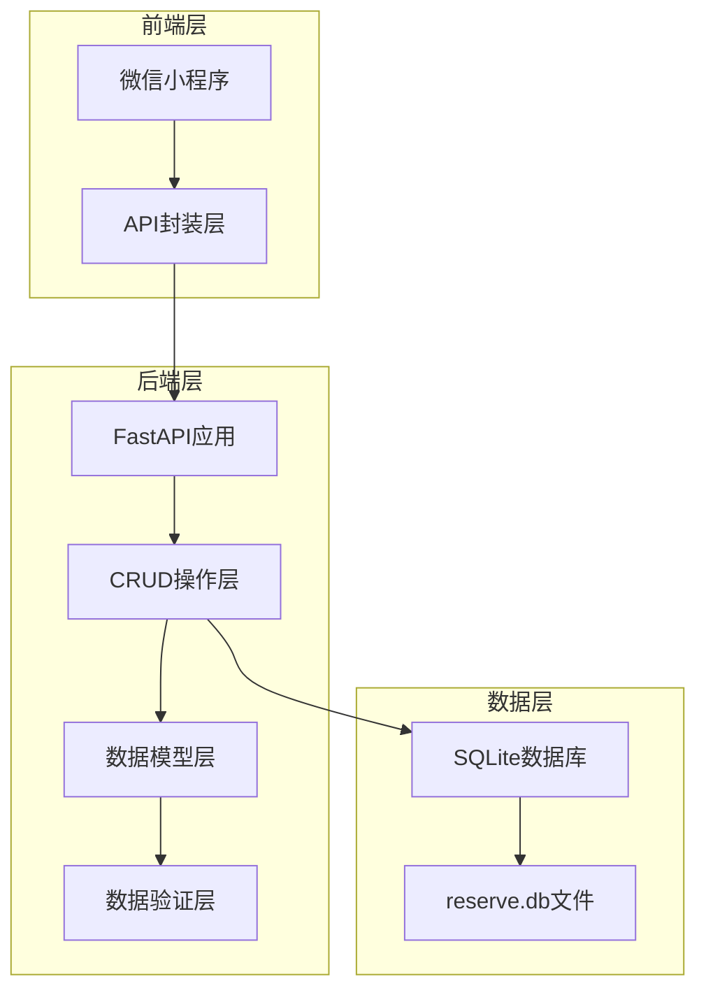
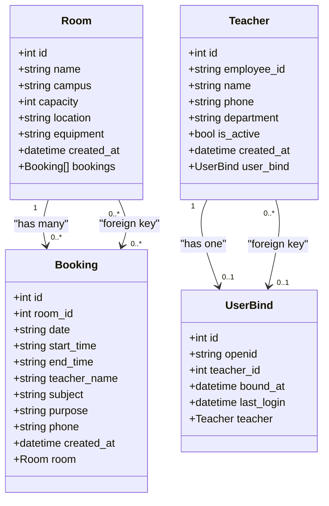
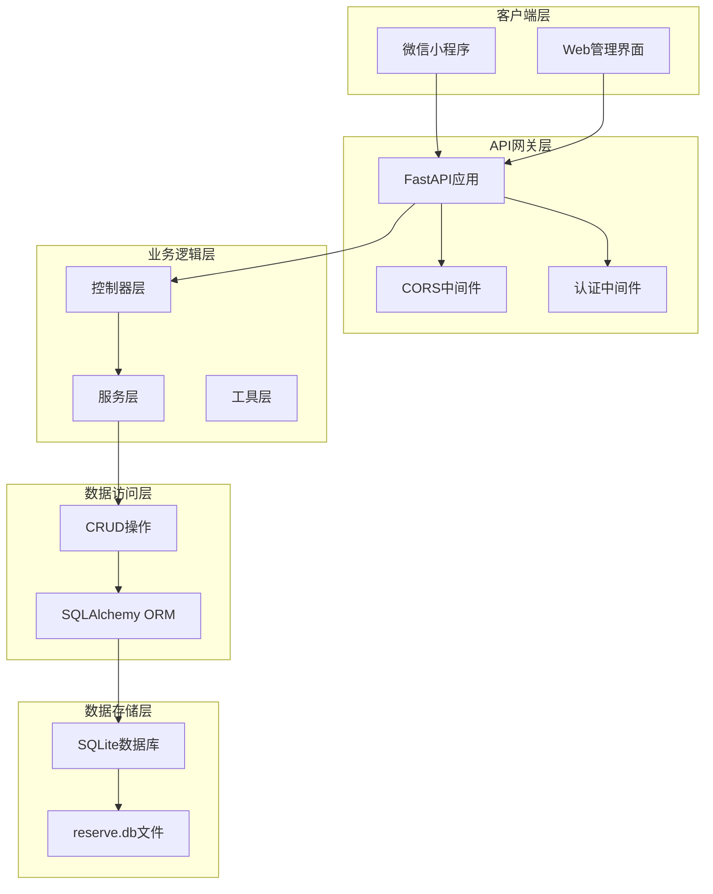
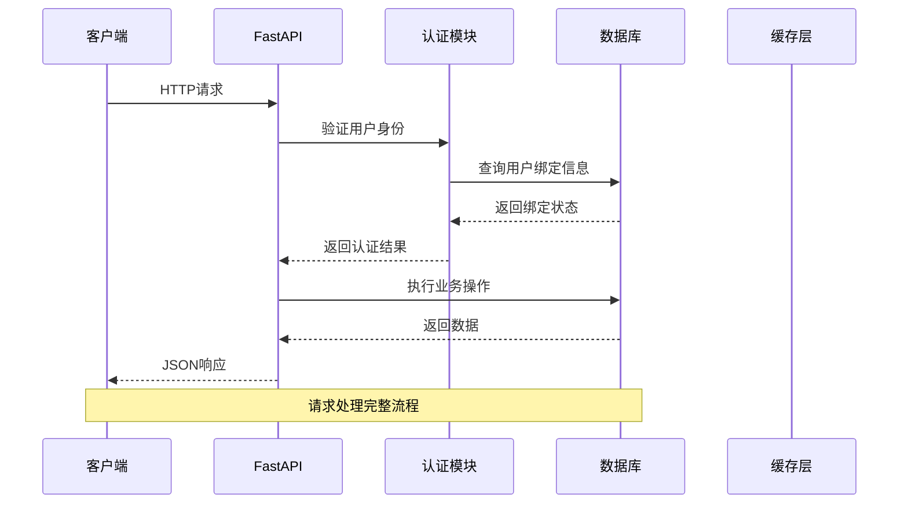
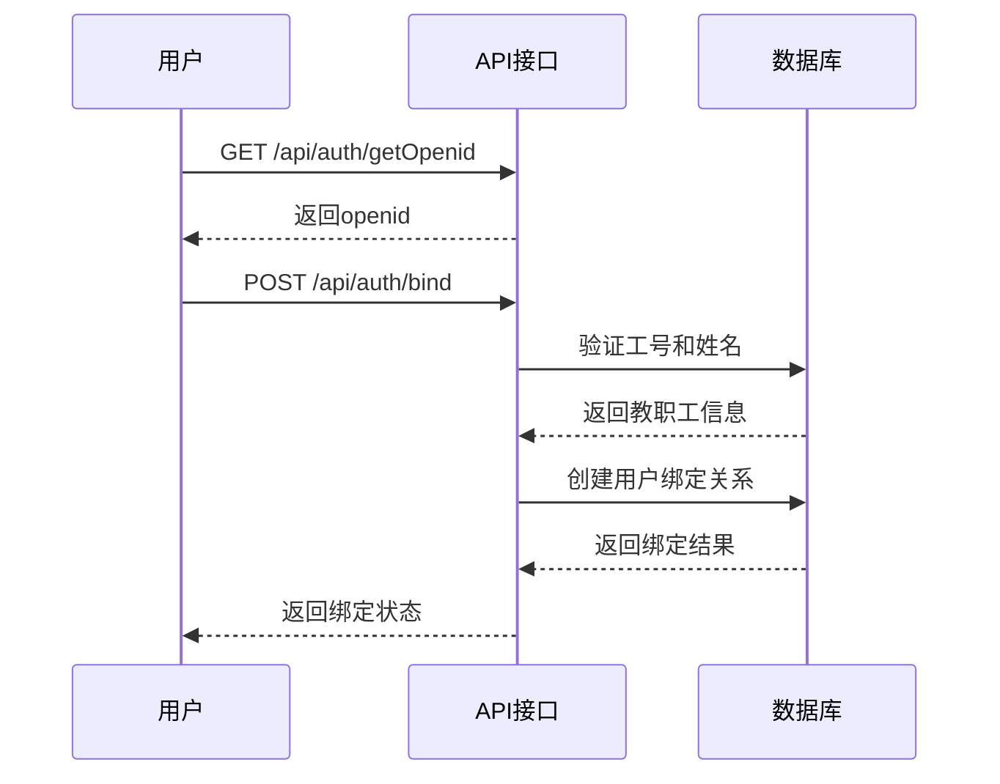
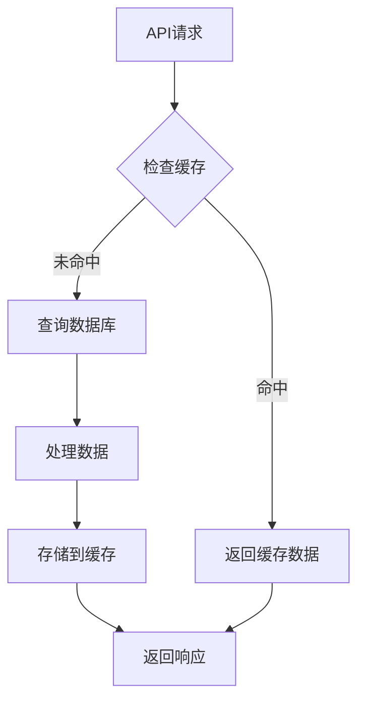

# API接口文档

<cite>
**本文档引用的文件**
- [backend/main.py](file://backend/main.py)
- [backend/models.py](file://backend/models.py)
- [backend/schemas.py](file://backend/schemas.py)
- [backend/crud.py](file://backend/crud.py)
- [backend/database.py](file://backend/database.py)
- [backend/requirements.txt](file://backend/requirements.txt)
- [miniprogram/utils/api.js](file://miniprogram/utils/api.js)
- [miniprogram/app.js](file://miniprogram/app.js)
- [README.md](file://README.md)
</cite>

## 目录
1. [简介](#简介)
2. [项目结构](#项目结构)
3. [核心组件](#核心组件)
4. [架构概览](#架构概览)
5. [详细接口规范](#详细接口规范)
6. [认证机制](#认证机制)
7. [CORS配置](#cors配置)
8. [错误处理](#错误处理)
9. [性能考虑](#性能考虑)
10. [故障排除指南](#故障排除指南)
11. [结论](#结论)

## 简介

西安交通大学软件学院会议室预约系统是一个基于微信小程序 + FastAPI + SQLite 的前后端分离架构系统。该系统为教师提供便捷的会议室预约服务，支持多校区管理、实时状态查询、可视化时间线预约等功能。

系统采用现代化的技术栈：
- **前端**：微信小程序原生开发 + Vant Weapp UI组件库
- **后端**：FastAPI (Python) + SQLAlchemy ORM
- **数据库**：SQLite 轻量级文件数据库
- **部署**：支持云托管和传统服务器部署

## 项目结构



**图表来源**
- [backend/main.py:1-673](file://backend/main.py#L1-L673)
- [backend/models.py:1-75](file://backend/models.py#L1-L75)
- [backend/schemas.py:1-185](file://backend/schemas.py#L1-L185)

**章节来源**
- [backend/main.py:1-673](file://backend/main.py#L1-L673)
- [backend/models.py:1-75](file://backend/models.py#L1-L75)
- [backend/schemas.py:1-185](file://backend/schemas.py#L1-L185)

## 核心组件

### 数据模型架构

系统采用清晰的数据模型分层设计：



**图表来源**
- [backend/models.py:8-75](file://backend/models.py#L8-L75)

### API路由架构

系统提供完整的RESTful API接口，按功能模块组织：

```mermaid
graph TD
subgraph "校区管理"
Campus[GET /api/campus<br/>获取校区列表]
end
subgraph "会议室管理"
RoomsList[GET /api/rooms<br/>获取会议室列表]
RoomDetail[GET /api/rooms/{id}<br/>获取会议室详情]
Timeline[GET /api/rooms/{id}/timeline<br/>获取时间线]
end
subgraph "预约管理"
BookingsList[GET /api/bookings<br/>获取预约列表]
CreateBooking[POST /api/bookings<br/>创建预约]
DeleteBooking[DELETE /api/bookings/{id}<br/>取消预约]
end
subgraph "认证管理"
GetOpenID[GET /api/auth/getOpenid<br/>获取OpenID]
AuthStatus[GET /api/auth/status<br/>获取认证状态]
BindUser[POST /api/auth/bind<br/>绑定用户]
UserInfo[GET /api/auth/userinfo<br/>获取用户信息]
UnbindUser[POST /api/auth/unbind<br/>解绑用户]
end
subgraph "管理后台"
AdminRooms[GET/POST/PUT/DELETE /api/admin/rooms]
AdminTeachers[GET/POST/PUT/DELETE /api/admin/teachers]
end
```

**图表来源**
- [backend/main.py:69-618](file://backend/main.py#L69-L618)

**章节来源**
- [backend/models.py:1-75](file://backend/models.py#L1-L75)
- [backend/main.py:69-618](file://backend/main.py#L69-L618)

## 架构概览

### 系统架构图



**图表来源**
- [backend/main.py:17-31](file://backend/main.py#L17-L31)
- [backend/database.py:1-62](file://backend/database.py#L1-L62)

### 数据流处理



**图表来源**
- [backend/main.py:469-500](file://backend/main.py#L469-L500)
- [backend/crud.py:308-342](file://backend/crud.py#L308-L342)

## 详细接口规范

### 校区管理接口

#### 获取校区列表

**接口描述**: 获取所有可用校区的信息

**HTTP请求**: `GET /api/campus`

**请求参数**: 无

**响应数据**:
```json
[
  {
    "code": "xingqing",
    "name": "兴庆校区"
  },
  {
    "code": "chuangxin", 
    "name": "创新港校区"
  }
]
```

**使用场景**: 
- 预约页面加载时获取校区选项
- 管理后台校区管理

**章节来源**
- [backend/main.py:69-75](file://backend/main.py#L69-L75)

### 会议室查询接口

#### 获取会议室列表

**接口描述**: 获取会议室列表，支持按校区过滤和实时状态查询

**HTTP请求**: `GET /api/rooms`

**查询参数**:
| 参数名 | 必填 | 类型 | 描述 | 示例 |
|--------|------|------|------|------|
| campus | 否 | string | 校区代码 | `xingqing` |
| date | 否 | string | 查询日期 | `2024-01-15` |
| current_date | 否 | string | 当前日期 | `2024-01-15` |
| current_time | 否 | string | 当前时间 | `14:30` |

**响应数据**:
```json
[
  {
    "id": 1,
    "name": "软件学院西小楼 114",
    "campus": "xingqing",
    "capacity": 20,
    "location": "软件学院西小楼114",
    "equipment": "投影仪,白板,空调",
    "created_at": "2024-01-01T10:00:00",
    "is_available": true,
    "earliest_available": "08:00"
  }
]
```

**使用场景**:
- 预约页面展示可用会议室
- 实时显示会议室状态

**章节来源**
- [backend/main.py:80-108](file://backend/main.py#L80-L108)

#### 获取单个会议室详情

**接口描述**: 获取指定会议室的详细信息

**HTTP请求**: `GET /api/rooms/{room_id}`

**路径参数**:
| 参数名 | 必填 | 类型 | 描述 |
|--------|------|------|------|
| room_id | 是 | integer | 会议室ID |

**响应数据**:
```json
{
  "id": 1,
  "name": "软件学院西小楼 114", 
  "campus": "xingqing",
  "capacity": 20,
  "location": "软件学院西小楼114",
  "equipment": "投影仪,白板,空调",
  "created_at": "2024-01-01T10:00:00"
}
```

**使用场景**:
- 会议室详情页面
- 预约确认页面

**章节来源**
- [backend/main.py:111-117](file://backend/main.py#L111-L117)

### 时间线获取接口

#### 获取会议室时间线

**接口描述**: 获取指定会议室某天的时间线，显示每30分钟时段的占用状态

**HTTP请求**: `GET /api/rooms/{room_id}/timeline`

**路径参数**:
| 参数名 | 必填 | 类型 | 描述 |
|--------|------|------|------|
| room_id | 是 | integer | 会议室ID |

**查询参数**:
| 参数名 | 必填 | 类型 | 描述 | 示例 |
|--------|------|------|------|------|
| date | 是 | string | 查询日期 | `2024-01-15` |

**响应数据**:
```json
{
  "room_id": 1,
  "room_name": "软件学院西小楼 114",
  "date": "2024-01-15",
  "slots": [
    {
      "start_time": "08:00",
      "end_time": "08:30", 
      "status": "available",
      "earliest_available": "08:00",
      "bookings": []
    },
    {
      "start_time": "08:30",
      "end_time": "09:00",
      "status": "partially_booked",
      "earliest_available": "09:00",
      "bookings": [
        {
          "id": 1,
          "start_time": "08:30",
          "end_time": "09:00",
          "teacher_name": "张老师",
          "purpose": "组会",
          "phone": "13800138000"
        }
      ]
    }
  ]
```

**状态说明**:
- `available`: 完全空闲
- `partially_booked`: 部分占用（有5分钟以上连续空闲）
- `fully_booked`: 完全占用

**使用场景**:
- 可视化时间线选择预约时段
- 实时显示会议室占用情况

**章节来源**
- [backend/main.py:120-246](file://backend/main.py#L120-L246)

### 预约管理接口

#### 获取预约列表

**接口描述**: 获取预约列表，支持多种筛选条件

**HTTP请求**: `GET /api/bookings`

**查询参数**:
| 参数名 | 必填 | 类型 | 描述 |
|--------|------|------|------|
| date | 否 | string | 日期 | `2024-01-15` |
| room_id | 否 | integer | 会议室ID | `1` |
| teacher_name | 否 | string | 教师姓名 | `张老师` |
| campus | 否 | string | 校区代码 | `xingqing` |

**响应数据**:
```json
[
  {
    "id": 1,
    "room_id": 1,
    "date": "2024-01-15",
    "start_time": "09:00",
    "end_time": "11:00", 
    "teacher_name": "张老师",
    "subject": "组会",
    "purpose": "组会讨论",
    "phone": "13800138000",
    "created_at": "2024-01-10T14:30:00",
    "room_name": "软件学院西小楼 114",
    "room_location": "软件学院西小楼114",
    "campus": "xingqing"
  }
]
```

**使用场景**:
- 管理后台查看所有预约
- 教师查看个人预约历史

**章节来源**
- [backend/main.py:251-279](file://backend/main.py#L251-L279)

#### 创建预约

**接口描述**: 创建新的会议室预约（需要用户认证）

**HTTP请求**: `POST /api/bookings`

**请求头**: `Content-Type: application/json`

**请求体**:
```json
{
  "room_id": 1,
  "date": "2024-01-15",
  "start_time": "09:00",
  "end_time": "11:00",
  "teacher_name": "张老师",
  "subject": "组会",
  "purpose": "组会讨论",
  "phone": "13800138000",
  "client_date": "2024-01-15",
  "client_time": "14:30"
}
```

**响应数据**:
```json
{
  "id": 2,
  "room_id": 1,
  "date": "2024-01-15",
  "start_time": "09:00", 
  "end_time": "11:00",
  "teacher_name": "张老师",
  "subject": "组会",
  "purpose": "组会讨论",
  "phone": "13800138000",
  "created_at": "2024-01-10T14:35:00"
}
```

**验证规则**:
- 不能预约过去的日期
- 预约日期不能超过当前日期60天
- 不能预约已过去的时间段
- 时间段不能与其他预约冲突
- 结束时间必须晚于开始时间
- 预约时间必须在08:00-22:00之间

**使用场景**:
- 教师创建会议室预约
- 预约确认和提交

**章节来源**
- [backend/main.py:282-333](file://backend/main.py#L282-L333)

#### 取消预约

**接口描述**: 取消指定的会议室预约

**HTTP请求**: `DELETE /api/bookings/{booking_id}`

**路径参数**:
| 参数名 | 必填 | 类型 | 描述 |
|--------|------|------|------|
| booking_id | 是 | integer | 预约ID |

**响应数据**:
```json
{
  "message": "预约已取消"
}
```

**使用场景**:
- 教师取消不需要的预约
- 管理员删除违规预约

**章节来源**
- [backend/main.py:336-341](file://backend/main.py#L336-L341)

### 管理后台接口

#### 会议室管理

**获取所有会议室**: `GET /api/admin/rooms`

**创建会议室**: `POST /api/admin/rooms`

**更新会议室**: `PUT /api/admin/rooms/{id}`

**删除会议室**: `DELETE /api/admin/rooms/{id}`

#### 教职工管理

**获取所有教职工**: `GET /api/admin/teachers`

**创建教职工**: `POST /api/admin/teachers`

**更新教职工**: `PUT /api/admin/teachers/{id}`

**删除教职工**: `DELETE /api/admin/teachers/{id}`

**解绑教职工**: `POST /api/admin/unbind/{teacher_id}`

**章节来源**
- [backend/main.py:344-441](file://backend/main.py#L344-L441)

## 认证机制

### OpenID获取

系统支持两种获取OpenID的方式：

1. **云托管环境**：通过请求头自动注入 `X-WX-OPENID`
2. **开发环境**：使用模拟OpenID

**接口**: `GET /api/auth/getOpenid`

**响应数据**:
```json
{
  "openid": "wx_openid_1234567890"
}
```

### 用户绑定流程



**图表来源**
- [backend/main.py:503-584](file://backend/main.py#L503-L584)

### 认证状态检查

**接口**: `GET /api/auth/status`

**查询参数**:
| 参数名 | 必填 | 类型 | 描述 |
|--------|------|------|------|
| openid | 是 | string | 用户OpenID |

**响应数据**:
```json
{
  "is_bound": true,
  "teacher_name": "张老师",
  "employee_id": "123456"
}
```

### 用户信息获取

**接口**: `GET /api/auth/userinfo`

**查询参数**:
| 参数名 | 必填 | 类型 | 描述 |
|--------|------|------|------|
| openid | 是 | string | 用户OpenID |

**响应数据**:
```json
{
  "openid": "wx_openid_1234567890",
  "employee_id": "123456",
  "name": "张老师",
  "phone": "13800138000",
  "department": "软件学院",
  "bound_at": "2024-01-01T10:00:00"
}
```

**章节来源**
- [backend/main.py:469-618](file://backend/main.py#L469-L618)

## CORS配置

### 跨域设置

系统使用FastAPI的CORS中间件，默认配置如下：

```python
app.add_middleware(
    CORSMiddleware,
    allow_origins=["*"],  # 生产环境应限制
    allow_credentials=True,
    allow_methods=["*"],
    allow_headers=["*"],
)
```

### 生产环境建议

```python
# 生产环境推荐配置
app.add_middleware(
    CORSMiddleware,
    allow_origins=["https://your-domain.com"],
    allow_credentials=True,
    allow_methods=["GET", "POST", "PUT", "DELETE"],
    allow_headers=["Content-Type", "Authorization"],
)
```

**章节来源**
- [backend/main.py:23-30](file://backend/main.py#L23-L30)

## 错误处理

### HTTP状态码

系统遵循标准HTTP状态码：

| 状态码 | 用途 | 示例场景 |
|--------|------|----------|
| 200 | 成功 | 正常响应 |
| 201 | 创建成功 | 新资源创建 |
| 400 | 请求错误 | 参数验证失败 |
| 401 | 未认证 | 用户未绑定 |
| 404 | 资源不存在 | 会议室/预约不存在 |
| 500 | 服务器错误 | 服务器内部错误 |

### 错误响应格式

```json
{
  "detail": "错误描述信息"
}
```

### 常见错误场景

1. **时间冲突**: 预约时间段与其他预约重叠
2. **日期无效**: 预约过去日期或超出60天限制
3. **时间无效**: 结束时间早于开始时间或超出工作时间
4. **用户未认证**: 未绑定微信账户
5. **资源不存在**: 会议室或预约ID不存在

**章节来源**
- [backend/main.py:282-333](file://backend/main.py#L282-L333)

## 性能考虑

### 数据库优化

1. **索引策略**: 
   - `rooms.id` - 主键索引
   - `bookings.room_id` - 外键索引
   - `bookings.date` - 日期查询索引

2. **查询优化**:
   - 使用JOIN查询减少数据库往返
   - 合理使用LIMIT限制结果集
   - 避免N+1查询问题

### 缓存策略



### 并发控制

1. **数据库连接池**: 使用SQLAlchemy连接池管理
2. **事务处理**: 合理使用数据库事务确保数据一致性
3. **锁机制**: 预约创建时使用适当的锁防止并发冲突

## 故障排除指南

### 常见问题诊断

#### 1. 小程序请求失败

**症状**: 小程序无法连接到后端API

**排查步骤**:
1. 检查后端服务是否正常运行
2. 验证域名是否配置HTTPS
3. 确认小程序后台服务器域名配置
4. 检查CORS配置是否正确

#### 2. 预约创建失败

**症状**: 预约创建时报错

**排查步骤**:
1. 检查时间格式是否正确 (YYYY-MM-DD, HH:MM)
2. 验证会议室是否存在
3. 确认时间不与现有预约冲突
4. 检查用户是否已绑定

#### 3. 认证问题

**症状**: 用户无法登录或绑定

**排查步骤**:
1. 检查OpenID获取是否成功
2. 验证教职工工号和姓名是否正确
3. 确认用户是否已绑定其他账户
4. 检查数据库连接是否正常

### 调试工具

**调试接口**: `GET /api/debug/db-status`

**用途**: 检查数据库状态和数据完整性

**响应数据**:
```json
{
  "db_path": "/path/to/reserve.db",
  "data_dir": "/data",
  "teachers_count": 10,
  "binds_count": 8,
  "rooms_count": 2
}
```

**章节来源**
- [backend/main.py:445-460](file://backend/main.py#L445-L460)

## 结论

本API接口文档涵盖了西安交通大学软件学院会议室预约系统的所有核心功能。系统采用RESTful设计原则，提供了完整的会议室管理、预约管理和用户认证功能。

### 系统优势

1. **完整的功能覆盖**: 从校区管理到预约管理的全流程支持
2. **实时状态显示**: 提供会议室实时占用状态和最早可预约时间
3. **灵活的查询接口**: 支持多种筛选条件的预约查询
4. **安全的认证机制**: 基于微信OpenID的用户认证和绑定
5. **易于扩展**: 清晰的架构设计便于功能扩展和维护

### 部署建议

1. **生产环境配置**: 限制CORS来源，启用HTTPS，配置防火墙
2. **监控和日志**: 设置服务监控和错误日志收集
3. **备份策略**: 定期备份数据库文件
4. **性能优化**: 根据使用量调整数据库连接池和缓存策略

该系统为高校教师提供了便捷的会议室预约解决方案，具有良好的可扩展性和维护性，适合在类似环境中部署和使用。