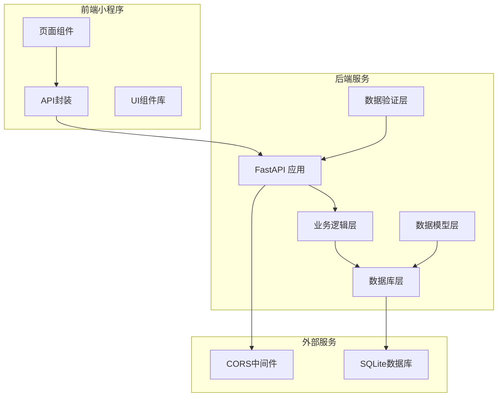
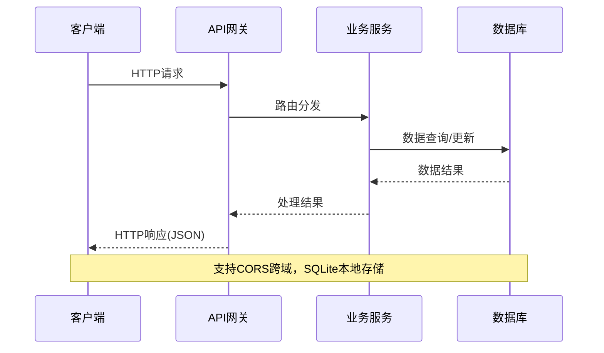
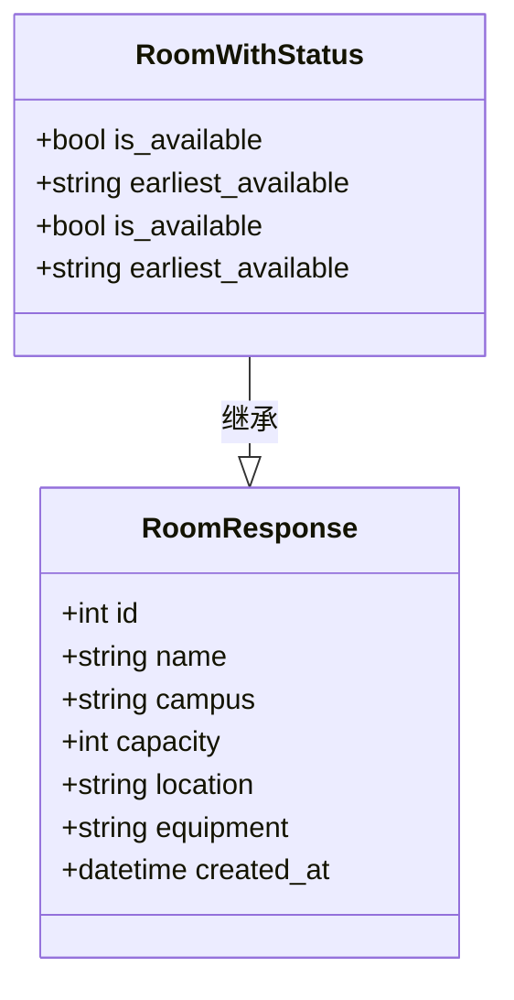
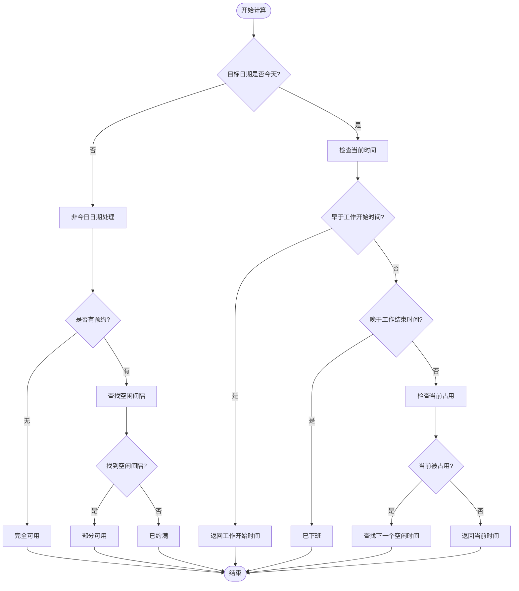
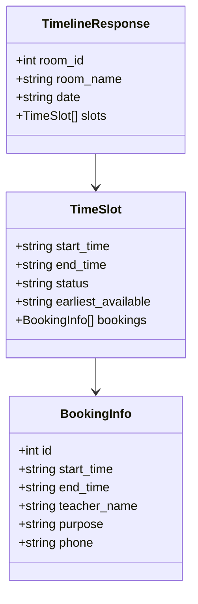
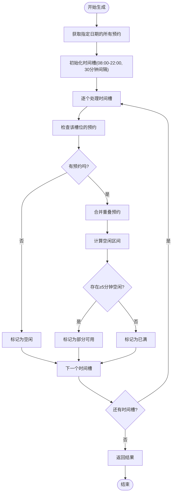
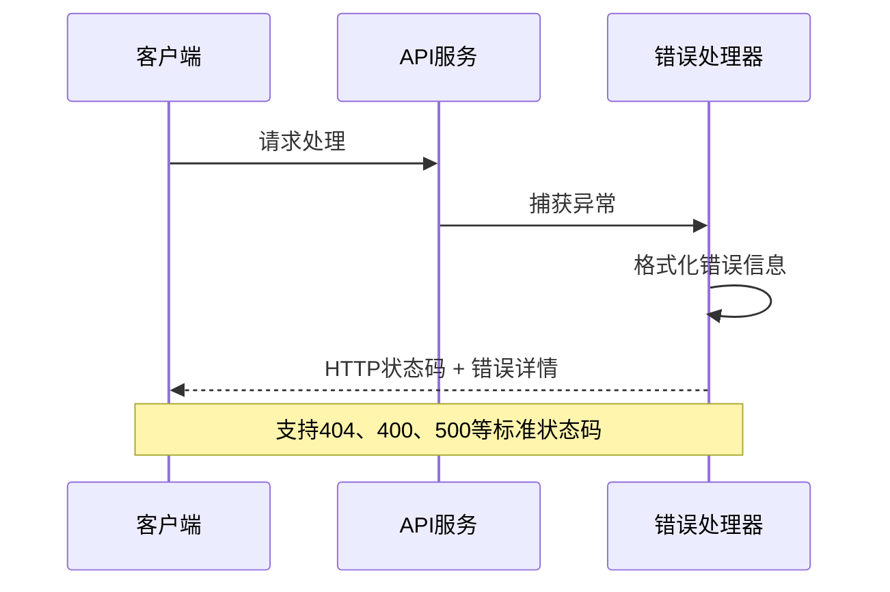
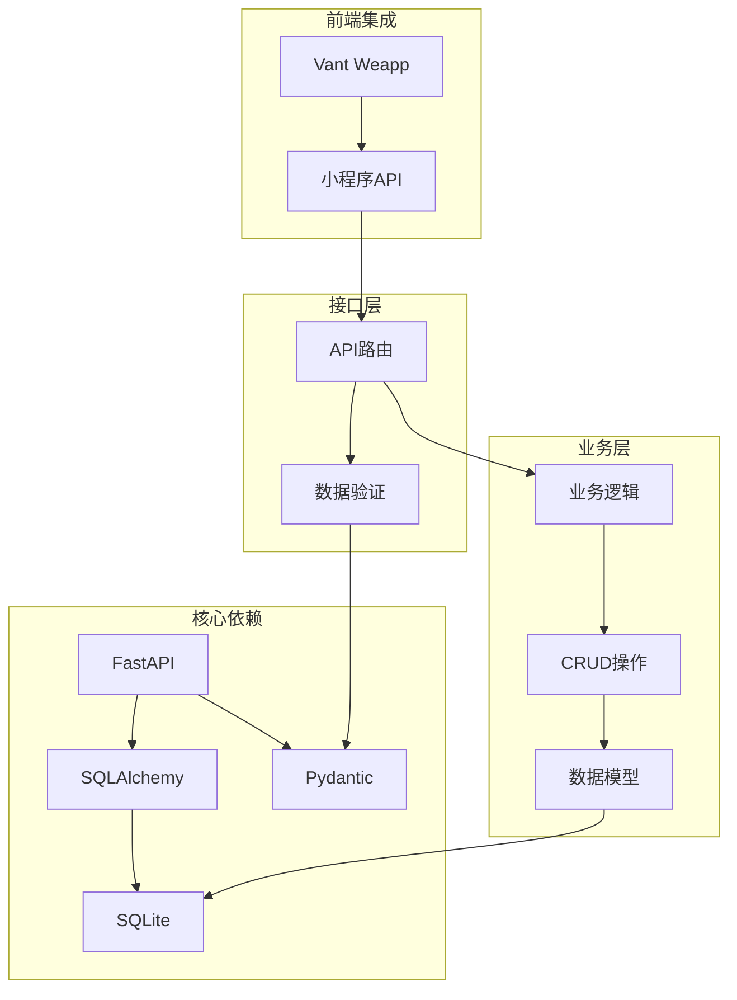

# 会议室管理接口

<cite>
**本文档引用的文件**
- [backend/main.py](file://backend/main.py)
- [backend/schemas.py](file://backend/schemas.py)
- [backend/models.py](file://backend/models.py)
- [backend/crud.py](file://backend/crud.py)
- [backend/database.py](file://backend/database.py)
- [miniprogram/utils/api.js](file://miniprogram/utils/api.js)
- [README.md](file://README.md)
- [docs/BACKEND_PRINCIPLE.md](file://docs/BACKEND_PRINCIPLE.md)
</cite>

## 目录
1. [简介](#简介)
2. [项目结构](#项目结构)
3. [核心组件](#核心组件)
4. [架构概览](#架构概览)
5. [详细组件分析](#详细组件分析)
6. [依赖分析](#依赖分析)
7. [性能考虑](#性能考虑)
8. [故障排除指南](#故障排除指南)
9. [结论](#结论)
10. [附录](#附录)

## 简介
本项目为西安交通大学软件学院提供会议室预约管理系统，采用前后端分离架构，后端基于FastAPI + SQLite，前端为微信小程序。系统支持多校区会议室管理、实时状态查询、时间线可视化预约等功能。

## 项目结构
系统采用模块化设计，主要分为后端API服务和小程序前端两大部分：



**图表来源**
- [backend/main.py:17-31](file://backend/main.py#L17-L31)
- [backend/database.py:8-21](file://backend/database.py#L8-L21)

**章节来源**
- [backend/main.py:17-673](file://backend/main.py#L17-L673)
- [backend/database.py:8-62](file://backend/database.py#L8-L62)

## 核心组件
系统的核心组件包括：

### 数据模型层
- **Room模型**：会议室实体，包含名称、校区、容量、位置、设备等属性
- **Booking模型**：预约记录，包含会议室ID、日期、时间段、教师信息等
- **Teacher模型**：教职工白名单，用于用户认证
- **UserBind模型**：用户绑定关系，连接微信OpenID与教职工信息

### 业务逻辑层
- **CRUD操作**：提供会议室、预约、教职工等数据的增删改查操作
- **状态计算**：实时计算会议室可用状态和最早可预约时间
- **时间冲突检测**：确保预约时间不冲突

### API接口层
- **会议室管理接口**：获取会议室列表、单个会议室信息、时间线
- **预约管理接口**：创建、查询、取消预约
- **认证接口**：用户绑定、状态查询、信息获取

**章节来源**
- [backend/models.py:8-75](file://backend/models.py#L8-L75)
- [backend/crud.py:12-343](file://backend/crud.py#L12-L343)
- [backend/schemas.py:9-185](file://backend/schemas.py#L9-L185)

## 架构概览
系统采用RESTful API设计，遵循HTTP标准，支持JSON数据交换：



**图表来源**
- [backend/main.py:24-30](file://backend/main.py#L24-L30)
- [backend/database.py:15-21](file://backend/database.py#L15-L21)

## 详细组件分析

### 会议室列表接口 (GET /api/rooms)
该接口用于获取会议室列表，并包含实时状态信息。

#### 请求参数
| 参数名 | 必填 | 类型 | 描述 | 示例值 |
|--------|------|------|------|--------|
| campus | 否 | string | 校区代码 | xingqing |
| date | 否 | string | 查询日期 YYYY-MM-DD | 2024-01-15 |
| current_date | 否 | string | 当前日期 YYYY-MM-DD | 2024-01-15 |
| current_time | 否 | string | 当前时间 HH:MM | 14:30 |

#### 响应数据结构
使用RoomWithStatus模型，包含基础会议室信息和状态字段：



**图表来源**
- [backend/schemas.py:32-45](file://backend/schemas.py#L32-L45)

#### 状态计算逻辑
会议室状态判断遵循以下规则：



**图表来源**
- [backend/crud.py:145-242](file://backend/crud.py#L145-L242)

#### 状态码说明
- 200 OK：请求成功
- 404 Not Found：会议室不存在
- 500 Internal Server Error：服务器内部错误

**章节来源**
- [backend/main.py:80-108](file://backend/main.py#L80-L108)
- [backend/crud.py:145-242](file://backend/crud.py#L145-L242)

### 单个会议室接口 (GET /api/rooms/{room_id})
该接口用于获取指定会议室的详细信息。

#### 请求参数
| 参数名 | 必填 | 类型 | 描述 |
|--------|------|------|------|
| room_id | 是 | integer | 会议室ID |

#### 响应数据结构
使用RoomResponse模型，包含完整会议室信息：
- 基础信息：名称、校区、容量、位置、设备
- 元数据：创建时间、ID

#### 状态码说明
- 200 OK：请求成功
- 404 Not Found：会议室不存在

**章节来源**
- [backend/main.py:111-117](file://backend/main.py#L111-L117)
- [backend/schemas.py:32-38](file://backend/schemas.py#L32-L38)

### 会议室时间线接口 (GET /api/rooms/{room_id}/timeline)
该接口用于获取指定会议室某天的时间线，按30分钟为单位展示可用状态。

#### 请求参数
| 参数名 | 必填 | 类型 | 描述 |
|--------|------|------|------|
| room_id | 是 | integer | 会议室ID |
| date | 是 | string | 查询日期 YYYY-MM-DD |

#### 响应数据结构
返回包含时间线信息的对象：



**图表来源**
- [backend/main.py:120-246](file://backend/main.py#L120-L246)

#### 时间线生成算法
时间线生成遵循以下算法：



**图表来源**
- [backend/main.py:120-246](file://backend/main.py#L120-L246)

#### 状态判断逻辑
时间线状态分为三种：
- **available**：完全空闲，可用于预约
- **partially_booked**：部分被占用，但存在≥5分钟连续空闲
- **fully_booked**：完全被占用，无连续≥5分钟空闲

#### 空闲时间计算
算法考虑以下因素：
1. **缓冲时间**：相邻预约之间需要1分钟缓冲
2. **最小空闲**：只有≥5分钟的连续空闲才被视为可用
3. **工作时间**：仅在08:00-22:00范围内有效

**章节来源**
- [backend/main.py:120-246](file://backend/main.py#L120-L246)

### 错误处理机制
系统采用统一的错误处理机制：



**图表来源**
- [backend/main.py:115-117](file://backend/main.py#L115-L117)
- [backend/main.py:294-295](file://backend/main.py#L294-L295)

## 依赖分析
系统各组件之间的依赖关系如下：



**图表来源**
- [backend/main.py:1-15](file://backend/main.py#L1-L15)
- [backend/database.py:1-7](file://backend/database.py#L1-L7)

**章节来源**
- [backend/main.py:1-15](file://backend/main.py#L1-L15)
- [backend/database.py:1-7](file://backend/database.py#L1-L7)

## 性能考虑
系统在设计时考虑了以下性能优化：

### 数据库优化
- **索引策略**：为常用查询字段建立索引
- **查询优化**：使用JOIN减少查询次数
- **连接池**：合理配置数据库连接

### 缓存策略
- **结果缓存**：对不频繁变化的数据进行缓存
- **查询缓存**：缓存热门查询结果

### API优化
- **批量查询**：支持批量获取会议室列表
- **分页机制**：大数据量时支持分页
- **压缩传输**：启用GZIP压缩

## 故障排除指南

### 常见问题及解决方案

#### 1. API请求失败
**症状**：小程序无法获取会议室列表
**可能原因**：
- 后端服务未启动
- 网络连接问题
- CORS跨域配置错误

**解决步骤**：
1. 检查后端服务状态：`http://localhost:8000`
2. 验证网络连接：`ping localhost:8000`
3. 检查CORS配置：确认允许跨域请求

#### 2. 会议室状态显示异常
**症状**：会议室状态与实际不符
**可能原因**：
- 时间同步问题
- 缓冲时间计算错误
- 数据库连接异常

**解决步骤**：
1. 检查服务器时间配置
2. 验证时间计算逻辑
3. 重启数据库连接

#### 3. 预约冲突检测失败
**症状**：系统允许重复预约
**可能原因**：
- 时间冲突检测逻辑错误
- 数据库事务处理问题
- 并发访问冲突

**解决步骤**：
1. 检查时间冲突检测算法
2. 验证数据库事务隔离级别
3. 实施并发控制机制

**章节来源**
- [docs/MINIPROGRAM_DEBUG_GUIDE.md:256-310](file://docs/MINIPROGRAM_DEBUG_GUIDE.md#L256-L310)

## 结论
本会议室管理系统采用现代化的技术栈，实现了完整的会议室预约功能。系统具有以下特点：

1. **架构清晰**：前后端分离，模块职责明确
2. **数据安全**：SQLite本地存储，数据持久化可靠
3. **用户体验**：实时状态显示，时间线可视化
4. **扩展性强**：模块化设计，便于功能扩展

系统通过合理的数据模型设计、完善的业务逻辑实现和健壮的错误处理机制，为用户提供了一个稳定可靠的会议室预约平台。

## 附录

### API使用示例

#### 获取会议室列表
```javascript
// 小程序调用示例
const rooms = await getRooms('xingqing', '2024-01-15', '2024-01-15', '14:30');
console.log(rooms);
```

#### 获取时间线
```javascript
// 小程序调用示例
const timeline = await getRoomTimeline(1, '2024-01-15');
console.log(timeline.slots);
```

### 数据库设计
系统采用SQLite轻量级数据库，支持完整的CRUD操作和数据完整性约束。

**章节来源**
- [miniprogram/utils/api.js:90-112](file://miniprogram/utils/api.js#L90-L112)
- [backend/database.py:55-62](file://backend/database.py#L55-L62)