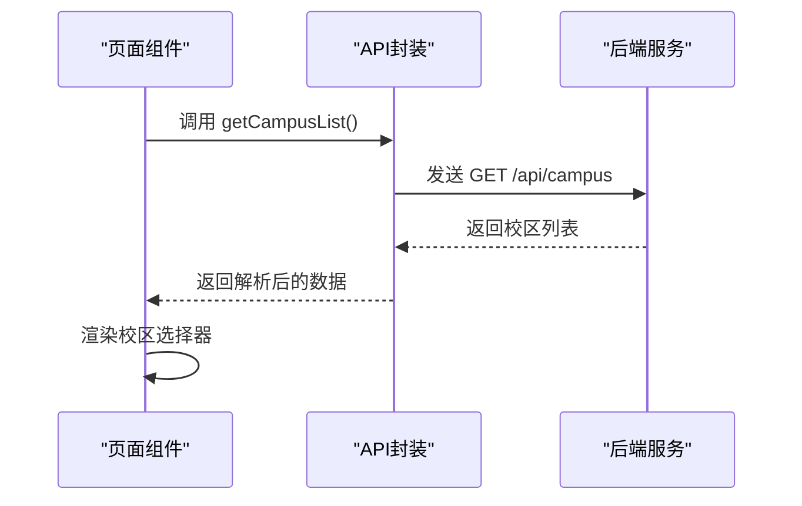
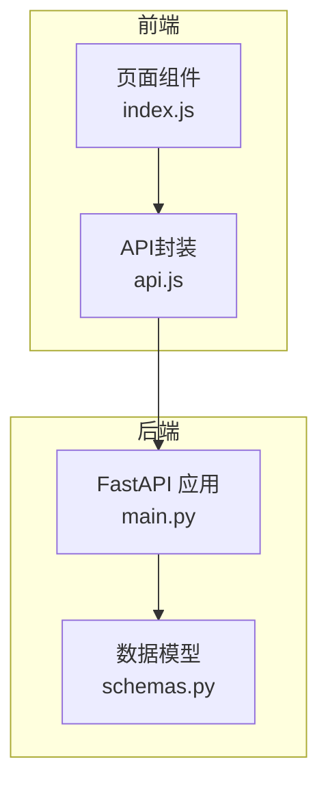

# 校区管理接口

<cite>
**本文引用的文件**
- [backend/main.py](file://backend/main.py)
- [backend/schemas.py](file://backend/schemas.py)
- [backend/models.py](file://backend/models.py)
- [miniprogram/utils/api.js](file://miniprogram/utils/api.js)
- [miniprogram/pages/index/index.js](file://miniprogram/pages/index/index.js)
- [README.md](file://README.md)
</cite>

## 目录
1. [简介](#简介)
2. [接口规范](#接口规范)
3. [数据结构定义](#数据结构定义)
4. [请求参数说明](#请求参数说明)
5. [响应示例](#响应示例)
6. [使用场景与注意事项](#使用场景与注意事项)
7. [前端调用示例](#前端调用示例)
8. [架构与实现分析](#架构与实现分析)
9. [故障排查指南](#故障排查指南)
10. [总结](#总结)

## 简介
本接口用于获取系统支持的校区列表，返回每个校区的代码与名称。接口采用标准 RESTful 设计，使用 HTTP GET 方法访问 `/api/campus` 路径，响应数据遵循统一的数据模型定义，便于前后端协作与集成。

## 接口规范
- **HTTP 方法**: GET
- **URL 路径**: `/api/campus`
- **功能描述**: 获取校区列表
- **响应类型**: JSON 数组
- **响应模型**: `List[CampusInfo]`
- **认证要求**: 无需认证
- **CORS 支持**: 默认允许跨域

**章节来源**
- [backend/main.py:69-75](file://backend/main.py#L69-L75)
- [backend/schemas.py:181-185](file://backend/schemas.py#L181-L185)

## 数据结构定义
接口响应的数据结构为 `CampusInfo`，包含以下字段：
- `code`: 校区代码，字符串类型
- `name`: 校区名称，字符串类型

该模型在后端通过 Pydantic 定义，确保数据验证与序列化的一致性。

**章节来源**
- [backend/schemas.py:181-185](file://backend/schemas.py#L181-L185)

## 请求参数说明
- **无请求参数**: 该接口不接受任何查询参数或请求体参数。
- **请求头**: 无特殊要求，遵循标准 HTTP 规范。

**章节来源**
- [backend/main.py:69-75](file://backend/main.py#L69-L75)

## 响应示例
接口返回一个包含两个校区信息的数组，示例如下：
```json
[
  {"code": "xingqing", "name": "兴庆校区"},
  {"code": "chuangxin", "name": "创新港校区"}
]
```

说明：
- `xingqing`: 兴庆校区
- `chuangxin`: 创新港校区

**章节来源**
- [backend/main.py:72-74](file://backend/main.py#L72-L74)
- [README.md:416-428](file://README.md#L416-L428)

## 使用场景与注意事项
- **使用场景**:
  - 在前端应用中展示校区选择器，供用户选择目标校区。
  - 作为筛选条件传递给其他接口（如获取会议室列表），以便按校区过滤数据。
  - 在管理后台中维护校区信息，确保与业务逻辑一致。

- **注意事项**:
  - 校区代码为固定枚举值，前端应严格使用 `xingqing` 和 `chuangxin`，避免拼写错误。
  - 若需扩展新的校区，应在后端接口与数据模型中同步更新，并确保前端适配。
  - 该接口返回静态数据，无需额外的数据库查询，性能开销极低。

**章节来源**
- [backend/main.py:69-75](file://backend/main.py#L69-L75)
- [backend/schemas.py:12](file://backend/schemas.py#L12)

## 前端调用示例
前端通过封装的 API 工具发起请求，示例代码如下（路径参考）：
- 调用封装函数获取校区列表：[miniprogram/utils/api.js:79-81](file://miniprogram/utils/api.js#L79-L81)
- 在页面中使用并渲染校区数据：[miniprogram/pages/index/index.js:6-9](file://miniprogram/pages/index/index.js#L6-L9)

调用流程（概念图）：


**图表来源**
- [miniprogram/utils/api.js:79-81](file://miniprogram/utils/api.js#L79-L81)
- [backend/main.py:69-75](file://backend/main.py#L69-L75)

**章节来源**
- [miniprogram/utils/api.js:79-81](file://miniprogram/utils/api.js#L79-L81)
- [miniprogram/pages/index/index.js:6-9](file://miniprogram/pages/index/index.js#L6-L9)

## 架构与实现分析
- **后端实现**:
  - 路由定义位于 FastAPI 应用中，使用装饰器注册 GET 路由。
  - 响应模型为 `List[CampusInfo]`，直接返回硬编码的校区数据。
  - 该实现简单高效，避免不必要的数据库访问。

- **数据模型**:
  - `CampusInfo` 模型定义清晰，字段简洁，便于前后端契约约定。
  - 与会议室模型中的 `campus` 字段保持一致，确保数据一致性。

- **前端集成**:
  - 小程序端通过云托管请求封装，自动携带必要的请求头。
  - 页面组件直接消费接口返回的校区列表，实现动态渲染。



**图表来源**
- [backend/main.py:69-75](file://backend/main.py#L69-L75)
- [backend/schemas.py:181-185](file://backend/schemas.py#L181-L185)
- [miniprogram/utils/api.js:79-81](file://miniprogram/utils/api.js#L79-L81)

**章节来源**
- [backend/main.py:69-75](file://backend/main.py#L69-L75)
- [backend/schemas.py:181-185](file://backend/schemas.py#L181-L185)
- [miniprogram/utils/api.js:79-81](file://miniprogram/utils/api.js#L79-L81)

## 故障排查指南
- **接口无法访问**:
  - 检查后端服务是否正常运行，确认监听端口与防火墙配置。
  - 确认域名与 HTTPS 配置正确，避免小程序跨域限制导致的请求失败。

- **响应数据异常**:
  - 校区代码不匹配：确保前端使用 `xingqing` 和 `chuangxin`。
  - 数据格式错误：检查后端返回的 JSON 结构是否符合 `List[CampusInfo]`。

- **小程序调用失败**:
  - 确认云托管配置与服务名称一致。
  - 检查网络状态与小程序后台的服务器域名配置。

**章节来源**
- [README.md:596-608](file://README.md#L596-L608)
- [miniprogram/utils/api.js:13-41](file://miniprogram/utils/api.js#L13-L41)

## 总结
校区管理接口设计简洁明确，职责单一，易于维护与扩展。通过统一的数据模型与前后端协作，能够稳定地为用户提供校区选择能力。建议在后续迭代中保持接口的稳定性，并在需要时增加校验与日志记录，以提升系统的可观测性与健壮性。