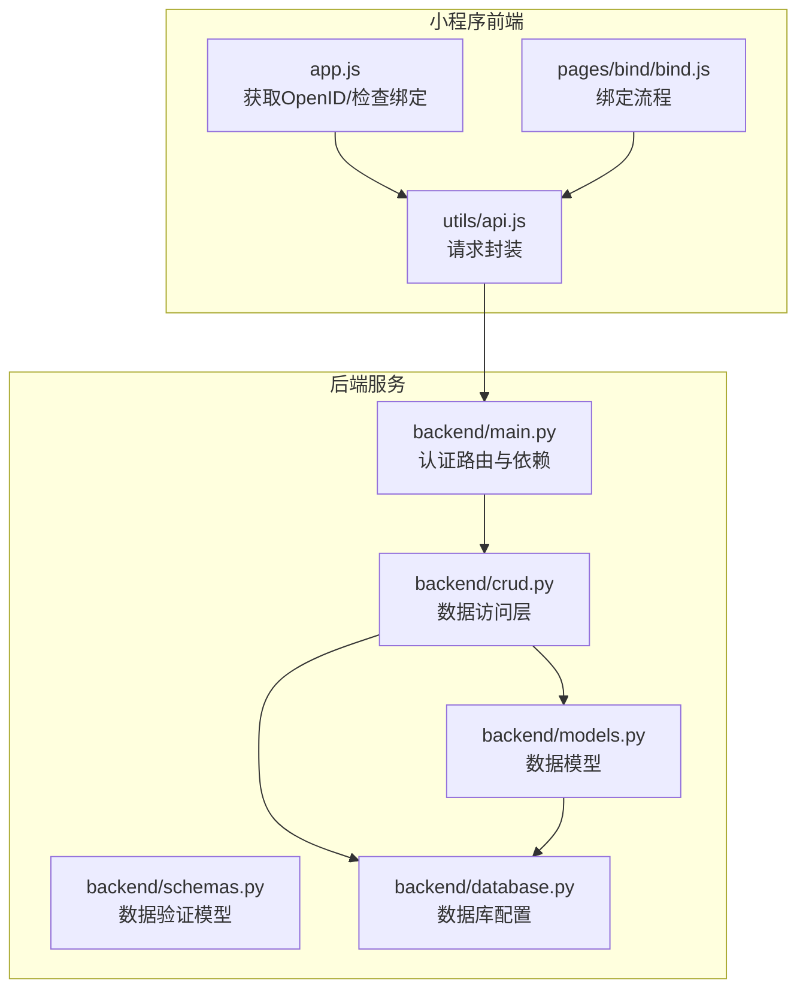
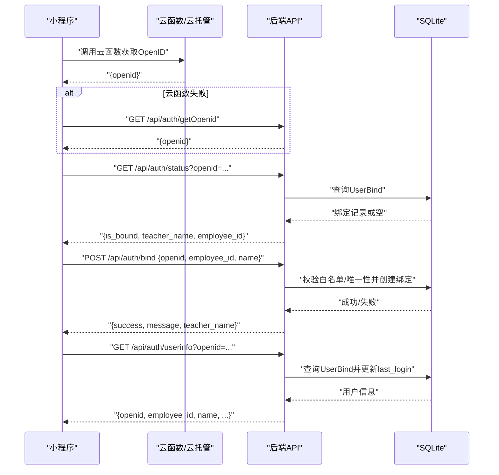
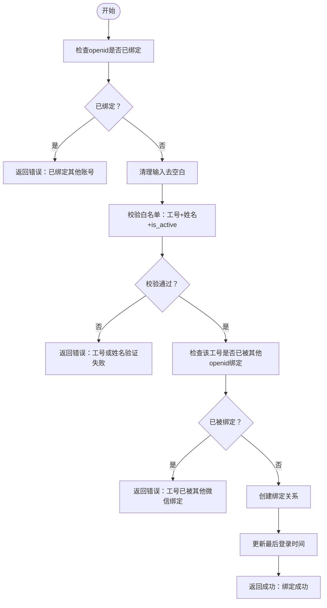
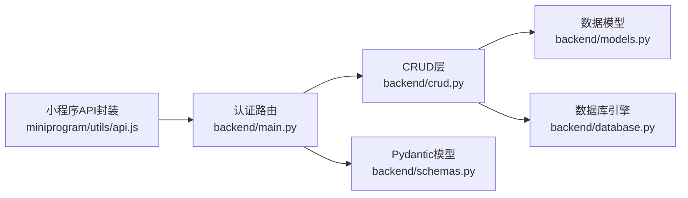

# 用户认证接口

<cite>
**本文引用的文件**
- [backend/main.py](file://backend/main.py)
- [backend/models.py](file://backend/models.py)
- [backend/schemas.py](file://backend/schemas.py)
- [backend/crud.py](file://backend/crud.py)
- [backend/database.py](file://backend/database.py)
- [miniprogram/utils/api.js](file://miniprogram/utils/api.js)
- [miniprogram/pages/bind/bind.js](file://miniprogram/pages/bind/bind.js)
- [miniprogram/app.js](file://miniprogram/app.js)
- [docs/MINIPROGRAM_DEBUG_GUIDE.md](file://docs/MINIPROGRAM_DEBUG_GUIDE.md)
</cite>

## 目录
1. [简介](#简介)
2. [项目结构](#项目结构)
3. [核心组件](#核心组件)
4. [架构总览](#架构总览)
5. [详细组件分析](#详细组件分析)
6. [依赖分析](#依赖分析)
7. [性能考虑](#性能考虑)
8. [故障排除指南](#故障排除指南)
9. [结论](#结论)
10. [附录](#附录)

## 简介
本文件为“用户认证接口”的权威技术文档，覆盖以下五个接口的完整规范：
- 获取OpenID接口：GET /api/auth/getOpenid
- 获取绑定状态接口：GET /api/auth/status
- 用户绑定接口：POST /api/auth/bind
- 获取用户信息接口：GET /api/auth/userinfo
- 解绑接口：POST /api/auth/unbind

文档同时解释微信OpenID获取机制、教职工绑定流程、身份验证逻辑与安全注意事项，并提供开发与生产环境的行为差异说明，以及完整的调试与故障排除指南。

## 项目结构
后端采用FastAPI + SQLAlchemy + SQLite，认证相关接口集中在主应用文件；小程序端通过云托管或HTTP两种方式调用后端接口，认证流程由小程序入口与绑定页面协同完成。

图表来源
- [backend/main.py:463-619](file://backend/main.py#L463-L619)
- [backend/crud.py:306-343](file://backend/crud.py#L306-L343)
- [backend/models.py:44-75](file://backend/models.py#L44-L75)
- [backend/database.py:1-62](file://backend/database.py#L1-L62)
- [miniprogram/utils/api.js:13-41](file://miniprogram/utils/api.js#L13-L41)
- [miniprogram/app.js:44-89](file://miniprogram/app.js#L44-L89)

章节来源
- [backend/main.py:17-31](file://backend/main.py#L17-L31)
- [backend/database.py:8-20](file://backend/database.py#L8-L20)
- [miniprogram/utils/api.js:13-41](file://miniprogram/utils/api.js#L13-L41)
- [miniprogram/app.js:44-89](file://miniprogram/app.js#L44-L89)

## 核心组件
- 认证路由与依赖
  - get_current_user：从请求头提取OpenID，校验绑定状态并返回用户上下文
  - get_openid：在云托管环境读取X-WX-OPENID，在开发环境生成模拟OpenID
  - get_auth_status：查询OpenID绑定状态
  - bind_user：教职工绑定（工号+姓名），校验唯一性与有效性
  - get_user_info：返回绑定用户的完整信息并更新最后登录时间
  - unbind_user：解绑（管理员操作）

- 数据模型与验证
  - UserBind：用户绑定关系（openid唯一、外键teacher_id）
  - Teacher：教职工白名单（employee_id唯一、is_active）
  - Pydantic模型：BindRequest、BindResponse、AuthStatus、UserInfo等

- 数据访问层
  - get_user_bind / get_user_bind_by_teacher / create_user_bind / delete_user_bind
  - verify_teacher / update_last_login

章节来源
- [backend/main.py:469-501](file://backend/main.py#L469-L501)
- [backend/main.py:503-513](file://backend/main.py#L503-L513)
- [backend/main.py:515-529](file://backend/main.py#L515-L529)
- [backend/main.py:531-585](file://backend/main.py#L531-L585)
- [backend/main.py:587-608](file://backend/main.py#L587-L608)
- [backend/main.py:610-619](file://backend/main.py#L610-L619)
- [backend/models.py:61-75](file://backend/models.py#L61-L75)
- [backend/schemas.py:143-172](file://backend/schemas.py#L143-L172)
- [backend/crud.py:308-343](file://backend/crud.py#L308-L343)

## 架构总览
认证流程涉及小程序前端、后端服务与数据库三层协作。核心要点：
- 小程序优先通过云函数获取OpenID；若失败则回退至后端接口
- 云托管环境下，后端从请求头X-WX-OPENID读取OpenID
- 开发环境下，后端生成基于客户端IP哈希的模拟OpenID
- 绑定流程要求教职工白名单校验，且OpenID与工号均唯一
- 身份验证依赖中间件get_current_user，未绑定用户将收到401

图表来源
- [miniprogram/app.js:44-89](file://miniprogram/app.js#L44-L89)
- [backend/main.py:503-513](file://backend/main.py#L503-L513)
- [backend/main.py:515-529](file://backend/main.py#L515-L529)
- [backend/main.py:531-585](file://backend/main.py#L531-L585)
- [backend/main.py:587-608](file://backend/main.py#L587-L608)
- [backend/crud.py:308-343](file://backend/crud.py#L308-L343)

## 详细组件分析

### 获取OpenID接口
- 路径与方法
  - GET /api/auth/getOpenid
- 功能描述
  - 云托管环境：从请求头X-WX-OPENID读取并返回
  - 开发环境：返回基于客户端IP哈希的模拟OpenID
- 请求参数
  - 无查询参数
- 请求体
  - 无
- 响应数据
  - openid: 字符串，OpenID或模拟OpenID
- 错误处理
  - 正常返回200；异常场景由上层框架处理
- 安全与环境差异
  - 生产环境依赖云托管注入的X-WX-OPENID
  - 开发环境仅用于本地调试，不可用于真实用户

章节来源
- [backend/main.py:503-513](file://backend/main.py#L503-L513)

### 获取绑定状态接口
- 路径与方法
  - GET /api/auth/status
- 功能描述
  - 根据openid查询绑定状态，返回是否已绑定及教职工信息
- 请求参数
  - openid: 查询参数，必填
- 请求体
  - 无
- 响应数据
  - is_bound: 布尔值
  - teacher_name: 已绑定时返回，否则为空
  - employee_id: 已绑定时返回，否则为空
- 错误处理
  - 未绑定时返回正常状态对象，不抛异常
- 典型场景
  - 登录页先查状态，决定是否进入绑定流程

章节来源
- [backend/main.py:515-529](file://backend/main.py#L515-L529)

### 用户绑定接口
- 路径与方法
  - POST /api/auth/bind
- 功能描述
  - 将微信OpenID与教职工工号+姓名进行绑定
  - 校验OpenID唯一性与工号唯一性，以及白名单有效性
- 请求参数
  - 无查询参数
- 请求体
  - openid: 字符串，必填
  - employee_id: 字符串，必填
  - name: 字符串，必填
- 响应数据
  - success: 布尔值
  - message: 字符串，结果说明
  - teacher_name: 已绑定时返回，否则为空
- 错误处理
  - openid已绑定：返回错误提示
  - 白名单校验失败：返回错误提示
  - 工号已被他人绑定：返回错误提示
  - 成功：返回成功提示与教师姓名
- 绑定流程图

图表来源
- [backend/main.py:531-585](file://backend/main.py#L531-L585)
- [backend/crud.py:308-343](file://backend/crud.py#L308-L343)
- [backend/crud.py:297-304](file://backend/crud.py#L297-L304)

章节来源
- [backend/main.py:531-585](file://backend/main.py#L531-L585)
- [backend/schemas.py:143-155](file://backend/schemas.py#L143-L155)

### 获取用户信息接口
- 路径与方法
  - GET /api/auth/userinfo
- 功能描述
  - 返回已绑定用户的完整信息，并更新最后登录时间
- 请求参数
  - openid: 查询参数，必填
- 请求体
  - 无
- 响应数据
  - openid: 字符串
  - employee_id: 字符串
  - name: 字符串
  - phone: 可选
  - department: 可选
  - bound_at: 绑定时间
- 错误处理
  - 未绑定：返回404
- 典型场景
  - 进入个人中心或发起预约时展示用户信息

章节来源
- [backend/main.py:587-608](file://backend/main.py#L587-L608)
- [backend/crud.py:327-333](file://backend/crud.py#L327-L333)

### 解绑接口
- 路径与方法
  - POST /api/auth/unbind
- 功能描述
  - 解除OpenID与教职工的绑定关系（管理员操作）
- 请求参数
  - openid: 查询参数，必填
- 请求体
  - 无
- 响应数据
  - message: 字符串
- 错误处理
  - 绑定不存在：返回404
- 典型场景
  - 管理员解除异常绑定或离职教职工绑定

章节来源
- [backend/main.py:610-619](file://backend/main.py#L610-L619)
- [backend/crud.py:335-343](file://backend/crud.py#L335-L343)

### 身份验证依赖与安全
- get_current_user
  - 从请求头读取X-WX-OPENID；开发环境支持查询参数或模拟OpenID
  - 校验绑定关系，未绑定返回401
  - 返回用户上下文（openid、teacher_id、teacher_name、employee_id）
- 安全考虑
  - 生产环境必须依赖云托管注入的X-WX-OPENID
  - 开发环境仅用于调试，不应暴露给真实用户
  - 绑定唯一性约束：openid唯一、工号唯一
  - 对外接口均需通过get_current_user进行认证（如创建预约等）

章节来源
- [backend/main.py:469-501](file://backend/main.py#L469-L501)
- [backend/models.py:61-75](file://backend/models.py#L61-L75)

## 依赖分析
- 组件耦合
  - 认证路由依赖CRUD层进行数据访问
  - CRUD层依赖数据模型与数据库引擎
  - 小程序通过API封装调用后端，间接依赖认证路由
- 外部依赖
  - 云托管：X-WX-OPENID请求头
  - SQLite：本地开发与云托管数据存储
- 潜在循环依赖
  - 未发现循环导入；模块职责清晰

图表来源
- [backend/main.py:463-619](file://backend/main.py#L463-L619)
- [backend/crud.py:1-343](file://backend/crud.py#L1-L343)
- [backend/models.py:1-75](file://backend/models.py#L1-L75)
- [backend/database.py:1-62](file://backend/database.py#L1-L62)
- [backend/schemas.py:1-185](file://backend/schemas.py#L1-L185)
- [miniprogram/utils/api.js:13-41](file://miniprogram/utils/api.js#L13-L41)

章节来源
- [backend/main.py:463-619](file://backend/main.py#L463-L619)
- [backend/crud.py:1-343](file://backend/crud.py#L1-L343)
- [backend/models.py:1-75](file://backend/models.py#L1-L75)
- [backend/database.py:1-62](file://backend/database.py#L1-L62)
- [backend/schemas.py:1-185](file://backend/schemas.py#L1-L185)
- [miniprogram/utils/api.js:13-41](file://miniprogram/utils/api.js#L13-L41)

## 性能考虑
- 数据库
  - SQLite适合小规模并发；若并发较高，建议迁移到PostgreSQL/MySQL
  - 建议对UserBind.openid与Teacher.employee_id建立索引（当前模型已具备唯一约束）
- 缓存
  - 可在小程序端缓存用户信息与OpenID，减少重复请求
- 网络
  - 云托管环境优先使用云函数/云容器，降低跨域与代理复杂度
- 日志
  - 绑定流程包含调试日志，便于定位白名单问题

## 故障排除指南
- 常见问题与解决
  - 无法获取OpenID
    - 确认云托管环境是否注入X-WX-OPENID
    - 开发环境检查是否走回退逻辑（后端GET /api/auth/getOpenid）
  - 绑定失败
    - 检查工号与姓名是否匹配白名单且is_active为真
    - 确认openid与工号均未被其他记录绑定
  - 401未认证
    - 确认请求头是否包含X-WX-OPENID
    - 开发环境确认查询参数或模拟OpenID是否传递
  - 解绑失败
    - 确认绑定记录是否存在
- 调试步骤
  - 小程序端查看Network面板与Console日志
  - 后端查看控制台输出（绑定流程包含打印语句）
  - 参考小程序调试指南，确保apiBase与域名校验设置正确

章节来源
- [docs/MINIPROGRAM_DEBUG_GUIDE.md:175-210](file://docs/MINIPROGRAM_DEBUG_GUIDE.md#L175-L210)
- [docs/MINIPROGRAM_DEBUG_GUIDE.md:256-279](file://docs/MINIPROGRAM_DEBUG_GUIDE.md#L256-L279)
- [backend/main.py:531-585](file://backend/main.py#L531-L585)

## 结论
本认证体系以OpenID为核心，结合教职工白名单与唯一性约束，实现了从OpenID获取、绑定校验到用户信息查询的完整闭环。生产环境依赖云托管注入的X-WX-OPENID，开发环境提供模拟OpenID以便快速调试。建议在高并发场景下升级数据库与引入缓存策略，并持续完善日志与监控体系。

## 附录

### 开发与生产环境行为差异
- OpenID获取
  - 生产：依赖X-WX-OPENID
  - 开发：模拟OpenID（基于客户端IP哈希）
- 跨域与代理
  - 生产：云托管直连，无需额外代理
  - 开发：小程序可直接访问本地后端或局域网IP
- 安全
  - 生产：严格依赖云托管安全机制
  - 开发：关闭域名校验仅限本地调试

章节来源
- [backend/main.py:503-513](file://backend/main.py#L503-L513)
- [docs/MINIPROGRAM_DEBUG_GUIDE.md:117-172](file://docs/MINIPROGRAM_DEBUG_GUIDE.md#L117-L172)