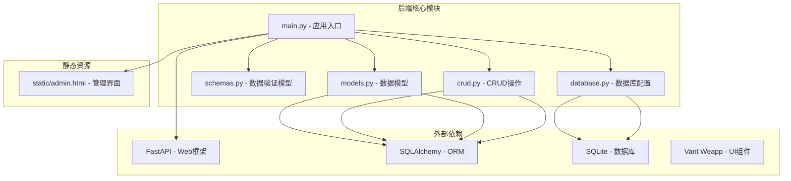
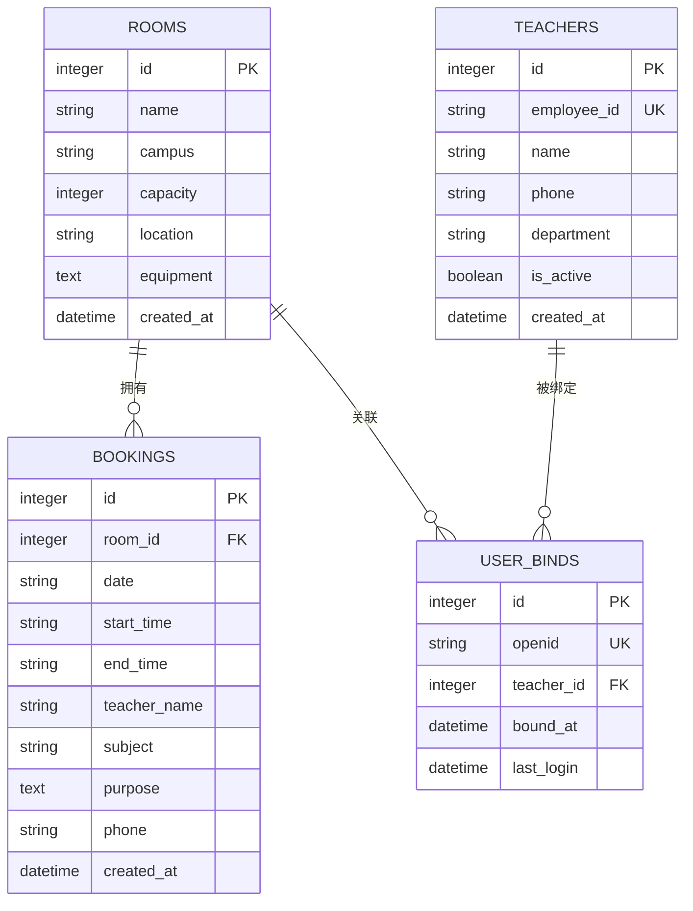
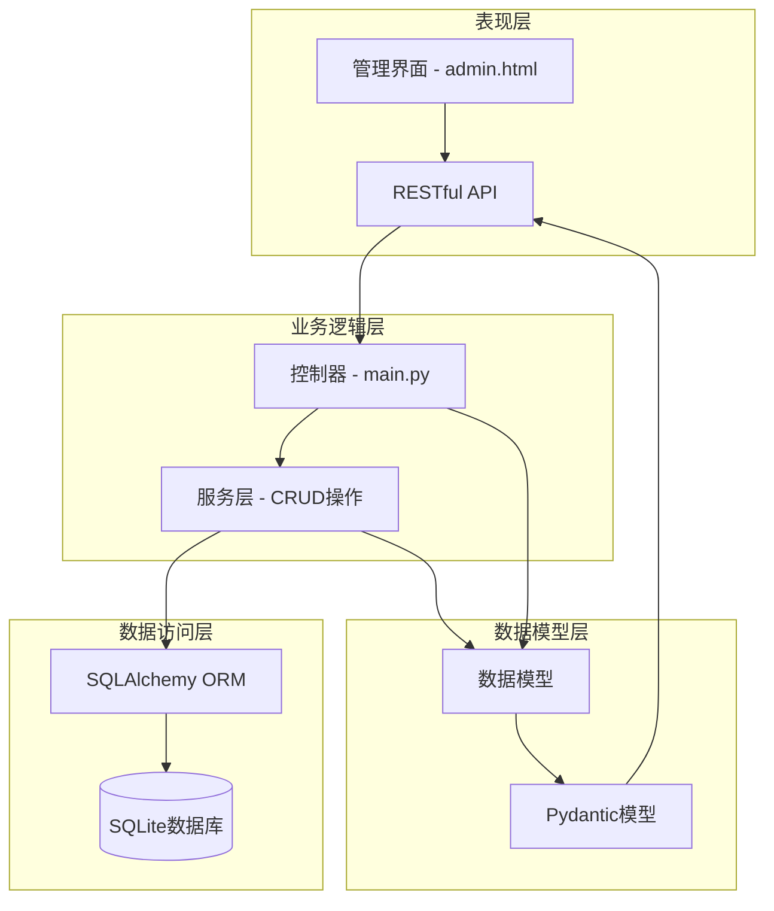
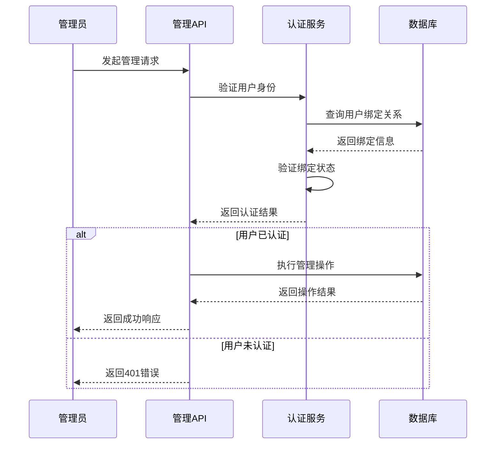
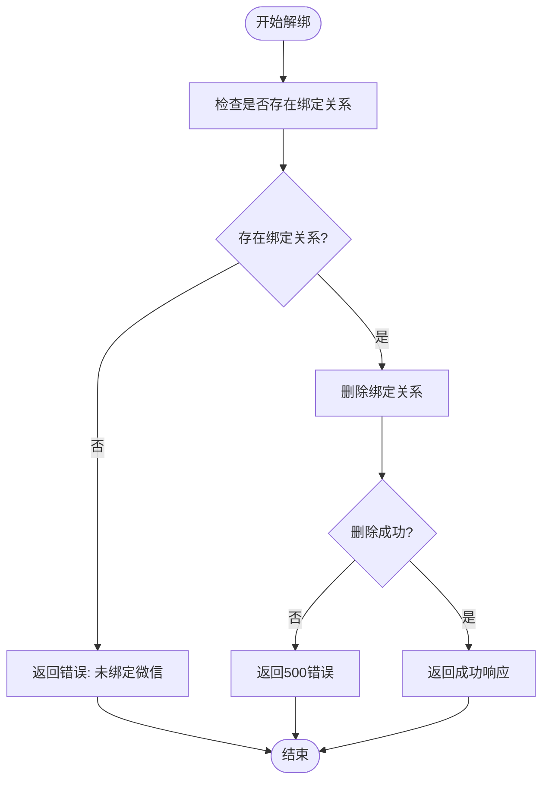
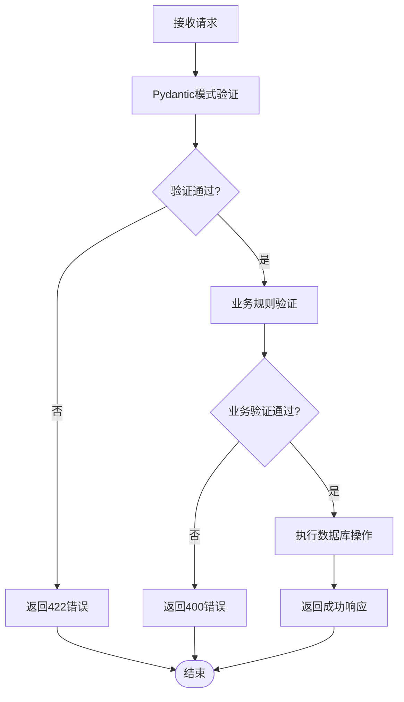
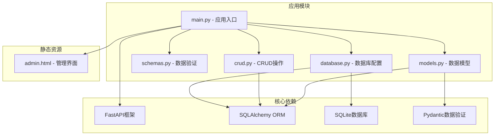
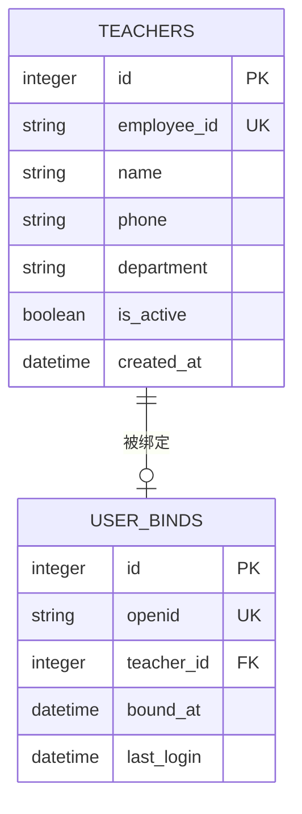

# 管理后台接口

<cite>
**本文档引用的文件**
- [backend/main.py](file://backend/main.py)
- [backend/models.py](file://backend/models.py)
- [backend/schemas.py](file://backend/schemas.py)
- [backend/crud.py](file://backend/crud.py)
- [backend/database.py](file://backend/database.py)
- [backend/static/admin.html](file://backend/static/admin.html)
- [README.md](file://README.md)
</cite>

## 目录
1. [简介](#简介)
2. [项目结构](#项目结构)
3. [核心组件](#核心组件)
4. [架构概览](#架构概览)
5. [详细组件分析](#详细组件分析)
6. [依赖关系分析](#依赖关系分析)
7. [性能考虑](#性能考虑)
8. [故障排除指南](#故障排除指南)
9. [结论](#结论)

## 简介

本项目是一个基于微信小程序和FastAPI的会议室预约管理系统，专为西安交通大学软件学院设计。系统采用前后端分离架构，后端使用FastAPI + SQLAlchemy + SQLite，前端使用微信小程序原生开发。

管理后台提供了完整的会议室管理和教职工管理功能，包括CRUD操作、数据验证、权限控制和业务约束处理。系统支持多校区管理（兴庆校区、创新港校区），提供实时会议室状态显示和可视化预约时间线。

## 项目结构

后端项目采用模块化组织方式，主要包含以下核心模块：



**图表来源**
- [backend/main.py:1-673](file://backend/main.py#L1-L673)
- [backend/models.py:1-75](file://backend/models.py#L1-L75)
- [backend/schemas.py:1-185](file://backend/schemas.py#L1-L185)
- [backend/crud.py:1-343](file://backend/crud.py#L1-L343)
- [backend/database.py:1-62](file://backend/database.py#L1-L62)

**章节来源**
- [backend/main.py:1-673](file://backend/main.py#L1-L673)
- [backend/models.py:1-75](file://backend/models.py#L1-L75)
- [backend/schemas.py:1-185](file://backend/schemas.py#L1-L185)
- [backend/crud.py:1-343](file://backend/crud.py#L1-L343)
- [backend/database.py:1-62](file://backend/database.py#L1-L62)

## 核心组件

### 数据模型架构

系统采用四个核心数据模型，通过外键关系建立完整的数据关联：



**图表来源**
- [backend/models.py:8-75](file://backend/models.py#L8-L75)

### API路由架构

管理后台提供三个主要功能模块的RESTful API：

```mermaid
graph LR
subgraph "管理后台API"
A[/api/admin/rooms]
B[/api/admin/teachers]
C[/api/admin/unbind/{teacher_id}]
end
subgraph "会议室管理"
A1[GET - 获取所有会议室]
A2[POST - 创建会议室]
A3[PUT - 更新会议室]
A4[DELETE - 删除会议室]
end
subgraph "教职工管理"
B1[GET - 获取所有教职工]
B2[POST - 创建教职工]
B3[PUT - 更新教职工]
B4[DELETE - 删除教职工]
end
subgraph "解绑操作"
C1[POST - 解绑教职工微信]
end
A --> A1
A --> A2
A --> A3
A --> A4
B --> B1
B --> B2
B --> B3
B --> B4
C --> C1
```

**图表来源**
- [backend/main.py:346-441](file://backend/main.py#L346-L441)

**章节来源**
- [backend/models.py:8-75](file://backend/models.py#L8-L75)
- [backend/main.py:346-441](file://backend/main.py#L346-L441)

## 架构概览

系统采用分层架构设计，确保关注点分离和代码可维护性：



**图表来源**
- [backend/main.py:1-673](file://backend/main.py#L1-L673)
- [backend/models.py:1-75](file://backend/models.py#L1-L75)
- [backend/schemas.py:1-185](file://backend/schemas.py#L1-L185)
- [backend/crud.py:1-343](file://backend/crud.py#L1-L343)

### 权限验证机制

系统实现了基于微信OpenID的用户认证和授权机制：



**图表来源**
- [backend/main.py:469-500](file://backend/main.py#L469-L500)

**章节来源**
- [backend/main.py:469-500](file://backend/main.py#L469-L500)

## 详细组件分析

### 会议室管理接口

#### GET /api/admin/rooms
获取所有会议室信息，支持按校区过滤。

**请求参数:**
- `campus` (可选): 校区代码，支持"xingqing"和"chuangxin"

**响应数据结构:**
```json
[
  {
    "id": 1,
    "name": "软件学院西小楼 114",
    "campus": "xingqing",
    "capacity": 20,
    "location": "软件学院西小楼114",
    "equipment": "投影仪,白板,空调",
    "created_at": "2024-01-15T10:30:00"
  }
]
```

**数据验证规则:**
- 校区代码必须为"xingqing"或"chuangxin"
- 容纳人数必须为正整数

#### POST /api/admin/rooms
创建新的会议室。

**请求体参数:**
- `name`: 会议室名称 (必填)
- `campus`: 校区代码 (必填)
- `capacity`: 容纳人数 (默认20)
- `location`: 位置 (可选)
- `equipment`: 设备说明 (可选)

**响应:**
返回创建的会议室完整信息

#### PUT /api/admin/rooms/{room_id}
更新指定会议室信息。

**路径参数:**
- `room_id`: 会议室ID (必填)

**请求体参数:**
支持部分更新，可包含以下字段：
- `name`: 会议室名称
- `campus`: 校区代码
- `capacity`: 容纳人数
- `location`: 位置
- `equipment`: 设备说明

#### DELETE /api/admin/rooms/{room_id}
删除指定会议室。

**路径参数:**
- `room_id`: 会议室ID (必填)

**注意事项:**
- 删除会议室不会影响相关的预约记录
- 系统会自动清理无效的房间关联

**章节来源**
- [backend/main.py:346-373](file://backend/main.py#L346-L373)
- [backend/schemas.py:9-45](file://backend/schemas.py#L9-L45)
- [backend/crud.py:12-54](file://backend/crud.py#L12-L54)

### 教职工管理接口

#### GET /api/admin/teachers
获取所有教职工信息，包含绑定状态。

**响应数据结构:**
```json
[
  {
    "id": 1,
    "employee_id": "2024001",
    "name": "张教授",
    "phone": "13800138000",
    "department": "计算机科学与技术",
    "is_active": true,
    "created_at": "2024-01-15T10:30:00",
    "is_bound": true,
    "bound_at": "2024-01-15T14:20:00"
  }
]
```

**查询条件:**
- 支持按激活状态过滤
- 支持分页查询

#### POST /api/admin/teachers
创建新的教职工信息。

**请求体参数:**
- `employee_id`: 工号 (必填，唯一)
- `name`: 姓名 (必填)
- `phone`: 联系电话 (可选)
- `department`: 部门 (可选)

**数据验证规则:**
- 工号必须唯一且非空
- 姓名必须非空
- 工号格式验证

#### PUT /api/admin/teachers/{teacher_id}
更新教职工信息。

**路径参数:**
- `teacher_id`: 教职工ID (必填)

**请求体参数:**
支持部分更新，可包含：
- `employee_id`: 工号
- `name`: 姓名
- `phone`: 联系电话
- `department`: 部门
- `is_active`: 激活状态

#### DELETE /api/admin/teachers/{teacher_id}
删除教职工信息。

**路径参数:**
- `teacher_id`: 教职工ID (必填)

**级联操作:**
- 删除教职工时，如果存在绑定关系，会自动删除对应的用户绑定
- 不会影响历史预约记录

**章节来源**
- [backend/main.py:375-429](file://backend/main.py#L375-L429)
- [backend/schemas.py:90-128](file://backend/schemas.py#L90-L128)
- [backend/crud.py:247-294](file://backend/crud.py#L247-L294)

### 解绑接口

#### POST /api/admin/unbind/{teacher_id}
强制解绑教职工的微信绑定关系。

**路径参数:**
- `teacher_id`: 教职工ID (必填)

**业务流程:**


**图表来源**
- [backend/main.py:431-441](file://backend/main.py#L431-L441)

**响应:**
```json
{
  "message": "解绑成功"
}
```

**错误处理:**
- 400错误：该教职工未绑定微信
- 500错误：解绑失败

**章节来源**
- [backend/main.py:431-441](file://backend/main.py#L431-L441)

### 数据验证规则

系统实现了多层次的数据验证机制：



**图表来源**
- [backend/schemas.py:1-185](file://backend/schemas.py#L1-L185)

**验证规则包括:**
- 必填字段检查
- 数据类型验证
- 格式验证（邮箱、电话等）
- 业务约束验证（唯一性、范围等）

**章节来源**
- [backend/schemas.py:1-185](file://backend/schemas.py#L1-L185)

## 依赖关系分析

系统采用模块化设计，各组件间依赖关系清晰：



**图表来源**
- [backend/main.py:1-15](file://backend/main.py#L1-L15)
- [backend/models.py:1-6](file://backend/models.py#L1-L6)
- [backend/schemas.py:1-5](file://backend/schemas.py#L1-L5)
- [backend/crud.py:1-8](file://backend/crud.py#L1-L8)
- [backend/database.py:1-7](file://backend/database.py#L1-L7)

### 数据库关系图



**图表来源**
- [backend/models.py:44-75](file://backend/models.py#L44-L75)

**章节来源**
- [backend/main.py:1-15](file://backend/main.py#L1-L15)
- [backend/models.py:1-75](file://backend/models.py#L1-L75)

## 性能考虑

### 数据库优化策略

1. **索引优化**: 对常用查询字段建立索引
2. **查询优化**: 使用高效的SQL查询语句
3. **连接池**: 配置合适的数据库连接池大小
4. **事务管理**: 合理使用事务确保数据一致性

### 缓存策略

系统目前采用SQLite轻量级数据库，适合中小规模应用。对于生产环境，建议考虑：
- Redis缓存热点数据
- 数据库连接池优化
- 查询结果缓存

### 并发处理

- 使用异步操作处理I/O密集型任务
- 实现适当的锁机制防止并发冲突
- 数据库事务隔离级别配置

## 故障排除指南

### 常见错误及解决方案

**1. 数据库连接失败**
- 检查数据库文件权限
- 验证DATA_PATH环境变量配置
- 确认SQLite驱动安装

**2. API响应404**
- 验证URL路径正确性
- 检查资源ID是否存在
- 确认数据库中数据完整性

**3. 数据验证错误**
- 检查请求参数格式
- 验证必填字段完整性
- 确认数据类型匹配

**4. 权限验证失败**
- 检查用户绑定状态
- 验证OpenID有效性
- 确认认证头信息正确

### 调试工具

系统提供调试接口用于问题排查：
- `/api/debug/db-status` - 数据库状态检查
- `/api/auth/status` - 用户认证状态查询

**章节来源**
- [backend/main.py:445-461](file://backend/main.py#L445-L461)
- [backend/main.py:515-528](file://backend/main.py#L515-L528)

## 结论

本管理后台接口设计完整，涵盖了会议室管理和教职工管理的核心功能。系统采用现代化的技术栈，具有良好的可扩展性和维护性。

**主要优势:**
- 清晰的RESTful API设计
- 完善的数据验证机制
- 合理的权限控制策略
- 详细的错误处理
- 良好的代码组织结构

**建议改进:**
- 添加API版本控制
- 实现更完善的日志记录
- 增加API限流机制
- 考虑引入缓存层提升性能

系统为西安交通大学软件学院提供了可靠的会议室预约管理解决方案，支持多校区、多用户场景下的高效管理需求。