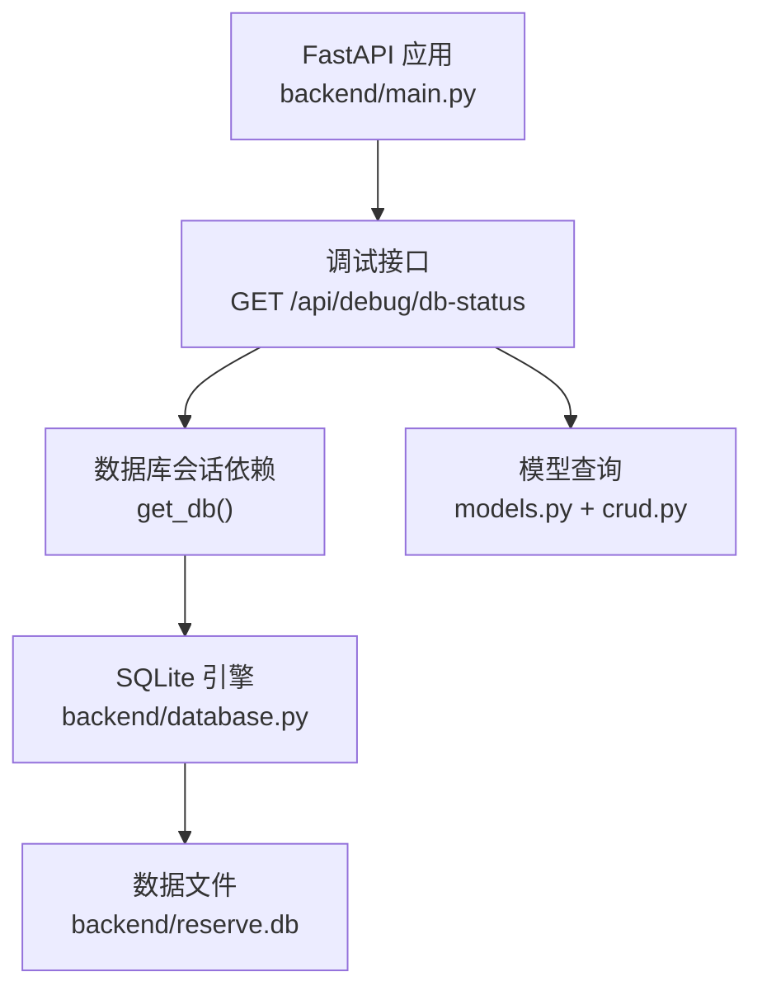
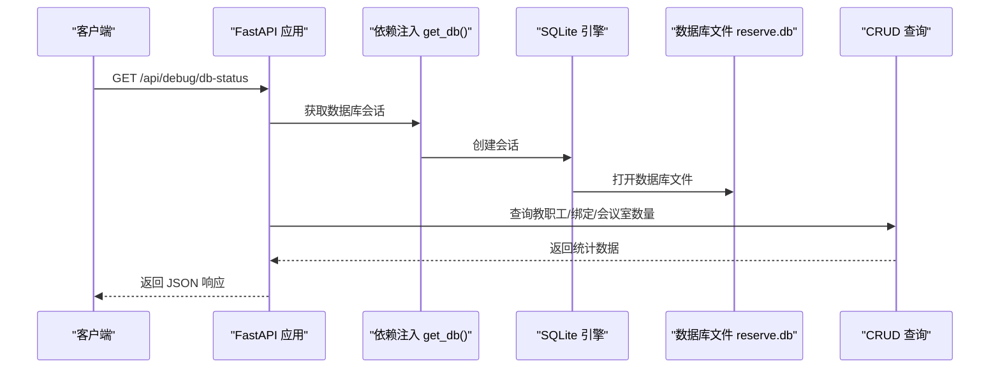
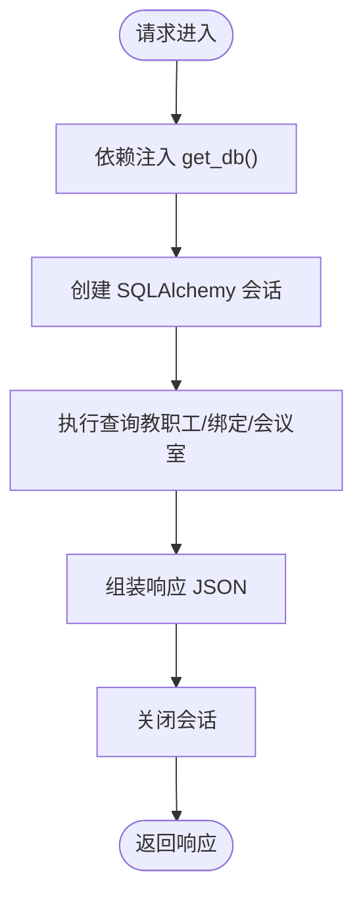
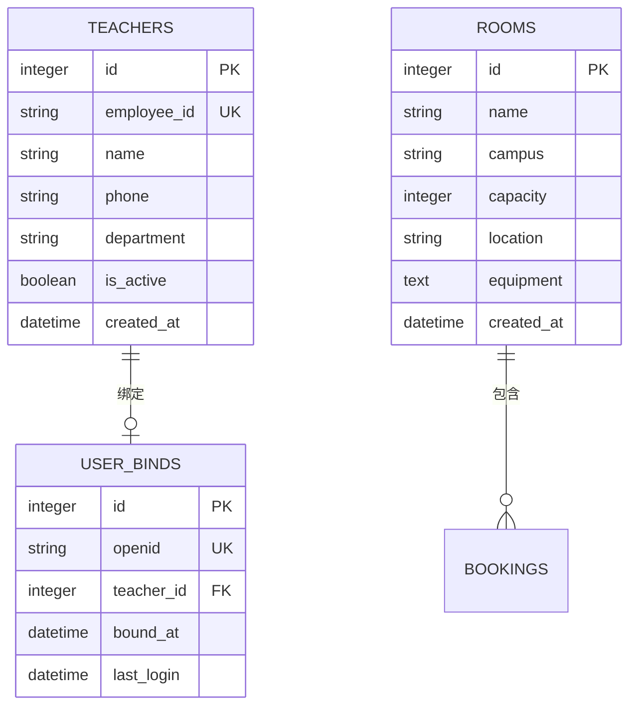
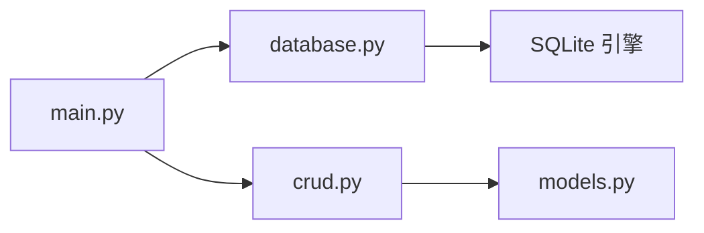

# 调试与测试接口

<cite>
**本文档引用的文件**
- [main.py](file://backend/main.py)
- [database.py](file://backend/database.py)
- [models.py](file://backend/models.py)
- [crud.py](file://backend/crud.py)
- [schemas.py](file://backend/schemas.py)
- [README.md](file://README.md)
</cite>

## 目录
1. [简介](#简介)
2. [项目结构](#项目结构)
3. [核心组件](#核心组件)
4. [架构总览](#架构总览)
5. [详细组件分析](#详细组件分析)
6. [依赖关系分析](#依赖关系分析)
7. [性能考量](#性能考量)
8. [故障排查指南](#故障排查指南)
9. [结论](#结论)

## 简介
本文件聚焦于调试与测试接口中的数据库状态检查接口，详细说明其规范、用途与使用方法。该接口为开发与运维阶段提供数据库健康度快速诊断能力，帮助确认数据库连接、数据完整性与配置信息。需特别注意：该接口仅用于开发与调试目的，在生产环境中应谨慎使用，避免泄露敏感信息。

## 项目结构
后端采用 FastAPI + SQLAlchemy + SQLite 的轻量架构，数据库状态检查接口位于主应用路由中，通过依赖注入获取数据库会话，执行轻量查询并返回关键统计信息。

图表来源
- [main.py:443-461](file://backend/main.py#L443-L461)
- [database.py:15-18](file://backend/database.py#L15-L18)
- [models.py:8-75](file://backend/models.py#L8-L75)
- [crud.py:247-252](file://backend/crud.py#L247-L252)

章节来源
- [main.py:443-461](file://backend/main.py#L443-L461)
- [database.py:15-18](file://backend/database.py#L15-L18)

## 核心组件
- 调试接口：GET /api/debug/db-status
  - 功能：检查数据库连接状态、统计关键数据条目数量、返回数据库文件路径与数据目录配置
  - 请求：无查询参数
  - 响应：包含数据库路径、数据目录、教职工数量、绑定关系数量、会议室数量及部分教职工简要信息
- 数据库配置：SQLite + SQLAlchemy
  - 数据库文件路径由环境变量 DATA_PATH 控制，默认位于 backend/reserve.db
  - 依赖注入 get_db 提供会话生命周期管理
- 数据模型与查询：基于 models 与 crud 的轻量查询，确保接口快速返回

章节来源
- [main.py:443-461](file://backend/main.py#L443-L461)
- [database.py:11-13](file://backend/database.py#L11-L13)
- [models.py:8-75](file://backend/models.py#L8-L75)
- [crud.py:247-252](file://backend/crud.py#L247-L252)

## 架构总览
调试接口在 FastAPI 应用中通过路由装饰器注册，依赖 get_db 从引擎创建会话，随后调用 CRUD 方法查询关键实体数量与样本数据，最终以 JSON 形式返回。

图表来源
- [main.py:443-461](file://backend/main.py#L443-L461)
- [database.py:23-29](file://backend/database.py#L23-L29)
- [crud.py:247-252](file://backend/crud.py#L247-L252)

## 详细组件分析

### 接口规范：GET /api/debug/db-status
- 请求方法：GET
- 请求路径：/api/debug/db-status
- 请求参数：无
- 认证与权限：无特殊要求（开发调试接口）
- 响应类型：JSON 对象
- 响应字段说明
  - db_path：SQLite 数据库文件绝对路径
  - data_dir：DATA_PATH 环境变量值（若未设置则返回“未设置”）
  - teachers_count：教职工总数
  - teachers：部分教职工简要信息数组（包含 id、employee_id、name、is_active）
  - binds_count：用户绑定关系总数
  - rooms_count：会议室总数
- 使用场景
  - 开发阶段：快速确认数据库连接、数据文件位置与基本数据量
  - 运维阶段：验证容器/云托管环境下的 DATA_PATH 配置是否正确
  - 故障定位：判断数据库文件是否存在、是否可读写、数据是否异常清空
- 响应解读
  - 若 db_path 存在且 data_dir 显示为有效路径，通常表明数据库文件存在
  - 若 teachers_count、binds_count、rooms_count 均为合理数值，通常表明数据完整
  - 若 teachers 数组为空或数量异常，可能意味着初始数据未加载或迁移失败
- 常见问题排查
  - 数据库文件不可读：检查 DATA_PATH 环境变量与文件权限
  - 数据库文件不存在：确认 init_db 是否在启动时执行
  - 数据为空：确认示例数据初始化逻辑是否触发
  - 权限不足：在容器/云托管环境中确保 DATA_PATH 目录具备读写权限

章节来源
- [main.py:443-461](file://backend/main.py#L443-L461)
- [database.py:11-13](file://backend/database.py#L11-L13)
- [crud.py:247-252](file://backend/crud.py#L247-L252)

### 依赖注入与数据库连接
- get_db：创建 SQLAlchemy 会话，确保在请求结束后正确关闭
- engine：基于 SQLite URL 创建连接，支持跨线程访问（check_same_thread=False）
- init_db：在应用启动时创建表结构并执行迁移

图表来源
- [main.py:443-461](file://backend/main.py#L443-L461)
- [database.py:23-29](file://backend/database.py#L23-L29)

章节来源
- [database.py:15-18](file://backend/database.py#L15-L18)
- [database.py:23-29](file://backend/database.py#L23-L29)

### 数据模型与查询
- 教职工模型：teachers 表，包含唯一工号、姓名、部门、是否有效等字段
- 用户绑定模型：user_binds 表，关联 openid 与教职工
- 会议室模型：rooms 表，包含名称、校区、容量、位置、设备等字段
- 查询逻辑：通过 crud.get_teachers 获取教职工列表，直接查询 user_binds 与 rooms 表

图表来源
- [models.py:8-75](file://backend/models.py#L8-L75)

章节来源
- [models.py:8-75](file://backend/models.py#L8-L75)
- [crud.py:247-252](file://backend/crud.py#L247-L252)

## 依赖关系分析
- 路由层依赖：main.py 中的调试接口依赖 get_db 依赖 database.py 中的 engine
- 数据层依赖：CRUD 查询依赖 models 定义的数据表结构
- 配置层依赖：数据库路径由环境变量 DATA_PATH 决定，database.py 与 README 描述了默认行为

图表来源
- [main.py:443-461](file://backend/main.py#L443-L461)
- [database.py:15-18](file://backend/database.py#L15-L18)
- [crud.py:247-252](file://backend/crud.py#L247-L252)
- [models.py:8-75](file://backend/models.py#L8-L75)

章节来源
- [main.py:443-461](file://backend/main.py#L443-L461)
- [database.py:15-18](file://backend/database.py#L15-L18)
- [crud.py:247-252](file://backend/crud.py#L247-L252)
- [models.py:8-75](file://backend/models.py#L8-L75)

## 性能考量
- 接口复杂度：O(n)，其中 n 为教职工数量；查询绑定与会议室数量均为全表扫描，但数据规模较小，影响有限
- 连接管理：依赖注入确保会话及时关闭，避免连接泄漏
- 建议：在生产环境中谨慎暴露此类调试接口，必要时通过网关或中间件限制访问来源

## 故障排查指南
- 无法连接数据库
  - 检查 DATA_PATH 环境变量是否正确设置
  - 确认 DATA_PATH 指向的目录存在且具备读写权限
  - 验证 SQLite 文件是否存在
- 数据为空
  - 确认应用启动时 init_db 是否执行
  - 检查示例数据初始化逻辑是否触发
- 权限问题
  - 在容器/云托管环境中，确保 DATA_PATH 目录具备读写权限
- 接口返回异常
  - 检查依赖注入 get_db 是否正常工作
  - 查看应用日志定位异常

章节来源
- [database.py:11-13](file://backend/database.py#L11-L13)
- [README.md:555-590](file://README.md#L555-L590)

## 结论
数据库状态检查接口为开发与运维提供了快速、直观的数据库健康度诊断手段。通过该接口，可以迅速确认数据库文件位置、配置信息与关键数据的数量与完整性。在生产环境中，建议严格限制该接口的访问范围，避免泄露敏感信息与造成不必要的安全风险。