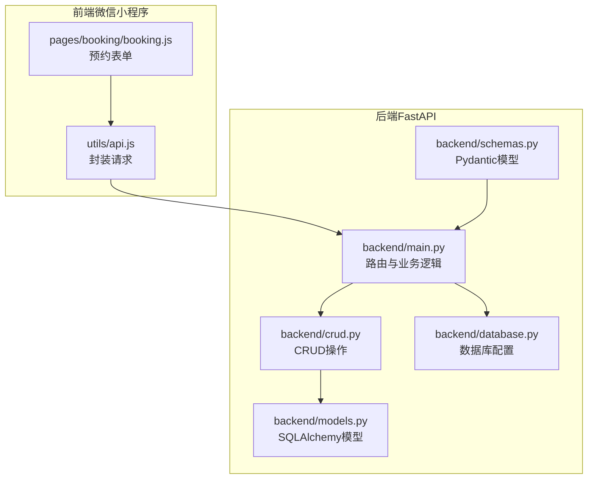
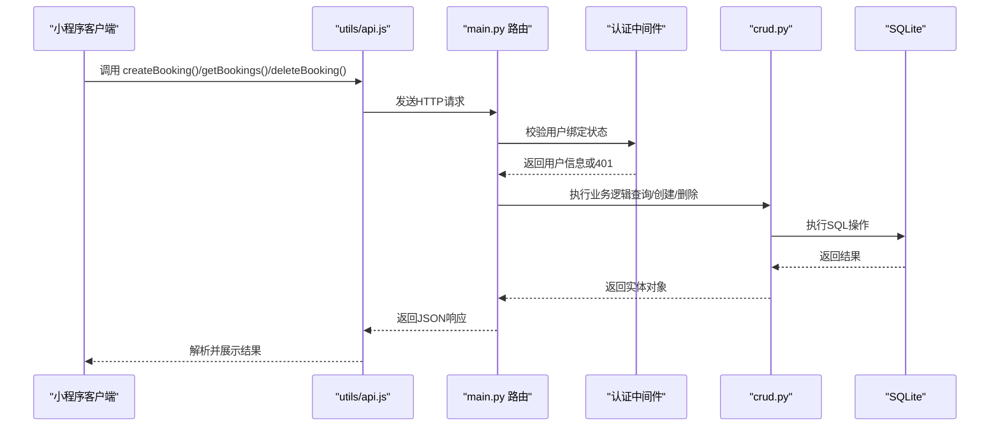
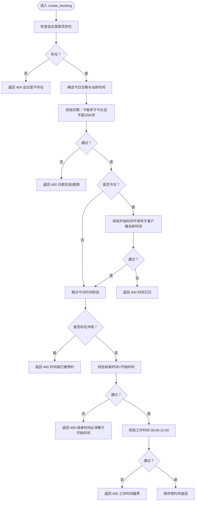
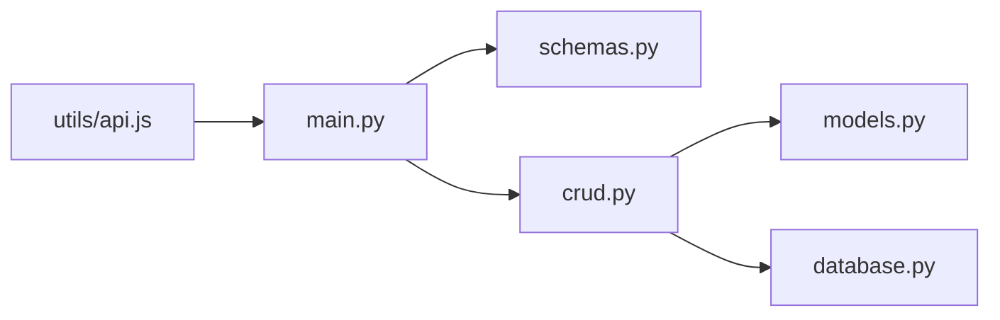

# 预约管理接口

<cite>
**本文引用的文件**
- [backend/main.py](file://backend/main.py)
- [backend/schemas.py](file://backend/schemas.py)
- [backend/models.py](file://backend/models.py)
- [backend/crud.py](file://backend/crud.py)
- [backend/database.py](file://backend/database.py)
- [miniprogram/utils/api.js](file://miniprogram/utils/api.js)
- [miniprogram/pages/booking/booking.js](file://miniprogram/pages/booking/booking.js)
- [README.md](file://README.md)
</cite>

## 目录
1. [简介](#简介)
2. [项目结构](#项目结构)
3. [核心组件](#核心组件)
4. [架构总览](#架构总览)
5. [详细组件分析](#详细组件分析)
6. [依赖分析](#依赖分析)
7. [性能考量](#性能考量)
8. [故障排查指南](#故障排查指南)
9. [结论](#结论)
10. [附录](#附录)

## 简介
本文件为“预约管理接口”的详细API文档，聚焦以下三个核心接口：
- 获取预约列表：GET /api/bookings
- 创建预约：POST /api/bookings
- 取消预约：DELETE /api/bookings/{booking_id}

文档涵盖请求参数说明、请求体结构、响应数据结构、错误码说明、业务规则（时间冲突检测、日期限制、时间有效性验证）、状态码处理与异常情况，并提供请求响应示例与常见使用场景。

## 项目结构
后端采用 FastAPI + SQLAlchemy + SQLite 的轻量架构，前端为微信小程序（Vant Weapp），通过云托管或自建服务访问后端API。

图表来源
- [backend/main.py:1-673](file://backend/main.py#L1-L673)
- [backend/schemas.py:1-185](file://backend/schemas.py#L1-L185)
- [backend/models.py:1-75](file://backend/models.py#L1-L75)
- [backend/crud.py:1-343](file://backend/crud.py#L1-L343)
- [backend/database.py:1-62](file://backend/database.py#L1-L62)
- [miniprogram/utils/api.js:1-184](file://miniprogram/utils/api.js#L1-L184)
- [miniprogram/pages/booking/booking.js:1-113](file://miniprogram/pages/booking/booking.js#L1-L113)

章节来源
- [backend/main.py:1-673](file://backend/main.py#L1-L673)
- [backend/schemas.py:1-185](file://backend/schemas.py#L1-L185)
- [backend/models.py:1-75](file://backend/models.py#L1-L75)
- [backend/crud.py:1-343](file://backend/crud.py#L1-L343)
- [backend/database.py:1-62](file://backend/database.py#L1-L62)
- [miniprogram/utils/api.js:1-184](file://miniprogram/utils/api.js#L1-L184)
- [miniprogram/pages/booking/booking.js:1-113](file://miniprogram/pages/booking/booking.js#L1-L113)

## 核心组件
- 路由与控制器：位于 backend/main.py，定义三个预约相关接口及认证流程。
- 数据模型与序列化：backend/models.py 定义数据库表结构；backend/schemas.py 定义请求/响应模型。
- 业务逻辑与数据访问：backend/crud.py 实现预约查询、创建、删除与冲突检测。
- 数据库配置：backend/database.py 管理SQLite连接与迁移。

章节来源
- [backend/main.py:249-342](file://backend/main.py#L249-L342)
- [backend/schemas.py:47-81](file://backend/schemas.py#L47-L81)
- [backend/models.py:25-42](file://backend/models.py#L25-L42)
- [backend/crud.py:57-123](file://backend/crud.py#L57-L123)
- [backend/database.py:1-62](file://backend/database.py#L1-L62)

## 架构总览
预约接口的调用链路如下：

图表来源
- [backend/main.py:282-342](file://backend/main.py#L282-L342)
- [backend/crud.py:57-123](file://backend/crud.py#L57-L123)
- [backend/database.py:15-30](file://backend/database.py#L15-L30)
- [miniprogram/utils/api.js:134-143](file://miniprogram/utils/api.js#L134-L143)

## 详细组件分析

### 获取预约列表接口（GET /api/bookings）
- 功能：按条件筛选并返回预约列表，包含会议室名称、位置、校区等附加信息。
- 认证：无需登录（匿名可读）。
- 查询参数
  - date（可选）：日期 YYYY-MM-DD
  - room_id（可选）：会议室ID
  - teacher_name（可选）：教师姓名
  - campus（可选）：校区代码（xingqing/chuangxin）
- 响应模型：List[BookingWithRoom]
  - 字段：id、room_id、date、start_time、end_time、teacher_name、subject、purpose、phone、created_at、room_name、room_location、campus
- 示例
  - 请求：GET /api/bookings?date=2025-04-05&room_id=1
  - 响应：包含多个预约项，每项包含房间信息

章节来源
- [backend/main.py:251-279](file://backend/main.py#L251-L279)
- [backend/schemas.py:75-80](file://backend/schemas.py#L75-L80)
- [backend/crud.py:59-73](file://backend/crud.py#L59-L73)

### 创建预约接口（POST /api/bookings）
- 功能：创建新的预约，需用户已绑定。
- 认证：需要通过请求头携带 X-WX-OPENID 或在开发环境通过查询参数传递。
- 请求体模型：BookingCreate
  - 必填字段：room_id、date、start_time、end_time、teacher_name
  - 可选字段：subject、purpose、phone、client_date、client_time
- 业务规则与校验
  - 日期有效性：不能预约过去的日期；最多允许提前60天；若预约当天，开始时间不得早于客户端当前时间。
  - 时间有效性：结束时间必须晚于开始时间；工作时间限制为08:00-22:00。
  - 冲突检测：同一会议室、同一天内，时间段必须满足“相邻预约之间有1分钟缓冲”，即新旧时间段相交或相邻均视为冲突。
- 响应模型：BookingResponse
  - 字段：id、room_id、date、start_time、end_time、teacher_name、subject、purpose、phone、created_at
- 常见错误
  - 400：日期无效、超出提前天数、时间冲突、时间无效、工作时间越界
  - 404：会议室不存在
  - 401：未认证或绑定失效
- 示例
  - 请求体（部分字段）：{"room_id":1,"date":"2025-04-05","start_time":"09:00","end_time":"11:00","teacher_name":"张老师","client_date":"2025-04-01","client_time":"14:30"}
  - 成功响应：返回创建的预约对象

图表来源
- [backend/main.py:282-333](file://backend/main.py#L282-L333)
- [backend/crud.py:102-122](file://backend/crud.py#L102-L122)

章节来源
- [backend/main.py:282-333](file://backend/main.py#L282-L333)
- [backend/schemas.py:60-73](file://backend/schemas.py#L60-L73)
- [backend/crud.py:81-89](file://backend/crud.py#L81-L89)

### 取消预约接口（DELETE /api/bookings/{booking_id}）
- 功能：删除指定ID的预约。
- 认证：无需登录（匿名可取消，但需确保业务上具备权限控制）。
- 响应模型：Message
  - 字段：message
- 常见错误
  - 404：预约不存在

章节来源
- [backend/main.py:336-341](file://backend/main.py#L336-L341)
- [backend/crud.py:92-99](file://backend/crud.py#L92-L99)
- [backend/schemas.py:176-179](file://backend/schemas.py#L176-L179)

### 认证与绑定机制（与创建预约相关）
- 获取当前用户：从请求头读取 X-WX-OPENID，若为空则在开发环境回退到查询参数或模拟值。
- 未绑定用户将返回 401。
- 小程序侧通过 utils/api.js 调用后端认证接口，前端页面 booking.js 在提交时读取全局用户信息。

章节来源
- [backend/main.py:469-500](file://backend/main.py#L469-L500)
- [miniprogram/utils/api.js:134-143](file://miniprogram/utils/api.js#L134-L143)
- [miniprogram/pages/booking/booking.js:50-97](file://miniprogram/pages/booking/booking.js#L50-L97)

## 依赖分析
- 模块耦合
  - main.py 依赖 schemas.py 的模型定义与 crud.py 的业务逻辑。
  - crud.py 依赖 models.py 的ORM模型与 database.py 的数据库引擎。
  - 前端通过 utils/api.js 封装请求，调用 main.py 暴露的REST接口。
- 外部依赖
  - FastAPI、SQLAlchemy、Pydantic、uvicorn、python-multipart。

图表来源
- [backend/main.py:1-20](file://backend/main.py#L1-L20)
- [backend/schemas.py:1-10](file://backend/schemas.py#L1-L10)
- [backend/crud.py:1-10](file://backend/crud.py#L1-L10)
- [backend/models.py:1-10](file://backend/models.py#L1-L10)
- [backend/database.py:1-10](file://backend/database.py#L1-L10)
- [miniprogram/utils/api.js:1-10](file://miniprogram/utils/api.js#L1-L10)

章节来源
- [backend/main.py:1-20](file://backend/main.py#L1-L20)
- [backend/schemas.py:1-10](file://backend/schemas.py#L1-L10)
- [backend/crud.py:1-10](file://backend/crud.py#L1-L10)
- [backend/models.py:1-10](file://backend/models.py#L1-L10)
- [backend/database.py:1-10](file://backend/database.py#L1-L10)
- [miniprogram/utils/api.js:1-10](file://miniprogram/utils/api.js#L1-L10)

## 性能考量
- 查询优化：GET /api/bookings 对多条件查询使用 JOIN + WHERE 子句，建议在 date、room_id、teacher_name、campus 上建立索引以提升查询效率。
- 冲突检测：check_time_conflict 使用 OR 条件匹配相交时间段，建议对 bookings 表的 date、room_id、start_time、end_time 建立复合索引。
- 时间线计算：会议室时间线算法涉及排序与合并区间，建议在 bookings 表按 date、room_id、start_time 排序，减少排序成本。
- 并发与事务：使用 SQLAlchemy 会话管理，确保事务一致性；高并发下建议增加连接池配置与锁策略。

## 故障排查指南
- 400 错误
  - 日期无效：确认 date 格式为 YYYY-MM-DD，且不早于今日或超过60天。
  - 时间冲突：检查目标时间段与现有预约是否相交或相邻（含1分钟缓冲）。
  - 时间无效：结束时间必须晚于开始时间；工作时间必须在 08:00-22:00。
- 401 错误
  - 未认证：确认请求头包含正确的 X-WX-OPENID，或在开发环境正确传递 openid。
- 404 错误
  - 会议室不存在：确认 room_id 有效。
  - 预约不存在：确认 booking_id 存在。
- 前端调用
  - 小程序通过 utils/api.js 的 request 封装调用，注意云托管模式下的 header 配置与服务名。

章节来源
- [backend/main.py:282-333](file://backend/main.py#L282-L333)
- [backend/main.py:336-341](file://backend/main.py#L336-L341)
- [backend/main.py:469-500](file://backend/main.py#L469-L500)
- [miniprogram/utils/api.js:13-41](file://miniprogram/utils/api.js#L13-L41)

## 结论
本API文档覆盖了预约管理的核心接口与业务规则，明确了请求参数、响应结构、错误码与异常处理策略。通过严格的日期与时间校验、冲突检测与工作时间限制，保障了预约系统的稳定与公平。建议在生产环境中完善权限控制、监控与日志记录，并针对高频查询建立索引以提升性能。

## 附录

### 请求参数与模型对照
- GET /api/bookings
  - 查询参数：date、room_id、teacher_name、campus
  - 响应模型：List[BookingWithRoom]
- POST /api/bookings
  - 请求体：BookingCreate（必填：room_id、date、start_time、end_time、teacher_name；可选：subject、purpose、phone、client_date、client_time）
  - 响应模型：BookingResponse
- DELETE /api/bookings/{booking_id}
  - 路径参数：booking_id
  - 响应模型：Message

章节来源
- [backend/main.py:251-279](file://backend/main.py#L251-L279)
- [backend/main.py:282-333](file://backend/main.py#L282-L333)
- [backend/main.py:336-341](file://backend/main.py#L336-L341)
- [backend/schemas.py:49-80](file://backend/schemas.py#L49-L80)

### 常见使用场景
- 场景1：教师查询某日的个人预约
  - 方法：GET /api/bookings?date=YYYY-MM-DD&teacher_name=张老师
- 场景2：管理员查看某会议室某日的全部预约
  - 方法：GET /api/bookings?date=YYYY-MM-DD&room_id=1
- 场景3：教师在小程序上创建预约
  - 步骤：填写表单 -> 读取全局用户信息 -> 调用 createBooking -> 显示结果
  - 参考：miniprogram/pages/booking/booking.js

章节来源
- [miniprogram/pages/booking/booking.js:50-97](file://miniprogram/pages/booking/booking.js#L50-L97)
- [miniprogram/utils/api.js:134-136](file://miniprogram/utils/api.js#L134-L136)