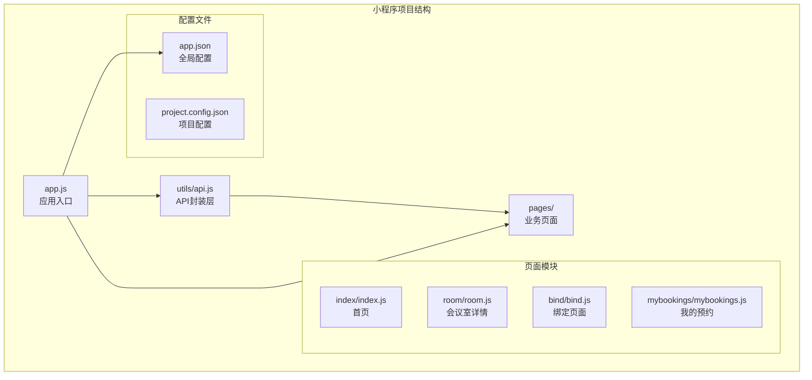
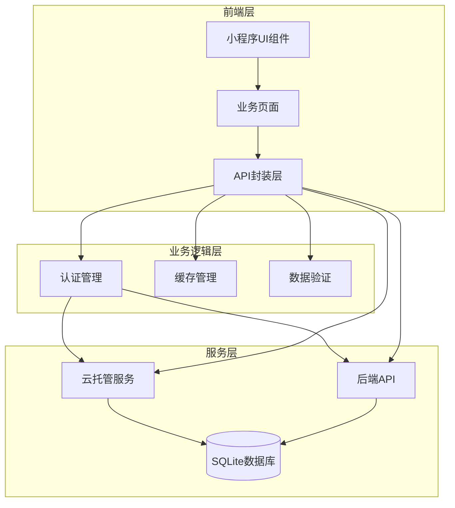
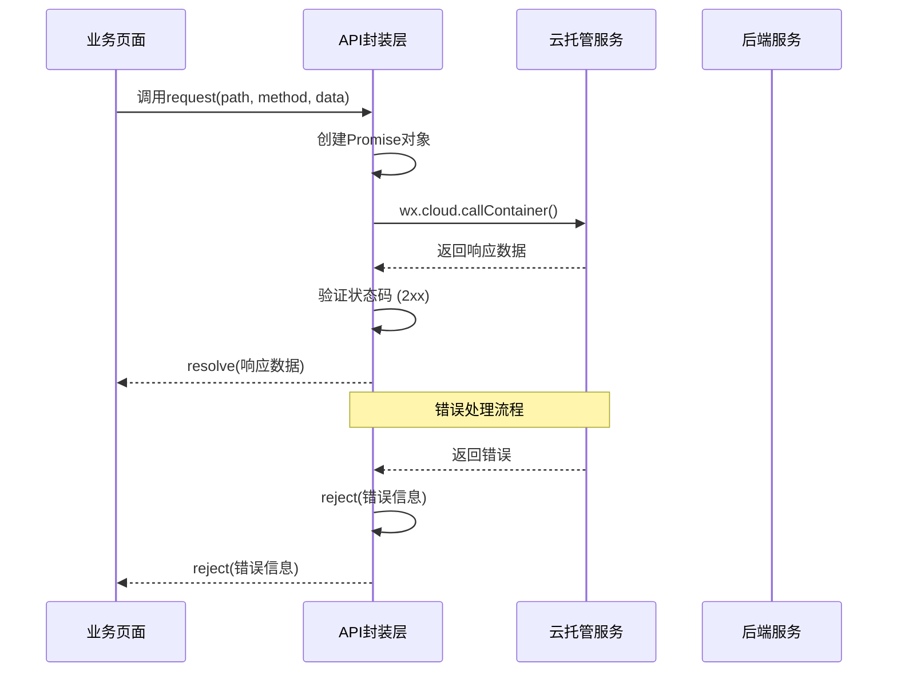
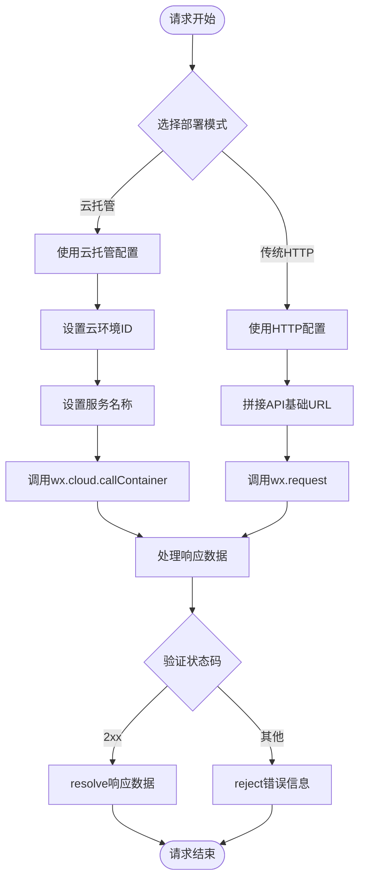
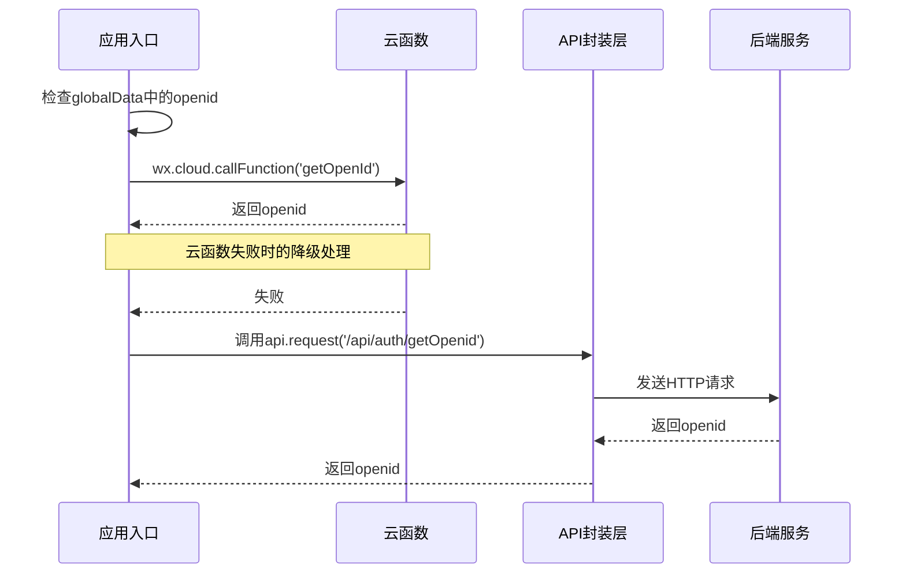
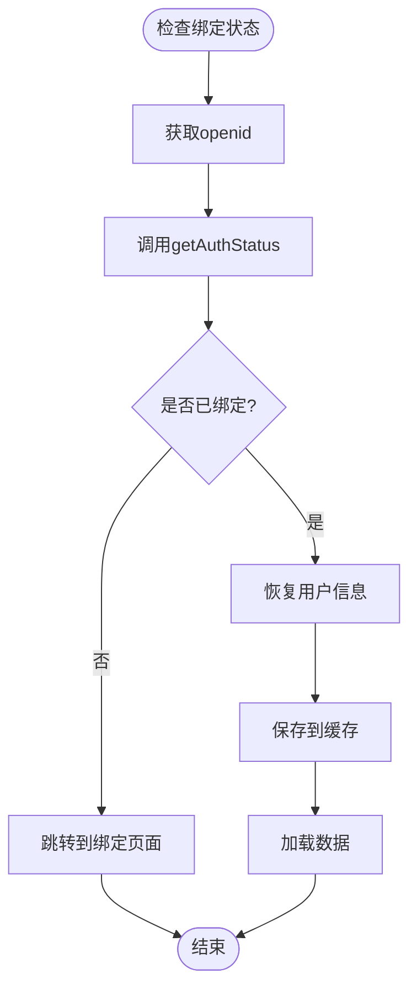
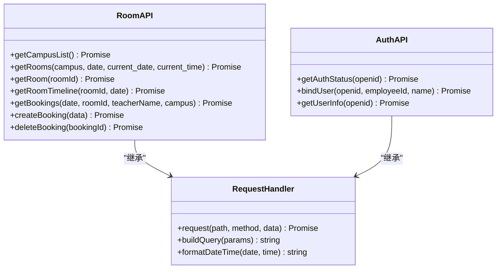
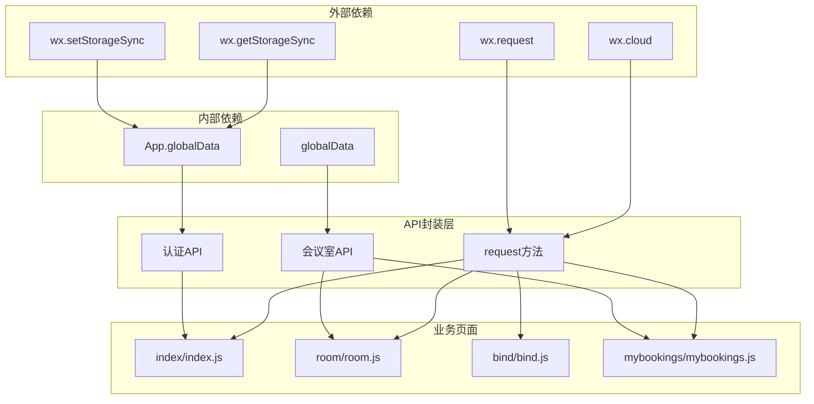

# API封装层

<cite>
**本文档引用的文件**
- [api.js](file://miniprogram/utils/api.js)
- [app.js](file://miniprogram/app.js)
- [index.js](file://miniprogram/pages/index/index.js)
- [bind.js](file://miniprogram/pages/bind/bind.js)
- [room.js](file://miniprogram/pages/room/room.js)
- [mybookings.js](file://miniprogram/pages/mybookings/mybookings.js)
- [app.json](file://miniprogram/app.json)
- [MINIPROGRAM_DEBUG_GUIDE.md](file://docs/MINIPROGRAM_DEBUG_GUIDE.md)
- [README.md](file://README.md)
</cite>

## 目录
1. [简介](#简介)
2. [项目结构](#项目结构)
3. [核心组件](#核心组件)
4. [架构概览](#架构概览)
5. [详细组件分析](#详细组件分析)
6. [依赖关系分析](#依赖关系分析)
7. [性能考虑](#性能考虑)
8. [故障排除指南](#故障排除指南)
9. [结论](#结论)

## 简介

本项目是一个基于微信小程序的会议室预约系统，采用前后端分离架构。API封装层位于`miniprogram/utils/api.js`文件中，提供了统一的HTTP请求处理机制，支持多种环境配置、认证管理和错误处理。

该封装层主要实现了以下功能：
- 统一的请求处理和响应数据格式化
- 多环境配置支持（开发、测试、生产）
- 认证机制实现（token管理、请求头设置）
- 网络请求优化策略
- 完整的错误处理机制

## 项目结构

项目采用模块化的文件组织方式，API封装层位于utils目录下，与业务页面分离，便于维护和复用。

**图表来源**
- [api.js:1-184](file://miniprogram/utils/api.js#L1-L184)
- [app.js:1-127](file://miniprogram/app.js#L1-L127)

**章节来源**
- [api.js:1-184](file://miniprogram/utils/api.js#L1-L184)
- [app.js:1-127](file://miniprogram/app.js#L1-L127)
- [app.json:1-61](file://miniprogram/app.json#L1-L61)

## 核心组件

API封装层的核心组件包括统一请求处理、环境配置、认证管理和业务接口封装。

### 统一请求处理

封装层提供了`request()`方法作为统一的HTTP请求入口，支持Promise异步处理和完整的错误处理机制。

### 环境配置管理

系统支持多种部署环境，通过云托管配置和传统HTTP请求两种模式实现：

- **云托管模式**：使用`wx.cloud.callContainer()`进行请求
- **传统HTTP模式**：使用`wx.request()`进行请求

### 认证机制

实现了完整的用户认证流程，包括openid获取、绑定状态检查和用户信息管理。

### 业务接口封装

提供了完整的会议室预约业务接口，包括校区查询、会议室管理、预约操作等功能。

**章节来源**
- [api.js:13-41](file://miniprogram/utils/api.js#L13-L41)
- [api.js:5-8](file://miniprogram/utils/api.js#L5-L8)
- [api.js:145-184](file://miniprogram/utils/api.js#L145-L184)

## 架构概览

系统采用三层架构设计，API封装层位于业务逻辑层，负责与后端服务通信。

**图表来源**
- [api.js:1-184](file://miniprogram/utils/api.js#L1-L184)
- [app.js:44-89](file://miniprogram/app.js#L44-L89)

## 详细组件分析

### API请求封装组件

#### request()方法实现

`request()`方法是整个封装层的核心，提供了统一的请求处理机制：

**图表来源**
- [api.js:13-41](file://miniprogram/utils/api.js#L13-L41)

#### 环境配置策略

系统支持两种部署模式，通过条件判断实现灵活的环境适配：

**图表来源**
- [api.js:5-8](file://miniprogram/utils/api.js#L5-L8)
- [api.js:43-74](file://miniprogram/utils/api.js#L43-L74)

**章节来源**
- [api.js:13-41](file://miniprogram/utils/api.js#L13-L41)
- [api.js:43-74](file://miniprogram/utils/api.js#L43-L74)

### 认证机制组件

#### openid获取流程

系统实现了多层级的openid获取策略，确保在不同环境下都能获取到有效的用户标识：

**图表来源**
- [app.js:46-89](file://miniprogram/app.js#L46-L89)

#### 绑定状态检查

系统提供了完整的绑定状态检查机制，确保用户身份的有效性：

**图表来源**
- [app.js:91-119](file://miniprogram/app.js#L91-L119)
- [index.js:38-90](file://miniprogram/pages/index/index.js#L38-L90)

**章节来源**
- [app.js:46-119](file://miniprogram/app.js#L46-L119)
- [index.js:38-134](file://miniprogram/pages/index/index.js#L38-L134)

### 业务接口组件

#### 会议室查询接口

封装层提供了完整的会议室查询接口，支持多种查询条件：

**图表来源**
- [api.js:76-184](file://miniprogram/utils/api.js#L76-L184)

#### 数据格式化处理

系统实现了智能的数据格式化机制，确保前后端数据传输的一致性：

**章节来源**
- [api.js:76-184](file://miniprogram/utils/api.js#L76-L184)

## 依赖关系分析

API封装层与项目其他组件存在紧密的依赖关系：

**图表来源**
- [api.js:1-184](file://miniprogram/utils/api.js#L1-L184)
- [app.js:1-127](file://miniprogram/app.js#L1-L127)

**章节来源**
- [api.js:1-184](file://miniprogram/utils/api.js#L1-L184)
- [app.js:1-127](file://miniprogram/app.js#L1-L127)

## 性能考虑

### 网络请求优化

系统实现了多项性能优化策略：

1. **并发请求处理**：使用`Promise.all()`并行获取多个API数据
2. **缓存策略**：利用微信存储API进行数据缓存
3. **请求去重**：避免重复发起相同的请求
4. **超时控制**：合理设置请求超时时间

### 内存管理

- 及时清理不再使用的数据
- 合理使用全局变量
- 避免内存泄漏

### 用户体验优化

- 加载状态指示
- 错误提示机制
- 网络状态检测

## 故障排除指南

### 常见问题及解决方案

#### 1. 网络请求失败

**问题现象**：API调用返回错误或超时

**可能原因**：
- 后端服务未启动
- 网络连接异常
- 域名配置错误

**解决方案**：
- 检查后端服务状态
- 验证网络连接
- 确认域名配置

#### 2. 认证失败

**问题现象**：用户无法登录或绑定

**可能原因**：
- openid获取失败
- 服务器认证服务异常
- 缓存数据过期

**解决方案**：
- 检查云函数配置
- 验证服务器状态
- 清除缓存后重试

#### 3. 数据加载缓慢

**问题现象**：页面加载时间过长

**可能原因**：
- API响应慢
- 网络延迟高
- 数据量过大

**解决方案**：
- 实施数据缓存
- 优化API查询
- 分页加载数据

**章节来源**
- [MINIPROGRAM_DEBUG_GUIDE.md:256-310](file://docs/MINIPROGRAM_DEBUG_GUIDE.md#L256-L310)

### 调试技巧

#### 1. 控制台调试

使用`console.log()`输出调试信息，监控API调用过程。

#### 2. 网络请求监控

通过微信开发者工具的Network面板查看详细的请求响应信息。

#### 3. 缓存数据检查

使用`wx.getStorageInfo()`检查本地缓存状态。

## 结论

本API封装层实现了完整的微信小程序HTTP请求处理机制，具有以下特点：

1. **统一性**：提供统一的请求接口和错误处理机制
2. **灵活性**：支持多种部署环境和配置策略
3. **安全性**：完善的认证机制和权限验证
4. **可维护性**：清晰的代码结构和模块化设计
5. **性能优化**：合理的缓存策略和并发处理机制

通过合理的架构设计和实现细节，该封装层为整个会议室预约系统提供了稳定可靠的服务支持，为后续的功能扩展奠定了良好的基础。