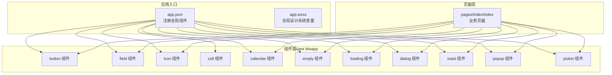
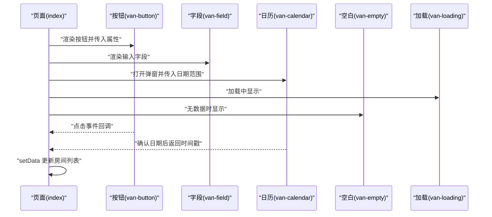
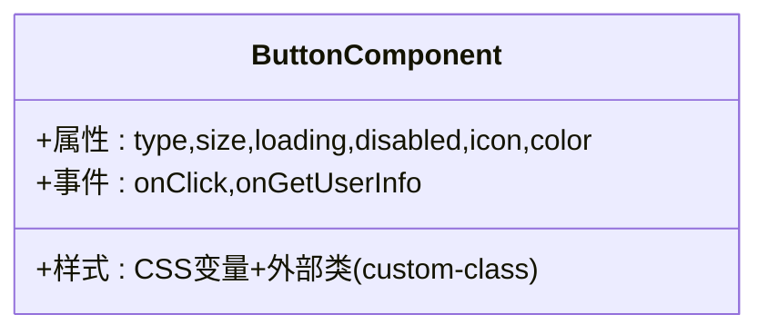
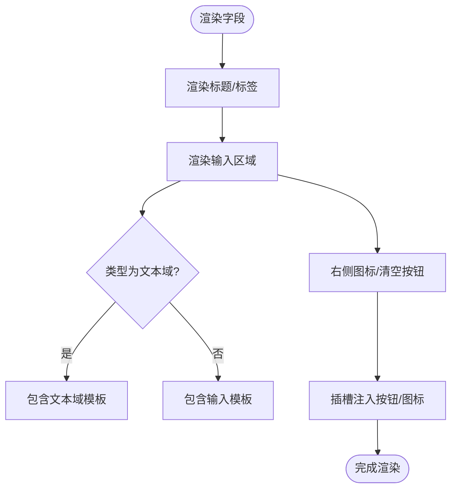
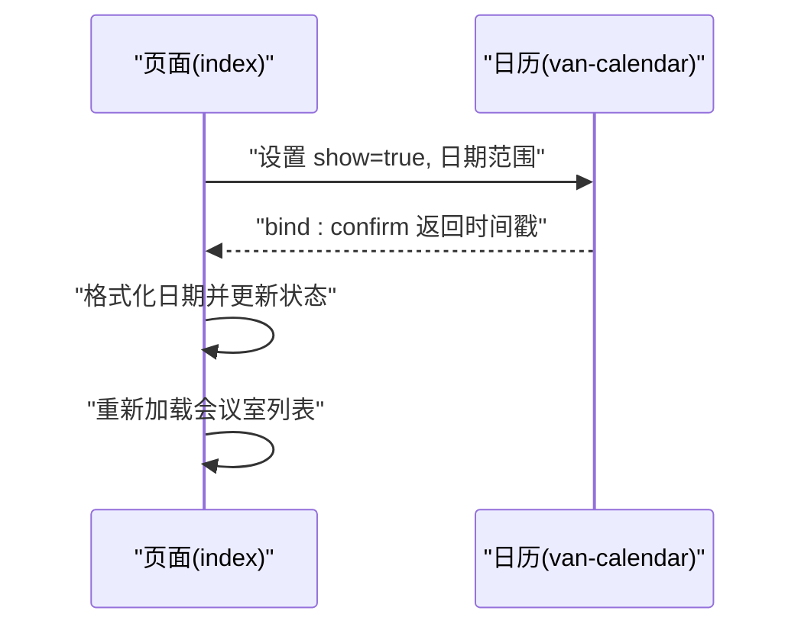
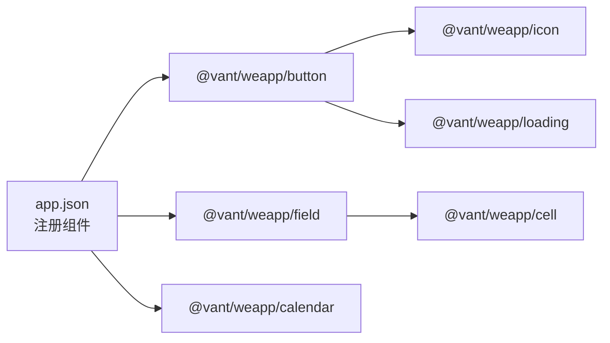
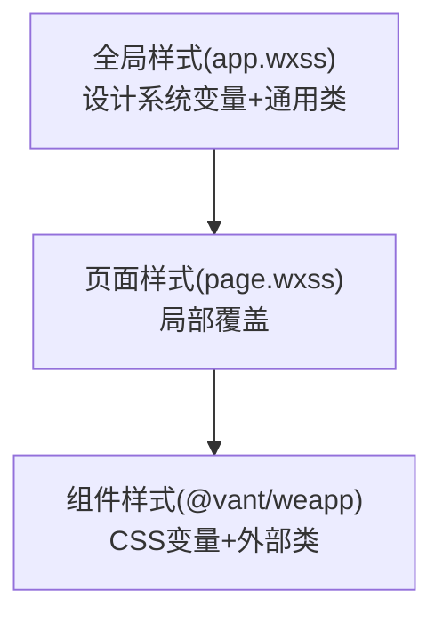
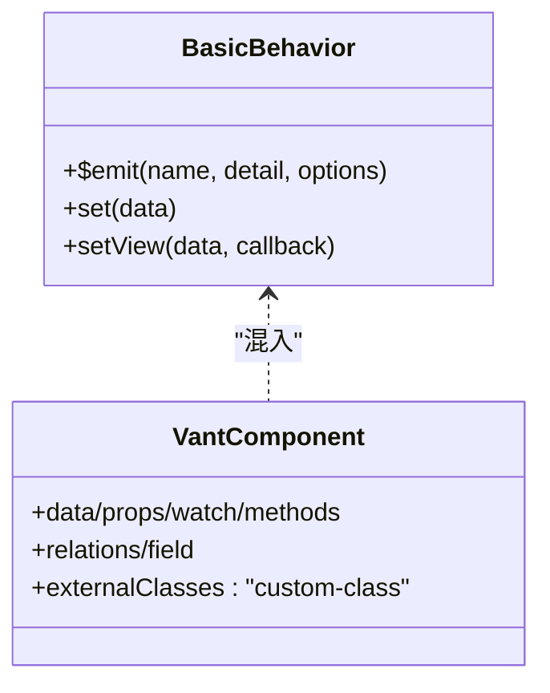

# UI组件与样式

<cite>
**本文引用的文件**
- [app.json](file://miniprogram/app.json)
- [app.wxss](file://miniprogram/app.wxss)
- [button/index.json](file://miniprogram/miniprogram_npm/@vant/weapp/button/index.json)
- [button/index.wxml](file://miniprogram/miniprogram_npm/@vant/weapp/button/index.wxml)
- [button/index.wxss](file://miniprogram/miniprogram_npm/@vant/weapp/button/index.wxss)
- [field/index.json](file://miniprogram/miniprogram_npm/@vant/weapp/field/index.json)
- [field/index.wxml](file://miniprogram/miniprogram_npm/@vant/weapp/field/index.wxml)
- [index.wxml](file://miniprogram/pages/index/index.wxml)
- [index.js](file://miniprogram/pages/index/index.js)
- [common/index.wxss](file://miniprogram/miniprogram_npm/@vant/weapp/common/index.wxss)
- [common/component.js](file://miniprogram/miniprogram_npm/@vant/weapp/common/component.js)
- [mixins/basic.js](file://miniprogram/miniprogram_npm/@vant/weapp/mixins/basic.js)
- [wxs/style.wxs](file://miniprogram/miniprogram_npm/@vant/weapp/wxs/style.wxs)
- [color.js](file://miniprogram/miniprogram_npm/@vant/weapp/common/color.js)
</cite>

## 目录
1. [简介](#简介)
2. [项目结构](#项目结构)
3. [核心组件](#核心组件)
4. [架构总览](#架构总览)
5. [详细组件分析](#详细组件分析)
6. [依赖分析](#依赖分析)
7. [性能考虑](#性能考虑)
8. [故障排查指南](#故障排查指南)
9. [结论](#结论)
10. [附录](#附录)

## 简介
本文件面向小程序UI组件与样式体系，围绕Vant Weapp组件库在本项目中的使用进行系统化梳理，覆盖以下重点：
- 组件使用：按钮、表单、布局、导航等常用组件的配置与定制路径
- 自定义组件开发：设计原则、属性传递、事件处理与性能优化
- 样式系统：全局样式、页面样式与组件样式的层次关系，以及响应式与主题定制方案
- 实战示例：首页页面对Vant Weapp组件的实际调用与交互流程
- 最佳实践：可复用的样式组织、WXS计算与事件处理模式

## 项目结构
本项目采用“页面 + 组件 + 样式”的分层组织方式：
- 页面层：各业务页面（如首页）负责数据与交互逻辑
- 组件层：通过 app.json 中集中注册的Vant Weapp组件，按需在页面中使用
- 样式层：全局样式（app.wxss）定义设计系统变量与通用类；组件样式（Vant Weapp）通过CSS变量与外部类扩展实现主题化

图表来源
- [app.json:44-58](file://miniprogram/app.json#L44-L58)
- [index.wxml:37-52](file://miniprogram/pages/index/index.wxml#L37-L52)

章节来源
- [app.json:1-61](file://miniprogram/app.json#L1-L61)
- [app.wxss:1-115](file://miniprogram/app.wxss#L1-L115)

## 核心组件
本项目集中使用了以下Vant Weapp组件：
- 基础交互：按钮、图标、加载、对话框、吐司
- 表单与展示：单元格、字段、选择器、弹窗、日历、空白提示
- 页面导航：标签、面板、步骤条等（在app.json中注册）

这些组件通过 app.json 的 usingComponents 字段统一注册，并在页面中以自定义标签形式使用。

章节来源
- [app.json:44-58](file://miniprogram/app.json#L44-L58)

## 架构总览
下图展示了页面与组件之间的调用关系与数据流：

图表来源
- [index.wxml:37-52](file://miniprogram/pages/index/index.wxml#L37-L52)
- [button/index.wxml:4-31](file://miniprogram/miniprogram_npm/@vant/weapp/button/index.wxml#L4-L31)
- [field/index.wxml:4-17](file://miniprogram/miniprogram_npm/@vant/weapp/field/index.wxml#L4-L17)

## 详细组件分析

### 按钮组件（van-button）
- 组件特性
  - 支持类型、尺寸、朴素/描边、圆形/方形、禁用、加载态等状态
  - 内置图标与加载指示器，支持无障碍属性
  - 通过外部类 custom-class 与CSS变量实现主题化
- 使用要点
  - 在页面中以自定义标签引入，绑定点击事件
  - 通过属性控制 loading 与 disabled 状态，避免重复点击
- 样式与主题
  - 组件样式基于CSS变量（如按钮高度、字体大小、颜色），可在全局或页面中覆盖
  - 通过外部类扩展容器样式，实现与业务样式的融合

图表来源
- [button/index.json:1-8](file://miniprogram/miniprogram_npm/@vant/weapp/button/index.json#L1-L8)
- [button/index.wxml:4-31](file://miniprogram/miniprogram_npm/@vant/weapp/button/index.wxml#L4-L31)
- [button/index.wxss:1-1](file://miniprogram/miniprogram_npm/@vant/weapp/button/index.wxss#L1-L1)

章节来源
- [button/index.json:1-8](file://miniprogram/miniprogram_npm/@vant/weapp/button/index.json#L1-L8)
- [button/index.wxml:1-57](file://miniprogram/miniprogram_npm/@vant/weapp/button/index.wxml#L1-L57)
- [button/index.wxss:1-1](file://miniprogram/miniprogram_npm/@vant/weapp/button/index.wxss#L1-L1)

### 字段组件（van-field）
- 组件特性
  - 将标题、输入区域、右侧图标、清空按钮、字数限制与错误信息整合为一个复合控件
  - 支持左右插槽，便于扩展图标与按钮
- 使用要点
  - 通过插槽注入输入内容，支持文本域与输入框两种形态
  - 提供清空与点击图标回调，便于表单校验与交互
- 与页面结合
  - 在首页中作为输入类表单项的基础单元，配合单元格展示

图表来源
- [field/index.wxml:4-17](file://miniprogram/miniprogram_npm/@vant/weapp/field/index.wxml#L4-L17)

章节来源
- [field/index.json:1-8](file://miniprogram/miniprogram_npm/@vant/weapp/field/index.json#L1-L8)
- [field/index.wxml:1-57](file://miniprogram/miniprogram_npm/@vant/weapp/field/index.wxml#L1-L57)

### 日历组件（van-calendar）
- 组件特性
  - 弹窗式日历，支持单选/区间/多选（本项目使用单选）
  - 可配置最小/最大日期、默认日期、确认文案与标题
- 使用要点
  - 通过 show 属性控制显隐，通过 confirm/close 事件接收结果
  - 与页面数据双向联动，更新当前选择日期并触发房间列表刷新

图表来源
- [index.wxml:37-52](file://miniprogram/pages/index/index.wxml#L37-L52)
- [index.js:295-309](file://miniprogram/pages/index/index.js#L295-L309)

章节来源
- [index.wxml:37-52](file://miniprogram/pages/index/index.wxml#L37-L52)
- [index.js:287-309](file://miniprogram/pages/index/index.js#L287-L309)

### 加载与空白组件（van-loading / van-empty）
- 加载组件
  - 在首页加载会议室列表时显示，支持尺寸与颜色配置
- 空白组件
  - 当房间列表为空时显示“暂无会议室”提示，提升可用性

章节来源
- [index.wxml:56-63](file://miniprogram/pages/index/index.wxml#L56-L63)

### 图标组件（van-icon）
- 用途
  - 在首页日期选择、房间信息展示等场景中用于增强语义与可读性
- 特点
  - 支持内置图标名与尺寸、颜色配置

章节来源
- [index.wxml:30-32](file://miniprogram/pages/index/index.wxml#L30-L32)

## 依赖分析
- 组件注册与依赖
  - app.json 中集中注册Vant Weapp组件，页面通过自定义标签直接使用
  - 组件内部通过 usingComponents 引用子组件（如按钮引用图标、加载）
- 样式依赖
  - 组件样式依赖公共样式（如clearfix、hairline）与CSS变量
  - 页面通过全局样式变量实现主题色与间距的一致性

图表来源
- [app.json:44-58](file://miniprogram/app.json#L44-L58)
- [button/index.json:3-6](file://miniprogram/miniprogram_npm/@vant/weapp/button/index.json#L3-L6)
- [field/index.json:3-6](file://miniprogram/miniprogram_npm/@vant/weapp/field/index.json#L3-L6)

章节来源
- [app.json:44-58](file://miniprogram/app.json#L44-L58)
- [common/index.wxss:1-1](file://miniprogram/miniprogram_npm/@vant/weapp/common/index.wxss#L1-L1)

## 性能考虑
- 数据更新优化
  - 使用组件提供的高性能 setData 包装（setView），仅对变化的数据进行更新，减少不必要的视图刷新
- 事件处理
  - 通过事件节流与防抖策略避免频繁触发（如日期选择、列表滚动）
- 样式计算
  - 使用WXS进行样式拼接与单位转换，降低JS侧计算开销
- 组件懒加载
  - 对于非首屏使用的组件（如复杂弹窗），建议按需引入，减少初始包体积

章节来源
- [mixins/basic.js:13-28](file://miniprogram/miniprogram_npm/@vant/weapp/mixins/basic.js#L13-L28)
- [wxs/style.wxs:15-40](file://miniprogram/miniprogram_npm/@vant/weapp/wxs/style.wxs#L15-L40)

## 故障排查指南
- 组件事件未触发
  - 检查是否正确绑定事件名与处理函数，确认组件未处于 disabled 或 loading 状态
- 样式不生效
  - 确认是否使用了外部类 custom-class，或CSS变量是否被覆盖
- 主题色异常
  - 检查全局CSS变量是否正确设置，组件样式是否依赖对应变量
- 页面滚动问题
  - 全局样式中已禁止横向滚动，若出现滚动异常，检查容器层级与布局

章节来源
- [button/index.wxml:21-29](file://miniprogram/miniprogram_npm/@vant/weapp/button/index.wxml#L21-L29)
- [app.wxss:25-28](file://miniprogram/app.wxss#L25-L28)

## 结论
本项目通过 app.json 统一注册Vant Weapp组件，结合全局样式变量与组件CSS变量，实现了高内聚、低耦合的UI体系。页面层以事件驱动与数据驱动的方式调用组件，形成清晰的职责边界。建议在后续迭代中：
- 规范组件命名与属性传递，统一事件命名约定
- 持续沉淀页面级通用样式类，减少重复样式
- 对复杂交互使用WXS进行性能优化

## 附录

### 样式系统组织与层次关系
- 全局样式（app.wxss）
  - 定义设计系统变量（主色、状态色、字号、圆角、背景等）
  - 提供通用容器、卡片、按钮、状态标签与Flex工具类
- 页面样式（页面.wxss）
  - 基于全局变量进行局部覆盖，保持风格一致
- 组件样式（Vant Weapp）
  - 通过CSS变量与外部类扩展，实现主题化与可定制

图表来源
- [app.wxss:3-28](file://miniprogram/app.wxss#L3-L28)
- [common/index.wxss:1-1](file://miniprogram/miniprogram_npm/@vant/weapp/common/index.wxss#L1-L1)

### 响应式设计与主题定制
- 响应式
  - 使用rpx单位与Flex布局，确保在不同设备上保持一致的视觉比例
- 主题定制
  - 通过全局CSS变量统一管理主色、状态色与圆角等，组件内部以变量形式消费
  - 组件支持通过属性与外部类进行二次定制

章节来源
- [app.wxss:19-28](file://miniprogram/app.wxss#L19-L28)
- [color.js:4-10](file://miniprogram/miniprogram_npm/@vant/weapp/common/color.js#L4-L10)

### 自定义组件开发规范与最佳实践
- 设计原则
  - 单一职责：每个组件聚焦一类功能
  - 明确接口：属性、事件、插槽三要素清晰
- 属性传递与事件处理
  - 使用外部类 custom-class 与CSS变量实现主题化
  - 通过行为（Behavior）封装通用方法（如 $emit、set、setView）
- 性能优化
  - 优先使用WXS进行样式拼接与计算
  - 使用高性能 setData 包装，减少无效更新

图表来源
- [mixins/basic.js:4-31](file://miniprogram/miniprogram_npm/@vant/weapp/mixins/basic.js#L4-L31)
- [common/component.js:12-47](file://miniprogram/miniprogram_npm/@vant/weapp/common/component.js#L12-L47)

章节来源
- [common/component.js:1-50](file://miniprogram/miniprogram_npm/@vant/weapp/common/component.js#L1-L50)
- [mixins/basic.js:1-31](file://miniprogram/miniprogram_npm/@vant/weapp/mixins/basic.js#L1-L31)

### 组件使用示例（路径指引）
- 首页中按钮与日历的组合使用
  - 路径：[pages/index/index.wxml:37-52](file://miniprogram/pages/index/index.wxml#L37-L52)
  - 逻辑：[pages/index/index.js:287-309](file://miniprogram/pages/index/index.js#L287-L309)
- 字段组件在表单中的使用
  - 路径：[miniprogram_npm/@vant/weapp/field/index.wxml:4-17](file://miniprogram/miniprogram_npm/@vant/weapp/field/index.wxml#L4-L17)

章节来源
- [index.wxml:37-52](file://miniprogram/pages/index/index.wxml#L37-L52)
- [index.js:287-309](file://miniprogram/pages/index/index.js#L287-L309)
- [field/index.wxml:1-57](file://miniprogram/miniprogram_npm/@vant/weapp/field/index.wxml#L1-L57)