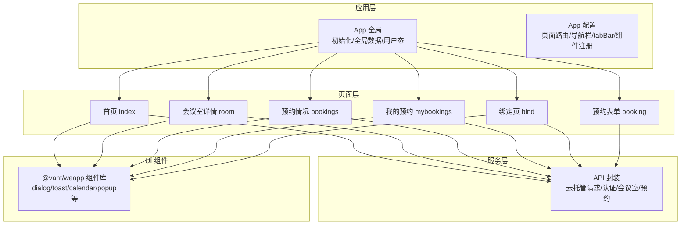
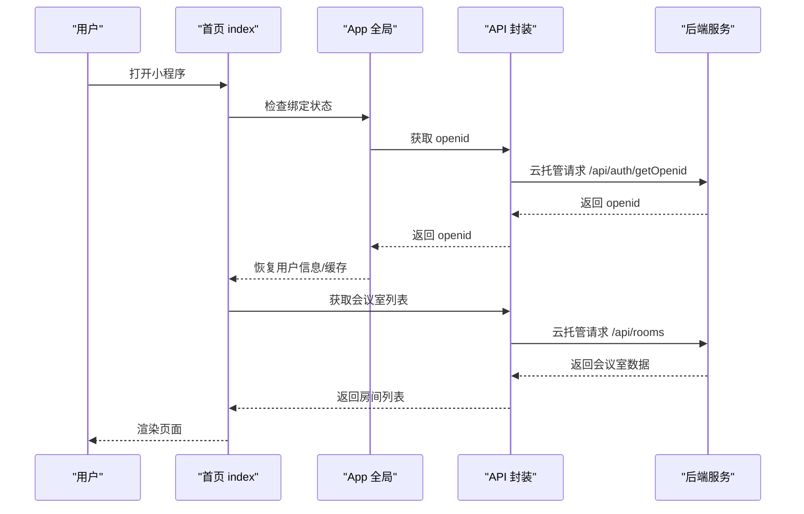
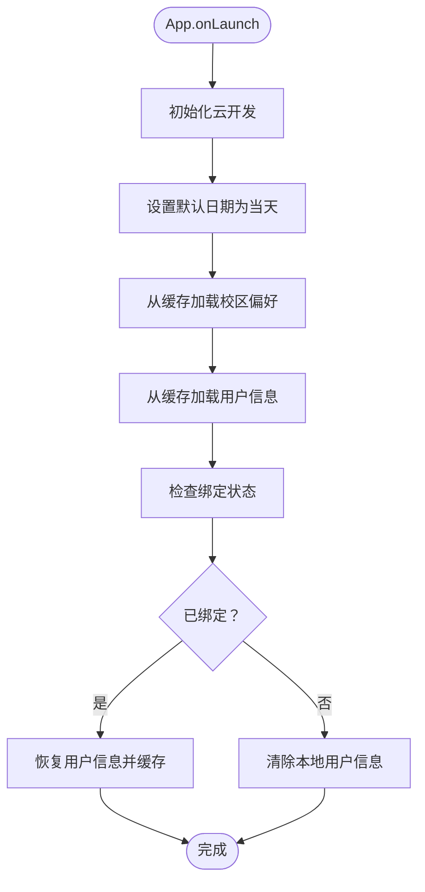
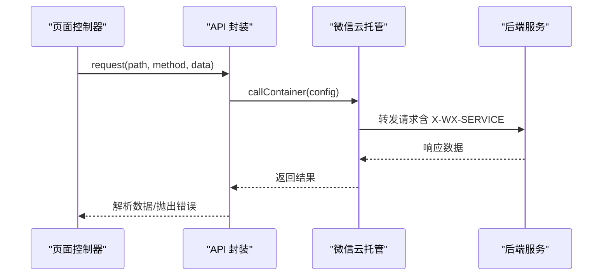
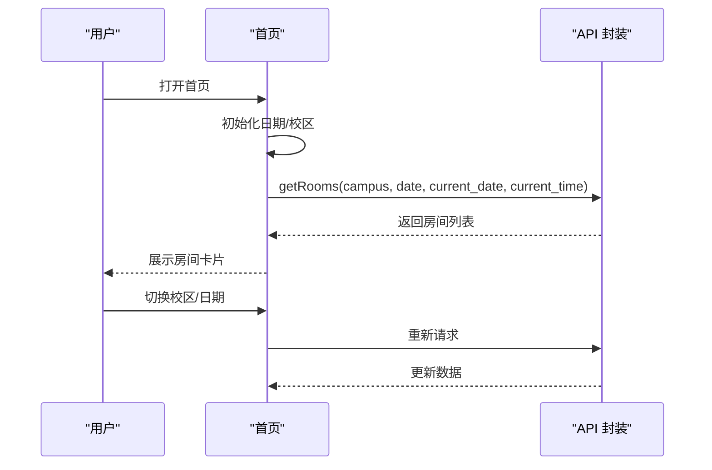
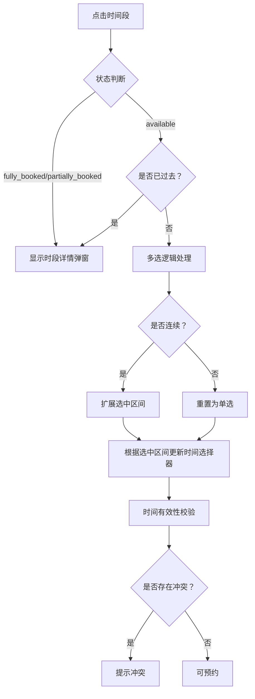
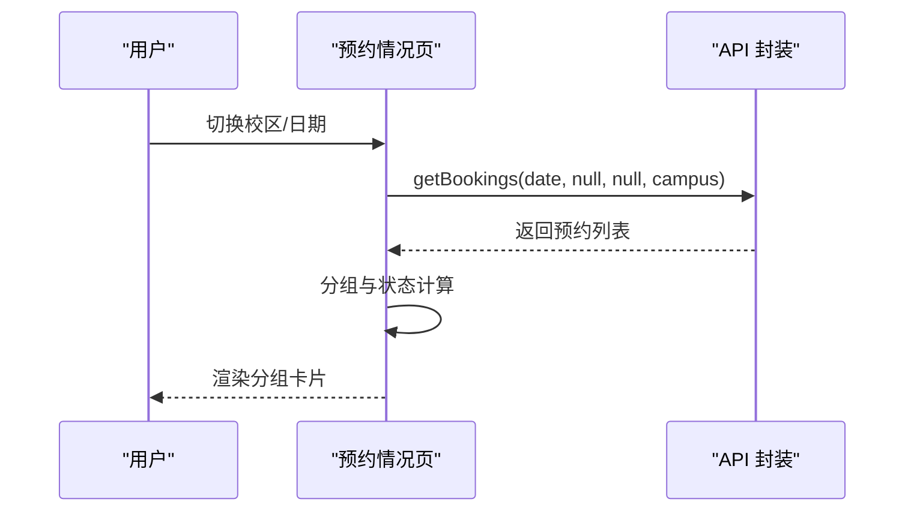
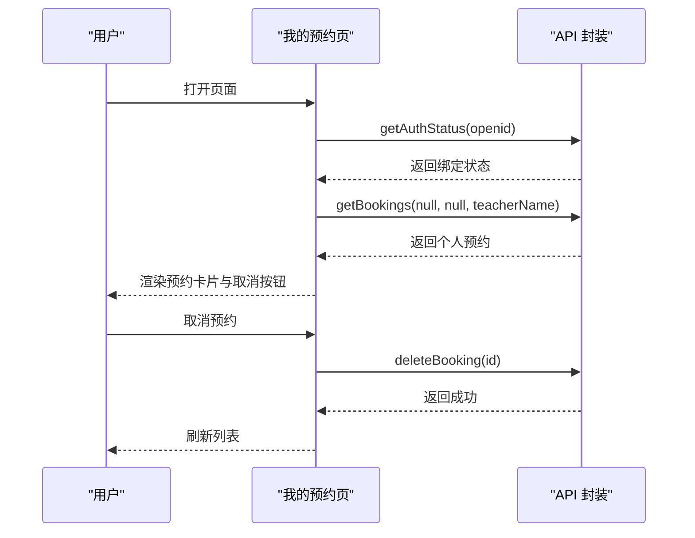
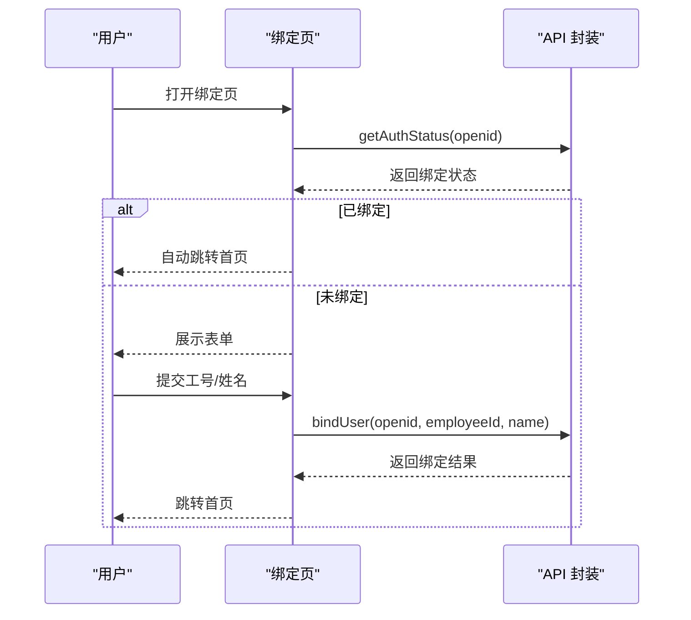
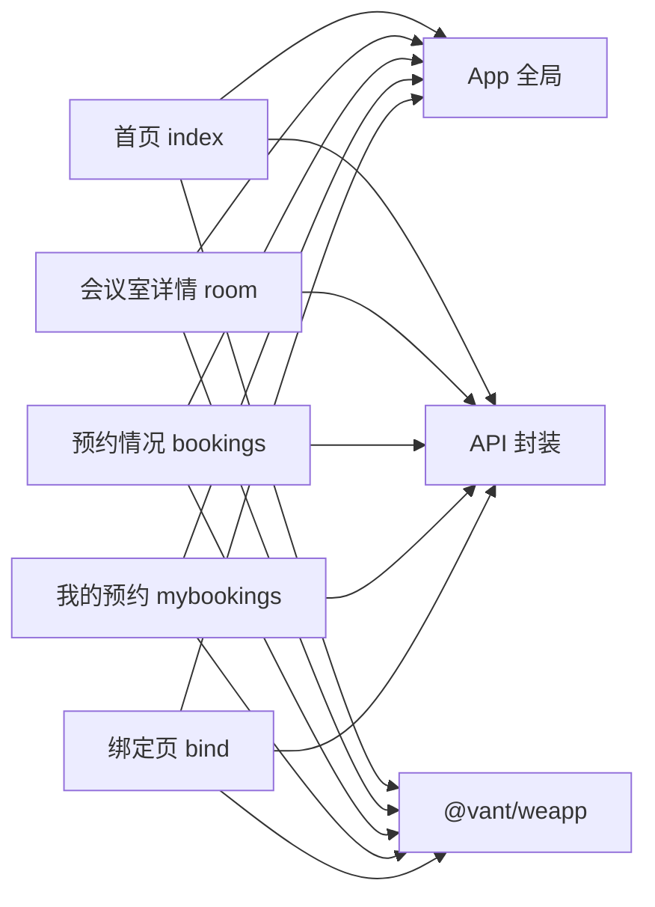

# 前端架构设计

<cite>
**本文档引用的文件**
- [app.js](file://miniprogram/app.js)
- [app.json](file://miniprogram/app.json)
- [api.js](file://miniprogram/utils/api.js)
- [index.js](file://miniprogram/pages/index/index.js)
- [room.js](file://miniprogram/pages/room/room.js)
- [bookings.js](file://miniprogram/pages/bookings/bookings.js)
- [mybookings.js](file://miniprogram/pages/mybookings/mybookings.js)
- [bind.js](file://miniprogram/pages/bind/bind.js)
- [booking.js](file://miniprogram/pages/booking/booking.js)
- [index.wxml](file://miniprogram/pages/index/index.wxml)
- [room.wxml](file://miniprogram/pages/room/room.wxml)
- [bookings.wxml](file://miniprogram/pages/bookings/bookings.wxml)
- [mybookings.wxml](file://miniprogram/pages/mybookings/mybookings.wxml)
- [bind.wxml](file://miniprogram/pages/bind/bind.wxml)
</cite>

## 目录
1. [简介](#简介)
2. [项目结构](#项目结构)
3. [核心组件](#核心组件)
4. [架构总览](#架构总览)
5. [详细组件分析](#详细组件分析)
6. [依赖关系分析](#依赖关系分析)
7. [性能考虑](#性能考虑)
8. [故障排查指南](#故障排查指南)
9. [结论](#结论)

## 简介
本项目为西安交通大学软件学院会议室预约系统的微信小程序前端，采用原生小程序框架与 Vant Weapp 组件库构建。系统围绕“认证绑定 → 首页预约 → 会议室详情 → 预约表单”的主流程展开，辅以“预约情况”和“我的预约”两大管理页面，形成完整的预约闭环。

- 应用初始化：在 App 全局中完成云开发初始化、全局数据注入、用户状态恢复与 openid 获取策略。
- API 封装：统一通过云托管容器能力发起请求，提供认证、会议室查询、预约 CRUD 等接口。
- 页面架构：首页负责校区/日期筛选与会议室列表；会议室详情页支持时间线可视化与多时段选择；预约管理页提供预约情况与个人预约管理。
- 组件库：基于 Vant Weapp，覆盖基础控件、弹窗、日历、加载与空状态展示。
- 状态管理：以 Page 内 data 为主，结合 App 全局 globalData 与本地存储实现跨页面状态共享与降级恢复。

## 项目结构
小程序采用按页面组织的目录结构，核心模块如下：
- app.js/app.json：应用入口与全局配置（页面路由、导航栏、tabBar、组件注册）。
- utils/api.js：API 封装层，统一请求与错误处理。
- pages/*：功能页面（首页、会议室详情、预约情况、我的预约、绑定页、预约表单）。
- miniprogram_npm/@vant/weapp：第三方组件库，通过 app.json 注册为全局组件。

图表来源
- [app.js:1-127](file://miniprogram/app.js#L1-L127)
- [app.json:1-61](file://miniprogram/app.json#L1-L61)
- [api.js:1-184](file://miniprogram/utils/api.js#L1-L184)

章节来源
- [app.js:1-127](file://miniprogram/app.js#L1-L127)
- [app.json:1-61](file://miniprogram/app.json#L1-L61)

## 核心组件
- 应用初始化与全局数据
  - 云开发初始化与环境配置
  - 全局日期与校区偏好初始化
  - 用户信息与 openid 恢复策略
- API 封装层
  - 云托管容器请求封装
  - 统一错误处理与降级策略
  - 认证、会议室、预约相关接口
- 页面控制器
  - 首页：校区/日期筛选、会议室列表、日历弹窗
  - 会议室详情：时间线可视化、多时段选择、快速预约
  - 预约情况：按校区/日期聚合展示
  - 我的预约：个人预约列表与取消
  - 绑定页：身份验证与自动登录
  - 预约表单：提交预约并回退

章节来源
- [app.js:16-42](file://miniprogram/app.js#L16-L42)
- [api.js:13-41](file://miniprogram/utils/api.js#L13-L41)
- [index.js:27-36](file://miniprogram/pages/index/index.js#L27-L36)
- [room.js:31-39](file://miniprogram/pages/room/room.js#L31-L39)
- [bookings.js:33-41](file://miniprogram/pages/bookings/bookings.js#L33-L41)
- [mybookings.js:14-23](file://miniprogram/pages/mybookings/mybookings.js#L14-L23)
- [bind.js:14-34](file://miniprogram/pages/bind/bind.js#L14-L34)
- [booking.js:22-39](file://miniprogram/pages/booking/booking.js#L22-L39)

## 架构总览
整体采用“页面控制器 + API 封装 + Vant Weapp 组件”的三层架构：
- 页面控制器负责业务交互与状态管理（Page data + App globalData + 本地缓存）
- API 封装层负责网络请求与错误处理（云托管容器）
- 组件库提供统一 UI 体验（日历、弹窗、加载、空状态）

图表来源
- [index.js:38-90](file://miniprogram/pages/index/index.js#L38-L90)
- [app.js:46-89](file://miniprogram/app.js#L46-L89)
- [api.js:13-41](file://miniprogram/utils/api.js#L13-L41)

## 详细组件分析

### 应用初始化与全局数据管理
- 初始化流程
  - 云开发初始化与环境配置
  - 默认日期初始化为当天
  - 从本地缓存恢复校区偏好与用户信息
- openid 获取策略
  - 优先通过云函数获取（生产环境推荐）
  - 备用方案：调用后端接口（云托管自动注入 X-WX-OPENID）
- 绑定状态检查
  - 登录态恢复与降级处理（网络异常时使用本地缓存）
- 数据缓存策略
  - 校区偏好与用户信息持久化
  - 页面间通过 App globalData 共享

图表来源
- [app.js:16-42](file://miniprogram/app.js#L16-L42)
- [app.js:92-119](file://miniprogram/app.js#L92-L119)

章节来源
- [app.js:16-42](file://miniprogram/app.js#L16-L42)
- [app.js:46-89](file://miniprogram/app.js#L46-L89)
- [app.js:92-119](file://miniprogram/app.js#L92-L119)

### API 封装层实现
- 请求封装
  - 云托管容器请求（wx.cloud.callContainer）
  - 统一 header（X-WX-SERVICE、content-type）
  - 成功/失败分支处理与错误对象标准化
- 接口定义
  - 认证：获取绑定状态、绑定用户、获取用户信息
  - 会议室：获取校区列表、获取房间列表、获取单个房间、获取时间线
  - 预约：获取预约列表、创建预约、取消预约
- 错误处理与网络优化
  - 状态码校验与错误消息透传
  - 网络失败兜底提示
  - 客户端时间参数传递（避免服务器时间偏差）

图表来源
- [api.js:13-41](file://miniprogram/utils/api.js#L13-L41)
- [api.js:79-184](file://miniprogram/utils/api.js#L79-L184)

章节来源
- [api.js:13-41](file://miniprogram/utils/api.js#L13-L41)
- [api.js:79-184](file://miniprogram/utils/api.js#L79-L184)

### 首页（预约入口）
- 功能要点
  - 校区切换与日期选择（7天滚动 + 日历弹窗）
  - 会议室列表渲染（空闲/占用状态）
  - 下拉刷新与加载状态
- 交互逻辑
  - 页面显示时二次验证绑定状态
  - 选择日期/校区后异步加载会议室数据
  - 点击会议室进入详情页

图表来源
- [index.js:27-36](file://miniprogram/pages/index/index.js#L27-L36)
- [index.js:219-243](file://miniprogram/pages/index/index.js#L219-L243)
- [api.js:90-98](file://miniprogram/utils/api.js#L90-L98)

章节来源
- [index.js:27-36](file://miniprogram/pages/index/index.js#L27-L36)
- [index.js:144-174](file://miniprogram/pages/index/index.js#L144-L174)
- [index.js:219-243](file://miniprogram/pages/index/index.js#L219-L243)
- [index.wxml:1-101](file://miniprogram/pages/index/index.wxml#L1-L101)

### 会议室详情页（时间线与多时段选择）
- 功能要点
  - 时间线网格展示（空闲/部分占用/已约满）
  - 多时段连续选择与边界控制
  - 快速预约（根据当前时间与最早可预约时间自动计算）
  - 时间冲突检测与提示
- 交互逻辑
  - 点击时间段：空闲进入多选，占用/已过查看详情
  - 多选：连续扩展、边缘取消、非连续重选
  - 时间选择器联动（开始时间变化自动调整结束时间）

图表来源
- [room.js:289-325](file://miniprogram/pages/room/room.js#L289-L325)
- [room.js:140-198](file://miniprogram/pages/room/room.js#L140-L198)
- [room.js:576-616](file://miniprogram/pages/room/room.js#L576-L616)

章节来源
- [room.js:289-325](file://miniprogram/pages/room/room.js#L289-L325)
- [room.js:140-198](file://miniprogram/pages/room/room.js#L140-L198)
- [room.js:576-616](file://miniprogram/pages/room/room.js#L576-L616)
- [room.wxml:1-168](file://miniprogram/pages/room/room.wxml#L1-L168)

### 预约情况页（全局预约概览）
- 功能要点
  - 校区筛选（全部/兴庆/创新港）
  - 日期滚动与日历弹窗
  - 按校区/会议室分组展示
  - 预约状态（待进行/进行中/已结束）实时判定
- 交互逻辑
  - 切换校区/日期后重新加载
  - 分组排序与状态标注

图表来源
- [bookings.js:183-190](file://miniprogram/pages/bookings/bookings.js#L183-L190)
- [bookings.js:255-282](file://miniprogram/pages/bookings/bookings.js#L255-L282)
- [bookings.js:284-326](file://miniprogram/pages/bookings/bookings.js#L284-L326)

章节来源
- [bookings.js:183-190](file://miniprogram/pages/bookings/bookings.js#L183-L190)
- [bookings.js:255-282](file://miniprogram/pages/bookings/bookings.js#L255-L282)
- [bookings.js:284-326](file://miniprogram/pages/bookings/bookings.js#L284-L326)
- [bookings.wxml:1-116](file://miniprogram/pages/bookings/bookings.wxml#L1-L116)

### 我的预约页（个人管理）
- 功能要点
  - 自动验证绑定状态并加载个人预约
  - 预约状态实时计算与过期判定
  - 支持取消预约（仅未结束的预约）
- 交互逻辑
  - 页面显示时刷新当前时间
  - 下拉刷新重新加载

图表来源
- [mybookings.js:25-58](file://miniprogram/pages/mybookings/mybookings.js#L25-L58)
- [mybookings.js:83-115](file://miniprogram/pages/mybookings/mybookings.js#L83-L115)
- [mybookings.js:118-139](file://miniprogram/pages/mybookings/mybookings.js#L118-L139)

章节来源
- [mybookings.js:25-58](file://miniprogram/pages/mybookings/mybookings.js#L25-L58)
- [mybookings.js:83-115](file://miniprogram/pages/mybookings/mybookings.js#L83-L115)
- [mybookings.js:118-139](file://miniprogram/pages/mybookings/mybookings.js#L118-L139)
- [mybookings.wxml:1-119](file://miniprogram/pages/mybookings/mybookings.wxml#L1-L119)

### 绑定页（身份验证）
- 功能要点
  - 自动检查 openid 是否已绑定
  - 未绑定时展示表单并提交绑定
  - 绑定成功后自动跳转首页
- 交互逻辑
  - 输入工号/姓名联动启用提交按钮
  - 提交后缓存用户信息并跳转

图表来源
- [bind.js:14-34](file://miniprogram/pages/bind/bind.js#L14-L34)
- [bind.js:88-142](file://miniprogram/pages/bind/bind.js#L88-L142)

章节来源
- [bind.js:14-34](file://miniprogram/pages/bind/bind.js#L14-L34)
- [bind.js:88-142](file://miniprogram/pages/bind/bind.js#L88-L142)
- [bind.wxml:1-65](file://miniprogram/pages/bind/bind.wxml#L1-L65)

### 预约表单页（提交预约）
- 功能要点
  - 从上一页接收房间与时间参数
  - 从 App 全局读取教师姓名
  - 提交时附带客户端日期/时间，确保时间一致性
- 交互逻辑
  - 提交成功后延时返回两页

章节来源
- [booking.js:22-39](file://miniprogram/pages/booking/booking.js#L22-L39)
- [booking.js:50-97](file://miniprogram/pages/booking/booking.js#L50-L97)

## 依赖关系分析
- 页面对 App 的依赖
  - 首页、会议室详情、预约情况、我的预约、绑定页均依赖 App 的 openid 获取与用户状态恢复
- 页面对 API 的依赖
  - 所有页面通过 API 封装访问后端服务，API 封装依赖微信云托管容器能力
- 组件库依赖
  - app.json 中集中注册 Vant Weapp 组件，页面通过标签直接使用

图表来源
- [app.js:1-127](file://miniprogram/app.js#L1-L127)
- [api.js:1-184](file://miniprogram/utils/api.js#L1-L184)
- [app.json:44-58](file://miniprogram/app.json#L44-L58)

章节来源
- [app.js:1-127](file://miniprogram/app.js#L1-L127)
- [api.js:1-184](file://miniprogram/utils/api.js#L1-L184)
- [app.json:44-58](file://miniprogram/app.json#L44-L58)

## 性能考虑
- 网络请求优化
  - 并行加载：会议室详情页同时请求房间与时间线，减少等待时间
  - 参数最小化：仅传递必要查询参数，避免冗余请求
- 本地缓存与降级
  - 校区偏好与用户信息本地持久化，提升二次打开速度
  - 绑定状态验证在网络异常时使用本地缓存降级
- UI 体验
  - 加载态与空状态统一使用 Vant Weapp 组件，保证一致性
  - 下拉刷新与日历弹窗减少重复请求与交互成本

章节来源
- [room.js:264-268](file://miniprogram/pages/room/room.js#L264-L268)
- [index.js:38-90](file://miniprogram/pages/index/index.js#L38-L90)
- [index.js:219-243](file://miniprogram/pages/index/index.js#L219-L243)

## 故障排查指南
- openid 获取失败
  - 现象：绑定页无法自动登录或首页无法加载数据
  - 排查：检查云函数返回值与网络状态；确认云托管环境配置
- 绑定状态异常
  - 现象：页面显示未绑定或用户信息丢失
  - 排查：确认本地缓存是否被清理；检查 App 恢复逻辑与降级处理
- 预约冲突与时间无效
  - 现象：时间选择后仍提示冲突或无法预约
  - 排查：检查时间范围与已有预约；确认 1 分钟缓冲规则与最早可预约时间
- 网络错误与超时
  - 现象：页面长时间加载或报错
  - 排查：查看 API 封装错误处理与提示；确认云托管服务可用性

章节来源
- [app.js:46-89](file://miniprogram/app.js#L46-L89)
- [app.js:92-119](file://miniprogram/app.js#L92-L119)
- [room.js:576-616](file://miniprogram/pages/room/room.js#L576-L616)
- [api.js:13-41](file://miniprogram/utils/api.js#L13-L41)

## 结论
本项目通过清晰的分层架构与完善的错误处理机制，实现了从认证绑定到预约全流程的稳定体验。API 封装层统一了网络请求与错误处理，页面层聚焦业务交互，Vant Weapp 组件提供了良好的可维护性与一致性。建议后续持续关注网络稳定性与缓存策略，进一步优化首屏加载与交互反馈。