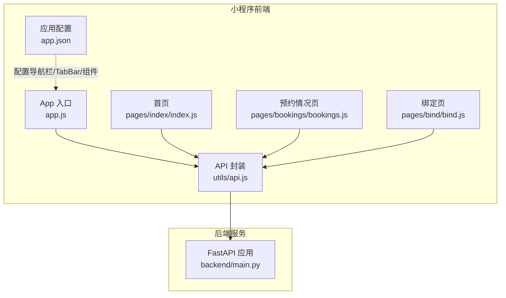
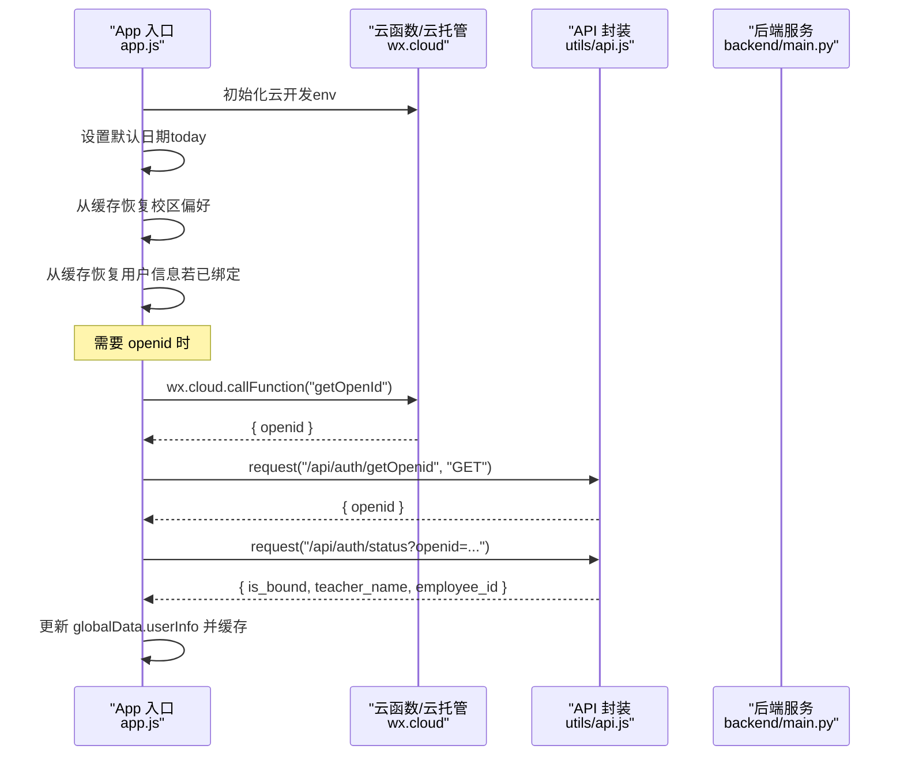
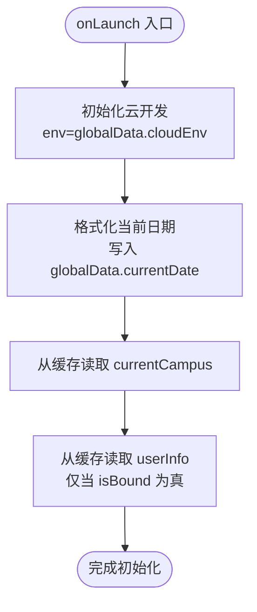
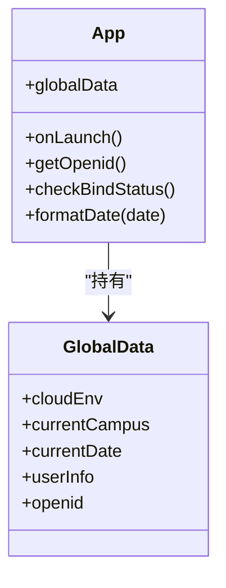
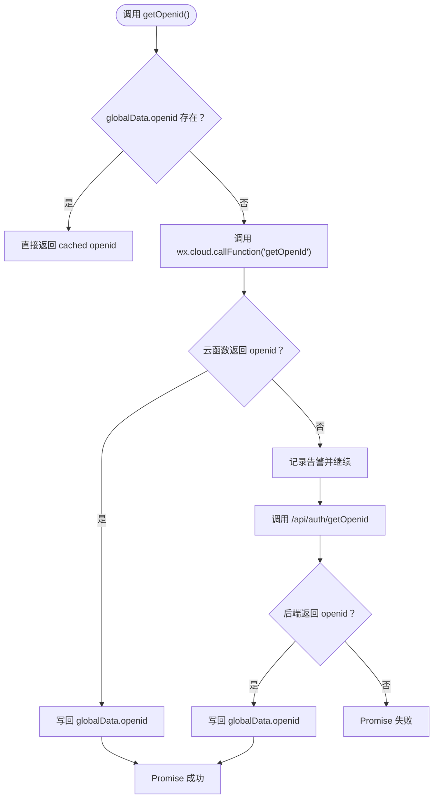
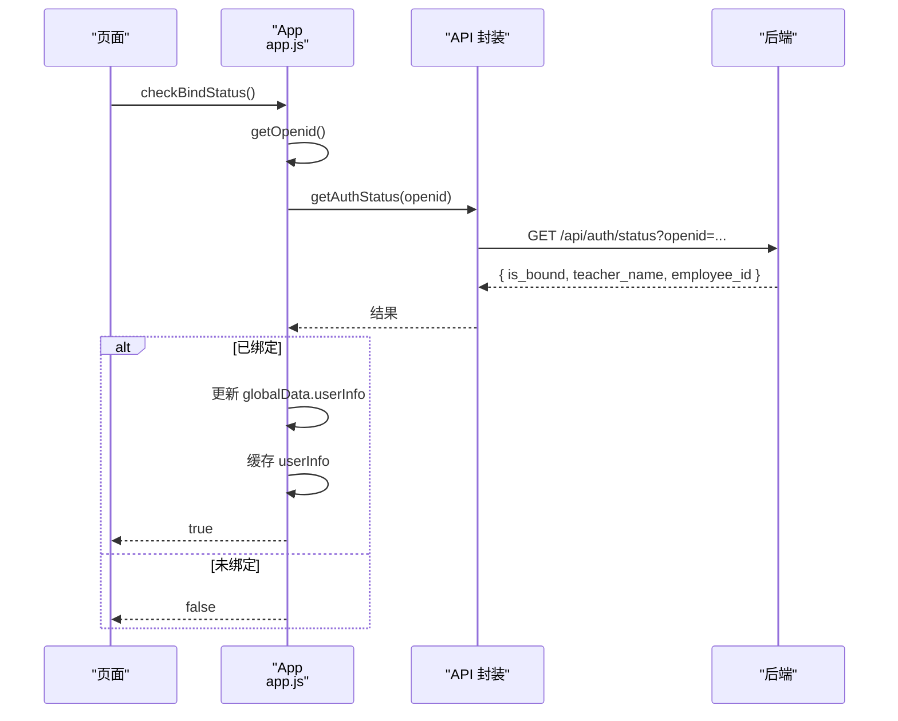
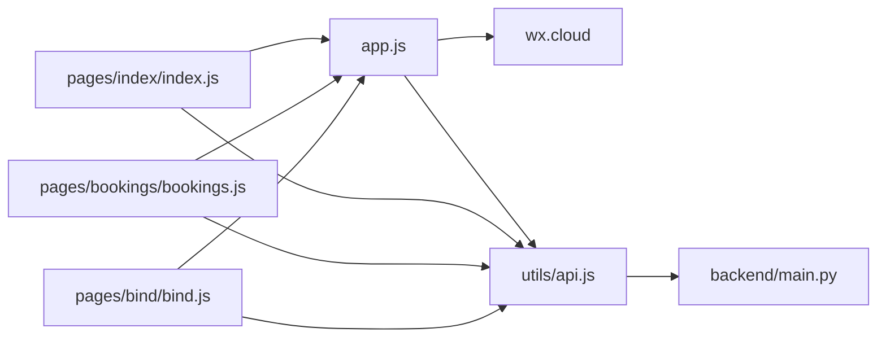

# 应用入口与配置

<cite>
**本文引用的文件**
- [miniprogram/app.js](file://miniprogram/app.js)
- [miniprogram/app.json](file://miniprogram/app.json)
- [miniprogram/utils/api.js](file://miniprogram/utils/api.js)
- [miniprogram/pages/bind/bind.js](file://miniprogram/pages/bind/bind.js)
- [miniprogram/pages/index/index.js](file://miniprogram/pages/index/index.js)
- [miniprogram/pages/bookings/bookings.js](file://miniprogram/pages/bookings/bookings.js)
- [backend/main.py](file://backend/main.py)
- [project.config.json](file://project.config.json)
- [miniprogram/project.private.config.json](file://miniprogram/project.private.config.json)
</cite>

## 目录
1. [简介](#简介)
2. [项目结构](#项目结构)
3. [核心组件](#核心组件)
4. [架构总览](#架构总览)
5. [详细组件分析](#详细组件分析)
6. [依赖分析](#依赖分析)
7. [性能考虑](#性能考虑)
8. [故障排查指南](#故障排查指南)
9. [结论](#结论)
10. [附录](#附录)

## 简介
本文件聚焦微信小程序应用入口与配置，围绕 app.js 的应用初始化流程展开，系统性解析以下主题：
- 云开发环境配置与初始化
- 全局数据管理策略与作用域边界
- 生命周期钩子函数 onLaunch 的职责与执行顺序
- globalData 的作用域与数据持久化机制（含校区选择、日期设置、用户信息缓存）
- getOpenid() 方法的多策略获取机制（云函数、后端 API、缓存优先级）
- checkBindStatus() 方法的用户状态恢复逻辑
- 应用配置最佳实践与性能优化建议

## 项目结构
小程序采用“页面 + 组件 + 工具模块 + 后端服务”的分层组织方式。应用入口位于 app.js，页面逻辑集中在 pages 目录，通用 API 请求封装在 utils/api.js，后端服务基于 FastAPI 实现。

图表来源
- [miniprogram/app.js:1-127](file://miniprogram/app.js#L1-L127)
- [miniprogram/app.json:1-61](file://miniprogram/app.json#L1-L61)
- [miniprogram/utils/api.js:1-184](file://miniprogram/utils/api.js#L1-L184)
- [miniprogram/pages/bind/bind.js:1-143](file://miniprogram/pages/bind/bind.js#L1-L143)
- [miniprogram/pages/index/index.js:1-342](file://miniprogram/pages/index/index.js#L1-L342)
- [miniprogram/pages/bookings/bookings.js:1-352](file://miniprogram/pages/bookings/bookings.js#L1-L352)
- [backend/main.py:1-673](file://backend/main.py#L1-L673)

章节来源
- [miniprogram/app.js:1-127](file://miniprogram/app.js#L1-L127)
- [miniprogram/app.json:1-61](file://miniprogram/app.json#L1-L61)

## 核心组件
- 应用入口与全局状态：app.js
- 应用配置：app.json
- API 请求封装：utils/api.js
- 页面交互与状态校验：pages/index/index.js、pages/bookings/bookings.js、pages/bind/bind.js
- 后端认证与业务接口：backend/main.py

章节来源
- [miniprogram/app.js:1-127](file://miniprogram/app.js#L1-L127)
- [miniprogram/app.json:1-61](file://miniprogram/app.json#L1-L61)
- [miniprogram/utils/api.js:1-184](file://miniprogram/utils/api.js#L1-L184)
- [miniprogram/pages/index/index.js:1-342](file://miniprogram/pages/index/index.js#L1-L342)
- [miniprogram/pages/bookings/bookings.js:1-352](file://miniprogram/pages/bookings/bookings.js#L1-L352)
- [miniprogram/pages/bind/bind.js:1-143](file://miniprogram/pages/bind/bind.js#L1-L143)
- [backend/main.py:1-673](file://backend/main.py#L1-L673)

## 架构总览
应用采用“前端云托管 + 后端 API”方案：
- 前端通过 wx.cloud 调用云函数或直接调用云托管容器接口
- 后端通过 FastAPI 提供认证、会议室、预约等接口
- 前端在 app.js 中集中初始化云环境、设置默认日期、恢复用户状态
- 页面在关键生命周期中进行绑定状态校验与降级处理

图表来源
- [miniprogram/app.js:16-42](file://miniprogram/app.js#L16-L42)
- [miniprogram/app.js:44-89](file://miniprogram/app.js#L44-L89)
- [miniprogram/utils/api.js:13-41](file://miniprogram/utils/api.js#L13-L41)
- [backend/main.py:503-528](file://backend/main.py#L503-L528)

## 详细组件分析

### 应用入口与初始化流程（app.js）
- 云开发初始化：在 onLaunch 中检测 wx.cloud 并初始化，指定 env 来源自 globalData.cloudEnv
- 默认日期设置：将当前日期格式化并写入 globalData.currentDate
- 校区偏好恢复：从本地缓存读取 currentCampus 并回填至 globalData
- 用户信息恢复：从本地缓存读取 userInfo，仅当 isBound 为真时才恢复 openid 与用户信息

图表来源
- [miniprogram/app.js:16-42](file://miniprogram/app.js#L16-L42)

章节来源
- [miniprogram/app.js:16-42](file://miniprogram/app.js#L16-L42)

### 全局数据管理策略与作用域（globalData）
- 作用域：globalData 属于 App 实例，跨页面共享，适合存放轻量状态与配置
- 关键字段：
  - cloudEnv：云环境 ID
  - currentCampus：当前选择的校区
  - currentDate：当前日期（YYYY-MM-DD）
  - userInfo：用户信息（绑定后存在）
  - openid：用户标识
- 数据持久化：
  - 校区偏好：写入缓存 currentCampus，页面切换时同步更新
  - 用户信息：写入缓存 userInfo，包含 isBound 标记；缓存清除后可据此恢复

图表来源
- [miniprogram/app.js:3-14](file://miniprogram/app.js#L3-L14)

章节来源
- [miniprogram/app.js:3-14](file://miniprogram/app.js#L3-L14)

### getOpenid() 多策略获取机制
- 缓存优先：若 globalData.openid 存在，直接返回
- 云函数优先：wx.cloud.callFunction("getOpenId")，env 来自 globalData.cloudEnv
- 后端 API 降级：调用 /api/auth/getOpenid，由云托管自动注入 X-WX-OPENID
- 错误处理：云函数失败时记录告警并继续尝试后端 API；任一成功均写回 globalData.openid

图表来源
- [miniprogram/app.js:44-89](file://miniprogram/app.js#L44-L89)
- [miniprogram/utils/api.js:13-41](file://miniprogram/utils/api.js#L13-L41)
- [backend/main.py:503-512](file://backend/main.py#L503-L512)

章节来源
- [miniprogram/app.js:44-89](file://miniprogram/app.js#L44-L89)
- [miniprogram/utils/api.js:13-41](file://miniprogram/utils/api.js#L13-L41)
- [backend/main.py:503-512](file://backend/main.py#L503-L512)

### checkBindStatus() 用户状态恢复逻辑
- 流程：
  - 调用 getOpenid() 获取 openid
  - 调用 /api/auth/status?openid=... 查询绑定状态
  - 若已绑定：构造 userInfo 写入 globalData，并同步缓存；返回 true
  - 若未绑定：返回 false，页面可引导跳转绑定页
  - 异常：捕获错误并返回 false，避免阻塞主流程

图表来源
- [miniprogram/app.js:91-119](file://miniprogram/app.js#L91-L119)
- [miniprogram/utils/api.js:149-152](file://miniprogram/utils/api.js#L149-L152)
- [backend/main.py:515-528](file://backend/main.py#L515-L528)

章节来源
- [miniprogram/app.js:91-119](file://miniprogram/app.js#L91-L119)
- [miniprogram/utils/api.js:149-152](file://miniprogram/utils/api.js#L149-L152)
- [backend/main.py:515-528](file://backend/main.py#L515-L528)

### 页面侧绑定状态校验与降级处理
- 首页与预约情况页在 onShow/onLoad 中调用 verifyAuthStatus/checkAuth，确保每次进入页面都进行校验
- 校验逻辑：
  - 优先使用本地 userInfo.isBound 判断
  - 否则获取 openid 并调用后端 /api/auth/status
  - 已绑定：更新本地状态并加载数据
  - 未绑定：清理本地缓存并跳转绑定页
  - 网络异常：使用本地缓存降级展示，避免白屏

章节来源
- [miniprogram/pages/index/index.js:27-134](file://miniprogram/pages/index/index.js#L27-L134)
- [miniprogram/pages/bookings/bookings.js:37-68](file://miniprogram/pages/bookings/bookings.js#L37-L68)

### 绑定页交互与自动登录
- 绑定页在 onLoad 中先获取 openid，再调用 checkAndAutoLogin
- 自动登录：若 openid 已绑定，直接写入 globalData.userInfo 并缓存，提示后跳转首页
- 绑定提交：校验输入后调用 /api/auth/bind，成功后更新 globalData 与缓存并跳转首页

章节来源
- [miniprogram/pages/bind/bind.js:14-68](file://miniprogram/pages/bind/bind.js#L14-L68)
- [miniprogram/pages/bind/bind.js:88-142](file://miniprogram/pages/bind/bind.js#L88-L142)

## 依赖分析
- app.js 依赖：
  - wx.cloud：云开发能力（初始化、云函数调用）
  - utils/api.js：统一请求封装（云托管容器调用、认证接口）
  - 本地存储：缓存 currentCampus、userInfo
- 页面依赖：
  - app.js：获取 openid、校验绑定状态、恢复用户信息
  - utils/api.js：调用后端接口
- 后端依赖：
  - FastAPI：提供认证、会议室、预约等接口
  - 数据库：SQLAlchemy ORM（示例数据初始化、绑定关系维护）

图表来源
- [miniprogram/app.js:16-42](file://miniprogram/app.js#L16-L42)
- [miniprogram/utils/api.js:13-41](file://miniprogram/utils/api.js#L13-L41)
- [miniprogram/pages/index/index.js:27-134](file://miniprogram/pages/index/index.js#L27-L134)
- [miniprogram/pages/bookings/bookings.js:37-68](file://miniprogram/pages/bookings/bookings.js#L37-L68)
- [miniprogram/pages/bind/bind.js:14-68](file://miniprogram/pages/bind/bind.js#L14-L68)
- [backend/main.py:503-528](file://backend/main.py#L503-L528)

章节来源
- [miniprogram/app.js:16-42](file://miniprogram/app.js#L16-L42)
- [miniprogram/utils/api.js:13-41](file://miniprogram/utils/api.js#L13-L41)
- [miniprogram/pages/index/index.js:27-134](file://miniprogram/pages/index/index.js#L27-L134)
- [miniprogram/pages/bookings/bookings.js:37-68](file://miniprogram/pages/bookings/bookings.js#L37-L68)
- [miniprogram/pages/bind/bind.js:14-68](file://miniprogram/pages/bind/bind.js#L14-L68)
- [backend/main.py:503-528](file://backend/main.py#L503-L528)

## 性能考虑
- 云函数优先策略：在生产环境优先使用 wx.cloud.callFunction，减少网络往返与头部组装成本
- 本地缓存命中：优先使用 globalData.openid 与 userInfo，避免重复请求
- 请求合并与节流：页面下拉刷新与日期切换时，避免并发重复请求
- 图标与组件：使用 app.json 中的 usingComponents，减少重复引入
- 网络异常降级：页面在 verifyAuthStatus 中对网络异常进行本地缓存降级，提升可用性

## 故障排查指南
- 云开发初始化失败
  - 检查 app.js 中 env 配置与 project.config.json 的 appid 是否一致
  - 确认 wx.cloud.init 在 onLaunch 中正确调用
- openid 获取失败
  - 云函数调用失败：查看控制台告警并确认云函数部署状态
  - 后端 API 失败：检查 /api/auth/getOpenid 接口与 X-WX-OPENID 注入
- 绑定状态异常
  - 校验 /api/auth/status 返回值与数据库绑定关系
  - 页面未跳转：确认 verifyAuthStatus 的分支逻辑与缓存清理
- 页面空白或数据不更新
  - 检查本地缓存 userInfo 的 isBound 标记与 globalData 同步
  - 确认 onShow/onLoad 中的校验与加载顺序

章节来源
- [miniprogram/app.js:16-42](file://miniprogram/app.js#L16-L42)
- [miniprogram/app.js:44-89](file://miniprogram/app.js#L44-L89)
- [miniprogram/pages/index/index.js:38-90](file://miniprogram/pages/index/index.js#L38-L90)
- [miniprogram/pages/bookings/bookings.js:43-68](file://miniprogram/pages/bookings/bookings.js#L43-L68)
- [backend/main.py:503-528](file://backend/main.py#L503-L528)

## 结论
本应用通过 app.js 集中管理云开发环境、全局状态与生命周期，结合 utils/api.js 的统一封装与后端 FastAPI 接口，实现了稳定的认证与状态恢复机制。getOpenid() 的多策略获取与 checkBindStatus() 的恢复逻辑保证了用户体验与安全性；页面侧的校验与降级策略进一步提升了健壮性。建议在生产环境中坚持“云函数优先 + 缓存优先”的策略，并完善监控与日志以便快速定位问题。

## 附录
- 应用配置要点
  - 导航栏与标题：navigationBarBackgroundColor、navigationBarTitleText、navigationBarTextStyle
  - tabBar 配置：颜色、字体大小、图标路径与选中态
  - usingComponents：统一引入 Vant Weapp 组件，减少重复定义
- 云开发与项目配置
  - project.config.json：编译选项、appid、压缩与热更
  - miniprogram/project.private.config.json：编辑器设置、编译热更开关等

章节来源
- [miniprogram/app.json:10-61](file://miniprogram/app.json#L10-L61)
- [project.config.json:1-25](file://project.config.json#L1-L25)
- [miniprogram/project.private.config.json:1-23](file://miniprogram/project.private.config.json#L1-L23)