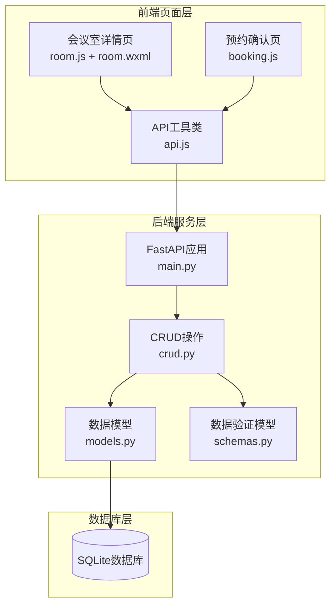
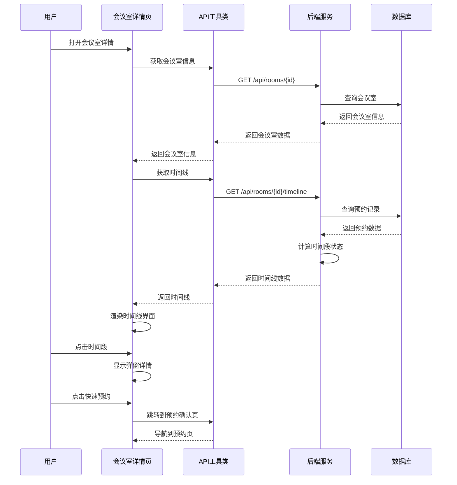
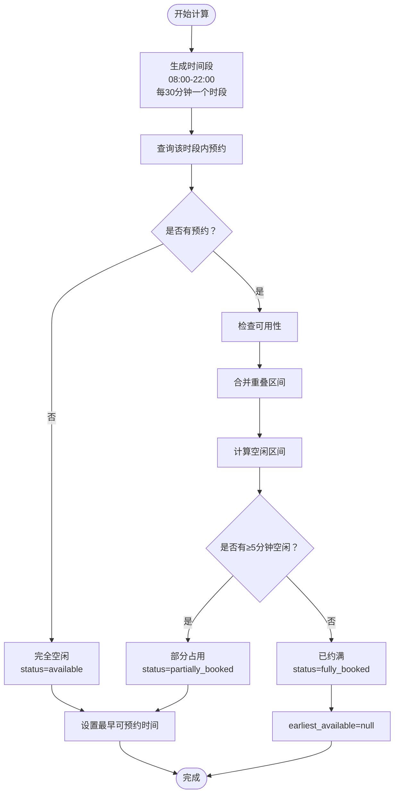
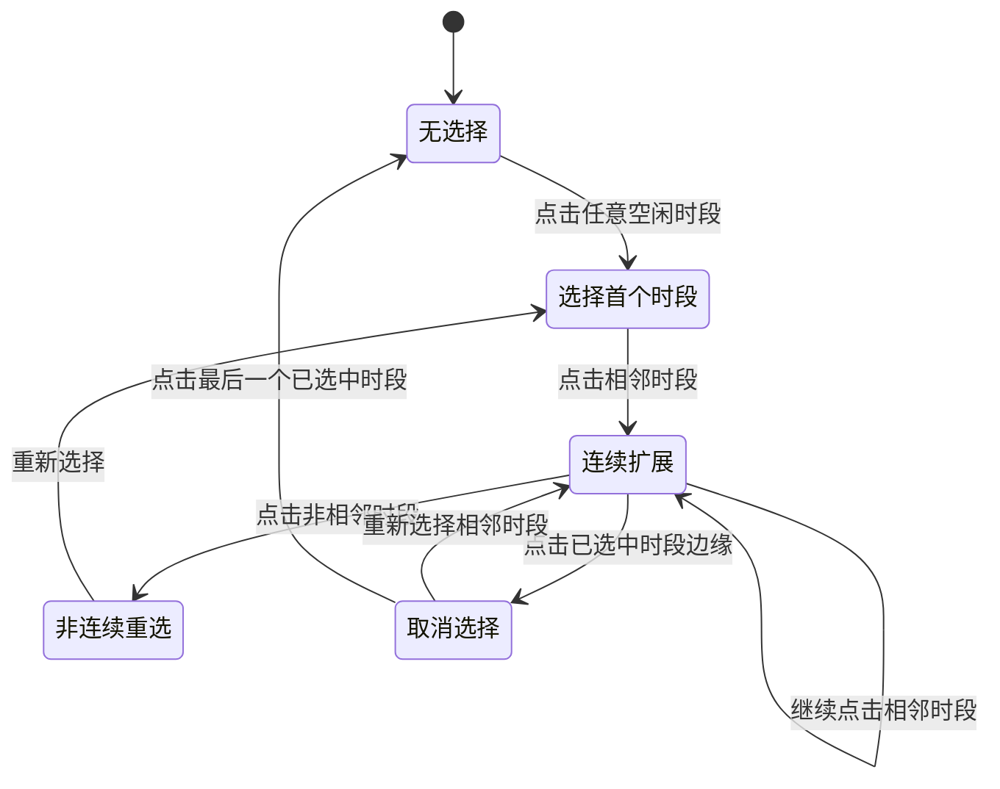
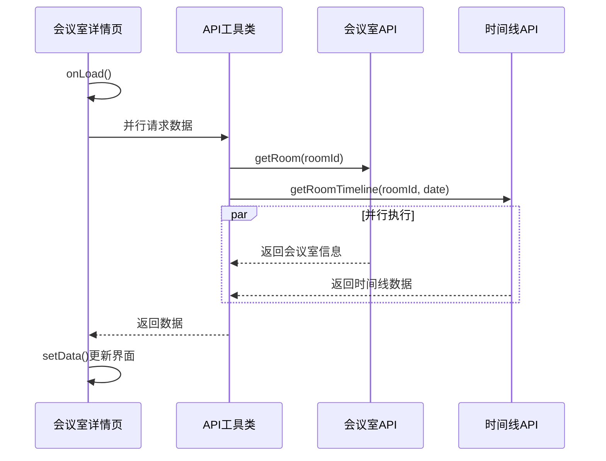
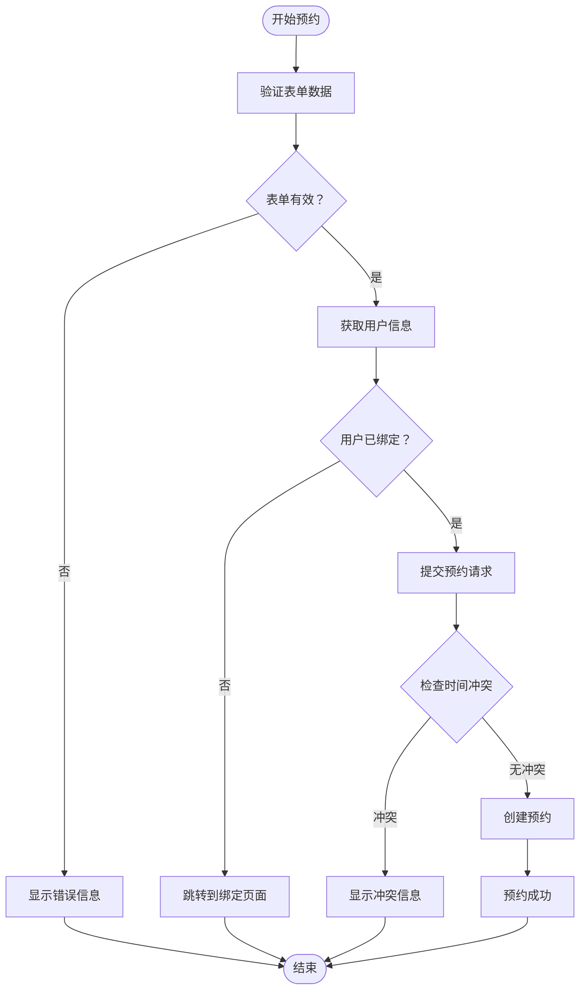
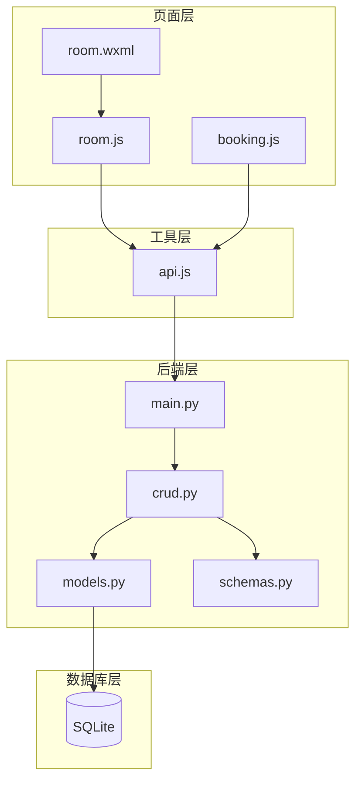

# 会议室详情页

<cite>
**本文档引用的文件**
- [room.js](file://miniprogram/pages/room/room.js)
- [room.json](file://miniprogram/pages/room/room.json)
- [room.wxml](file://miniprogram/pages/room/room.wxml)
- [api.js](file://miniprogram/utils/api.js)
- [booking.js](file://miniprogram/pages/booking/booking.js)
- [main.py](file://backend/main.py)
- [crud.py](file://backend/crud.py)
- [models.py](file://backend/models.py)
- [schemas.py](file://backend/schemas.py)
</cite>

## 目录
1. [简介](#简介)
2. [项目结构](#项目结构)
3. [核心组件](#核心组件)
4. [架构概览](#架构概览)
5. [详细组件分析](#详细组件分析)
6. [依赖关系分析](#依赖关系分析)
7. [性能考虑](#性能考虑)
8. [故障排除指南](#故障排除指南)
9. [结论](#结论)

## 简介

会议室详情页是西安交通大学软件学院会议室预约系统的核心功能模块，为用户提供会议室的详细信息展示、时间线可视化、时间段选择和预约功能。该页面实现了完整的会议室预约流程，包括时间段计算、状态显示、用户交互处理和预约提交等核心功能。

## 项目结构

会议室详情页面采用微信小程序架构，主要由以下组件构成：

**图表来源**
- [room.js:1-657](file://miniprogram/pages/room/room.js#L1-L657)
- [api.js:1-184](file://miniprogram/utils/api.js#L1-L184)
- [main.py:1-673](file://backend/main.py#L1-L673)

**章节来源**
- [room.js:1-657](file://miniprogram/pages/room/room.js#L1-L657)
- [api.js:1-184](file://miniprogram/utils/api.js#L1-L184)
- [main.py:1-673](file://backend/main.py#L1-L673)

## 核心组件

会议室详情页面包含以下核心组件：

### 1. 时间线展示组件
- **时间槽网格**：显示24小时工作时间内的30分钟时间段
- **状态指示器**：通过颜色区分空闲、部分占用、已约满状态
- **交互式点击**：支持时间段点击查看详情和快速选择

### 2. 时间选择器组件
- **双列选择器**：分别控制开始时间和结束时间
- **智能联动**：开始时间改变时自动调整结束时间
- **冲突检测**：实时验证时间选择的有效性

### 3. 弹窗详情组件
- **时段详情**：显示具体时间段的预约信息
- **快速预约**：一键预约功能
- **状态说明**：清晰的状态提示和最早可预约时间

**章节来源**
- [room.wxml:64-127](file://miniprogram/pages/room/room.wxml#L64-L127)
- [room.js:105-236](file://miniprogram/pages/room/room.js#L105-L236)

## 架构概览

会议室详情页面采用前后端分离架构，实现了完整的预约系统：

**图表来源**
- [room.js:258-287](file://miniprogram/pages/room/room.js#L258-L287)
- [api.js:103-112](file://miniprogram/utils/api.js#L103-L112)
- [main.py:120-246](file://backend/main.py#L120-L246)

## 详细组件分析

### 时间线展示实现

时间线展示是会议室详情页的核心功能，实现了以下逻辑：

#### 时间段计算算法

**图表来源**
- [main.py:148-246](file://backend/main.py#L148-L246)
- [crud.py:102-123](file://backend/crud.py#L102-L123)

#### 状态显示逻辑

时间线中的每个时间段根据其状态显示不同的样式：

| 状态 | 显示样式 | 含义 |
|------|----------|------|
| available | 绿色背景 | 完全空闲，可直接预约 |
| partially_booked | 黄色背景 | 部分占用，显示最早可预约时间 |
| fully_booked | 红色背景 | 已约满，无法预约 |

**章节来源**
- [room.wxml:69-82](file://miniprogram/pages/room/room.wxml#L69-L82)
- [main.py:168-223](file://backend/main.py#L168-L223)

### 时间选择器工作原理

时间选择器实现了智能的时间段选择功能：

#### 多选时段逻辑

**图表来源**
- [room.js:141-198](file://miniprogram/pages/room/room.js#L141-L198)

#### 时间冲突检测机制

时间选择器实现了双重冲突检测：

1. **前端冲突检测**：实时验证开始时间必须早于结束时间
2. **后端冲突检测**：检查与现有预约的冲突（包括相邻预约）

**章节来源**
- [room.js:577-616](file://miniprogram/pages/room/room.js#L577-L616)
- [crud.py:102-123](file://backend/crud.py#L102-L123)

### 页面数据获取和展示机制

#### 并行数据加载

页面采用了并行数据加载策略来提升性能：

**图表来源**
- [room.js:264-268](file://miniprogram/pages/room/room.js#L264-L268)

#### 数据结构设计

后端返回的时间线数据结构：

| 字段名 | 类型 | 描述 |
|--------|------|------|
| start_time | string | 时间段开始时间 |
| end_time | string | 时间段结束时间 |
| status | string | 状态：available/partially_booked/fully_booked |
| earliest_available | string | 最早可预约时间 |
| bookings | array | 该时段内的预约列表 |

**章节来源**
- [main.py:224-246](file://backend/main.py#L224-L246)
- [schemas.py:75-88](file://backend/schemas.py#L75-L88)

### 用户预约流程实现

#### 预约表单验证

预约流程包含了完整的表单验证机制：

**图表来源**
- [booking.js:50-97](file://miniprogram/pages/booking/booking.js#L50-L97)
- [main.py:282-333](file://backend/main.py#L282-L333)

#### 预约提交流程

后端的预约提交流程确保了数据的一致性和完整性：

**章节来源**
- [booking.js:68-78](file://miniprogram/pages/booking/booking.js#L68-L78)
- [main.py:282-333](file://backend/main.py#L282-L333)

## 依赖关系分析

会议室详情页面的依赖关系如下：

**图表来源**
- [room.js:1-657](file://miniprogram/pages/room/room.js#L1-L657)
- [api.js:1-184](file://miniprogram/utils/api.js#L1-L184)
- [main.py:1-673](file://backend/main.py#L1-L673)

**章节来源**
- [room.js:1-657](file://miniprogram/pages/room/room.js#L1-L657)
- [api.js:1-184](file://miniprogram/utils/api.js#L1-L184)
- [main.py:1-673](file://backend/main.py#L1-L673)

## 性能考虑

### 数据缓存策略

1. **并行数据加载**：同时获取会议室信息和时间线数据，减少等待时间
2. **本地状态管理**：使用setData()管理页面状态，避免重复请求
3. **智能刷新**：提供刷新按钮，用户可以手动刷新数据

### 渲染优化

1. **条件渲染**：使用wx:if控制加载状态和内容显示
2. **列表渲染优化**：使用wx:for渲染时间槽，设置合适的key值
3. **WXS模块**：使用wxs模块进行高效的前端计算

### 内存管理

1. **及时清理**：页面卸载时自动清理定时器和事件监听
2. **状态重置**：提供重置功能，清除用户的选择状态
3. **异步处理**：使用Promise处理异步操作，避免阻塞UI线程

## 故障排除指南

### 常见问题及解决方案

#### 1. 时间线数据加载失败
- **症状**：页面长时间显示加载状态
- **原因**：网络请求超时或服务器异常
- **解决方案**：检查网络连接，点击刷新按钮重试

#### 2. 时间选择无效
- **症状**：开始时间无法设置或结束时间异常
- **原因**：时间格式错误或超出工作时间范围
- **解决方案**：确保时间在08:00-22:00范围内，开始时间早于结束时间

#### 3. 预约提交失败
- **症状**：提交后显示错误信息
- **原因**：时间冲突、用户未绑定或服务器错误
- **解决方案**：检查时间安排，确保用户已完成绑定

#### 4. 状态显示异常
- **症状**：时间段状态显示不正确
- **原因**：数据同步延迟或计算错误
- **解决方案**：刷新页面或稍后重试

**章节来源**
- [room.js:280-286](file://miniprogram/pages/room/room.js#L280-L286)
- [booking.js:89-96](file://miniprogram/pages/booking/booking.js#L89-L96)

## 结论

会议室详情页面是一个功能完整、用户体验良好的预约系统前端模块。它通过以下特点实现了优秀的用户体验：

1. **直观的时间线展示**：清晰的状态指示和交互式的时间段选择
2. **智能的时间冲突检测**：前后端双重验证确保预约的有效性
3. **流畅的用户交互**：快速预约、弹窗详情等便捷功能
4. **完善的错误处理**：友好的错误提示和解决方案引导

该页面的设计充分考虑了实际使用场景，为用户提供了高效、可靠的会议室预约体验。通过合理的架构设计和性能优化，确保了在各种网络环境下的稳定运行。