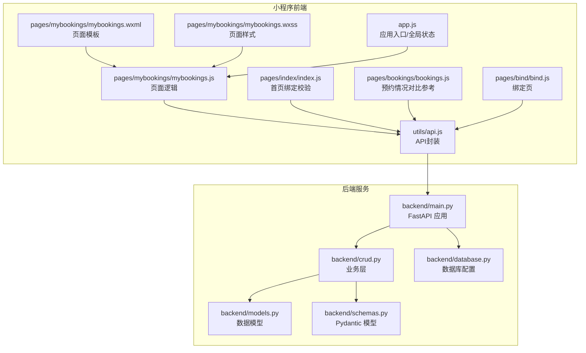
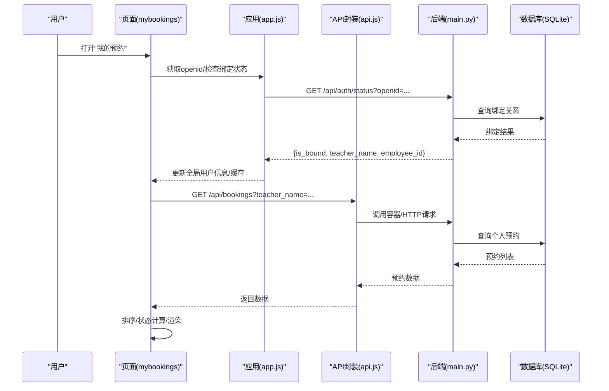
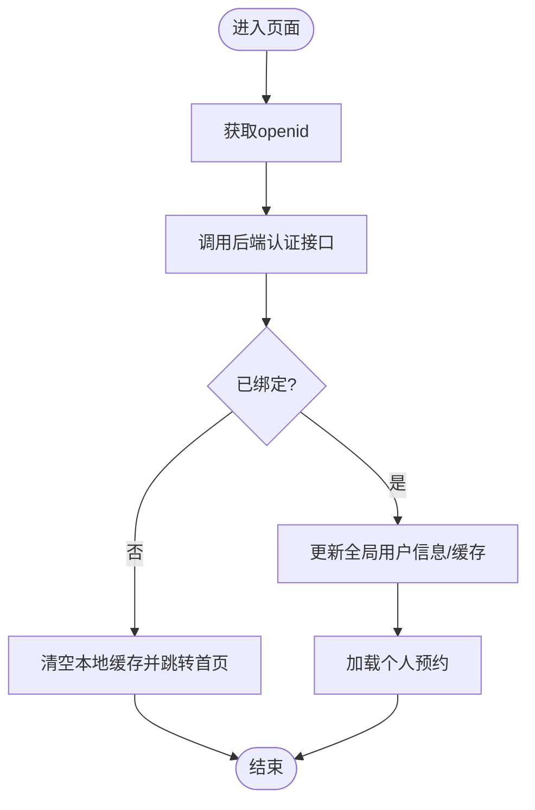
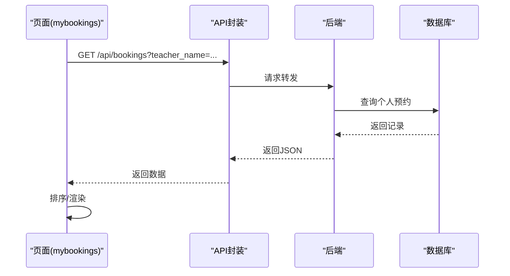
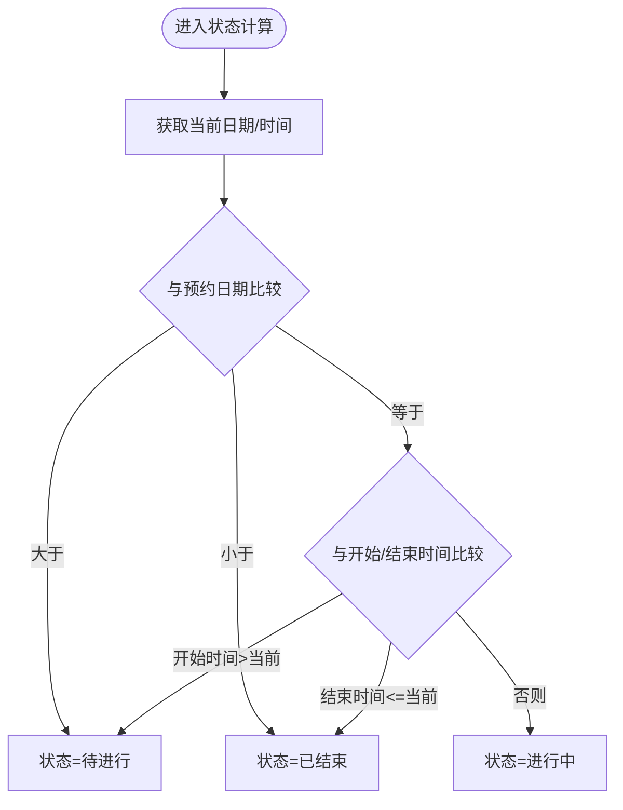
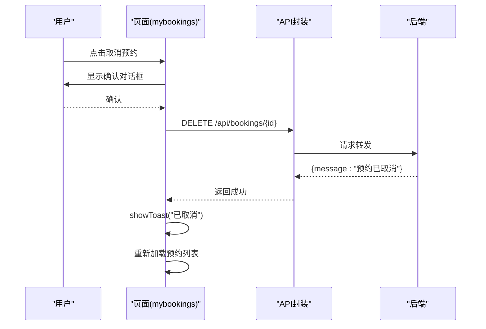
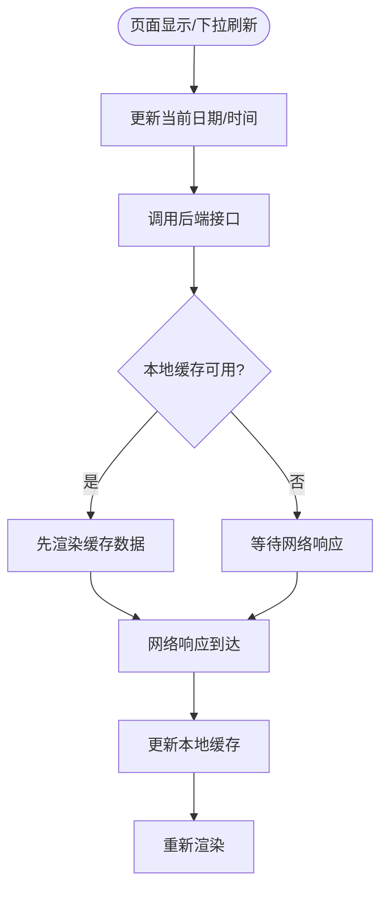
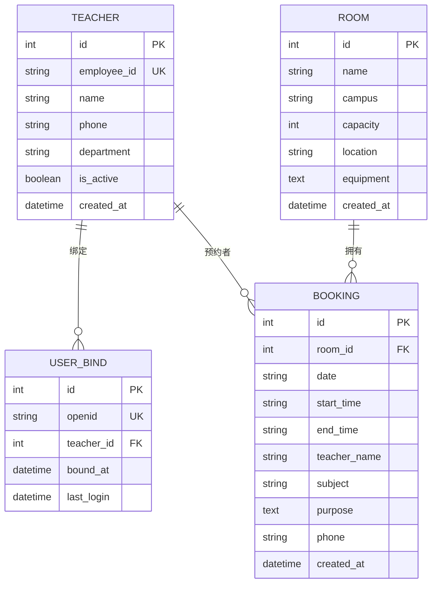
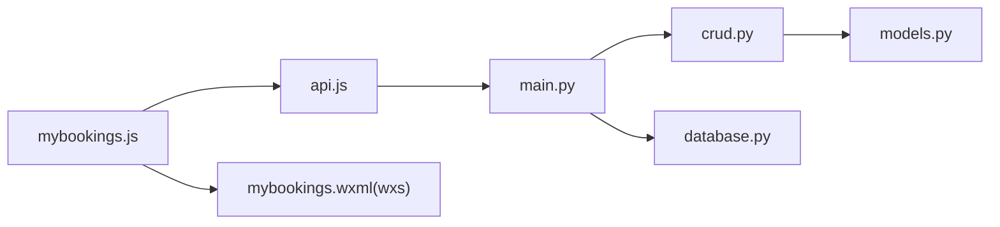

# 我的预约页

<cite>
**本文引用的文件**
- [mybookings.js](file://miniprogram/pages/mybookings/mybookings.js)
- [mybookings.json](file://miniprogram/pages/mybookings/mybookings.json)
- [mybookings.wxml](file://miniprogram/pages/mybookings/mybookings.wxml)
- [mybookings.wxss](file://miniprogram/pages/mybookings/mybookings.wxss)
- [api.js](file://miniprogram/utils/api.js)
- [app.js](file://miniprogram/app.js)
- [index.js](file://miniprogram/pages/index/index.js)
- [bookings.js](file://miniprogram/pages/bookings/bookings.js)
- [bind.js](file://miniprogram/pages/bind/bind.js)
- [main.py](file://backend/main.py)
- [crud.py](file://backend/crud.py)
- [models.py](file://backend/models.py)
- [schemas.py](file://backend/schemas.py)
- [database.py](file://backend/database.py)
</cite>

## 目录
1. [简介](#简介)
2. [项目结构](#项目结构)
3. [核心组件](#核心组件)
4. [架构总览](#架构总览)
5. [详细组件分析](#详细组件分析)
6. [依赖分析](#依赖分析)
7. [性能考量](#性能考量)
8. [故障排查指南](#故障排查指南)
9. [结论](#结论)
10. [附录](#附录)

## 简介
本文件面向“我的预约”页面，系统性梳理其数据获取与展示机制、用户身份验证流程、预约状态分类与呈现、预约操作（查看详情、取消预约、状态管理）、数据同步策略（与服务器同步与本地缓存更新）、交互设计（状态变更通知、提醒与历史记录管理），并给出性能优化与体验改进建议。目标是帮助开发者与产品人员快速理解页面实现与扩展点。

## 项目结构
“我的预约”页面位于小程序前端目录 pages/mybookings，配合全局 API 封装、应用入口与后端 FastAPI 服务共同构成完整的预约数据链路。

图表来源
- [mybookings.js:1-201](file://miniprogram/pages/mybookings/mybookings.js#L1-L201)
- [mybookings.wxml:1-119](file://miniprogram/pages/mybookings/mybookings.wxml#L1-L119)
- [mybookings.wxss:1-297](file://miniprogram/pages/mybookings/mybookings.wxss#L1-L297)
- [api.js:1-184](file://miniprogram/utils/api.js#L1-L184)
- [app.js:1-127](file://miniprogram/app.js#L1-L127)
- [index.js:1-342](file://miniprogram/pages/index/index.js#L1-L342)
- [bookings.js:1-352](file://miniprogram/pages/bookings/bookings.js#L1-L352)
- [bind.js:1-143](file://miniprogram/pages/bind/bind.js#L1-L143)
- [main.py:1-673](file://backend/main.py#L1-L673)
- [crud.py:1-343](file://backend/crud.py#L1-L343)
- [models.py:1-75](file://backend/models.py#L1-L75)
- [schemas.py:1-185](file://backend/schemas.py#L1-L185)
- [database.py:1-62](file://backend/database.py#L1-L62)

章节来源
- [mybookings.js:1-201](file://miniprogram/pages/mybookings/mybookings.js#L1-L201)
- [api.js:1-184](file://miniprogram/utils/api.js#L1-L184)
- [main.py:1-673](file://backend/main.py#L1-L673)

## 核心组件
- 页面控制器：负责用户身份验证、预约数据加载、状态计算、取消预约、下拉刷新与本地时间维护。
- API 封装：统一调用后端接口，支持云托管请求与传统 HTTP 备用方案。
- 应用入口：提供 openid 获取、绑定状态检查与全局用户信息缓存。
- 后端服务：提供认证、绑定、预约查询与删除等接口；通过 CRUD 层访问 SQLite 数据库。

章节来源
- [mybookings.js:1-201](file://miniprogram/pages/mybookings/mybookings.js#L1-L201)
- [api.js:1-184](file://miniprogram/utils/api.js#L1-L184)
- [app.js:1-127](file://miniprogram/app.js#L1-L127)
- [main.py:1-673](file://backend/main.py#L1-L673)

## 架构总览
“我的预约”页面采用前后端分离架构：前端通过 API 封装发起请求，后端基于 FastAPI 提供 REST 接口，数据持久化使用 SQLAlchemy + SQLite。页面在每次显示时进行绑定状态校验，确保用户身份合法后加载个人预约列表。

图表来源
- [mybookings.js:25-58](file://miniprogram/pages/mybookings/mybookings.js#L25-L58)
- [api.js:114-129](file://miniprogram/utils/api.js#L114-L129)
- [main.py:515-529](file://backend/main.py#L515-L529)
- [main.py:251-279](file://backend/main.py#L251-L279)
- [database.py:1-62](file://backend/database.py#L1-L62)

## 详细组件分析

### 1) 用户身份验证与绑定状态
- 页面加载与显示时，先通过应用入口获取 openid 并调用后端认证接口检查绑定状态。
- 若已绑定，更新全局用户信息并缓存；若未绑定，清空本地缓存并跳转首页引导绑定。
- 网络异常时采用本地缓存降级，保证基本可用性。

图表来源
- [mybookings.js:25-58](file://miniprogram/pages/mybookings/mybookings.js#L25-L58)
- [app.js:91-119](file://miniprogram/app.js#L91-L119)
- [main.py:515-529](file://backend/main.py#L515-L529)

章节来源
- [mybookings.js:25-58](file://miniprogram/pages/mybookings/mybookings.js#L25-L58)
- [app.js:44-89](file://miniprogram/app.js#L44-L89)
- [main.py:515-529](file://backend/main.py#L515-L529)

### 2) 预约数据获取与展示
- 通过 API 封装调用后端“获取预约列表”接口，按日期与开始时间倒序排列，最近的在前。
- 页面提供加载中与空状态占位，提升用户体验。
- 预约卡片包含日期、状态标签、会议室名称、时间、地点、主题与备注等字段。

图表来源
- [mybookings.js:84-115](file://miniprogram/pages/mybookings/mybookings.js#L84-L115)
- [api.js:114-129](file://miniprogram/utils/api.js#L114-L129)
- [main.py:251-279](file://backend/main.py#L251-L279)

章节来源
- [mybookings.js:84-115](file://miniprogram/pages/mybookings/mybookings.js#L84-L115)
- [mybookings.wxml:62-117](file://miniprogram/pages/mybookings/mybookings.wxml#L62-L117)
- [api.js:114-129](file://miniprogram/utils/api.js#L114-L129)
- [main.py:251-279](file://backend/main.py#L251-L279)

### 3) 预约状态分类与展示
- 状态计算逻辑同时考虑“日期”和“当前时间”，确保跨天场景正确判断。
- 状态分为：待进行、进行中、已结束；对应不同样式类，便于视觉区分。
- 页面模板中通过 WXS 模块复用状态计算与文案映射，减少 JS 侧重复逻辑。

图表来源
- [mybookings.js:141-168](file://miniprogram/pages/mybookings/mybookings.js#L141-L168)
- [mybookings.wxml:2-40](file://miniprogram/pages/mybookings/mybookings.wxml#L2-L40)

章节来源
- [mybookings.js:141-168](file://miniprogram/pages/mybookings/mybookings.js#L141-L168)
- [mybookings.wxml:2-40](file://miniprogram/pages/mybookings/mybookings.wxml#L2-L40)
- [mybookings.wxss:189-202](file://miniprogram/pages/mybookings/mybookings.wxss#L189-L202)

### 4) 预约操作：取消预约
- 点击“取消预约”弹出确认对话框，二次确认防止误操作。
- 成功后提示“已取消”，并重新加载预约列表以反映最新状态。
- 异常时提示错误信息，保持界面一致性。

图表来源
- [mybookings.js:117-139](file://miniprogram/pages/mybookings/mybookings.js#L117-L139)
- [api.js:138-143](file://miniprogram/utils/api.js#L138-L143)
- [main.py:336-341](file://backend/main.py#L336-L341)

章节来源
- [mybookings.js:117-139](file://miniprogram/pages/mybookings/mybookings.js#L117-L139)
- [api.js:138-143](file://miniprogram/utils/api.js#L138-L143)
- [main.py:336-341](file://backend/main.py#L336-L341)

### 5) 数据同步策略
- 服务器端：后端接口接收客户端传入的“当前日期/时间”，避免服务器时间偏差导致的状态误判。
- 前端：页面在每次显示时刷新当前时间，确保状态计算准确；下拉刷新触发重新加载。
- 缓存策略：应用入口与页面均使用本地存储缓存用户信息；网络异常时采用降级策略，优先展示本地缓存。

图表来源
- [mybookings.js:19-23](file://miniprogram/pages/mybookings/mybookings.js#L19-L23)
- [mybookings.js:77-81](file://miniprogram/pages/mybookings/mybookings.js#L77-L81)
- [mybookings.js:84-115](file://miniprogram/pages/mybookings/mybookings.js#L84-L115)
- [app.js:36-42](file://miniprogram/app.js#L36-L42)

章节来源
- [mybookings.js:19-23](file://miniprogram/pages/mybookings/mybookings.js#L19-L23)
- [mybookings.js:77-81](file://miniprogram/pages/mybookings/mybookings.js#L77-L81)
- [mybookings.js:84-115](file://miniprogram/pages/mybookings/mybookings.js#L84-L115)
- [app.js:36-42](file://miniprogram/app.js#L36-L42)

### 6) 交互设计与用户体验
- 状态变更通知：取消成功/失败均有 Toast 提示，明确反馈。
- 提醒功能：页面通过状态计算与样式区分，直观提示“进行中/待进行/已结束”；可结合定时任务或推送扩展消息提醒（需后端支持）。
- 历史记录管理：当前页面仅展示当前与未来的预约；历史记录可通过筛选或新增“历史”标签页实现（参考“预约情况”页面的分组思路）。

章节来源
- [mybookings.js:117-139](file://miniprogram/pages/mybookings/mybookings.js#L117-L139)
- [mybookings.wxml:62-117](file://miniprogram/pages/mybookings/mybookings.wxml#L62-L117)
- [bookings.js:284-326](file://miniprogram/pages/bookings/bookings.js#L284-L326)

### 7) 数据模型与接口映射
- 数据模型：会议室、预约、教职工、用户绑定关系，定义清晰的外键与关联。
- 接口映射：前端 API 封装与后端路由一一对应，返回 Pydantic 模型序列化后的 JSON。

图表来源
- [models.py:8-75](file://backend/models.py#L8-L75)
- [schemas.py:47-81](file://backend/schemas.py#L47-L81)

章节来源
- [models.py:8-75](file://backend/models.py#L8-L75)
- [schemas.py:47-81](file://backend/schemas.py#L47-L81)
- [main.py:251-279](file://backend/main.py#L251-L279)

## 依赖分析
- 前端依赖：页面逻辑依赖 API 封装与应用入口；模板依赖 WXS 模块进行状态计算与样式映射。
- 后端依赖：路由依赖 CRUD 层；CRUD 层依赖 SQLAlchemy 模型与数据库配置。
- 耦合与内聚：页面与 API 封装耦合度低，便于替换后端；后端路由与模型职责清晰，内聚良好。

图表来源
- [mybookings.js:1-5](file://miniprogram/pages/mybookings/mybookings.js#L1-L5)
- [mybookings.wxml:2-40](file://miniprogram/pages/mybookings/mybookings.wxml#L2-L40)
- [api.js:1-184](file://miniprogram/utils/api.js#L1-L184)
- [main.py:1-673](file://backend/main.py#L1-L673)
- [crud.py:1-343](file://backend/crud.py#L1-L343)
- [models.py:1-75](file://backend/models.py#L1-L75)
- [database.py:1-62](file://backend/database.py#L1-L62)

章节来源
- [mybookings.js:1-5](file://miniprogram/pages/mybookings/mybookings.js#L1-L5)
- [api.js:1-184](file://miniprogram/utils/api.js#L1-L184)
- [main.py:1-673](file://backend/main.py#L1-L673)

## 性能考量
- 网络请求优化：合并请求、减少不必要的刷新；对频繁状态计算使用 WXS 模块，降低 JS 侧负担。
- 数据排序：前端按日期与时间排序，建议后端返回时按时间顺序，前端仅做必要调整。
- 缓存策略：合理利用本地缓存与降级策略，避免长时间无响应；对常用数据设置合理的缓存有效期。
- 渲染优化：列表渲染使用 wx:for，key 采用唯一标识；避免在渲染过程中进行复杂计算。

## 故障排查指南
- 绑定状态异常：检查应用入口的 openid 获取与后端认证接口；确认本地缓存是否被清理。
- 加载失败：查看 API 封装的错误处理与后端返回的错误码；确认网络连通性。
- 状态显示异常：核对页面与 WXS 的状态计算逻辑，确保日期/时间格式一致。
- 取消失败：检查后端删除接口与数据库事务；查看前端提示与重载逻辑。

章节来源
- [mybookings.js:49-57](file://miniprogram/pages/mybookings/mybookings.js#L49-L57)
- [mybookings.js:108-114](file://miniprogram/pages/mybookings/mybookings.js#L108-L114)
- [api.js:13-41](file://miniprogram/utils/api.js#L13-L41)
- [main.py:336-341](file://backend/main.py#L336-L341)

## 结论
“我的预约”页面通过清晰的身份验证、稳定的 API 调用与可靠的后端数据模型，实现了个人预约的高效展示与操作。页面在状态计算、交互反馈与数据同步方面具备良好的工程实践，建议后续结合定时任务与推送能力增强提醒功能，并在历史记录与筛选维度进一步完善用户体验。

## 附录
- 术语说明
  - 绑定：用户通过工号与姓名与微信 openid 建立关联，用于预约与权限控制。
  - 状态：待进行、进行中、已结束，依据日期与当前时间动态计算。
  - 降级：网络异常时使用本地缓存，保证基本可用性。
- 扩展建议
  - 历史记录：增加“历史”标签页，按日期筛选历史预约。
  - 提醒功能：后端定时扫描即将开始的预约，推送提醒。
  - 缓存策略：引入更细粒度的缓存失效与预热机制。