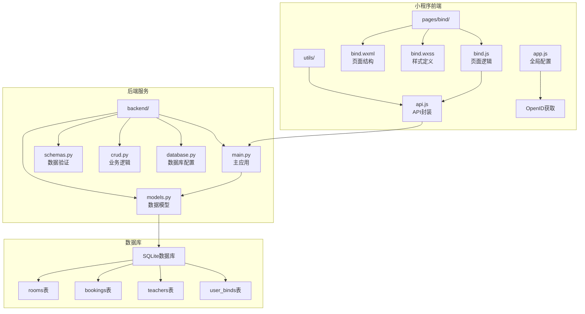
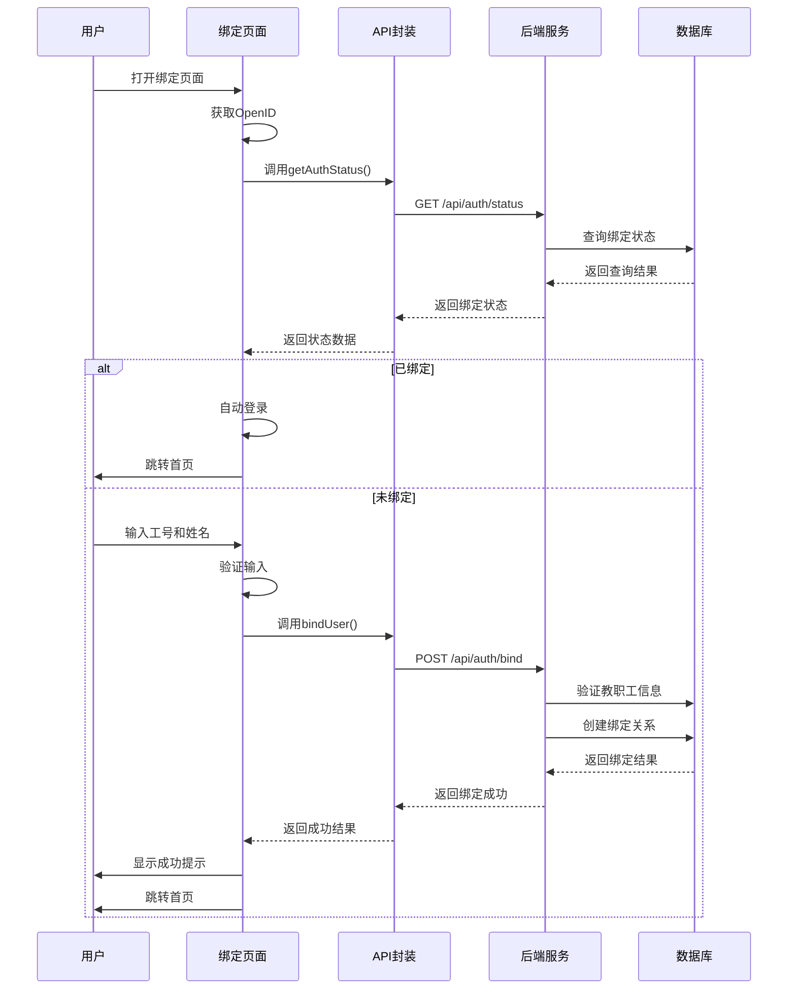
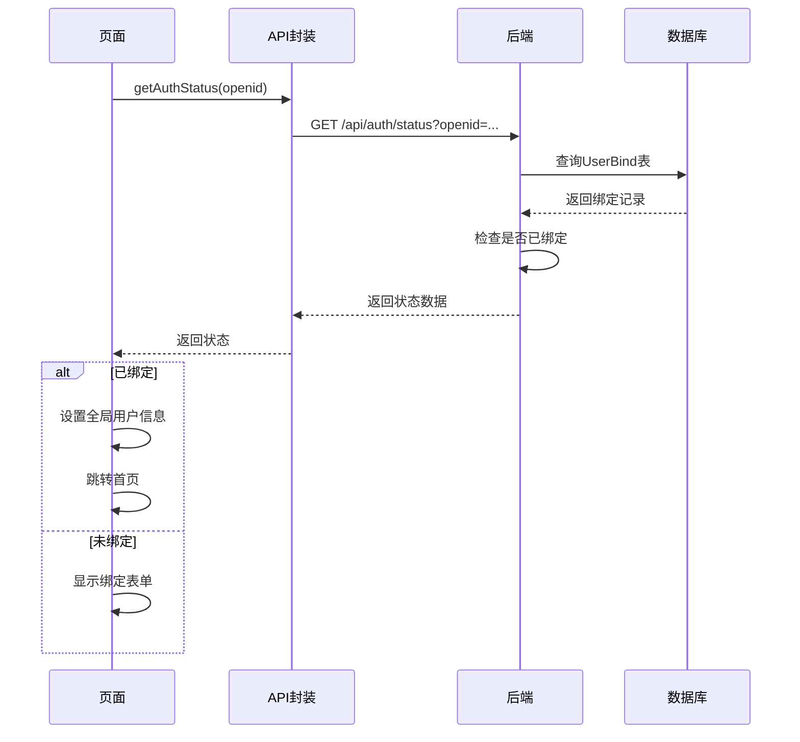
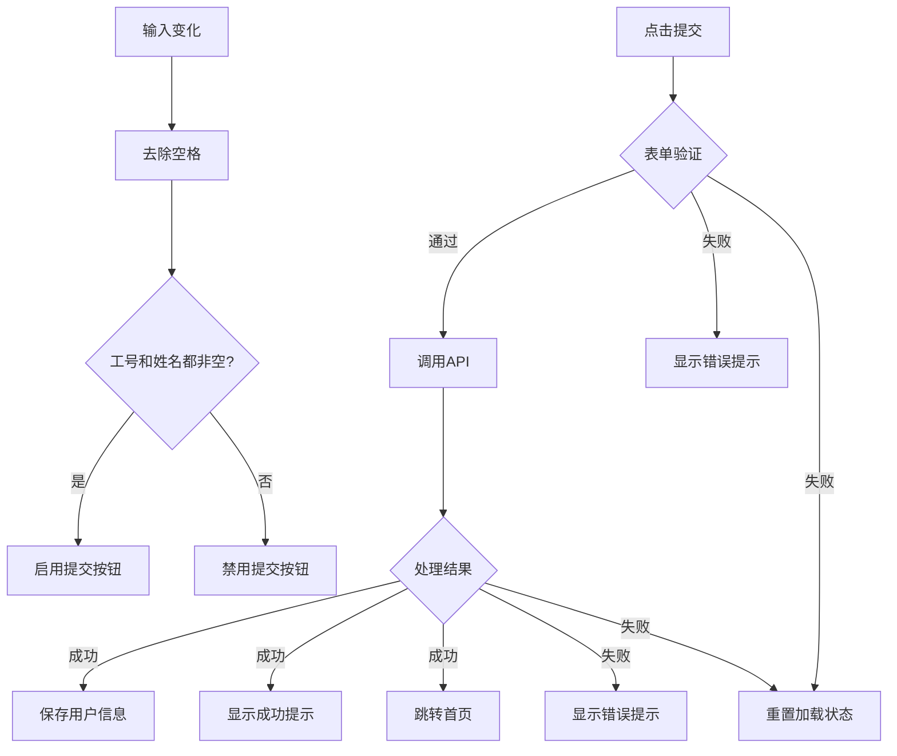
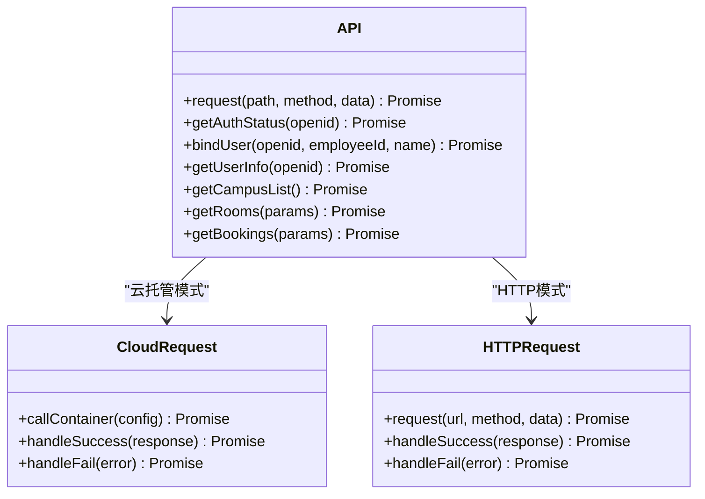
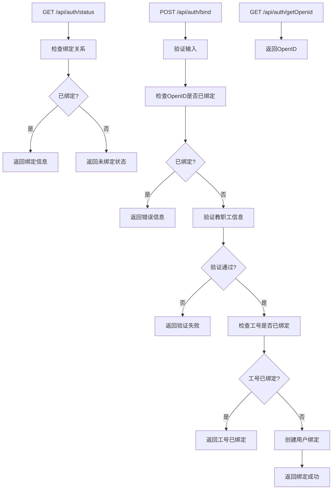
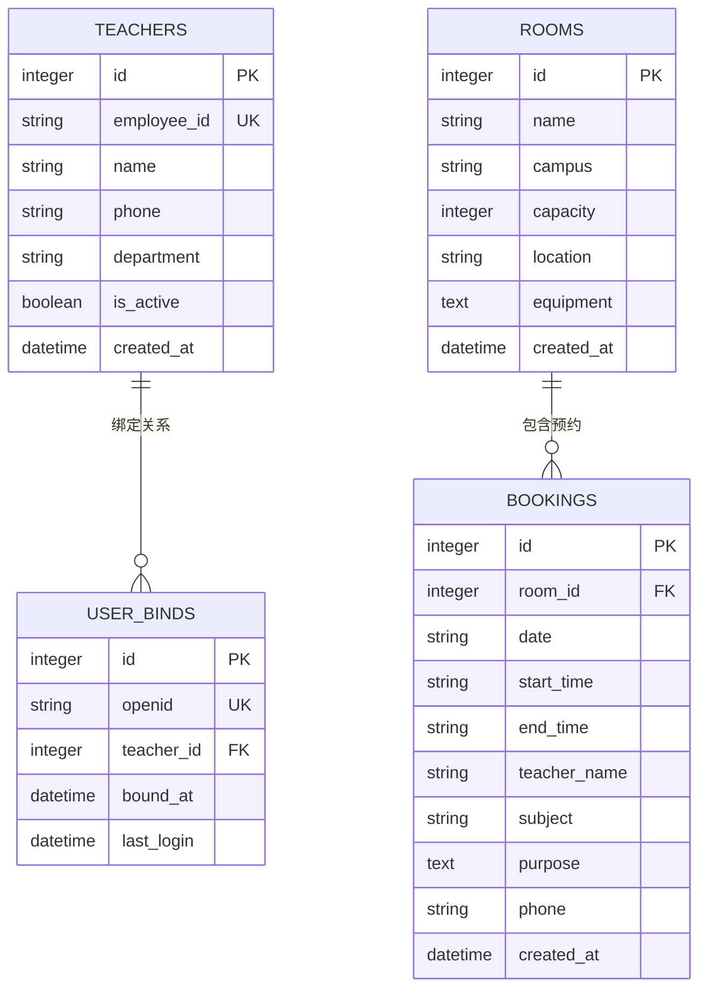
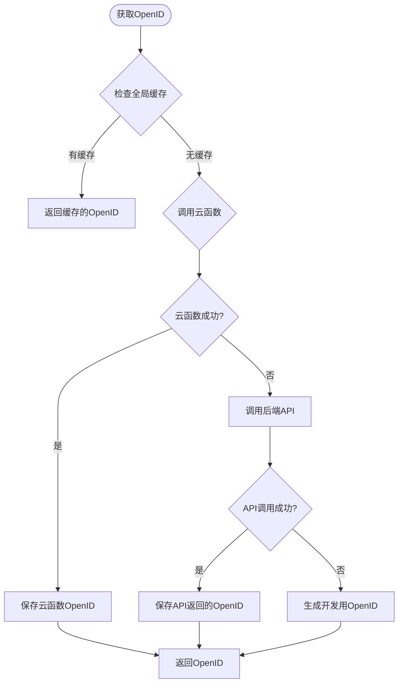
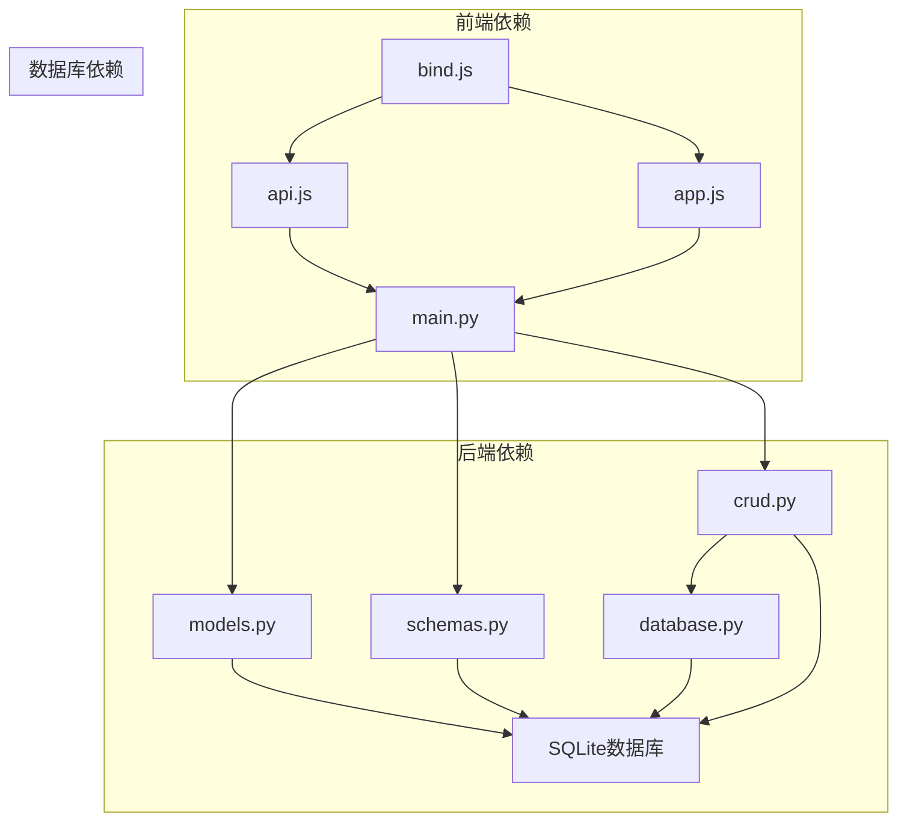

# 用户绑定页

<cite>
**本文档引用的文件**
- [bind.js](file://miniprogram/pages/bind/bind.js)
- [bind.wxml](file://miniprogram/pages/bind/bind.wxml)
- [bind.wxss](file://miniprogram/pages/bind/bind.wxss)
- [api.js](file://miniprogram/utils/api.js)
- [app.js](file://miniprogram/app.js)
- [main.py](file://backend/main.py)
- [models.py](file://backend/models.py)
- [schemas.py](file://backend/schemas.py)
- [crud.py](file://backend/crud.py)
- [database.py](file://backend/database.py)
</cite>

## 目录
1. [简介](#简介)
2. [项目结构](#项目结构)
3. [核心组件](#核心组件)
4. [架构概览](#架构概览)
5. [详细组件分析](#详细组件分析)
6. [依赖关系分析](#依赖关系分析)
7. [性能考虑](#性能考虑)
8. [故障排除指南](#故障排除指南)
9. [结论](#结论)

## 简介

用户绑定页面是西安交通大学软件学院会议室预约系统中的关键组件，负责教职工身份绑定流程。该页面实现了完整的身份验证绑定功能，包括OpenID获取、工号和姓名输入验证、绑定状态检查以及绑定成功后的数据处理。

系统采用前后端分离架构，前端使用微信小程序框架，后端基于FastAPI构建RESTful API服务。整个绑定流程确保了数据安全性和用户体验的平衡。

## 项目结构

用户绑定页面位于小程序项目的pages目录下，采用标准的微信小程序页面组织结构：



**图表来源**
- [bind.js:1-143](file://miniprogram/pages/bind/bind.js#L1-L143)
- [api.js:1-184](file://miniprogram/utils/api.js#L1-L184)
- [main.py:1-673](file://backend/main.py#L1-L673)

**章节来源**
- [bind.js:1-143](file://miniprogram/pages/bind/bind.js#L1-L143)
- [bind.wxml:1-65](file://miniprogram/pages/bind/bind.wxml#L1-L65)
- [bind.wxss:1-61](file://miniprogram/pages/bind/bind.wxss#L1-L61)
- [api.js:1-184](file://miniprogram/utils/api.js#L1-L184)
- [app.js:1-127](file://miniprogram/app.js#L1-L127)

## 核心组件

用户绑定页面由多个核心组件构成，每个组件都有明确的职责分工：

### 前端组件
- **页面逻辑组件**：处理用户交互、状态管理和数据验证
- **API封装组件**：统一管理后端接口调用
- **全局配置组件**：管理OpenID获取和用户状态

### 后端组件
- **认证接口**：处理OpenID获取、绑定状态检查和用户绑定
- **数据模型**：定义数据库表结构和关系
- **业务逻辑层**：实现数据验证和业务规则

### 数据库组件
- **SQLite数据库**：存储用户绑定信息和教职工数据
- **多表关联**：通过外键关系维护数据一致性

**章节来源**
- [bind.js:5-143](file://miniprogram/pages/bind/bind.js#L5-L143)
- [api.js:145-184](file://miniprogram/utils/api.js#L145-L184)
- [main.py:463-620](file://backend/main.py#L463-L620)

## 架构概览

系统采用分层架构设计，确保各层职责清晰、耦合度低：



**图表来源**
- [bind.js:14-68](file://miniprogram/pages/bind/bind.js#L14-L68)
- [api.js:145-163](file://miniprogram/utils/api.js#L145-L163)
- [main.py:515-584](file://backend/main.py#L515-L584)

## 详细组件分析

### 页面逻辑组件分析

绑定页面的核心逻辑集中在bind.js文件中，实现了完整的身份绑定流程：

#### OpenID获取机制

页面首先尝试从URL参数获取OpenID，如果不存在则通过全局app对象获取：

```mermaid
flowchart TD
Start([页面加载]) --> CheckParam{检查URL参数}
CheckParam --> |有OpenID| UseParam[使用URL参数中的OpenID]
CheckParam --> |无OpenID| GetFromApp[调用app.getOpenid()]
GetFromApp --> TryCloud{云函数调用成功?}
TryCloud --> |是| UseCloud[使用云函数获取的OpenID]
TryCloud --> |否| CallAPI[调用后端API获取OpenID]
CallAPI --> SaveOpenID[保存OpenID到data]
UseParam --> SaveOpenID
UseCloud --> SaveOpenID
SaveOpenID --> CheckBind[检查绑定状态]
```

**图表来源**
- [bind.js:14-34](file://miniprogram/pages/bind/bind.js#L14-L34)
- [app.js:46-89](file://miniprogram/app.js#L46-L89)

#### 绑定状态检查

页面通过调用后端的认证状态接口检查用户是否已绑定：



**图表来源**
- [bind.js:37-68](file://miniprogram/pages/bind/bind.js#L37-L68)
- [main.py:515-529](file://backend/main.py#L515-L529)

#### 表单验证逻辑

页面实现了双重验证机制：

1. **实时验证**：输入框变化时即时检查
2. **提交验证**：表单提交时的最终验证



**图表来源**
- [bind.js:70-101](file://miniprogram/pages/bind/bind.js#L70-L101)
- [bind.js:88-142](file://miniprogram/pages/bind/bind.js#L88-L142)

**章节来源**
- [bind.js:14-142](file://miniprogram/pages/bind/bind.js#L14-L142)

### API封装组件分析

API封装组件提供了统一的后端接口访问方式：

#### 请求封装机制

API封装使用Promise模式统一处理异步请求：



**图表来源**
- [api.js:13-41](file://miniprogram/utils/api.js#L13-L41)
- [api.js:47-74](file://miniprogram/utils/api.js#L47-L74)

#### 认证相关接口

API封装提供了专门的认证接口：

| 接口名称 | 方法 | 路径 | 功能描述 |
|---------|------|------|----------|
| getAuthStatus | GET | `/api/auth/status` | 获取用户绑定状态 |
| bindUser | POST | `/api/auth/bind` | 绑定用户工号和姓名 |
| getUserInfo | GET | `/api/auth/userinfo` | 获取用户信息 |
| getOpenid | GET | `/api/auth/getOpenid` | 获取用户OpenID |

**章节来源**
- [api.js:145-184](file://miniprogram/utils/api.js#L145-L184)

### 后端服务组件分析

后端服务基于FastAPI构建，提供了完整的认证和绑定功能：

#### 认证接口实现

后端实现了三个核心认证接口：



**图表来源**
- [main.py:515-584](file://backend/main.py#L515-L584)
- [main.py:503-513](file://backend/main.py#L503-L513)

#### 数据模型设计

后端使用SQLAlchemy ORM定义了完整的数据模型：



**图表来源**
- [models.py:44-75](file://backend/models.py#L44-L75)

**章节来源**
- [main.py:463-620](file://backend/main.py#L463-L620)
- [models.py:1-75](file://backend/models.py#L1-L75)

### 全局配置组件分析

全局配置组件负责管理OpenID获取和用户状态：

#### OpenID获取策略

全局配置实现了多级OpenID获取策略：



**图表来源**
- [app.js:46-89](file://miniprogram/app.js#L46-L89)

#### 用户状态管理

全局配置还负责用户状态的恢复和管理：

| 状态类型 | 检查点 | 恢复方式 | 缓存策略 |
|---------|--------|----------|----------|
| OpenID | 页面加载 | 云函数或API | 全局缓存 |
| 用户信息 | 应用启动 | 本地存储 | userInfo键 |
| 绑定状态 | 页面加载 | 后端API | userInfo键 |
| 校区偏好 | 应用启动 | 本地存储 | currentCampus键 |

**章节来源**
- [app.js:91-119](file://miniprogram/app.js#L91-L119)

## 依赖关系分析

系统各组件之间的依赖关系清晰明确：



**图表来源**
- [bind.js:1-3](file://miniprogram/pages/bind/bind.js#L1-L3)
- [api.js:1-2](file://miniprogram/utils/api.js#L1-L2)
- [main.py:11-14](file://backend/main.py#L11-L14)

### 组件耦合度分析

- **前端组件内聚性**：高 - 页面逻辑、API封装、全局配置职责明确
- **前后端耦合度**：适中 - 通过标准化API接口通信
- **数据库耦合度**：较低 - 通过ORM层抽象数据库操作

### 循环依赖检查

系统设计避免了循环依赖：
- 前端页面依赖API封装，API封装依赖后端服务
- 后端服务依赖数据模型和业务逻辑
- 数据库配置独立于业务逻辑

**章节来源**
- [bind.js:1-143](file://miniprogram/pages/bind/bind.js#L1-L143)
- [api.js:1-184](file://miniprogram/utils/api.js#L1-L184)
- [main.py:1-673](file://backend/main.py#L1-L673)

## 性能考虑

### 前端性能优化

1. **异步加载**：OpenID获取和状态检查采用异步方式，避免阻塞UI
2. **缓存策略**：合理使用本地存储减少重复请求
3. **状态管理**：使用setData更新界面，避免直接修改DOM

### 后端性能优化

1. **数据库索引**：OpenID和工号字段建立唯一索引
2. **查询优化**：使用SQLAlchemy ORM的高效查询
3. **连接池**：SQLite连接池管理

### 网络性能优化

1. **请求合并**：将多个API调用合并为单次请求
2. **超时控制**：设置合理的请求超时时间
3. **错误重试**：网络错误时自动重试

## 故障排除指南

### 常见问题及解决方案

#### OpenID获取失败

**问题现象**：页面无法获取用户OpenID，绑定功能不可用

**可能原因**：
1. 云函数调用失败
2. 网络连接异常
3. 后端API不可用

**解决方案**：
1. 检查云开发环境配置
2. 验证网络连接状态
3. 查看后端服务日志

#### 绑定验证失败

**问题现象**：输入正确的工号和姓名仍提示验证失败

**可能原因**：
1. 教职工信息未录入系统
2. 工号或姓名大小写不匹配
3. 教职工状态无效

**解决方案**：
1. 确认工号和姓名与系统录入完全一致
2. 联系管理员检查教职工信息
3. 验证教职工状态为激活状态

#### 重复绑定错误

**问题现象**：提示"该微信已绑定其他账号"或"该工号已被其他微信绑定"

**可能原因**：
1. 该OpenID已绑定其他工号
2. 该工号已被其他OpenID绑定

**解决方案**：
1. 解除原有绑定关系
2. 联系管理员处理重复绑定问题

#### 网络错误处理

**问题现象**：网络请求超时或失败

**处理策略**：
1. 显示友好的错误提示
2. 提供重试机制
3. 记录错误日志便于排查

**章节来源**
- [bind.js:135-141](file://miniprogram/pages/bind/bind.js#L135-L141)
- [main.py:538-574](file://backend/main.py#L538-L574)

### 调试技巧

1. **前端调试**：使用微信开发者工具的调试功能
2. **后端调试**：查看服务器日志输出
3. **数据库调试**：使用SQLite浏览器查看数据状态

## 结论

用户绑定页面是一个设计良好的身份验证组件，具有以下特点：

### 技术优势

1. **架构清晰**：前后端分离，职责明确
2. **安全性强**：多重验证机制，防止重复绑定
3. **用户体验好**：异步加载，即时反馈
4. **扩展性强**：模块化设计，易于维护和扩展

### 最佳实践

1. **输入验证**：前后端双重验证，确保数据完整性
2. **错误处理**：完善的错误处理机制
3. **状态管理**：合理的状态管理和缓存策略
4. **安全考虑**：敏感信息保护和防重复提交

### 改进建议

1. **增加输入格式验证**：对工号格式进行更严格的验证
2. **增强错误提示**：提供更具体的错误信息
3. **优化加载体验**：增加进度指示器
4. **完善日志记录**：记录更多调试信息

该绑定页面为整个会议室预约系统奠定了坚实的身份验证基础，确保了系统的安全性和可靠性。