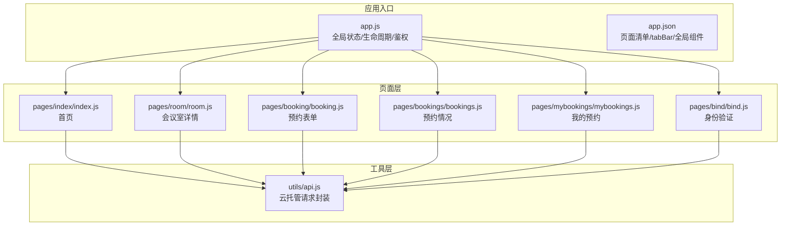
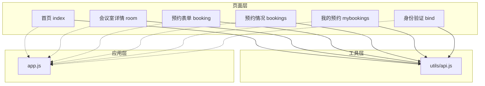
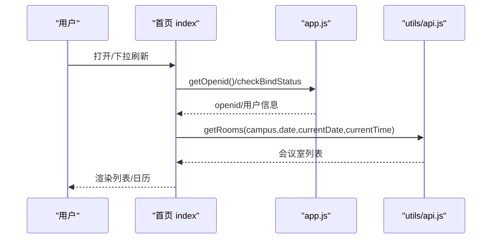
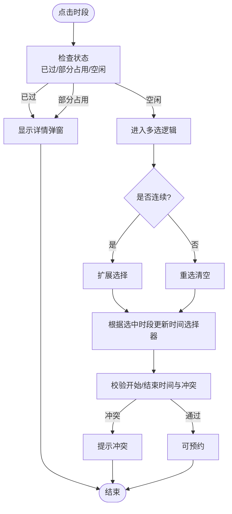
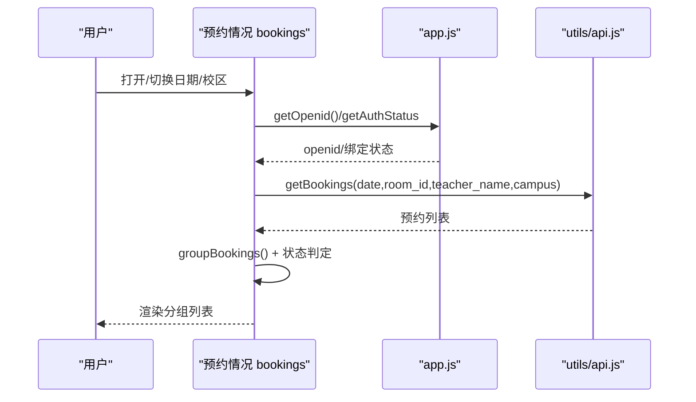
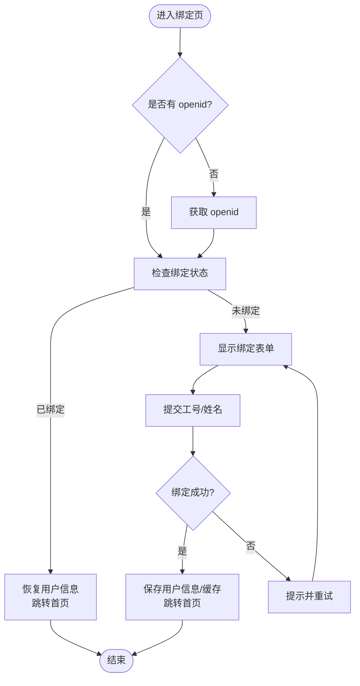
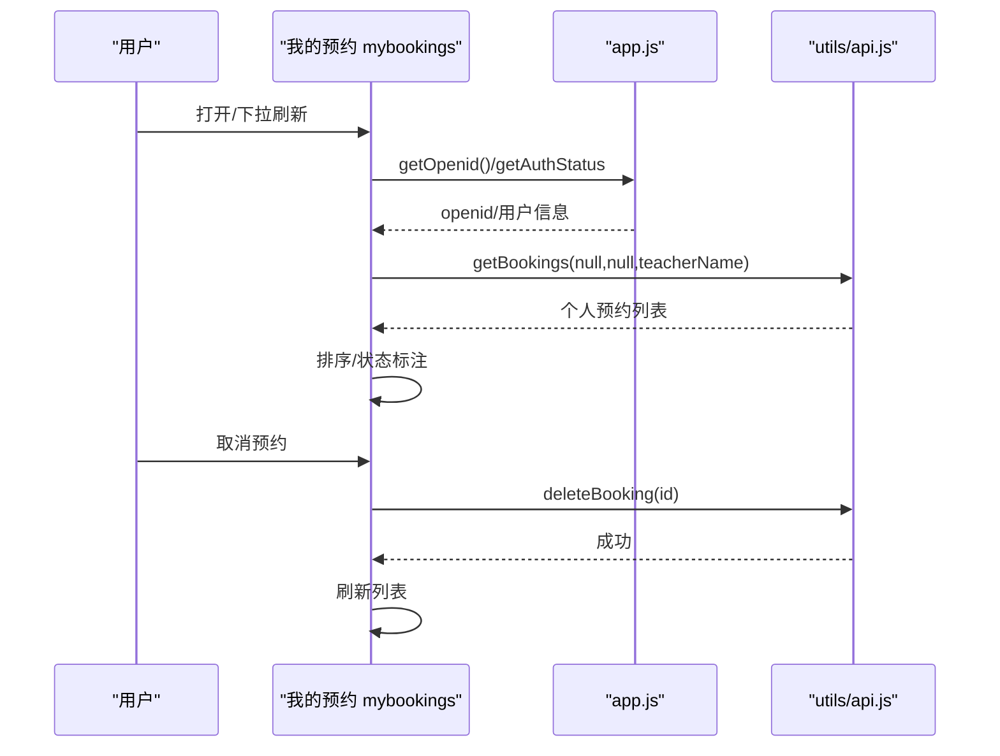
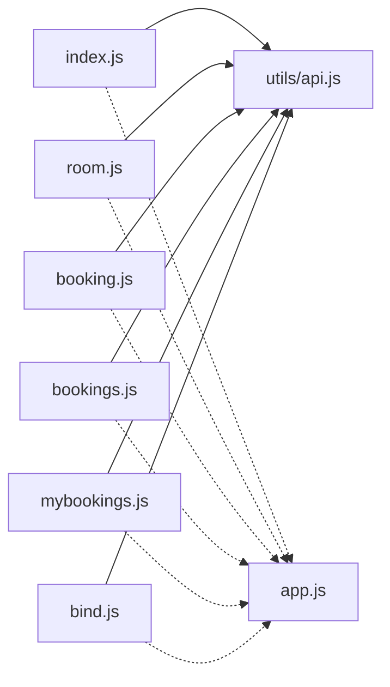

# 页面架构设计

<cite>
**本文引用的文件**
- [miniprogram/app.js](file://miniprogram/app.js)
- [miniprogram/app.json](file://miniprogram/app.json)
- [miniprogram/utils/api.js](file://miniprogram/utils/api.js)
- [miniprogram/pages/index/index.js](file://miniprogram/pages/index/index.js)
- [miniprogram/pages/index/index.json](file://miniprogram/pages/index/index.json)
- [miniprogram/pages/room/room.js](file://miniprogram/pages/room/room.js)
- [miniprogram/pages/room/room.json](file://miniprogram/pages/room/room.json)
- [miniprogram/pages/booking/booking.js](file://miniprogram/pages/booking/booking.js)
- [miniprogram/pages/booking/booking.json](file://miniprogram/pages/booking/booking.json)
- [miniprogram/pages/bookings/bookings.js](file://miniprogram/pages/bookings/bookings.js)
- [miniprogram/pages/bookings/bookings.json](file://miniprogram/pages/bookings/bookings.json)
- [miniprogram/pages/mybookings/mybookings.js](file://miniprogram/pages/mybookings/mybookings.js)
- [miniprogram/pages/mybookings/mybookings.json](file://miniprogram/pages/mybookings/mybookings.json)
- [miniprogram/pages/bind/bind.js](file://miniprogram/pages/bind/bind.js)
- [miniprogram/pages/bind/bind.json](file://miniprogram/pages/bind/bind.json)
</cite>

## 目录
1. [简介](#简介)
2. [项目结构](#项目结构)
3. [核心组件](#核心组件)
4. [架构总览](#架构总览)
5. [详细组件分析](#详细组件分析)
6. [依赖分析](#依赖分析)
7. [性能考虑](#性能考虑)
8. [故障排查指南](#故障排查指南)
9. [结论](#结论)
10. [附录](#附录)

## 简介
本文件面向小程序页面架构设计，围绕“首页（校区选择与日期导航）”“会议室详情页（时间线展示与多选逻辑）”“预约管理页（数据展示与操作交互）”“用户绑定页（身份验证流程）”“我的预约页（个人数据管理）”五大功能页面，系统梳理其设计模式、实现逻辑、页面间导航与数据传递机制、全局状态共享与生命周期管理，并给出性能优化策略与最佳实践建议。

## 项目结构
- 小程序采用分页目录组织，页面位于 pages/ 下，通用工具位于 utils/ 下，应用级入口与全局状态位于 app.js 与 app.json。
- 页面清单与 tabBar 配置集中于 app.json；各页面独立的 JSON 文件定义导航栏标题与按需引入的组件。
- API 层封装于 utils/api.js，统一走云托管容器请求，便于前后端解耦与部署迁移。

图表来源
- [miniprogram/app.js:1-127](file://miniprogram/app.js#L1-L127)
- [miniprogram/app.json:1-61](file://miniprogram/app.json#L1-L61)
- [miniprogram/utils/api.js:1-184](file://miniprogram/utils/api.js#L1-L184)
- [miniprogram/pages/index/index.js:1-342](file://miniprogram/pages/index/index.js#L1-L342)
- [miniprogram/pages/room/room.js:1-657](file://miniprogram/pages/room/room.js#L1-L657)
- [miniprogram/pages/booking/booking.js:1-113](file://miniprogram/pages/booking/booking.js#L1-L113)
- [miniprogram/pages/bookings/bookings.js:1-352](file://miniprogram/pages/bookings/bookings.js#L1-L352)
- [miniprogram/pages/mybookings/mybookings.js:1-201](file://miniprogram/pages/mybookings/mybookings.js#L1-L201)
- [miniprogram/pages/bind/bind.js:1-143](file://miniprogram/pages/bind/bind.js#L1-L143)

章节来源
- [miniprogram/app.js:1-127](file://miniprogram/app.js#L1-L127)
- [miniprogram/app.json:1-61](file://miniprogram/app.json#L1-L61)

## 核心组件
- 应用级全局状态与生命周期
  - 全局数据：云环境 ID、当前校区、当前日期、用户信息、openid。
  - 生命周期：onLaunch 初始化日期、读取缓存偏好；checkBindStatus 缓存恢复登录；getOpenid 优先云函数，回退后端接口。
- API 工具
  - request 封装云托管容器调用，统一封装状态码判断与错误处理。
  - 提供认证、会议室、预约、时间线等接口方法，支持查询参数拼接与编码。
- 页面导航与状态
  - tabBar 页面：首页、预约情况、我的，均在 app.json 中声明。
  - 页面间通过 wx.navigateTo、wx.switchTab、wx.redirectTo 等进行跳转与参数传递。

章节来源
- [miniprogram/app.js:1-127](file://miniprogram/app.js#L1-L127)
- [miniprogram/utils/api.js:1-184](file://miniprogram/utils/api.js#L1-L184)
- [miniprogram/app.json:1-61](file://miniprogram/app.json#L1-L61)

## 架构总览
整体采用“页面层-工具层-应用层”的三层架构：
- 页面层负责视图与交互，调用 API 工具发起网络请求。
- 工具层负责统一请求封装与错误处理，屏蔽云托管/后端差异。
- 应用层负责全局状态、鉴权与生命周期管理，保障跨页面一致性。

图表来源
- [miniprogram/pages/index/index.js:1-342](file://miniprogram/pages/index/index.js#L1-L342)
- [miniprogram/pages/room/room.js:1-657](file://miniprogram/pages/room/room.js#L1-L657)
- [miniprogram/pages/booking/booking.js:1-113](file://miniprogram/pages/booking/booking.js#L1-L113)
- [miniprogram/pages/bookings/bookings.js:1-352](file://miniprogram/pages/bookings/bookings.js#L1-L352)
- [miniprogram/pages/mybookings/mybookings.js:1-201](file://miniprogram/pages/mybookings/mybookings.js#L1-L201)
- [miniprogram/pages/bind/bind.js:1-143](file://miniprogram/pages/bind/bind.js#L1-L143)
- [miniprogram/utils/api.js:1-184](file://miniprogram/utils/api.js#L1-L184)
- [miniprogram/app.js:1-127](file://miniprogram/app.js#L1-L127)

## 详细组件分析

### 首页（校区选择与日期导航）
- 设计要点
  - 校区选择：下拉选择当前校区，写入全局状态并持久化至缓存，触发会议室列表刷新。
  - 日期导航：默认展示今日与未来6天，支持日历组件选择与“今天/明天/周X”友好展示。
  - 数据加载：并发获取会议室列表与时间线，结合客户端当前日期/时间过滤无效时段。
- 关键交互
  - onShow 每次显示均校验绑定状态，确保安全。
  - 下拉刷新触发 loadRooms。
- 参数与状态
  - 通过页面参数 date 传递给会议室详情页；通过全局状态 currentCampus 与 currentDate 在应用层共享。

图表来源
- [miniprogram/pages/index/index.js:27-142](file://miniprogram/pages/index/index.js#L27-L142)
- [miniprogram/app.js:44-119](file://miniprogram/app.js#L44-L119)
- [miniprogram/utils/api.js:90-98](file://miniprogram/utils/api.js#L90-L98)

章节来源
- [miniprogram/pages/index/index.js:1-342](file://miniprogram/pages/index/index.js#L1-L342)
- [miniprogram/pages/index/index.json:1-5](file://miniprogram/pages/index/index.json#L1-L5)

### 会议室详情页（时间线展示与多选逻辑）
- 设计要点
  - 时间线展示：并行加载会议室信息与时间线，动态计算“已过/进行中/空闲/占用”状态。
  - 多选时段：支持连续扩展、边缘取消、非连续重选；自动计算起止时间索引，联动时间选择器。
  - 快速预约：根据“当前时间/最早可预约时间/相邻预约”计算最优时间段。
- 关键交互
  - onSlotTap：区分已过/部分占用/空闲，分别进入详情或多选。
  - 时间选择器联动：开始时间变化时自动调整结束时间，保证结束时间晚于开始时间。
  - 预约提交：携带 room_id、date、start_time、end_time 跳转到预约表单页。
- 性能注意
  - 并行请求房间与时间线，减少等待时间。
  - 选择器初始化固定范围（08:00-22:00），避免重复计算。

图表来源
- [miniprogram/pages/room/room.js:289-471](file://miniprogram/pages/room/room.js#L289-L471)
- [miniprogram/pages/room/room.js:576-616](file://miniprogram/pages/room/room.js#L576-L616)

章节来源
- [miniprogram/pages/room/room.js:1-657](file://miniprogram/pages/room/room.js#L1-L657)
- [miniprogram/pages/room/room.json:1-6](file://miniprogram/pages/room/room.json#L1-L6)

### 预约管理页（数据展示与操作交互）
- 设计要点
  - 日期导航：支持选择任意日期，若超出7天则重新生成日期列表。
  - 校区筛选：支持“全部/兴庆/创新港”，按校区与会议室分组展示。
  - 状态标识：根据客户端日期/时间动态标注“待进行/进行中/已结束”。
- 关键交互
  - 下拉刷新：重新加载当日预约并分组。
  - 绑定状态校验：每次显示时验证，未绑定则回到首页。
- 数据分组
  - groupBookings 将预约按校区与会议室聚合，并按开始时间排序。

图表来源
- [miniprogram/pages/bookings/bookings.js:255-350](file://miniprogram/pages/bookings/bookings.js#L255-L350)
- [miniprogram/app.js:92-119](file://miniprogram/app.js#L92-L119)
- [miniprogram/utils/api.js:121-129](file://miniprogram/utils/api.js#L121-L129)

章节来源
- [miniprogram/pages/bookings/bookings.js:1-352](file://miniprogram/pages/bookings/bookings.js#L1-L352)
- [miniprogram/pages/bookings/bookings.json:1-5](file://miniprogram/pages/bookings/bookings.json#L1-L5)

### 用户绑定页（身份验证流程）
- 设计要点
  - 自动登录：若 openid 已绑定，自动恢复用户信息并跳转首页。
  - 手动绑定：输入工号与姓名，提交后写入全局状态与缓存，跳转首页。
  - 安全性：所有页面均在 onShow 时二次校验绑定状态，网络异常时采用本地缓存降级。
- 参数传递
  - 通过路由参数 openid 传入绑定页，避免重复获取。
- 流程图

图表来源
- [miniprogram/pages/bind/bind.js:14-68](file://miniprogram/pages/bind/bind.js#L14-L68)
- [miniprogram/pages/bind/bind.js:88-142](file://miniprogram/pages/bind/bind.js#L88-L142)

章节来源
- [miniprogram/pages/bind/bind.js:1-143](file://miniprogram/pages/bind/bind.js#L1-L143)
- [miniprogram/pages/bind/bind.json:1-9](file://miniprogram/pages/bind/bind.json#L1-L9)

### 我的预约页（个人数据管理）
- 设计要点
  - 绑定校验：onShow 时验证并加载当前用户的预约列表。
  - 状态判定：同“预约管理页”的状态逻辑，支持“待进行/进行中/已结束”。
  - 操作交互：支持取消预约，取消后刷新列表。
- 参数与状态
  - 通过全局用户信息 teacherName 作为查询条件，无需额外参数。

图表来源
- [miniprogram/pages/mybookings/mybookings.js:83-139](file://miniprogram/pages/mybookings/mybookings.js#L83-L139)
- [miniprogram/app.js:92-119](file://miniprogram/app.js#L92-L119)
- [miniprogram/utils/api.js:141-143](file://miniprogram/utils/api.js#L141-L143)

章节来源
- [miniprogram/pages/mybookings/mybookings.js:1-201](file://miniprogram/pages/mybookings/mybookings.js#L1-L201)
- [miniprogram/pages/mybookings/mybookings.json:1-5](file://miniprogram/pages/mybookings/mybookings.json#L1-L5)

## 依赖分析
- 页面对工具层的依赖
  - 所有页面均通过 utils/api.js 发起请求，降低重复代码与提升一致性。
- 页面对应用层的依赖
  - 首页、会议室详情、预约管理、我的预约、绑定页均在生命周期中调用 app.js 的鉴权与全局状态方法。
- 组件依赖
  - app.json 统一注册 Vant Weapp 组件，页面 JSON 按需引入局部组件。

图表来源
- [miniprogram/pages/index/index.js:1-342](file://miniprogram/pages/index/index.js#L1-L342)
- [miniprogram/pages/room/room.js:1-657](file://miniprogram/pages/room/room.js#L1-L657)
- [miniprogram/pages/booking/booking.js:1-113](file://miniprogram/pages/booking/booking.js#L1-L113)
- [miniprogram/pages/bookings/bookings.js:1-352](file://miniprogram/pages/bookings/bookings.js#L1-L352)
- [miniprogram/pages/mybookings/mybookings.js:1-201](file://miniprogram/pages/mybookings/mybookings.js#L1-L201)
- [miniprogram/pages/bind/bind.js:1-143](file://miniprogram/pages/bind/bind.js#L1-L143)
- [miniprogram/utils/api.js:1-184](file://miniprogram/utils/api.js#L1-L184)
- [miniprogram/app.js:1-127](file://miniprogram/app.js#L1-L127)

章节来源
- [miniprogram/app.json:44-58](file://miniprogram/app.json#L44-L58)

## 性能考虑
- 数据懒加载与并发
  - 会议室详情页并行加载房间与时间线，缩短首屏等待。
  - 首页与预约管理页在日期/校区切换时按需加载，避免全量刷新。
- 渲染优化
  - 使用分组与排序在前端完成，减少后端复杂度；对长列表采用合理分页/截断策略（如需）。
  - 日期选择器与时间选择器初始化固定范围，避免运行时计算。
- 内存管理
  - 页面 onUnload 未显式实现，建议在需要时释放定时器、事件监听与大对象引用。
  - 缓存策略：优先使用本地缓存恢复用户信息与校区偏好，网络异常时降级。
- 网络健壮性
  - 鉴权与 openid 获取具备回退路径（云函数 → 后端接口），增强可用性。
  - 错误提示统一通过 Toast 展示，避免崩溃。

## 故障排查指南
- 绑定状态异常
  - 现象：进入页面提示未绑定或信息丢失。
  - 排查：确认 app.js 的 getOpenid 与 checkBindStatus 是否正常执行；检查缓存中 userInfo 是否存在且 isBound 为真。
- openid 获取失败
  - 现象：网络错误或返回空。
  - 排查：检查云托管容器配置与 X-WX-SERVICE；确认后端接口可用。
- 预约冲突与时间边界
  - 现象：结束时间早于开始时间或与相邻预约冲突。
  - 排查：核对 validateTime 逻辑与时间选择器索引映射；确认相邻预约的开始/结束时间边界。
- 页面跳转与参数丢失
  - 现象：从首页跳转到会议室详情或从详情跳转到预约表单时参数缺失。
  - 排查：确认页面跳转时的参数拼接与编码（如 room_name）；在目标页 onLoad 中正确读取。

章节来源
- [miniprogram/app.js:44-119](file://miniprogram/app.js#L44-L119)
- [miniprogram/utils/api.js:13-41](file://miniprogram/utils/api.js#L13-L41)
- [miniprogram/pages/room/room.js:576-616](file://miniprogram/pages/room/room.js#L576-L616)
- [miniprogram/pages/booking/booking.js:22-39](file://miniprogram/pages/booking/booking.js#L22-L39)

## 结论
该小程序页面架构清晰，采用“页面-工具-应用”三层分离，配合全局状态与生命周期管理，实现了安全、一致且易维护的用户体验。通过并行加载、状态机式的时间选择与冲突校验、以及严格的绑定校验与降级策略，系统在功能完整性与稳定性方面表现良好。后续可在长列表渲染、页面卸载资源回收与更多交互反馈上持续优化。

## 附录
- 页面导航与参数传递一览
  - 首页 → 会议室详情：携带 id、date。
  - 会议室详情 → 预约表单：携带 room_id、room_name、date、start_time、end_time。
  - 绑定页：携带 openid。
  - 我的预约：通过全局用户信息 teacherName 查询个人预约。
- 最佳实践建议
  - 严格遵循“鉴权前置”原则，在每个页面的 onShow 中进行绑定状态校验。
  - 对外部输入（如日期、时间）进行格式化与边界校验，避免异常。
  - 对高频交互（如时间选择器联动）进行节流与防抖，提升流畅度。
  - 对长列表与图片资源进行懒加载与缓存复用，降低首屏与滚动卡顿。