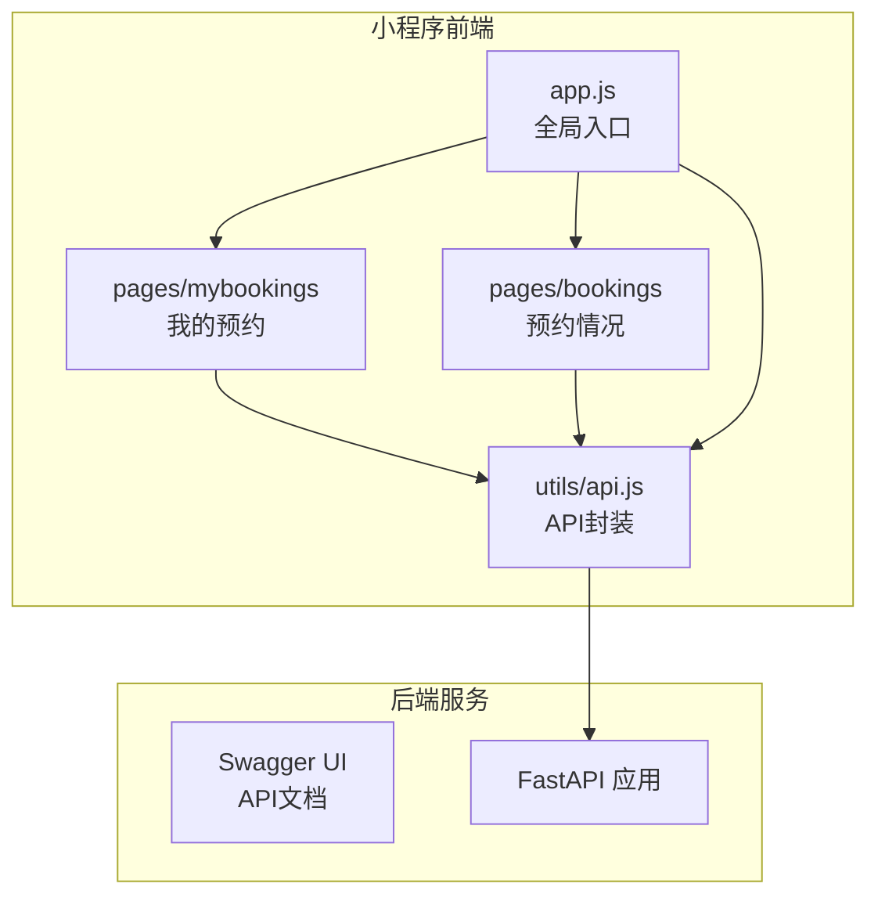
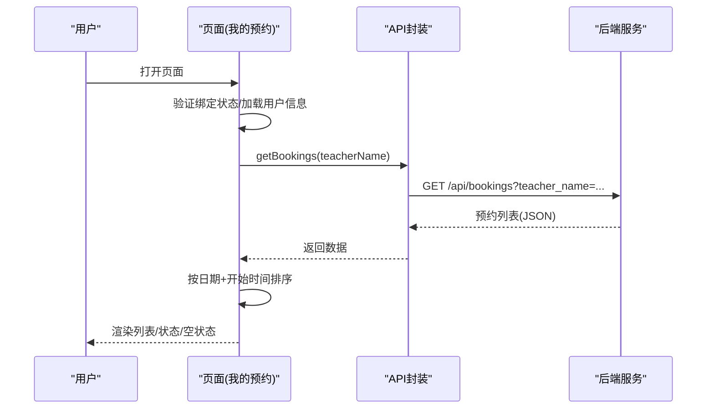
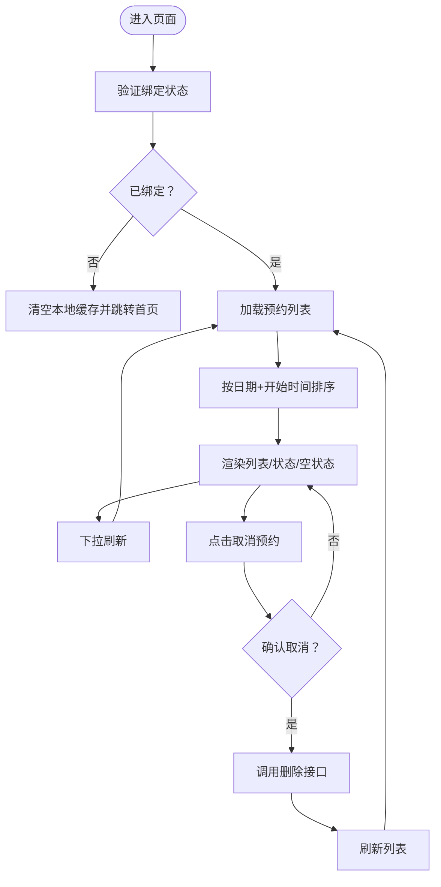
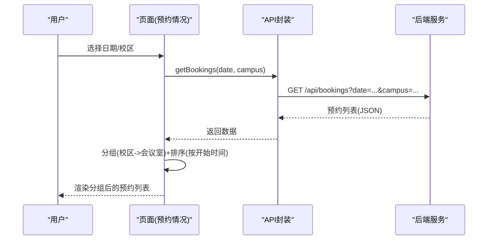
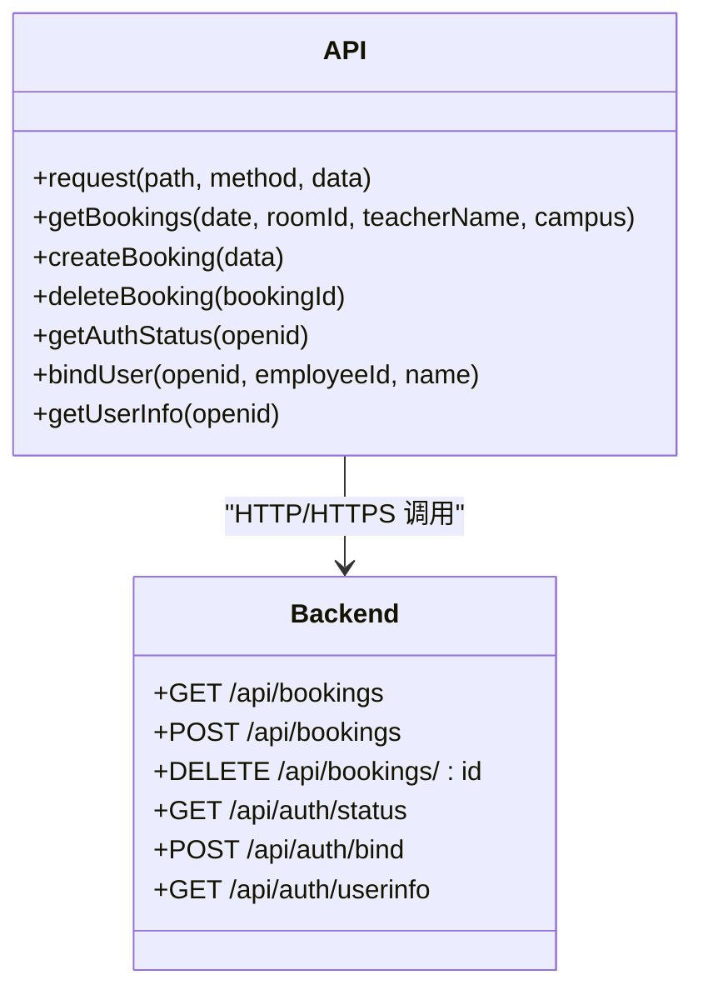
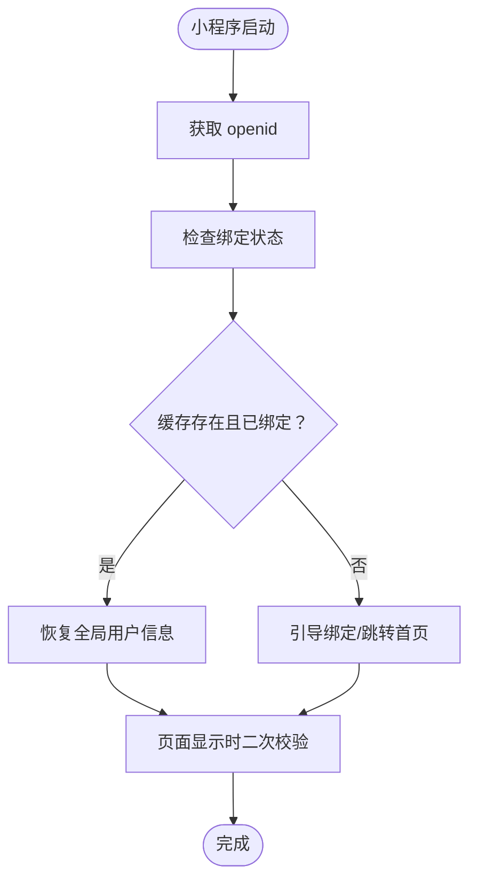
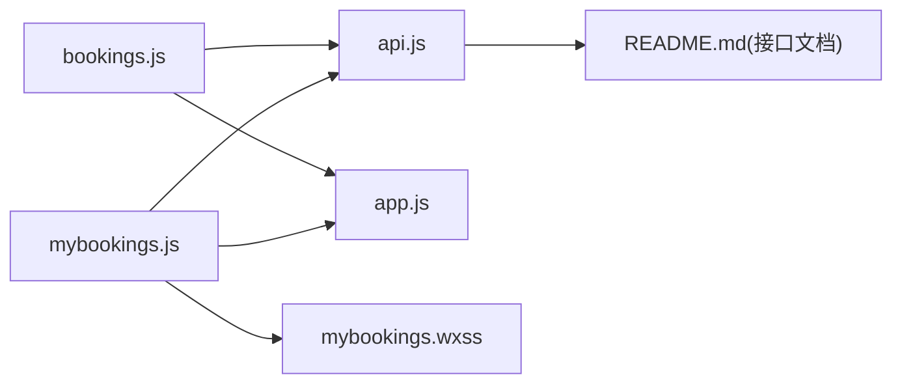

# 预约管理页

<cite>
**本文引用的文件**
- [mybookings.js](file://miniprogram/pages/mybookings/mybookings.js)
- [mybookings.json](file://miniprogram/pages/mybookings/mybookings.json)
- [mybookings.wxml](file://miniprogram/pages/mybookings/mybookings.wxml)
- [mybookings.wxss](file://miniprogram/pages/mybookings/mybookings.wxss)
- [bookings.js](file://miniprogram/pages/bookings/bookings.js)
- [bookings.json](file://miniprogram/pages/bookings/bookings.json)
- [bookings.wxml](file://miniprogram/pages/bookings/bookings.wxml)
- [api.js](file://miniprogram/utils/api.js)
- [app.js](file://miniprogram/app.js)
- [README.md](file://README.md)
</cite>

## 目录
1. [简介](#简介)
2. [项目结构](#项目结构)
3. [核心组件](#核心组件)
4. [架构总览](#架构总览)
5. [详细组件分析](#详细组件分析)
6. [依赖关系分析](#依赖关系分析)
7. [性能考虑](#性能考虑)
8. [故障排查指南](#故障排查指南)
9. [结论](#结论)
10. [附录](#附录)

## 简介
本文件聚焦“预约管理页”（我的预约）的设计与实现，围绕以下目标展开：
- 解析预约列表的展示逻辑：数据获取、排序与筛选机制
- 说明预约状态管理与显示：已预约、可取消、已过期等状态的判定与呈现
- 阐述用户操作功能：查看详情、取消预约、状态更新
- 解释页面数据同步机制：与服务器的数据同步与本地缓存策略
- 说明页面交互设计：下拉刷新、空状态处理等
- 提供性能优化与用户体验改进建议

## 项目结构
本项目采用前后端分离架构，小程序前端通过封装的 API 模块调用后端 REST 接口；预约管理页位于小程序 pages 目录下，分别提供“我的预约”和“预约情况”两个页面，前者面向教师个人，后者面向管理员或全局视图。

图表来源
- [mybookings.js:1-201](file://miniprogram/pages/mybookings/mybookings.js#L1-L201)
- [bookings.js:1-352](file://miniprogram/pages/bookings/bookings.js#L1-L352)
- [api.js:1-184](file://miniprogram/utils/api.js#L1-L184)
- [app.js:1-127](file://miniprogram/app.js#L1-L127)
- [README.md:48-85](file://README.md#L48-L85)

章节来源
- [mybookings.js:1-201](file://miniprogram/pages/mybookings/mybookings.js#L1-L201)
- [bookings.js:1-352](file://miniprogram/pages/bookings/bookings.js#L1-L352)
- [api.js:1-184](file://miniprogram/utils/api.js#L1-L184)
- [app.js:1-127](file://miniprogram/app.js#L1-L127)
- [README.md:48-85](file://README.md#L48-L85)

## 核心组件
- 我的预约页面（个人视角）
  - 数据源：根据当前绑定教师姓名查询其预约记录
  - 排序：按“日期+开始时间”降序排列，最近的在前
  - 状态：基于客户端当前日期与时间动态计算（待进行/进行中/已结束）
  - 交互：下拉刷新、空状态、取消预约
- 预约情况页面（全局/管理员视角）
  - 数据源：按日期与校区过滤的全局预约记录
  - 分组：按校区与会议室分组展示
  - 排序：按开始时间升序排列
  - 交互：日期选择、校区切换、下拉刷新、空状态

章节来源
- [mybookings.js:84-115](file://miniprogram/pages/mybookings/mybookings.js#L84-L115)
- [mybookings.wxml:72-117](file://miniprogram/pages/mybookings/mybookings.wxml#L72-L117)
- [bookings.js:255-282](file://miniprogram/pages/bookings/bookings.js#L255-L282)
- [bookings.wxml:73-113](file://miniprogram/pages/bookings/bookings.wxml#L73-L113)

## 架构总览
小程序通过统一的 API 封装模块发起请求，后端提供 REST 接口，Swagger UI 自动生成接口文档。全局入口负责 openid 获取与绑定状态恢复，确保页面在每次显示时能正确加载数据。

图表来源
- [mybookings.js:26-115](file://miniprogram/pages/mybookings/mybookings.js#L26-L115)
- [api.js:121-129](file://miniprogram/utils/api.js#L121-L129)
- [README.md:407-523](file://README.md#L407-L523)

章节来源
- [mybookings.js:26-115](file://miniprogram/pages/mybookings/mybookings.js#L26-L115)
- [api.js:121-129](file://miniprogram/utils/api.js#L121-L129)
- [README.md:407-523](file://README.md#L407-L523)

## 详细组件分析

### 我的预约页面（个人视角）
- 数据获取与绑定校验
  - 页面加载与显示时，先获取 openid 并调用认证接口判断绑定状态；若已绑定则缓存用户信息并加载预约列表；否则清空本地缓存并跳转首页。
  - 若网络异常，采用本地缓存降级策略，继续渲染上次成功加载的数据。
- 列表展示与排序
  - 通过 API 获取教师名对应的预约列表，按“日期+开始时间”降序排列，最近的在前。
  - 支持下拉刷新，刷新完成后停止指示。
- 状态管理与显示
  - 状态由客户端计算：基于当前日期与时间与预约的日期/起止时间对比，得出“待进行/进行中/已结束”。
  - WXML 中通过 wxs 模块复用状态计算逻辑，保证视图层与逻辑层的一致性。
- 可取消条件
  - 仅当预约尚未结束（即当天结束时间未到）时才显示“取消预约”按钮。
- 用户交互
  - 加载中状态、空状态占位图；点击取消弹出确认对话框；成功/失败提示。
- 样式与布局
  - 卡片式布局，状态标签使用不同颜色区分；底部操作区域仅对可取消项可见。

图表来源
- [mybookings.js:26-139](file://miniprogram/pages/mybookings/mybookings.js#L26-L139)
- [mybookings.wxml:4-40](file://miniprogram/pages/mybookings/mybookings.wxml#L4-L40)
- [mybookings.wxss:189-213](file://miniprogram/pages/mybookings/mybookings.wxss#L189-L213)

章节来源
- [mybookings.js:26-139](file://miniprogram/pages/mybookings/mybookings.js#L26-L139)
- [mybookings.json:1-5](file://miniprogram/pages/mybookings/mybookings.json#L1-L5)
- [mybookings.wxml:1-119](file://miniprogram/pages/mybookings/mybookings.wxml#L1-L119)
- [mybookings.wxss:1-297](file://miniprogram/pages/mybookings/mybookings.wxss#L1-L297)

### 预约情况页面（全局/管理员视角）
- 数据获取与分组
  - 按当前日期与校区参数调用 API 获取全局预约列表，按校区与会议室分组，并在每条预约上附加状态字段。
  - 对每个会议室内的预约按开始时间升序排序。
- 日期与校区控制
  - 提供未来7天日期列表与“更多日期”日历弹窗；支持校区切换（全部/兴庆/创新港）。
- 状态显示
  - 与“我的预约”一致，基于客户端当前日期与时间计算状态并在视图中展示。
- 交互与反馈
  - 下拉刷新、加载中与空状态处理。

图表来源
- [bookings.js:255-350](file://miniprogram/pages/bookings/bookings.js#L255-L350)
- [bookings.wxml:73-113](file://miniprogram/pages/bookings/bookings.wxml#L73-L113)
- [api.js:121-129](file://miniprogram/utils/api.js#L121-L129)

章节来源
- [bookings.js:1-352](file://miniprogram/pages/bookings/bookings.js#L1-L352)
- [bookings.json:1-5](file://miniprogram/pages/bookings/bookings.json#L1-L5)
- [bookings.wxml:1-116](file://miniprogram/pages/bookings/bookings.wxml#L1-L116)

### API 封装与后端接口
- API 封装
  - 封装云托管请求方法，统一处理成功/失败回调与错误信息；提供获取预约列表、创建/删除预约、认证相关等方法。
  - 支持传统 HTTP 请求方式作为备用方案（注释说明）。
- 后端接口
  - 提供获取预约列表、创建预约、删除预约等接口；Swagger UI 自动生成接口文档，便于联调与测试。

图表来源
- [api.js:13-184](file://miniprogram/utils/api.js#L13-L184)
- [README.md:407-523](file://README.md#L407-L523)

章节来源
- [api.js:1-184](file://miniprogram/utils/api.js#L1-L184)
- [README.md:407-523](file://README.md#L407-L523)

### 全局入口与缓存策略
- openid 获取
  - 优先从云函数获取；失败时回退到后端接口；最终写入全局状态并缓存。
- 绑定状态恢复
  - 小程序启动时尝试从缓存恢复用户信息；页面显示时再次校验绑定状态，确保一致性。
- 缓存降级
  - “我的预约”在认证接口失败时使用本地缓存渲染，提升可用性。

图表来源
- [app.js:44-119](file://miniprogram/app.js#L44-L119)
- [mybookings.js:26-58](file://miniprogram/pages/mybookings/mybookings.js#L26-L58)

章节来源
- [app.js:1-127](file://miniprogram/app.js#L1-L127)
- [mybookings.js:26-58](file://miniprogram/pages/mybookings/mybookings.js#L26-L58)

## 依赖关系分析
- 页面依赖
  - “我的预约”依赖 API 封装与全局入口；状态计算通过 WXML 的 wxs 模块复用。
  - “预约情况”同样依赖 API 封装，但额外包含日期与校区选择逻辑。
- 组件与样式
  - 使用 Vant Weapp 组件库（如 loading、empty、calendar 等）提升交互体验。
  - 样式采用卡片式布局与状态色区分，增强可读性。

图表来源
- [mybookings.js:1-201](file://miniprogram/pages/mybookings/mybookings.js#L1-L201)
- [bookings.js:1-352](file://miniprogram/pages/bookings/bookings.js#L1-L352)
- [api.js:1-184](file://miniprogram/utils/api.js#L1-L184)
- [app.js:1-127](file://miniprogram/app.js#L1-L127)
- [README.md:407-523](file://README.md#L407-L523)

章节来源
- [mybookings.js:1-201](file://miniprogram/pages/mybookings/mybookings.js#L1-L201)
- [bookings.js:1-352](file://miniprogram/pages/bookings/bookings.js#L1-L352)
- [api.js:1-184](file://miniprogram/utils/api.js#L1-L184)
- [app.js:1-127](file://miniprogram/app.js#L1-L127)
- [README.md:407-523](file://README.md#L407-L523)

## 性能考虑
- 数据获取与排序
  - “我的预约”在前端对结果进行排序，建议后端提供排序参数或服务端排序，减少前端计算开销。
- 状态计算
  - WXML 中使用 wxs 模块复用状态逻辑，避免重复计算；保持逻辑简洁，避免复杂字符串拼接。
- 列表渲染
  - 使用 wx:for 渲染列表时指定 wx:key，提升渲染性能；对长列表可考虑分页或虚拟滚动（如后续扩展）。
- 缓存与降级
  - 认证失败时使用本地缓存降级，保障可用性；建议在弱网环境下增加“上次更新时间”提示。
- 图标与样式
  - 使用轻量图标与简洁样式，避免过度阴影与复杂动画影响首屏渲染。

## 故障排查指南
- 认证失败或未绑定
  - 现象：页面清空预约并跳转首页
  - 排查：检查 openid 获取流程、后端认证接口返回值、网络连通性
- 加载失败
  - 现象：Toast 提示“加载失败”
  - 排查：查看 API 返回的 detail 字段、网络状态、后端接口可用性
- 取消失败
  - 现象：Toast 提示“取消失败”
  - 排查：确认 bookingId 正确、后端 DELETE 接口返回状态码、网络异常
- 状态显示异常
  - 现象：状态与预期不符
  - 排查：检查客户端当前日期/时间与服务器时间差异、wxs 状态计算逻辑

章节来源
- [mybookings.js:108-138](file://miniprogram/pages/mybookings/mybookings.js#L108-L138)
- [mybookings.wxml:4-40](file://miniprogram/pages/mybookings/mybookings.wxml#L4-L40)
- [api.js:13-41](file://miniprogram/utils/api.js#L13-L41)

## 结论
“预约管理页”通过清晰的页面职责划分（个人与全局）、统一的 API 封装与状态计算、以及完善的交互与降级策略，实现了稳定可靠的预约管理体验。建议后续在后端排序、分页与弱网优化方面进一步完善，持续提升性能与稳定性。

## 附录
- API 接口概览（参考）
  - 获取预约列表、创建/删除预约、认证相关接口详见项目文档与 Swagger UI

章节来源
- [README.md:407-523](file://README.md#L407-L523)