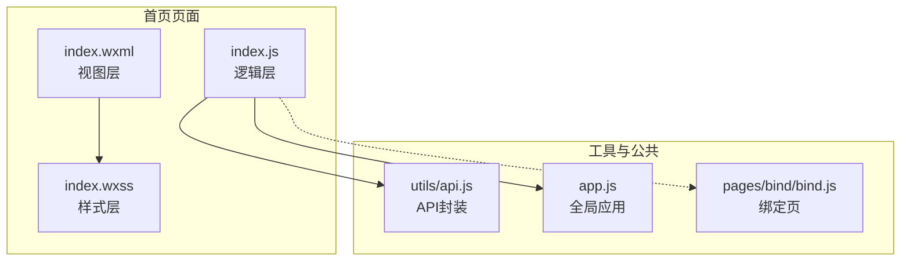
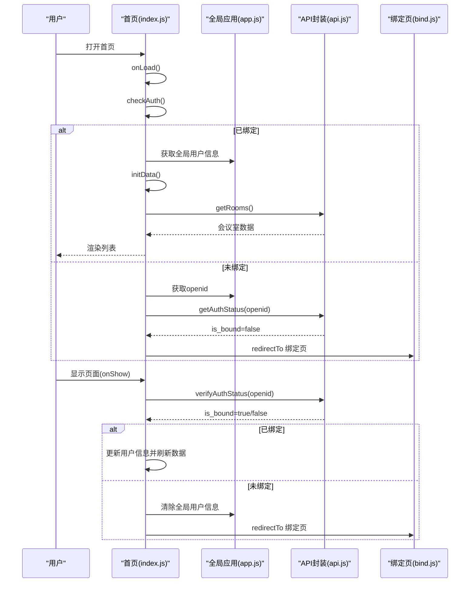
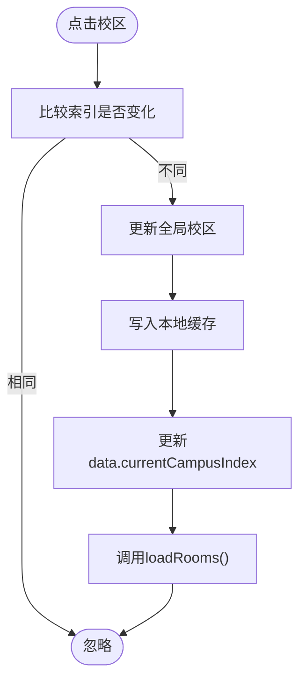
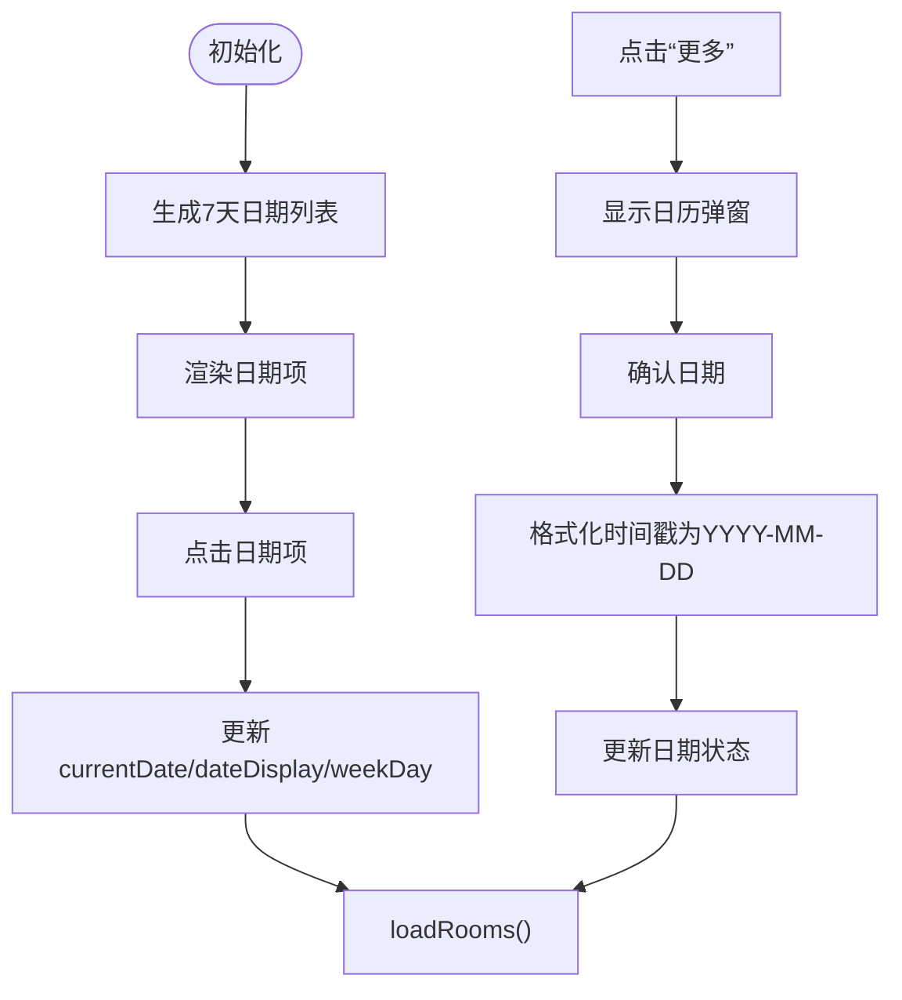
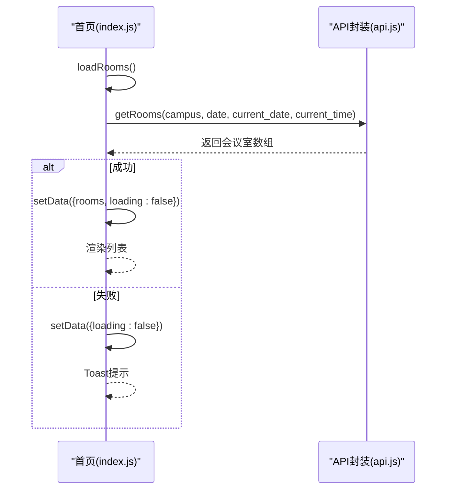
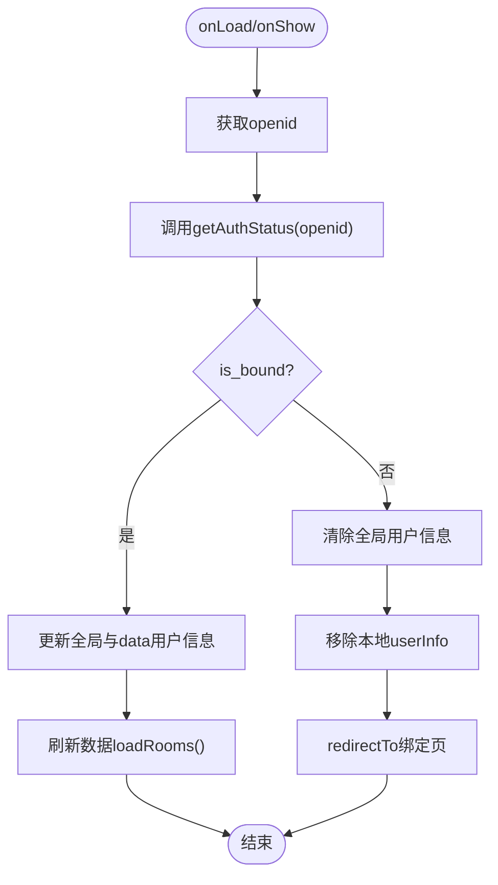
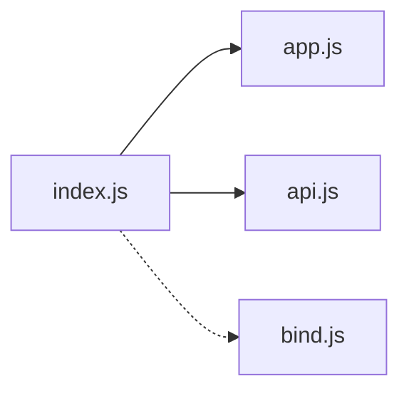

# 首页页面

<cite>
**本文引用的文件**
- [index.js](file://miniprogram/pages/index/index.js)
- [index.json](file://miniprogram/pages/index/index.json)
- [index.wxml](file://miniprogram/pages/index/index.wxml)
- [index.wxss](file://miniprogram/pages/index/index.wxss)
- [api.js](file://miniprogram/utils/api.js)
- [app.js](file://miniprogram/app.js)
- [bind.js](file://miniprogram/pages/bind/bind.js)
</cite>

## 目录
1. [简介](#简介)
2. [项目结构](#项目结构)
3. [核心组件](#核心组件)
4. [架构总览](#架构总览)
5. [详细组件分析](#详细组件分析)
6. [依赖关系分析](#依赖关系分析)
7. [性能考虑](#性能考虑)
8. [故障排查指南](#故障排查指南)
9. [结论](#结论)

## 简介
本文件面向“首页页面”的功能实现与架构解析，重点覆盖以下方面：
- 校区选择器：多校区切换与状态持久化
- 日期导航组件：7天日期列表生成、日期格式化与交互处理
- 会议室列表展示：数据加载、缓存与错误处理
- 用户认证状态检查：本地缓存检查、服务器验证与降级策略
- 生命周期管理：onLoad 与 onShow 的执行顺序与职责
- 性能优化与用户体验改进建议

## 项目结构
首页页面由 WXML 视图层、WXSS 样式层、JS 逻辑层与 API 封装组成，采用微信小程序原生开发与 Vant Weapp 组件库结合的方式实现。

图表来源
- [index.js:1-342](file://miniprogram/pages/index/index.js#L1-L342)
- [index.wxml:1-101](file://miniprogram/pages/index/index.wxml#L1-L101)
- [index.wxss:1-294](file://miniprogram/pages/index/index.wxss#L1-L294)
- [api.js:1-184](file://miniprogram/utils/api.js#L1-L184)
- [app.js:1-127](file://miniprogram/app.js#L1-L127)
- [bind.js:1-143](file://miniprogram/pages/bind/bind.js#L1-L143)

章节来源
- [index.js:1-342](file://miniprogram/pages/index/index.js#L1-L342)
- [index.json:1-5](file://miniprogram/pages/index/index.json#L1-L5)
- [index.wxml:1-101](file://miniprogram/pages/index/index.wxml#L1-L101)
- [index.wxss:1-294](file://miniprogram/pages/index/index.wxss#L1-L294)
- [api.js:1-184](file://miniprogram/utils/api.js#L1-L184)
- [app.js:1-127](file://miniprogram/app.js#L1-L127)
- [bind.js:1-143](file://miniprogram/pages/bind/bind.js#L1-L143)

## 核心组件
- 校区选择器：支持兴庆校区与创新港校区切换，状态通过全局变量与本地缓存持久化
- 日期导航：7天日期列表（含“今天/明天/周X”友好显示），支持点击与日历弹窗选择
- 会议室列表：按校区与日期加载会议室数据，展示空闲/占用状态与最早可预约时间
- 用户认证：页面加载与显示时进行绑定状态校验，支持降级处理

章节来源
- [index.js:4-25](file://miniprogram/pages/index/index.js#L4-L25)
- [index.js:27-36](file://miniprogram/pages/index/index.js#L27-L36)
- [index.js:144-174](file://miniprogram/pages/index/index.js#L144-L174)
- [index.js:176-201](file://miniprogram/pages/index/index.js#L176-L201)
- [index.js:219-243](file://miniprogram/pages/index/index.js#L219-L243)
- [index.js:260-271](file://miniprogram/pages/index/index.js#L260-L271)
- [index.js:273-309](file://miniprogram/pages/index/index.js#L273-L309)

## 架构总览
首页页面与全局应用、API 封装、绑定页之间的交互如下：

图表来源
- [index.js:27-36](file://miniprogram/pages/index/index.js#L27-L36)
- [index.js:92-134](file://miniprogram/pages/index/index.js#L92-L134)
- [index.js:38-90](file://miniprogram/pages/index/index.js#L38-L90)
- [app.js:44-89](file://miniprogram/app.js#L44-L89)
- [api.js:149-152](file://miniprogram/utils/api.js#L149-L152)
- [bind.js:14-68](file://miniprogram/pages/bind/bind.js#L14-L68)

## 详细组件分析

### 校区选择器
- 功能要点
  - 列表定义：包含两个校区对象，分别具有 code 与 name
  - 切换逻辑：通过点击事件更新 currentCampusIndex，并同步至全局与本地缓存
  - 切换后触发：立即调用 loadRooms() 刷新会议室数据
- 数据持久化
  - 全局：globalData.currentCampus
  - 本地：storage 中的 currentCampus 键
- 交互行为
  - 样式高亮：当前选中项显示激活态
  - 点击防抖：若目标索引与当前一致则忽略

图表来源
- [index.js:260-271](file://miniprogram/pages/index/index.js#L260-L271)
- [app.js:30-34](file://miniprogram/app.js#L30-L34)

章节来源
- [index.js:4-25](file://miniprogram/pages/index/index.js#L4-L25)
- [index.js:260-271](file://miniprogram/pages/index/index.js#L260-L271)
- [app.js:30-34](file://miniprogram/app.js#L30-L34)

### 日期导航组件
- 7天日期列表生成
  - 以当前日期为起点，生成未来7天的日期对象，包含年月日、星期、是否今天、友好显示文案
  - 日期格式化：统一为 YYYY-MM-DD 字符串
- 日期显示与交互
  - 横向滚动条展示日期项，点击后更新 currentDate、dateDisplay、weekDay，并刷新会议室数据
  - 更多日期：点击“更多”按钮打开日历弹窗
- 日历弹窗
  - 使用 Vant Weapp Calendar 组件，限制可选日期范围（今日起最多60天）
  - 确认后格式化时间戳为 YYYY-MM-DD，更新默认日期与显示文案

图表来源
- [index.js:144-174](file://miniprogram/pages/index/index.js#L144-L174)
- [index.js:176-201](file://miniprogram/pages/index/index.js#L176-L201)
- [index.js:204-217](file://miniprogram/pages/index/index.js#L204-L217)
- [index.js:273-309](file://miniprogram/pages/index/index.js#L273-L309)
- [index.js:327-341](file://miniprogram/pages/index/index.js#L327-L341)

章节来源
- [index.js:144-174](file://miniprogram/pages/index/index.js#L144-L174)
- [index.js:176-201](file://miniprogram/pages/index/index.js#L176-L201)
- [index.js:204-217](file://miniprogram/pages/index/index.js#L204-L217)
- [index.js:273-309](file://miniprogram/pages/index/index.js#L273-L309)
- [index.js:327-341](file://miniprogram/pages/index/index.js#L327-L341)

### 会议室列表展示
- 加载流程
  - 依据当前校区与日期，调用 API 获取会议室列表
  - 客户端同时传入当前日期与时间，避免服务器时间偏差导致的状态异常
  - 成功后更新 rooms 列表；失败时提示错误并保持加载状态关闭
- 展示细节
  - 空列表与加载态分别渲染 Loading 与 Empty 状态
  - 卡片包含名称、位置、容量、状态（空闲/占用）、最早可预约时间
  - 点击卡片跳转至会议室详情页，附带日期参数

图表来源
- [index.js:219-243](file://miniprogram/pages/index/index.js#L219-L243)
- [api.js:89-98](file://miniprogram/utils/api.js#L89-L98)
- [index.js:319-325](file://miniprogram/pages/index/index.js#L319-L325)

章节来源
- [index.js:219-243](file://miniprogram/pages/index/index.js#L219-L243)
- [api.js:89-98](file://miniprogram/utils/api.js#L89-L98)
- [index.js:319-325](file://miniprogram/pages/index/index.js#L319-L325)

### 用户认证状态检查
- 生命周期中的两次校验
  - onLoad：首次进入页面时检查绑定状态，决定是否跳转绑定页或继续初始化
  - onShow：每次页面显示时再次向服务器验证绑定状态，确保安全
- 本地缓存与降级策略
  - 若网络异常，优先使用本地缓存的用户信息（若有效）恢复界面与数据加载
  - 无本地缓存时提示用户网络错误
- 绑定流程
  - 未绑定时，先获取 openid，再调用服务器检查绑定状态
  - 已绑定则自动恢复用户信息并跳转首页；未绑定则引导绑定

图表来源
- [index.js:38-90](file://miniprogram/pages/index/index.js#L38-L90)
- [index.js:92-134](file://miniprogram/pages/index/index.js#L92-L134)
- [app.js:44-89](file://miniprogram/app.js#L44-L89)
- [api.js:149-152](file://miniprogram/utils/api.js#L149-L152)
- [bind.js:14-68](file://miniprogram/pages/bind/bind.js#L14-L68)

章节来源
- [index.js:27-36](file://miniprogram/pages/index/index.js#L27-L36)
- [index.js:38-90](file://miniprogram/pages/index/index.js#L38-L90)
- [index.js:92-134](file://miniprogram/pages/index/index.js#L92-L134)
- [app.js:44-89](file://miniprogram/app.js#L44-L89)
- [api.js:149-152](file://miniprogram/utils/api.js#L149-L152)
- [bind.js:14-68](file://miniprogram/pages/bind/bind.js#L14-L68)

## 依赖关系分析
- 页面对全局应用的依赖：获取 openid、读取/写入全局校区与用户信息
- 页面对 API 封装的依赖：认证状态检查、会议室数据获取
- 页面对绑定页的依赖：未绑定时的跳转与后续恢复

图表来源
- [index.js:1-342](file://miniprogram/pages/index/index.js#L1-L342)
- [app.js:1-127](file://miniprogram/app.js#L1-L127)
- [api.js:1-184](file://miniprogram/utils/api.js#L1-184)
- [bind.js:1-143](file://miniprogram/pages/bind/bind.js#L1-L143)

章节来源
- [index.js:1-342](file://miniprogram/pages/index/index.js#L1-L342)
- [app.js:1-127](file://miniprogram/app.js#L1-L127)
- [api.js:1-184](file://miniprogram/utils/api.js#L1-L184)
- [bind.js:1-143](file://miniprogram/pages/bind/bind.js#L1-L143)

## 性能考虑
- 数据加载优化
  - 仅在必要时调用 loadRooms()，如校区切换、日期变更、下拉刷新
  - 对于频繁切换场景，可在 UI 层增加节流/防抖（当前已通过点击防抖避免重复请求）
- 缓存策略
  - 本地缓存用户信息与校区偏好，减少重复网络请求
  - 服务器返回的房间数据可考虑短期缓存，避免短时间内重复查询
- 网络健壮性
  - 降级策略：网络异常时优先使用本地缓存恢复界面
  - 错误提示：统一 Toast 提示，避免页面空白
- UI 体验
  - 加载态与空态明确区分，提升感知反馈
  - 横向滚动与日历弹窗交互流畅，注意滚动性能与触摸惯性

## 故障排查指南
- 绑定状态异常
  - 现象：页面反复跳转绑定页或无法加载数据
  - 排查：检查 openid 获取流程、服务器认证接口返回值、本地缓存是否被清理
- 日期选择无效
  - 现象：点击日期无反应或日历弹窗不可用
  - 排查：确认 minDate/maxDate/defaultDate 设置、Vant Calendar 组件版本与样式覆盖
- 会议室列表为空
  - 现象：显示“暂无会议室”
  - 排查：确认校区与日期参数正确、API 返回数据结构、网络连通性
- 下拉刷新无效果
  - 现象：下拉无刷新动画或数据未更新
  - 排查：确认 enablePullDownRefresh 配置、stopPullDownRefresh 调用时机

章节来源
- [index.js:136-142](file://miniprogram/pages/index/index.js#L136-L142)
- [index.js:38-90](file://miniprogram/pages/index/index.js#L38-L90)
- [index.js:219-243](file://miniprogram/pages/index/index.js#L219-L243)
- [index.json:1-5](file://miniprogram/pages/index/index.json#L1-L5)

## 结论
首页页面围绕“校区选择 + 日期导航 + 会议室列表 + 用户认证”四大核心能力构建，采用清晰的生命周期管理与稳健的降级策略，兼顾性能与用户体验。通过全局应用与 API 封装的解耦，页面逻辑简洁、扩展性强。建议在后续迭代中进一步完善缓存与节流机制，持续优化网络异常下的可用性与交互流畅度。