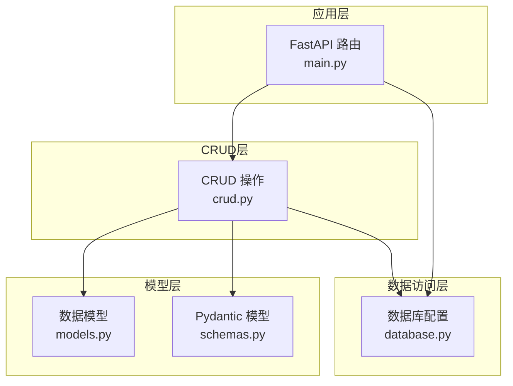
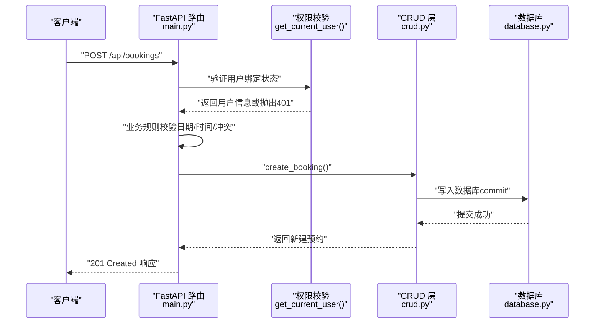
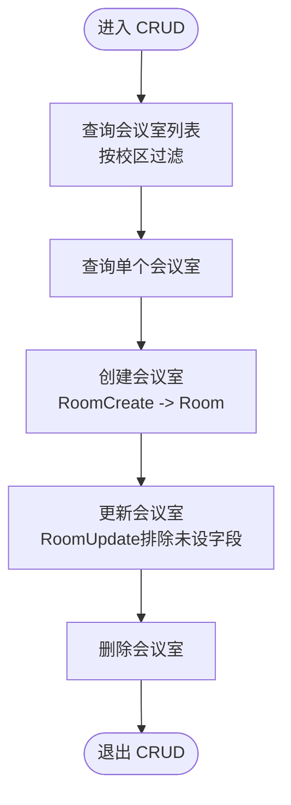
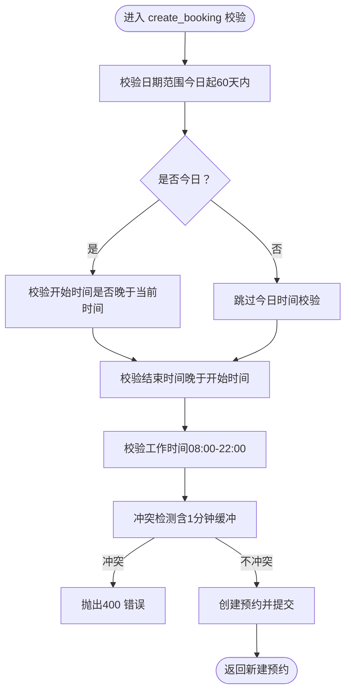
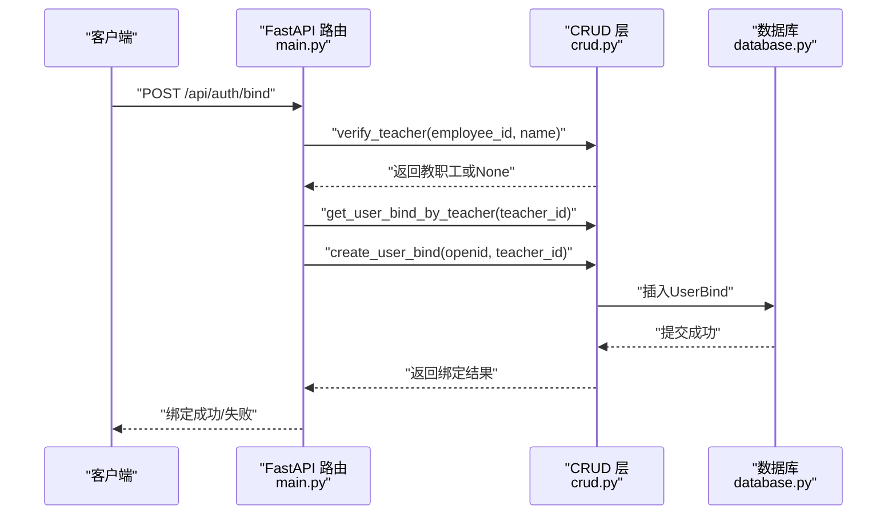
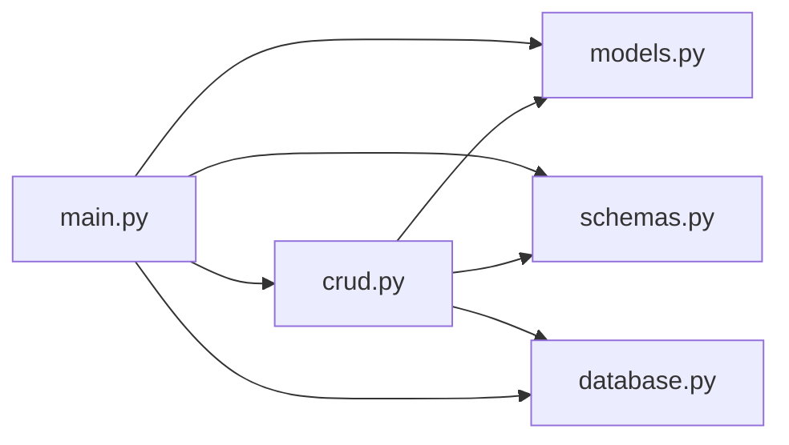

# CRUD操作层

<cite>
**本文引用的文件**
- [crud.py](file://backend/crud.py)
- [models.py](file://backend/models.py)
- [schemas.py](file://backend/schemas.py)
- [database.py](file://backend/database.py)
- [main.py](file://backend/main.py)
</cite>

## 目录
1. [简介](#简介)
2. [项目结构](#项目结构)
3. [核心组件](#核心组件)
4. [架构总览](#架构总览)
5. [详细组件分析](#详细组件分析)
6. [依赖分析](#依赖分析)
7. [性能考量](#性能考量)
8. [故障排查指南](#故障排查指南)
9. [结论](#结论)
10. [附录](#附录)

## 简介
本文件聚焦于后端CRUD操作层，系统性解析会议室管理、预约管理、用户绑定等核心业务的CRUD实现，阐述数据访问层设计模式（查询优化、批量操作、事务处理），说明业务规则（时间冲突检测、日期范围验证、权限控制），并总结错误处理与异常管理策略及最佳实践与性能优化技巧。目标读者既包括开发者，也包括对技术细节感兴趣的非专业用户。

## 项目结构
后端采用分层清晰的Python项目组织：
- 数据模型层：定义数据库表结构与关系
- Pydantic模型层：定义API输入输出的数据验证模型
- 数据访问层：封装CRUD与业务逻辑
- 应用层：FastAPI路由与业务规则校验
- 数据库配置：SQLite引擎、会话工厂、迁移脚本

图表来源
- [main.py:1-673](file://backend/main.py#L1-L673)
- [crud.py:1-343](file://backend/crud.py#L1-L343)
- [models.py:1-75](file://backend/models.py#L1-L75)
- [schemas.py:1-185](file://backend/schemas.py#L1-L185)
- [database.py:1-62](file://backend/database.py#L1-L62)

章节来源
- [main.py:1-673](file://backend/main.py#L1-L673)
- [crud.py:1-343](file://backend/crud.py#L1-L343)
- [models.py:1-75](file://backend/models.py#L1-L75)
- [schemas.py:1-185](file://backend/schemas.py#L1-L185)
- [database.py:1-62](file://backend/database.py#L1-L62)

## 核心组件
- 数据模型层：定义会议室、预约、教职工、用户绑定四张表及其关系
- Pydantic模型层：定义创建、更新、查询、响应等数据结构
- CRUD层：封装增删改查、业务规则校验、状态计算
- 应用层：FastAPI路由、权限控制、业务规则前置校验
- 数据库层：SQLite引擎、会话工厂、迁移脚本

章节来源
- [models.py:1-75](file://backend/models.py#L1-L75)
- [schemas.py:1-185](file://backend/schemas.py#L1-L185)
- [crud.py:1-343](file://backend/crud.py#L1-L343)
- [main.py:1-673](file://backend/main.py#L1-L673)
- [database.py:1-62](file://backend/database.py#L1-L62)

## 架构总览
CRUD层通过SQLAlchemy ORM与SQLite交互，FastAPI路由在进入CRUD之前进行权限与业务规则校验，确保数据一致性与用户体验。

图表来源
- [main.py:282-333](file://backend/main.py#L282-L333)
- [main.py:468-500](file://backend/main.py#L468-L500)
- [crud.py:81-89](file://backend/crud.py#L81-L89)
- [database.py:23-29](file://backend/database.py#L23-L29)

## 详细组件分析

### 数据模型与关系
- Room：会议室，包含名称、校区、容量、位置、设备等字段，与Booking一对多
- Booking：预约，包含日期、起止时间、教师姓名、主题、用途、电话等，与Room多对一
- Teacher：教职工白名单，包含工号、姓名、联系方式、部门、是否有效等，与UserBind一对一
- UserBind：用户绑定关系，包含微信OpenID、关联教职工ID、绑定时间、最后登录时间，与Teacher一对一

```mermaid
erDiagram
ROOMS {
int id PK
string name
string campus
int capacity
string location
text equipment
datetime created_at
}
BOOKINGS {
int id PK
int room_id FK
string date
string start_time
string end_time
string teacher_name
string subject
text purpose
string phone
datetime created_at
}
TEACHERS {
int id PK
string employee_id UK
string name
string phone
string department
boolean is_active
datetime created_at
}
USER_BINDS {
int id PK
string openid UK
int teacher_id FK
datetime bound_at
datetime last_login
}
ROOMS ||--o{ BOOKINGS : "拥有"
TEACHERS ||--o| USER_BINDS : "绑定"
USER_BINDS }o--|| TEACHERS : "关联"
```

图表来源
- [models.py:8-75](file://backend/models.py#L8-L75)

章节来源
- [models.py:1-75](file://backend/models.py#L1-L75)

### CRUD操作与业务规则

#### 会议室管理
- 查询：支持按校区过滤；支持获取单个会议室
- 新增：基于Pydantic模型RoomCreate
- 更新：基于RoomUpdate，使用排除未设置字段的策略
- 删除：级联删除（若存在外键约束，需在数据库层面保证）

图表来源
- [crud.py:12-54](file://backend/crud.py#L12-L54)

章节来源
- [crud.py:12-54](file://backend/crud.py#L12-L54)

#### 预约管理
- 查询：支持按日期、会议室ID、教师姓名、校区过滤；默认按日期与开始时间排序
- 新增：创建时排除客户端时间字段；新增后刷新对象
- 删除：按ID删除
- 时间冲突检测：基于时间段重叠判断，且相邻预约也视为冲突（含1分钟缓冲）
- 会议室状态计算：根据目标日期与当前时间，计算是否可用与最早可预约时间

图表来源
- [main.py:282-333](file://backend/main.py#L282-L333)
- [crud.py:102-122](file://backend/crud.py#L102-L122)

章节来源
- [crud.py:59-99](file://backend/crud.py#L59-L99)
- [crud.py:102-122](file://backend/crud.py#L102-L122)
- [crud.py:125-130](file://backend/crud.py#L125-L130)
- [main.py:251-279](file://backend/main.py#L251-L279)

#### 用户绑定与认证
- 绑定：校验OpenID未绑定、工号与姓名匹配且有效、工号未被他人绑定，然后创建UserBind
- 解绑：按OpenID删除UserBind
- 认证：从请求头读取X-WX-OPENID，若为空则开发环境回退；未绑定则401
- 用户信息：获取绑定信息并更新最后登录时间

图表来源
- [main.py:531-584](file://backend/main.py#L531-L584)
- [crud.py:297-324](file://backend/crud.py#L297-L324)
- [crud.py:308-324](file://backend/crud.py#L308-L324)

章节来源
- [main.py:468-500](file://backend/main.py#L468-L500)
- [main.py:515-528](file://backend/main.py#L515-L528)
- [main.py:531-584](file://backend/main.py#L531-L584)
- [crud.py:308-342](file://backend/crud.py#L308-L342)

### 数据访问层设计模式

#### 查询优化
- 条件查询：按需拼接过滤条件（校区、日期、房间ID、教师姓名）
- 连接查询：预约列表与会议室连接，便于返回校区与位置信息
- 排序：按日期与开始时间排序，便于前端展示

章节来源
- [crud.py:14-17](file://backend/crud.py#L14-L17)
- [crud.py:64-73](file://backend/crud.py#L64-L73)
- [crud.py:127-130](file://backend/crud.py#L127-L130)

#### 批量操作
- 批量查询：通过ORM链式调用一次性获取集合
- 批量删除：删除绑定关系时，先查询再删除，避免重复删除

章节来源
- [crud.py:12-17](file://backend/crud.py#L12-L17)
- [crud.py:335-342](file://backend/crud.py#L335-L342)

#### 事务处理
- 会话管理：每次请求创建独立会话，使用with块确保关闭
- 提交策略：增删改后立即commit，失败时抛出HTTP异常
- 迁移脚本：启动时执行数据库迁移，确保表结构一致

章节来源
- [database.py:23-29](file://backend/database.py#L23-L29)
- [database.py:32-61](file://backend/database.py#L32-L61)
- [crud.py:28-31](file://backend/crud.py#L28-L31)
- [crud.py:52-54](file://backend/crud.py#L52-L54)

### 业务规则实现

#### 时间冲突检测
- 冲突判定：时间段重叠即冲突，且相邻预约也视为冲突（含1分钟缓冲）
- 排除自身：更新场景下可排除特定预约ID

章节来源
- [crud.py:102-122](file://backend/crud.py#L102-L122)

#### 日期范围验证
- 不可预约过去日期
- 最多提前60天
- 今日不可预约已过去的时间段

章节来源
- [main.py:301-318](file://backend/main.py#L301-L318)

#### 权限控制
- 预约创建需认证：从请求头读取OpenID，未绑定则401
- 管理后台接口：仅管理员可见（前端页面）

章节来源
- [main.py:289-290](file://backend/main.py#L289-L290)
- [main.py:468-500](file://backend/main.py#L468-L500)

### 错误处理与异常管理

#### 数据验证失败
- Pydantic模型自动校验，FastAPI自动返回422
- 自定义校验：日期格式、时间顺序、工作时间范围、冲突检测

章节来源
- [main.py:301-331](file://backend/main.py#L301-L331)

#### 业务规则违反
- 400：日期无效、超出60天、今日已过时间、结束时间早于开始时间、工作时间外、时间冲突
- 404：资源不存在（会议室、预约、教职工、绑定关系）
- 401：未认证或绑定失效

章节来源
- [main.py:115-117](file://backend/main.py#L115-L117)
- [main.py:294-295](file://backend/main.py#L294-L295)
- [main.py:302-331](file://backend/main.py#L302-L331)
- [main.py:339-341](file://backend/main.py#L339-L341)
- [main.py:404-406](file://backend/main.py#L404-L406)
- [main.py:413-415](file://backend/main.py#L413-L415)
- [main.py:435-439](file://backend/main.py#L435-L439)
- [main.py:489-493](file://backend/main.py#L489-L493)

#### 数据库操作异常
- 会话生命周期：依赖注入，确保finally关闭
- 迁移异常：捕获并跳过，不影响启动

章节来源
- [database.py:23-29](file://backend/database.py#L23-L29)
- [database.py:51-52](file://backend/database.py#L51-L52)

## 依赖分析

图表来源
- [main.py:11-14](file://backend/main.py#L11-L14)
- [crud.py:1-8](file://backend/crud.py#L1-L8)
- [database.py:1-62](file://backend/database.py#L1-L62)

章节来源
- [main.py:11-14](file://backend/main.py#L11-L14)
- [crud.py:1-8](file://backend/crud.py#L1-L8)
- [database.py:1-62](file://backend/database.py#L1-L62)

## 性能考量
- 查询优化
  - 使用索引字段（主键、唯一键）进行过滤
  - 连接查询时明确过滤条件，减少不必要的JOIN
  - 对高频查询（如按日期、房间ID）保持索引
- 批量操作
  - 批量查询使用ORM链式调用，减少多次往返
  - 批量删除时避免循环逐条删除，尽量使用批量删除
- 事务与锁
  - 单请求单会话，避免跨请求共享会话
  - 在高并发下建议引入乐观锁或悲观锁策略（如需要）
- 缓存
  - 可考虑缓存常用查询结果（如会议室列表、教师白名单）
- 日志与监控
  - 记录慢查询与异常，定位瓶颈

## 故障排查指南
- 绑定失败
  - 检查OpenID是否已绑定、工号与姓名是否匹配、工号是否已被他人绑定
  - 查看调试接口输出
- 预约失败
  - 检查日期是否在允许范围内、是否与现有预约冲突、是否在工作时间外
  - 确认当前时间是否晚于开始时间（今日）
- 数据库问题
  - 检查数据库路径与DATA_PATH环境变量
  - 查看迁移脚本是否成功执行
- 权限问题
  - 确认请求头是否包含X-WX-OPENID，或开发环境是否正确传递参数

章节来源
- [main.py:531-584](file://backend/main.py#L531-L584)
- [main.py:282-333](file://backend/main.py#L282-L333)
- [database.py:32-61](file://backend/database.py#L32-L61)
- [main.py:468-500](file://backend/main.py#L468-L500)

## 结论
本CRUD操作层以清晰的分层设计实现了会议室、预约、用户绑定等核心业务的完整CRUD流程，并在应用层前置校验业务规则，结合SQLAlchemy ORM与SQLite，提供了稳定可靠的数据访问能力。通过合理的查询优化、事务处理与异常管理策略，系统在功能完整性与运行稳定性方面表现良好。建议在生产环境中进一步完善并发控制、缓存策略与监控告警体系。

## 附录
- 最佳实践
  - 明确职责边界：路由只做校验与编排，业务逻辑集中在CRUD层
  - 使用Pydantic模型统一输入输出，减少样板代码
  - 严格区分400/404/401语义，提升API可维护性
  - 对高频查询建立索引，避免全表扫描
  - 在高并发场景下引入锁或队列机制，避免竞态条件
- 性能优化建议
  - 使用分页查询处理大量数据
  - 对热点数据引入缓存层
  - 合理拆分读写分离（如需）
  - 监控慢查询与异常，持续优化