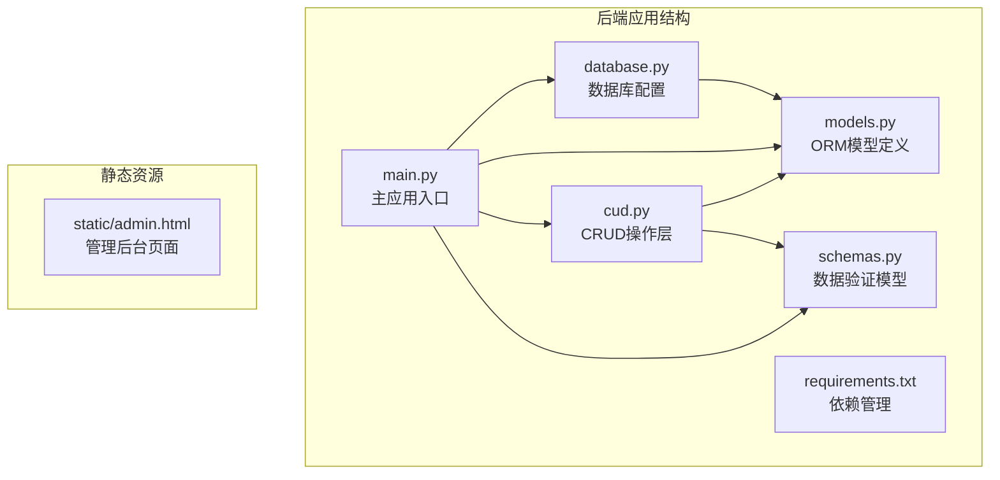
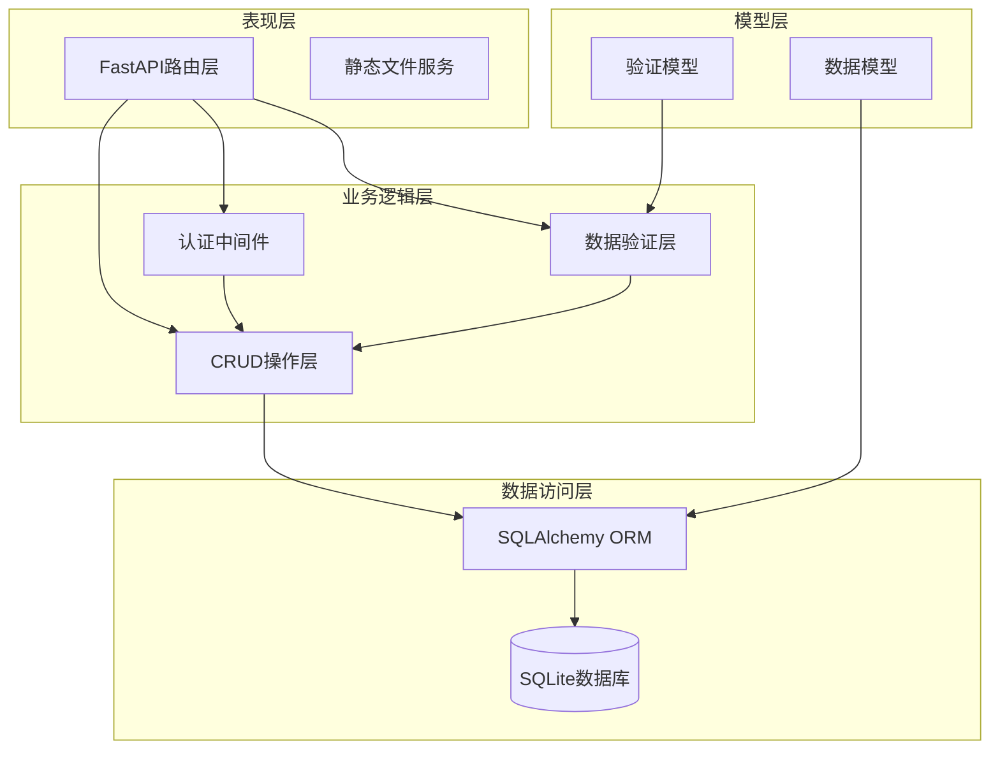
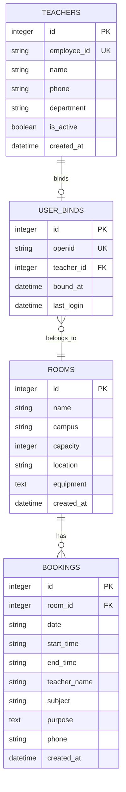
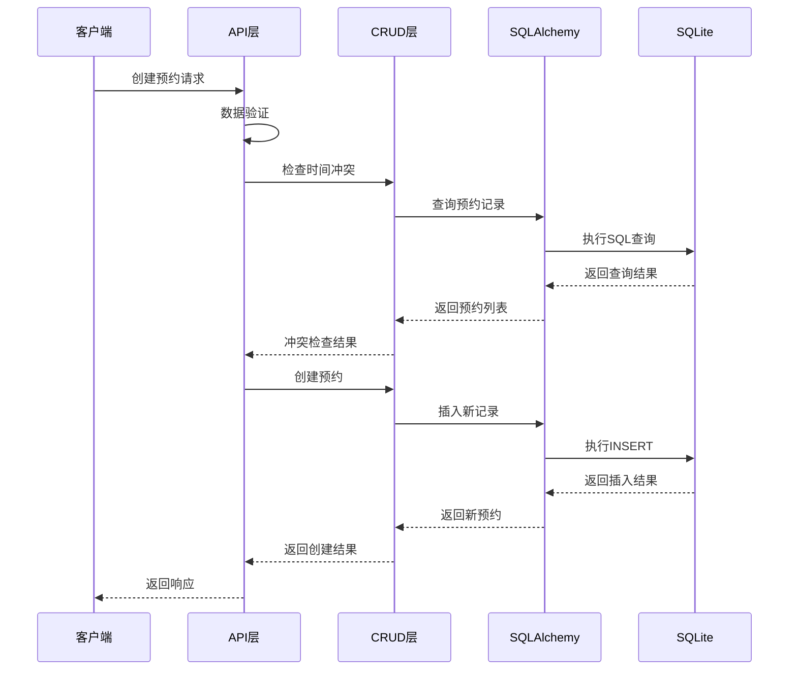
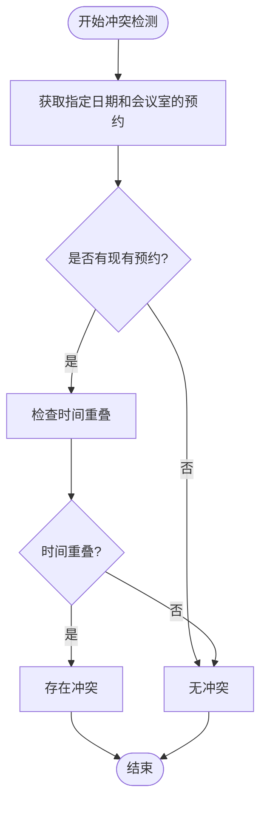
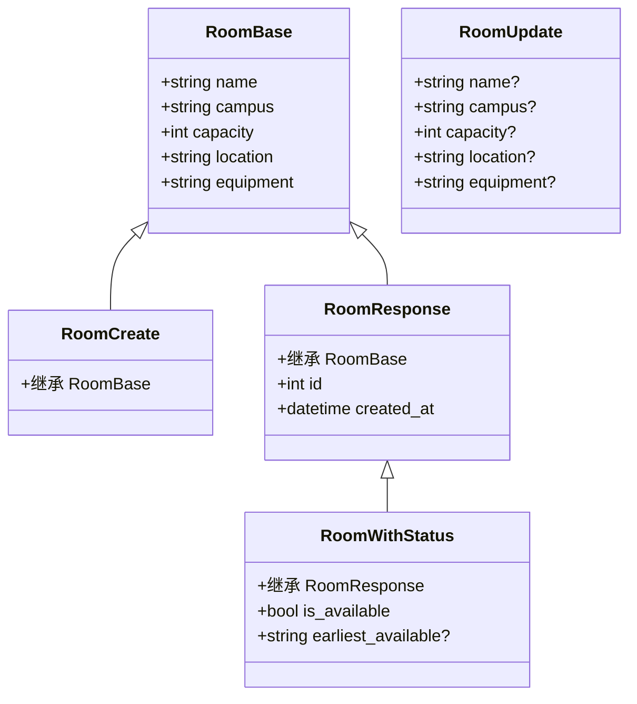
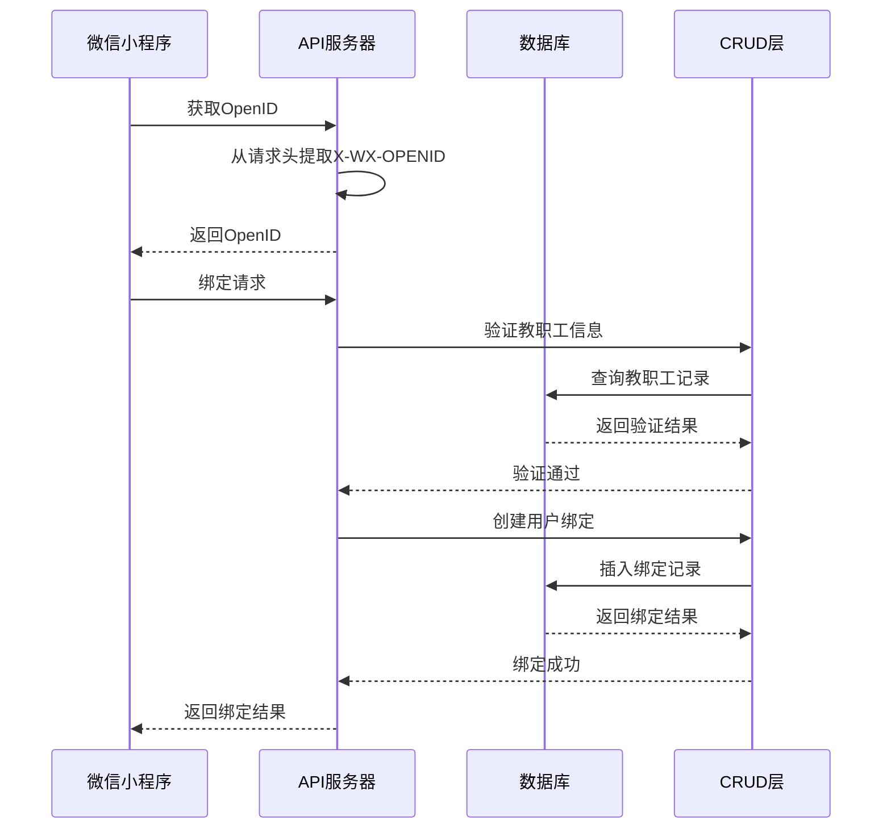
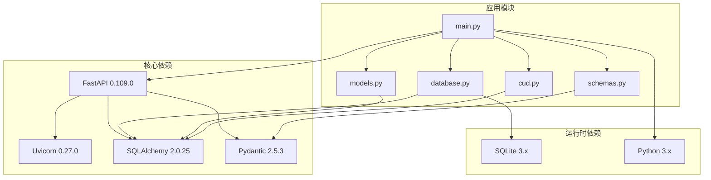

# 后端架构设计

<cite>
**本文引用的文件**
- [main.py](file://backend/main.py)
- [database.py](file://backend/database.py)
- [models.py](file://backend/models.py)
- [crud.py](file://backend/crud.py)
- [schemas.py](file://backend/schemas.py)
- [requirements.txt](file://backend/requirements.txt)
</cite>

## 目录
1. [简介](#简介)
2. [项目结构](#项目结构)
3. [核心组件](#核心组件)
4. [架构概览](#架构概览)
5. [详细组件分析](#详细组件分析)
6. [依赖关系分析](#依赖关系分析)
7. [性能考虑](#性能考虑)
8. [故障排除指南](#故障排除指南)
9. [结论](#结论)

## 简介

这是一个基于FastAPI的会议室预约管理系统，专为西安交通大学软件学院设计。系统采用现代化的Python Web框架技术栈，实现了完整的会议室预约、教职工管理和用户认证功能。项目采用SQLite数据库存储，支持微信小程序集成，提供了RESTful API接口和管理后台界面。

## 项目结构

后端项目采用模块化设计，主要包含以下核心文件：

**图表来源**
- [main.py:1-673](file://backend/main.py#L1-L673)
- [database.py:1-62](file://backend/database.py#L1-L62)
- [models.py:1-75](file://backend/models.py#L1-L75)
- [crud.py:1-343](file://backend/crud.py#L1-L343)
- [schemas.py:1-185](file://backend/schemas.py#L1-L185)

**章节来源**
- [main.py:1-673](file://backend/main.py#L1-L673)
- [database.py:1-62](file://backend/database.py#L1-L62)
- [models.py:1-75](file://backend/models.py#L1-L75)
- [crud.py:1-343](file://backend/crud.py#L1-L343)
- [schemas.py:1-185](file://backend/schemas.py#L1-L185)
- [requirements.txt:1-5](file://backend/requirements.txt#L1-L5)

## 核心组件

### FastAPI应用初始化配置

应用通过FastAPI框架创建，配置了完整的API元数据和中间件系统：

- **应用元数据**：标题、描述、版本信息
- **CORS跨域配置**：允许所有源、方法和头部
- **静态文件服务**：提供管理后台页面
- **数据库初始化**：启动时自动创建表结构

### 数据库连接配置

采用SQLAlchemy ORM框架，支持SQLite数据库：

- **连接池管理**：线程安全的数据库连接
- **环境变量支持**：支持云托管环境的数据目录配置
- **自动迁移**：动态添加数据库列结构

### Pydantic数据验证模型

定义了完整的数据验证和序列化模型：

- **Room模型**：会议室信息管理
- **Booking模型**：预约记录管理  
- **Teacher模型**：教职工白名单
- **UserBind模型**：用户绑定关系
- **认证模型**：微信登录和绑定流程

**章节来源**
- [main.py:17-31](file://backend/main.py#L17-L31)
- [database.py:8-20](file://backend/database.py#L8-L20)
- [schemas.py:9-45](file://backend/schemas.py#L9-L45)

## 架构概览

系统采用分层架构设计，清晰分离关注点：

**图表来源**
- [main.py:11-14](file://backend/main.py#L11-L14)
- [database.py:55-62](file://backend/database.py#L55-L62)
- [models.py:8-75](file://backend/models.py#L8-L75)
- [schemas.py:1-185](file://backend/schemas.py#L1-L185)

## 详细组件分析

### 数据库设计与ORM模型

系统采用SQLAlchemy ORM进行数据库抽象，定义了四个核心数据模型：

#### 实体关系图

**图表来源**
- [models.py:8-75](file://backend/models.py#L8-L75)

#### 数据模型详细说明

**会议室模型 (Room)**
- 主键：自增ID
- 唯一约束：无
- 外键：无
- 索引：主键索引
- 字段说明：名称、校区、容量、位置、设备信息

**预约模型 (Booking)**
- 主键：自增ID
- 外键：room_id → rooms.id
- 索引：主键索引、外键索引
- 字段说明：日期、开始时间、结束时间、教师姓名、主题、用途、电话

**教职工模型 (Teacher)**
- 主键：自增ID
- 唯一约束：employee_id
- 外键：无
- 索引：主键索引、唯一索引
- 字段说明：工号、姓名、电话、部门、激活状态

**用户绑定模型 (UserBind)**
- 主键：自增ID
- 唯一约束：openid
- 外键：teacher_id → teachers.id
- 索引：主键索引、唯一索引、外键索引
- 字段说明：微信OpenID、关联教职工ID、绑定时间、最后登录时间

**章节来源**
- [models.py:8-75](file://backend/models.py#L8-L75)

### CRUD操作层实现

CRUD层提供了完整的数据访问接口，实现了业务逻辑封装：

#### CRUD操作流程

**图表来源**
- [crud.py:81-89](file://backend/crud.py#L81-L89)
- [main.py:282-333](file://backend/main.py#L282-L333)

#### 时间冲突检测算法

系统实现了复杂的时间冲突检测机制：

**图表来源**
- [crud.py:102-122](file://backend/crud.py#L102-L122)

**章节来源**
- [crud.py:12-54](file://backend/crud.py#L12-L54)
- [crud.py:102-122](file://backend/crud.py#L102-L122)
- [crud.py:145-242](file://backend/crud.py#L145-L242)

### Pydantic数据验证模型设计

系统采用Pydantic v2进行数据验证，提供了完整的类型安全和数据校验：

#### 模型层次结构

**图表来源**
- [schemas.py:9-45](file://backend/schemas.py#L9-L45)

#### 验证机制特点

- **类型安全**：编译时类型检查
- **自动序列化**：支持ORM模型转换
- **字段约束**：必填字段、默认值、范围限制
- **嵌套验证**：复杂对象的递归验证

**章节来源**
- [schemas.py:9-45](file://backend/schemas.py#L9-L45)
- [schemas.py:49-88](file://backend/schemas.py#L49-L88)
- [schemas.py:92-128](file://backend/schemas.py#L92-L128)

### 认证与授权系统

系统实现了基于微信OpenID的用户认证机制：

#### 认证流程

**图表来源**
- [main.py:469-500](file://backend/main.py#L469-L500)
- [main.py:531-584](file://backend/main.py#L531-L584)

**章节来源**
- [main.py:469-500](file://backend/main.py#L469-L500)
- [main.py:531-584](file://backend/main.py#L531-L584)

## 依赖关系分析

系统采用现代化的Python技术栈，各组件间依赖关系清晰：

**图表来源**
- [requirements.txt:1-5](file://backend/requirements.txt#L1-L5)
- [main.py:11-14](file://backend/main.py#L11-L14)

**章节来源**
- [requirements.txt:1-5](file://backend/requirements.txt#L1-L5)

## 性能考虑

### 数据库优化策略

- **索引设计**：为常用查询字段建立索引
- **连接池管理**：复用数据库连接减少开销
- **查询优化**：使用JOIN操作减少查询次数
- **缓存策略**：会议室状态计算结果缓存

### API性能优化

- **异步处理**：支持异步请求处理
- **批量操作**：支持批量查询和更新
- **分页机制**：大数据量时使用分页
- **压缩传输**：启用GZIP压缩

### 缓存机制

系统实现了多层缓存策略：

1. **内存缓存**：会议室状态计算结果
2. **数据库缓存**：频繁查询的结果集
3. **HTTP缓存**：静态资源和API响应

## 故障排除指南

### 常见问题诊断

**数据库连接问题**
- 检查DATA_PATH环境变量配置
- 验证数据库文件权限
- 确认SQLite版本兼容性

**认证失败问题**
- 验证微信OpenID提取逻辑
- 检查绑定关系是否正确
- 确认教职工信息有效性

**时间冲突检测问题**
- 检查时间格式验证
- 验证缓冲时间计算逻辑
- 确认工作时间范围设置

### 调试工具

系统提供了完善的调试接口：

- **数据库状态检查**：查看表结构和数据统计
- **认证状态查询**：验证用户绑定状态
- **日志输出**：详细的操作日志记录

**章节来源**
- [main.py:445-460](file://backend/main.py#L445-L460)
- [main.py:515-528](file://backend/main.py#L515-L528)

## 结论

本后端架构设计体现了现代Web应用的最佳实践：

### 技术优势

- **模块化设计**：清晰的分层架构便于维护和扩展
- **类型安全**：Pydantic和SQLAlchemy提供强类型保障
- **性能优化**：合理的数据库设计和缓存策略
- **开发体验**：自动生成API文档和完善的错误处理

### 架构特色

- **微服务友好**：模块化设计便于未来拆分
- **云原生支持**：环境变量配置支持容器化部署
- **安全性考虑**：CORS配置和认证机制
- **可扩展性**：插件化的中间件和模块设计

### 发展建议

1. **监控系统**：集成APM工具进行性能监控
2. **测试覆盖**：增加单元测试和集成测试
3. **文档完善**：补充详细的API文档和部署指南
4. **安全加固**：实施更严格的输入验证和权限控制

该架构为会议室预约管理系统提供了坚实的技术基础，具备良好的可维护性和扩展性，能够满足高校办公场景的需求。