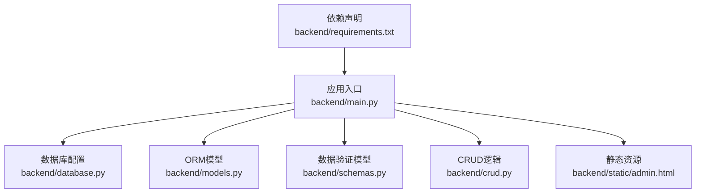
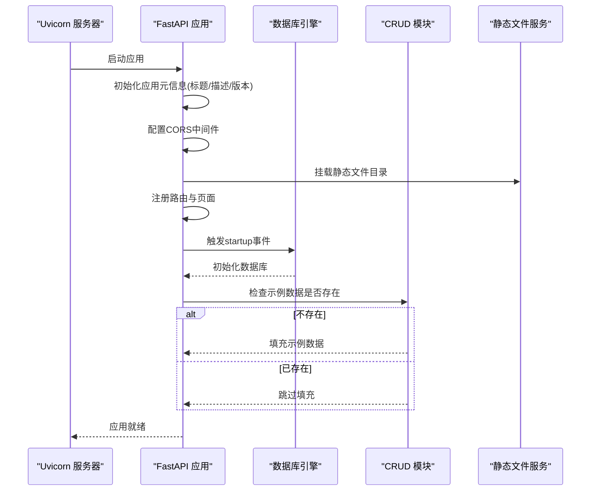
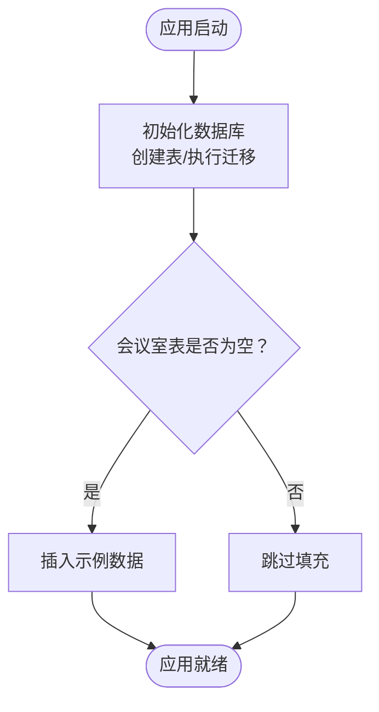
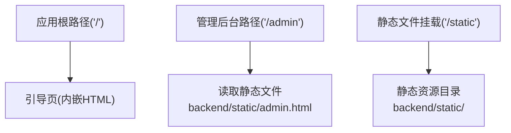
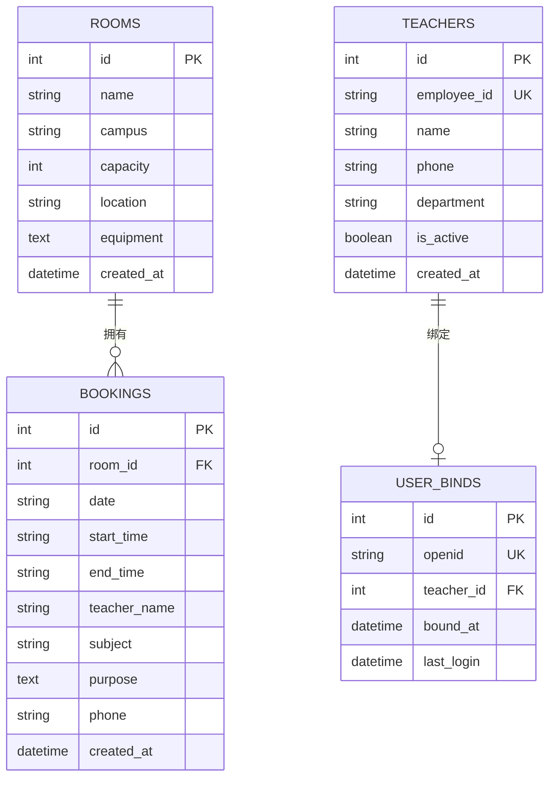
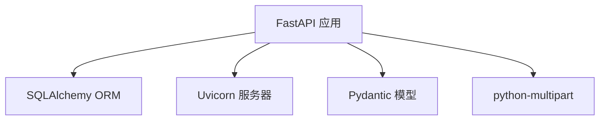

# 应用配置与初始化

<cite>
**本文引用的文件**
- [main.py](file://backend/main.py)
- [database.py](file://backend/database.py)
- [models.py](file://backend/models.py)
- [schemas.py](file://backend/schemas.py)
- [crud.py](file://backend/crud.py)
- [admin.html](file://backend/static/admin.html)
- [requirements.txt](file://backend/requirements.txt)
</cite>

## 目录
1. [简介](#简介)
2. [项目结构](#项目结构)
3. [核心组件](#核心组件)
4. [架构总览](#架构总览)
5. [详细组件分析](#详细组件分析)
6. [依赖关系分析](#依赖关系分析)
7. [性能考量](#性能考量)
8. [故障排查指南](#故障排查指南)
9. [结论](#结论)
10. [附录](#附录)

## 简介
本技术文档聚焦于应用的配置与初始化流程，围绕以下目标展开：
- 解析FastAPI应用实例的创建过程，包括应用实例的初始化参数配置、标题描述版本信息设置
- 详述CORS跨域中间件的配置策略，包括允许的源、方法、头部等安全设置
- 阐述应用启动事件的处理机制，包括数据库初始化和示例数据的自动填充逻辑
- 说明静态文件服务的配置和管理后台HTML页面的挂载方式
- 提供完整的应用配置指南和最佳实践建议

## 项目结构
后端采用模块化组织，核心文件如下：
- 应用入口与路由定义：backend/main.py
- 数据库配置与连接：backend/database.py
- ORM模型定义：backend/models.py
- Pydantic数据模型：backend/schemas.py
- CRUD业务逻辑：backend/crud.py
- 静态资源与管理后台页面：backend/static/admin.html
- 依赖声明：backend/requirements.txt

图表来源
- [main.py:1-673](file://backend/main.py#L1-L673)
- [database.py:1-62](file://backend/database.py#L1-L62)
- [models.py:1-75](file://backend/models.py#L1-L75)
- [schemas.py:1-185](file://backend/schemas.py#L1-L185)
- [crud.py:1-343](file://backend/crud.py#L1-L343)
- [admin.html:1-800](file://backend/static/admin.html#L1-L800)
- [requirements.txt:1-5](file://backend/requirements.txt#L1-L5)

章节来源
- [main.py:1-673](file://backend/main.py#L1-L673)
- [database.py:1-62](file://backend/database.py#L1-L62)
- [models.py:1-75](file://backend/models.py#L1-L75)
- [schemas.py:1-185](file://backend/schemas.py#L1-L185)
- [crud.py:1-343](file://backend/crud.py#L1-L343)
- [admin.html:1-800](file://backend/static/admin.html#L1-L800)
- [requirements.txt:1-5](file://backend/requirements.txt#L1-L5)

## 核心组件
- 应用实例与元信息
  - 在应用创建时设置标题、描述与版本信息，便于API文档展示与识别
- CORS中间件
  - 默认允许所有源、方法与头部，生产环境需收紧策略
- 数据库初始化与迁移
  - 启动事件中执行数据库表创建与列迁移
- 示例数据填充
  - 若数据库为空，自动插入默认会议室示例数据
- 静态文件服务与管理后台页面
  - 挂载静态目录，提供管理后台HTML页面访问

章节来源
- [main.py:17-21](file://backend/main.py#L17-L21)
- [main.py:24-30](file://backend/main.py#L24-L30)
- [main.py:38-50](file://backend/main.py#L38-L50)
- [main.py:53-64](file://backend/main.py#L53-L64)
- [main.py:667-667](file://backend/main.py#L667-L667)

## 架构总览
应用启动流程概览如下：

图表来源
- [main.py:17-21](file://backend/main.py#L17-L21)
- [main.py:24-30](file://backend/main.py#L24-L30)
- [main.py:38-50](file://backend/main.py#L38-L50)
- [main.py:53-64](file://backend/main.py#L53-L64)
- [main.py:667-667](file://backend/main.py#L667-L667)

## 详细组件分析

### 应用实例与元信息配置
- 应用创建时通过构造函数参数设置标题、描述与版本，用于自动生成的API文档与客户端识别
- 元信息设置位于应用初始化阶段，确保在路由注册之前完成

章节来源
- [main.py:17-21](file://backend/main.py#L17-L21)

### CORS跨域中间件配置
- 中间件类型：CORSMiddleware
- 允许策略：
  - 允许源：["*"]（开发环境可用，生产环境建议明确指定可信源）
  - 凭据：允许
  - 方法：["*"]
  - 头部：["*"]
- 安全建议：
  - 生产环境应将允许源限定为具体域名，避免使用通配符
  - 如需携带凭据，务必明确允许的源列表，不可使用通配符
  - 可按需限制允许的方法与头部，减少攻击面

章节来源
- [main.py:24-30](file://backend/main.py#L24-L30)

### 应用启动事件处理机制
- 启动事件触发点：on_event("startup")
- 执行步骤：
  - 初始化数据库：创建表结构并执行迁移
  - 检查示例数据：若会议室表为空，则填充默认示例数据
- 数据库初始化与迁移：
  - 表创建：基于ORM模型元数据
  - 列迁移：对历史表进行增量列添加，保证向后兼容
- 示例数据填充：
  - 自动创建两条默认会议室记录，便于首次部署快速体验

图表来源
- [main.py:38-50](file://backend/main.py#L38-L50)
- [main.py:53-64](file://backend/main.py#L53-L64)
- [database.py:55-62](file://backend/database.py#L55-L62)

章节来源
- [main.py:38-50](file://backend/main.py#L38-L50)
- [main.py:53-64](file://backend/main.py#L53-L64)
- [database.py:55-62](file://backend/database.py#L55-L62)

### 静态文件服务与管理后台页面挂载
- 静态目录：
  - 动态确定静态目录路径，若不存在则自动创建
  - 通过mount挂载到"/static"路径
- 管理后台页面：
  - 根路径"/"返回引导页，包含进入管理后台与API文档的链接
  - "/admin"路径返回管理后台HTML内容；若文件不存在，返回提示信息
  - 管理后台HTML文件位于backend/static/admin.html

图表来源
- [main.py:623-667](file://backend/main.py#L623-L667)
- [main.py:667-667](file://backend/main.py#L667-L667)
- [admin.html:1-800](file://backend/static/admin.html#L1-L800)

章节来源
- [main.py:32-36](file://backend/main.py#L32-L36)
- [main.py:623-667](file://backend/main.py#L623-L667)
- [main.py:667-667](file://backend/main.py#L667-L667)
- [admin.html:1-800](file://backend/static/admin.html#L1-L800)

### 数据模型与依赖关系
- ORM模型：
  - Room：会议室
  - Booking：预约
  - Teacher：教职工白名单
  - UserBind：用户绑定关系
- 关系：
  - Room 与 Booking 一对多
  - Teacher 与 UserBind 一对一
- 数据库初始化：
  - 通过Base.metadata.create_all创建表
  - 迁移脚本对历史表进行列补充，避免破坏现有数据

图表来源
- [models.py:8-75](file://backend/models.py#L8-L75)
- [database.py:55-62](file://backend/database.py#L55-L62)

章节来源
- [models.py:8-75](file://backend/models.py#L8-L75)
- [database.py:55-62](file://backend/database.py#L55-L62)

### 数据验证与业务逻辑
- Pydantic模型：
  - Room/Booking/Teacher/UserBind等响应与请求模型
  - 字段校验与默认值定义
- CRUD逻辑：
  - 会议室CRUD、预约CRUD、教职工CRUD、用户绑定CRUD
  - 时间冲突检测、状态计算（含缓冲时间）、工作时间约束等

章节来源
- [schemas.py:1-185](file://backend/schemas.py#L1-L185)
- [crud.py:1-343](file://backend/crud.py#L1-L343)

## 依赖关系分析
- 应用依赖：
  - FastAPI：Web框架与路由
  - Uvicorn：ASGI服务器
  - SQLAlchemy：ORM与数据库连接
  - Pydantic：数据验证
  - python-multipart：表单上传支持
- 版本锁定：
  - 通过requirements.txt固定版本，确保部署一致性

图表来源
- [requirements.txt:1-5](file://backend/requirements.txt#L1-L5)
- [main.py:1-15](file://backend/main.py#L1-L15)

章节来源
- [requirements.txt:1-5](file://backend/requirements.txt#L1-L5)
- [main.py:1-15](file://backend/main.py#L1-L15)

## 性能考量
- 数据库连接：
  - 使用SQLite，适合轻量级场景；如需高并发，建议迁移到PostgreSQL/MySQL
  - 会话管理采用标准SessionLocal，注意在高并发下合理复用与关闭
- 启动事件：
  - 表创建与迁移仅在启动时执行，避免频繁I/O
  - 示例数据仅在空表时插入，减少不必要的写入
- 静态文件：
  - 通过StaticFiles挂载，建议在生产环境配合CDN与缓存策略

## 故障排查指南
- CORS相关问题
  - 现象：浏览器跨域请求被拒绝
  - 排查：确认生产环境已收紧允许源，且与前端域名一致
- 数据库初始化失败
  - 现象：启动时报错或表未创建
  - 排查：检查DATA_PATH环境变量与目录权限；确认数据库文件路径正确
- 示例数据未填充
  - 现象：首次访问无默认会议室
  - 排查：确认startup事件已触发；检查CRUD层是否返回空表
- 管理后台页面空白
  - 现象：/admin返回提示信息
  - 排查：确认backend/static/admin.html存在且可读；检查静态目录挂载路径

章节来源
- [main.py:24-30](file://backend/main.py#L24-L30)
- [database.py:9-13](file://backend/database.py#L9-L13)
- [main.py:38-50](file://backend/main.py#L38-L50)
- [main.py:656-667](file://backend/main.py#L656-L667)

## 结论
本应用通过清晰的模块划分与简洁的初始化流程，实现了从应用创建、CORS配置、数据库初始化到静态资源与管理后台页面的完整链路。建议在生产环境中进一步收紧CORS策略、完善数据库迁移与备份机制，并结合CDN优化静态资源加载。

## 附录
- 最佳实践清单
  - CORS：生产环境明确允许源，避免使用通配符；如需携带凭据，必须指定具体源
  - 数据库：定期备份；迁移脚本需幂等；高并发场景考虑切换至关系型数据库
  - 静态资源：启用缓存与压缩；生产环境建议CDN分发
  - 日志与监控：增加启动与异常日志；接入指标监控