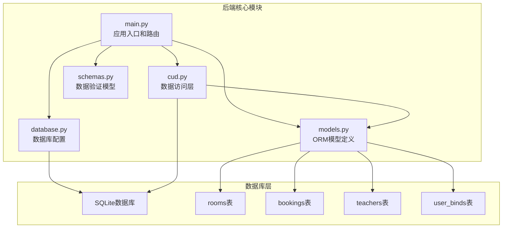
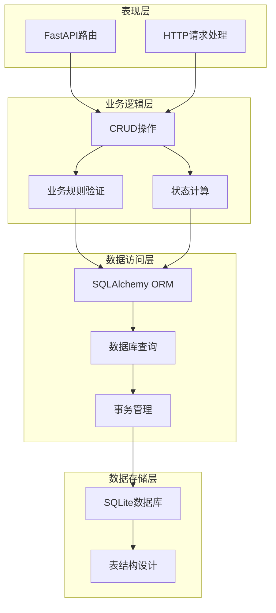
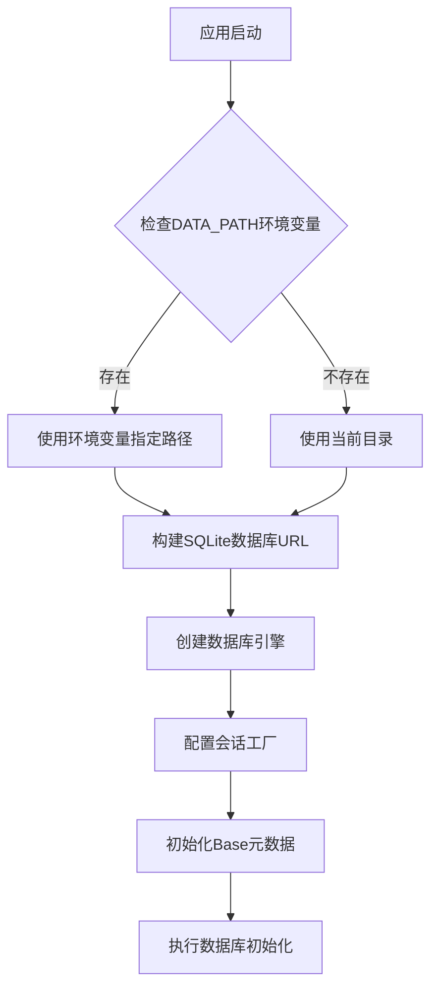
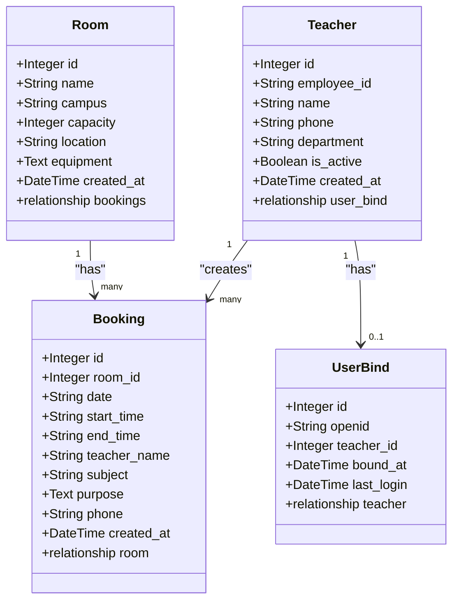
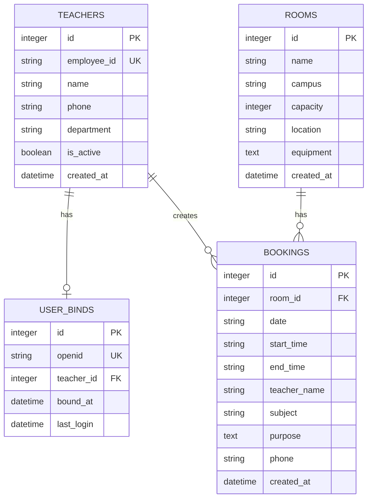
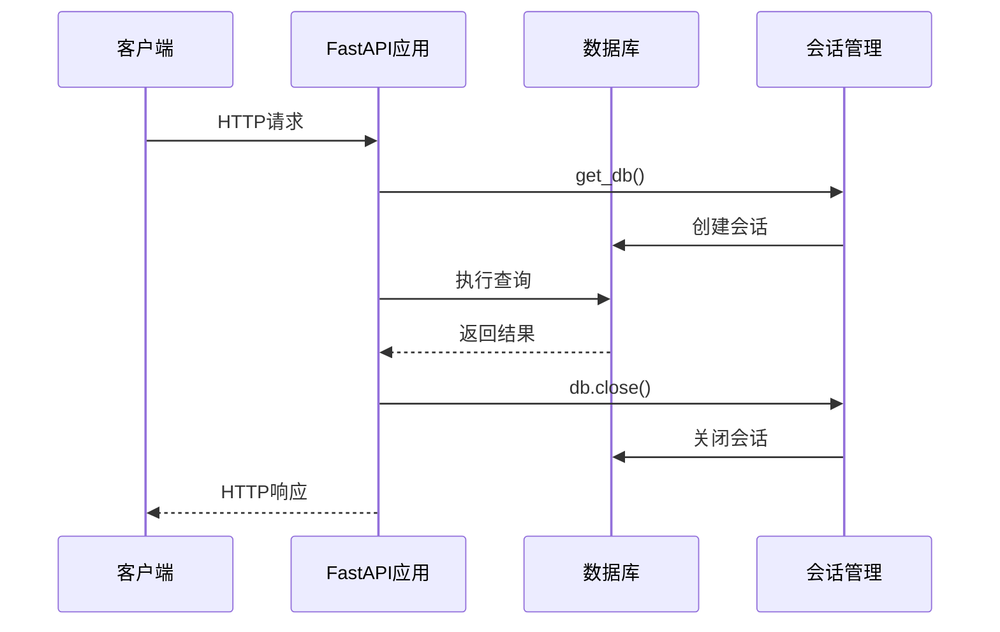
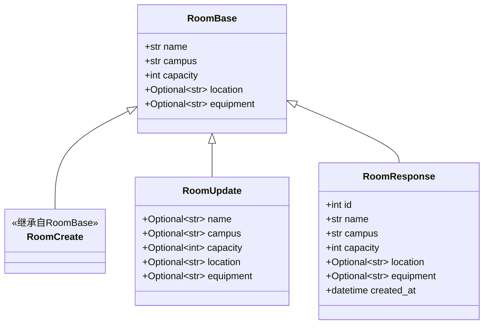
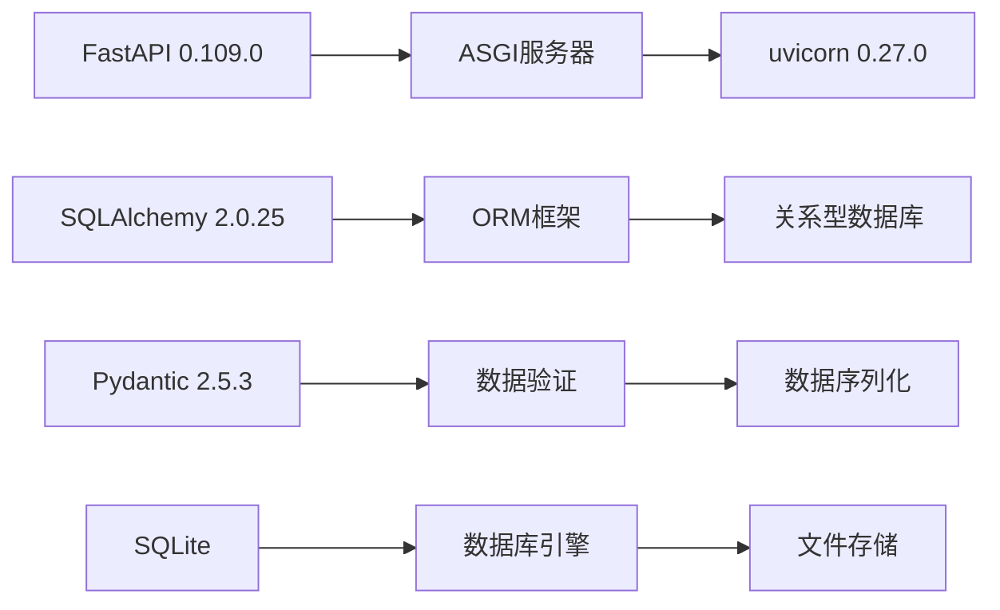
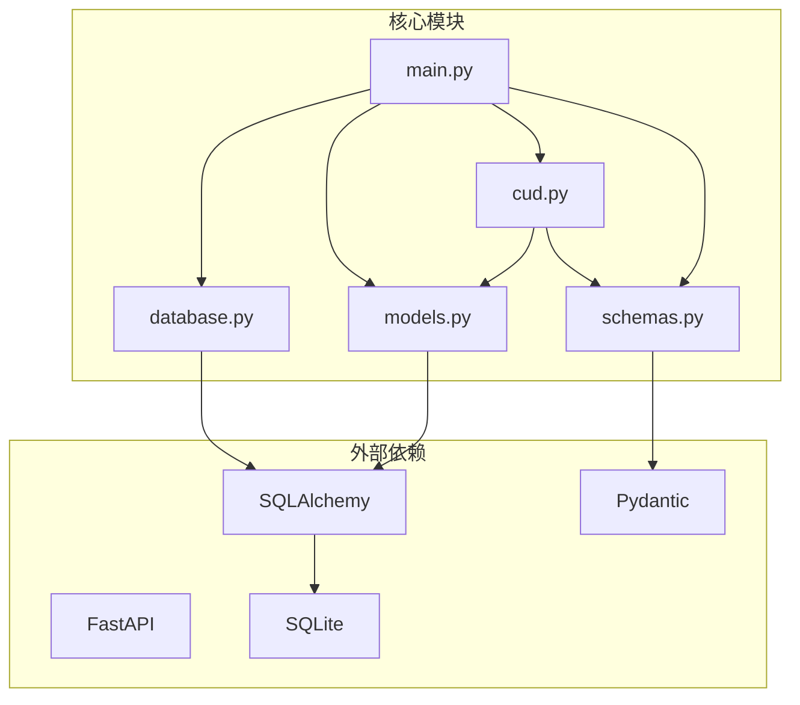
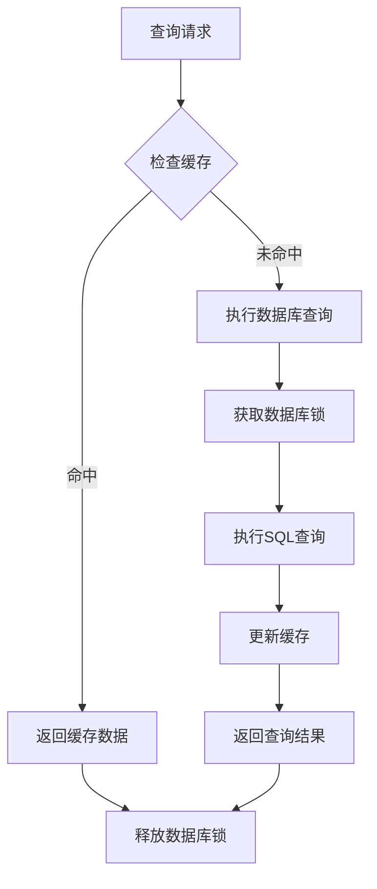

# 数据库设计

<cite>
**本文档引用的文件**
- [database.py](file://backend/database.py)
- [models.py](file://backend/models.py)
- [crud.py](file://backend/crud.py)
- [schemas.py](file://backend/schemas.py)
- [main.py](file://backend/main.py)
- [requirements.txt](file://backend/requirements.txt)
</cite>

## 目录
1. [简介](#简介)
2. [项目结构](#项目结构)
3. [核心组件](#核心组件)
4. [架构概览](#架构概览)
5. [详细组件分析](#详细组件分析)
6. [依赖关系分析](#依赖关系分析)
7. [性能考虑](#性能考虑)
8. [故障排除指南](#故障排除指南)
9. [结论](#结论)

## 简介

本项目是一个基于FastAPI和SQLAlchemy的会议室预约管理系统。系统采用SQLite作为数据库引擎，通过SQLAlchemy ORM进行数据持久化，实现了完整的会议室预约业务流程，包括预约管理、用户认证、教职工管理等功能。

系统的核心设计理念是通过清晰的数据模型设计和严格的约束机制，确保数据的一致性和完整性，同时提供高效的查询性能和良好的用户体验。

## 项目结构

后端项目采用模块化设计，主要包含以下核心文件：

**图表来源**
- [main.py:1-673](file://backend/main.py#L1-L673)
- [database.py:1-62](file://backend/database.py#L1-L62)
- [models.py:1-75](file://backend/models.py#L1-L75)

**章节来源**
- [main.py:1-673](file://backend/main.py#L1-L673)
- [database.py:1-62](file://backend/database.py#L1-L62)
- [models.py:1-75](file://backend/models.py#L1-L75)

## 核心组件

### 数据库连接管理

系统使用SQLAlchemy创建数据库引擎和会话管理器，支持本地开发和云托管两种部署模式：

- **SQLite引擎配置**：使用内存数据库文件存储，支持动态路径配置
- **会话管理**：提供依赖注入的数据库会话获取机制
- **连接池**：基于SQLAlchemy的默认连接池配置
- **迁移机制**：支持运行时数据库结构升级

### ORM模型设计

系统定义了四个核心数据模型，采用声明式映射方式实现：

- **Room模型**：会议室基本信息和预约关联
- **Booking模型**：预约记录和会议室关联  
- **Teacher模型**：教职工信息和绑定关系
- **UserBind模型**：用户微信绑定关系

**章节来源**
- [database.py:15-30](file://backend/database.py#L15-L30)
- [models.py:8-75](file://backend/models.py#L8-L75)

## 架构概览

系统采用分层架构设计，各层职责明确：

**图表来源**
- [main.py:17-31](file://backend/main.py#L17-L31)
- [crud.py:10-343](file://backend/crud.py#L10-L343)
- [database.py:15-29](file://backend/database.py#L15-L29)

## 详细组件分析

### 数据库连接配置

系统采用灵活的数据库连接配置策略：

**图表来源**
- [database.py:9-20](file://backend/database.py#L9-L20)
- [database.py:15-20](file://backend/database.py#L15-L20)

关键特性：
- **环境变量支持**：通过`DATA_PATH`环境变量控制数据库文件存储位置
- **线程安全**：SQLite连接配置支持多线程访问
- **自动初始化**：应用启动时自动创建数据库表结构

**章节来源**
- [database.py:9-20](file://backend/database.py#L9-L20)
- [database.py:23-29](file://backend/database.py#L23-L29)

### ORM模型设计原则

#### 实体类设计规范

每个模型类都遵循统一的设计原则：

**图表来源**
- [models.py:8-75](file://backend/models.py#L8-L75)

#### 字段类型选择策略

系统采用合理的字段类型设计：

| 字段类型 | 使用场景 | 设计考虑 |
|---------|---------|---------|
| Integer | 主键、整数字段 | SQLite原生支持，性能最佳 |
| String | 文本字段，有限长度 | 指定最大长度，节省空间 |
| Text | 长文本字段 | 存储设备说明、用途描述 |
| DateTime | 时间戳字段 | 记录创建和修改时间 |
| Boolean | 布尔状态字段 | 简化激活状态管理 |

**章节来源**
- [models.py:2-5](file://backend/models.py#L2-L5)

### 关系映射策略

#### 一对一关系

系统实现了两种一对一关系：

1. **Teacher ↔ UserBind**：教职工与微信绑定关系
2. **Booking ↔ Room**：预约与会议室关系

**图表来源**
- [models.py:25-41](file://backend/models.py#L25-L41)
- [models.py:61-74](file://backend/models.py#L61-L74)

#### 一对多关系

- **Room → Booking**：一个会议室可以有多个预约
- **Teacher → Booking**：一个教职工可以创建多个预约

**章节来源**
- [models.py:21-22](file://backend/models.py#L21-L22)
- [models.py:40-41](file://backend/models.py#L40-L41)

### 字段约束和索引设计

#### 主键约束

所有表都定义了主键约束：
- `rooms.id`：会议室主键
- `bookings.id`：预约记录主键  
- `teachers.id`：教职工主键
- `user_binds.id`：用户绑定主键

#### 外键约束

系统建立了完整的外键约束链：
- `bookings.room_id` → `rooms.id`
- `user_binds.teacher_id` → `teachers.id`

#### 唯一性约束

- `teachers.employee_id`：教职工工号唯一
- `user_binds.openid`：微信OpenID唯一

#### 非空约束

- `rooms.name`：会议室名称必填
- `rooms.campus`：校区信息必填
- `bookings.room_id`：预约必须关联会议室
- `bookings.date`：预约日期必填
- `bookings.start_time`：开始时间必填
- `bookings.end_time`：结束时间必填
- `bookings.teacher_name`：预约老师必填
- `user_binds.openid`：OpenID必填
- `user_binds.teacher_id`：关联教职工必填

**章节来源**
- [models.py:12-18](file://backend/models.py#L12-L18)
- [models.py:29-38](file://backend/models.py#L29-L38)
- [models.py:48-54](file://backend/models.py#L48-L54)
- [models.py:65-71](file://backend/models.py#L65-L71)

### 数据库连接管理和会话处理

#### 会话生命周期管理

**图表来源**
- [database.py:23-29](file://backend/database.py#L23-L29)
- [main.py:11-14](file://backend/main.py#L11-L14)

#### 连接池配置

系统采用SQLAlchemy的默认连接池配置：
- 自动提交：`autocommit=False`
- 自动刷新：`autoflush=False`
- 绑定引擎：直接绑定到创建的引擎实例

#### 事务管理策略

- **手动事务**：所有数据库操作都需要显式调用`commit()`
- **异常处理**：使用try-finally模式确保会话正确关闭
- **回滚机制**：通过异常传播实现自动回滚

**章节来源**
- [database.py:15-29](file://backend/database.py#L15-L29)
- [crud.py:25-54](file://backend/crud.py#L25-L54)

### 数据验证和序列化

#### Pydantic模型设计

系统使用Pydantic进行数据验证和序列化：

**图表来源**
- [schemas.py:9-38](file://backend/schemas.py#L9-L38)

**章节来源**
- [schemas.py:1-185](file://backend/schemas.py#L1-L185)

## 依赖关系分析

### 技术栈依赖

系统采用现代化的Python Web技术栈：

**图表来源**
- [requirements.txt:1-5](file://backend/requirements.txt#L1-L5)

### 模块间依赖关系

**图表来源**
- [main.py:11-14](file://backend/main.py#L11-L14)
- [database.py:2-4](file://backend/database.py#L2-L4)
- [models.py:2-5](file://backend/models.py#L2-L5)
- [schemas.py:2-4](file://backend/schemas.py#L2-L4)

**章节来源**
- [requirements.txt:1-5](file://backend/requirements.txt#L1-L5)

## 性能考虑

### 查询优化策略

#### 索引设计

系统通过以下方式优化查询性能：

1. **主键索引**：所有主键字段自动建立索引
2. **外键索引**：外键字段建立索引提高关联查询效率
3. **常用查询字段**：对经常用于过滤的字段建立索引

#### 查询优化技巧

- **批量查询**：使用`query.all()`减少数据库往返次数
- **条件过滤**：在查询阶段就进行数据过滤
- **关联查询**：使用`join()`进行关联表查询

### 缓存策略

系统实现了智能的缓存机制：

### 并发控制

系统采用以下并发控制策略：

- **连接池管理**：合理配置连接池大小
- **事务隔离**：使用适当的事务隔离级别
- **死锁预防**：避免循环依赖和长时间持有锁

## 故障排除指南

### 常见问题诊断

#### 数据库连接问题

**症状**：应用启动时报数据库连接错误

**解决方案**：
1. 检查`DATA_PATH`环境变量设置
2. 验证数据库文件权限
3. 确认SQLite驱动安装

#### 数据迁移问题

**症状**：数据库表结构不完整

**解决方案**：
1. 检查`migrate_db()`函数执行日志
2. 验证数据库文件写权限
3. 确认SQLite版本兼容性

#### 会话管理问题

**症状**：数据库连接泄漏或超时

**解决方案**：
1. 检查所有数据库操作是否正确关闭会话
2. 确保异常处理中包含会话清理代码
3. 监控连接池使用情况

**章节来源**
- [database.py:32-62](file://backend/database.py#L32-L62)
- [database.py:23-29](file://backend/database.py#L23-L29)

### 调试工具

系统提供了完善的调试接口：

- **数据库状态检查**：`/api/debug/db-status`
- **OpenID获取**：`/api/auth/getOpenid`
- **认证状态查询**：`/api/auth/status`

**章节来源**
- [main.py:445-461](file://backend/main.py#L445-L461)
- [main.py:503-513](file://backend/main.py#L503-L513)

## 结论

本数据库设计方案体现了现代Web应用的最佳实践：

### 设计优势

1. **清晰的架构分离**：各层职责明确，便于维护和扩展
2. **强类型约束**：通过Pydantic和SQLAlchemy实现双重数据验证
3. **灵活的部署支持**：支持本地开发和云托管环境
4. **完善的错误处理**：提供全面的异常处理和恢复机制

### 技术特色

- **SQLite轻量级**：适合中小型应用，部署简单
- **SQLAlchemy ORM**：提供强大的对象关系映射功能
- **FastAPI高性能**：利用异步特性和类型提示提升性能
- **Pydantic验证**：自动数据验证和序列化

### 改进建议

1. **索引优化**：根据实际查询模式添加复合索引
2. **连接池调优**：根据并发需求调整连接池配置
3. **监控增强**：添加数据库性能监控指标
4. **备份策略**：实现定期数据库备份机制

该设计方案为会议室预约系统提供了稳定可靠的数据存储基础，能够满足当前业务需求并具备良好的扩展性。