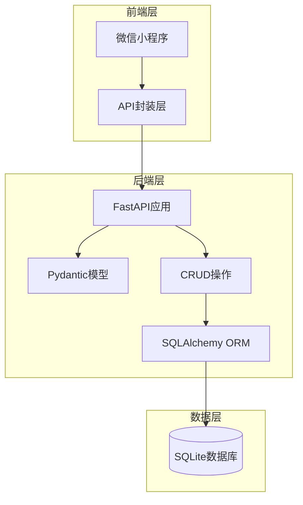
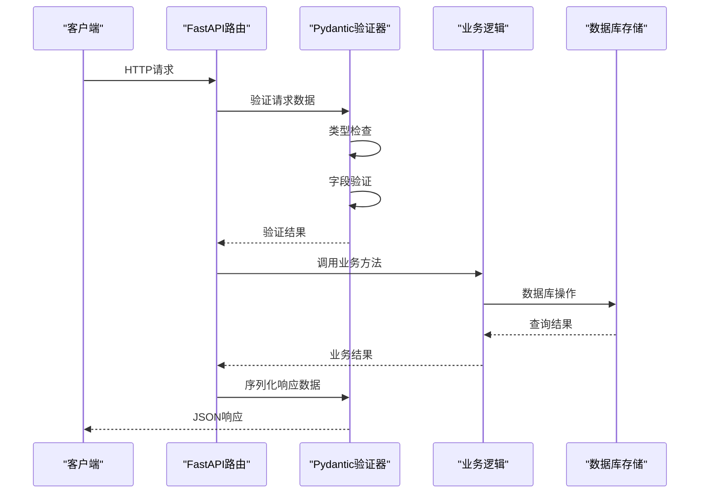
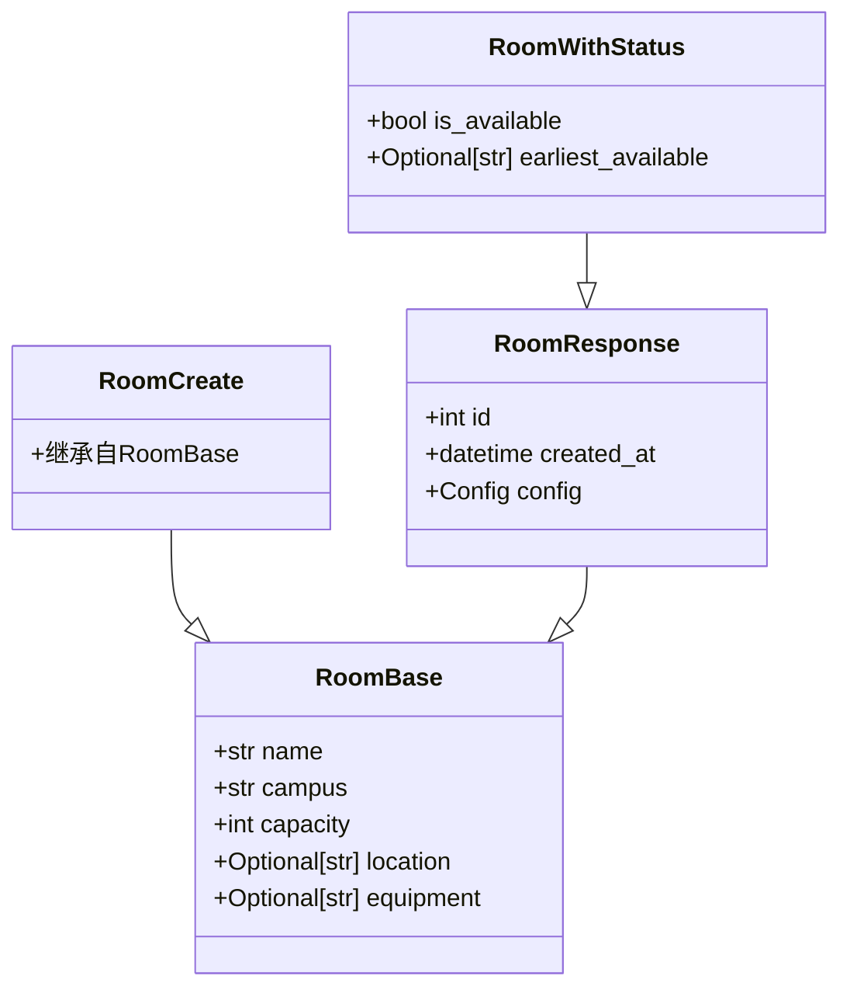
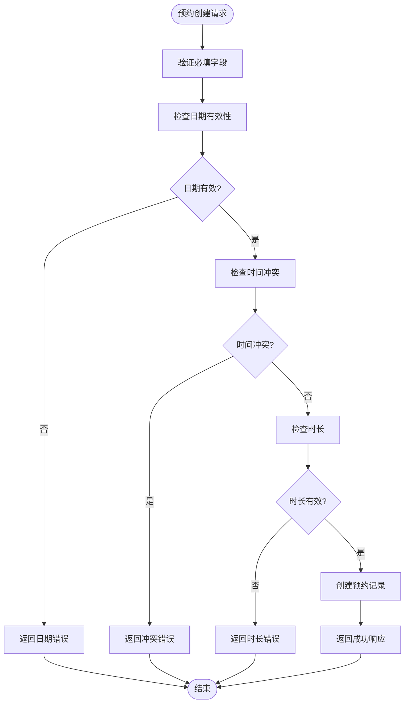
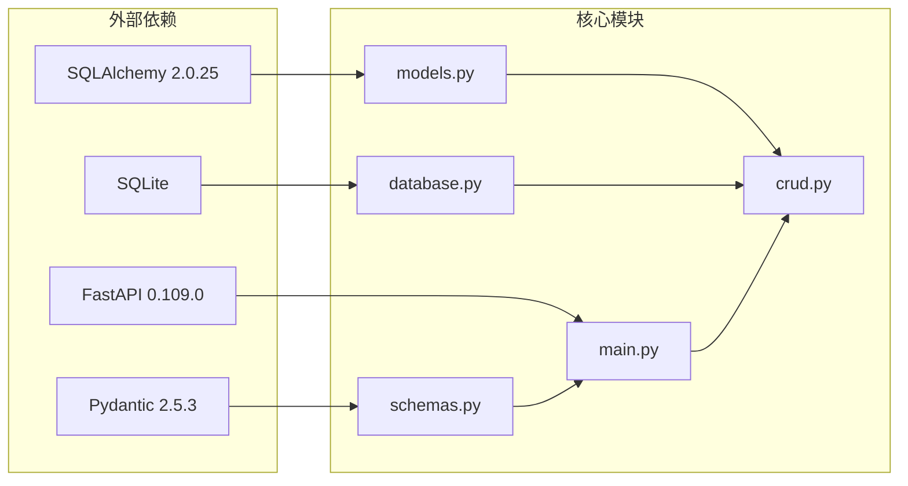

# 数据验证模型

<cite>
**本文档引用的文件**
- [schemas.py](file://backend/schemas.py)
- [models.py](file://backend/models.py)
- [main.py](file://backend/main.py)
- [crud.py](file://backend/crud.py)
- [database.py](file://backend/database.py)
- [requirements.txt](file://backend/requirements.txt)
- [api.js](file://miniprogram/utils/api.js)
</cite>

## 目录
1. [简介](#简介)
2. [项目结构](#项目结构)
3. [核心组件](#核心组件)
4. [架构概览](#架构概览)
5. [详细组件分析](#详细组件分析)
6. [依赖关系分析](#依赖关系分析)
7. [性能考虑](#性能考虑)
8. [故障排除指南](#故障排除指南)
9. [结论](#结论)

## 简介

本项目采用现代Python Web开发技术栈，使用FastAPI作为后端框架，Pydantic作为数据验证和序列化工具，SQLite作为数据存储。系统实现了完整的会议室预约管理功能，包括多校区支持、实时状态查询、时间线可视化等功能。

数据验证模型是整个系统的核心，它确保了API请求和响应的数据完整性、类型安全性和业务逻辑正确性。通过Pydantic模型，系统能够自动进行数据验证、类型转换和序列化，大大减少了手动验证代码的编写。

## 项目结构

项目采用前后端分离架构，后端使用FastAPI + SQLAlchemy + Pydantic，前端使用微信小程序原生开发。

**图表来源**
- [main.py:1-673](file://backend/main.py#L1-L673)
- [schemas.py:1-185](file://backend/schemas.py#L1-L185)
- [database.py:1-62](file://backend/database.py#L1-L62)

**章节来源**
- [main.py:1-673](file://backend/main.py#L1-L673)
- [schemas.py:1-185](file://backend/schemas.py#L1-L185)
- [database.py:1-62](file://backend/database.py#L1-L62)

## 核心组件

### Pydantic数据验证模型

系统使用Pydantic 2.5.3版本，提供了强大的数据验证和序列化功能。核心验证模型包括：

- **基础模型**: 定义字段类型、默认值、可选性
- **创建模型**: 用于API请求的数据结构
- **响应模型**: 用于API响应的数据结构
- **嵌套模型**: 支持复杂数据结构的组合

### 数据库模型

使用SQLAlchemy ORM定义数据库表结构，与Pydantic模型形成完整的数据层：

- **Room模型**: 会议室信息
- **Booking模型**: 预约记录
- **Teacher模型**: 教职工信息
- **UserBind模型**: 用户绑定关系

**章节来源**
- [schemas.py:1-185](file://backend/schemas.py#L1-L185)
- [models.py:1-75](file://backend/models.py#L1-L75)
- [requirements.txt:1-5](file://backend/requirements.txt#L1-L5)

## 架构概览

系统采用分层架构，数据验证模型位于应用层的核心位置，负责协调前端请求、业务逻辑和数据存储。

**图表来源**
- [main.py:282-333](file://backend/main.py#L282-L333)
- [schemas.py:49-73](file://backend/schemas.py#L49-L73)
- [crud.py:81-89](file://backend/crud.py#L81-L89)

## 详细组件分析

### 会议室数据验证模型

会议室相关的数据验证模型体现了复杂的嵌套结构和字段约束：

#### RoomBase基础模型
- **必填字段**: name、campus、capacity
- **可选字段**: location、equipment
- **默认值**: capacity默认为20
- **类型约束**: name为字符串，campus限定枚举值

#### RoomCreate创建模型
- 继承自RoomBase，用于创建新会议室
- 所有字段均为必填，确保数据完整性

#### RoomResponse响应模型
- 扩展RoomBase，添加id和created_at字段
- 配置from_attributes=True，支持ORM对象直接序列化

**图表来源**
- [schemas.py:9-45](file://backend/schemas.py#L9-L45)

**章节来源**
- [schemas.py:9-45](file://backend/schemas.py#L9-L45)

### 预约数据验证模型

预约系统的数据验证模型最为复杂，包含了时间处理、业务规则验证等功能。

#### BookingBase基础模型
- **时间字段**: date、start_time、end_time
- **业务字段**: room_id、teacher_name、subject、purpose
- **约束规则**: 时间格式验证、业务逻辑检查

#### BookingCreate扩展模型
- 添加client_date和client_time字段
- 用于解决客户端时间准确性问题

#### BookingResponse响应模型
- 包含房间信息的复合响应
- 支持嵌套模型的序列化

**图表来源**
- [main.py:282-333](file://backend/main.py#L282-L333)
- [schemas.py:49-80](file://backend/schemas.py#L49-L80)

**章节来源**
- [main.py:282-333](file://backend/main.py#L282-L333)
- [schemas.py:49-80](file://backend/schemas.py#L49-L80)

### 教职工数据验证模型

教职工管理模块的数据验证模型体现了用户绑定和状态管理：

#### TeacherBase基础模型
- **身份字段**: employee_id、name
- **可选字段**: phone、department
- **状态字段**: is_active，默认为True

#### TeacherWithBind扩展模型
- 添加绑定状态和时间信息
- 支持用户绑定状态的查询

**章节来源**
- [schemas.py:92-128](file://backend/schemas.py#L92-L128)

### 认证数据验证模型

认证系统的数据验证模型处理微信小程序的用户认证流程：

#### WxLoginRequest模型
- **必填字段**: code，用于微信登录验证

#### BindRequest模型
- **绑定字段**: openid、employee_id、name
- **业务验证**: 工号和姓名的匹配验证

#### AuthStatus模型
- **状态查询**: is_bound、teacher_name、employee_id
- **可选字段**: 支持未绑定用户的查询

**章节来源**
- [schemas.py:132-162](file://backend/schemas.py#L132-L162)

### 数据序列化和反序列化机制

系统实现了完整的数据序列化和反序列化机制：

#### Pydantic配置
- **from_attributes**: 支持ORM对象直接序列化
- **model_dump**: 数据模型转换为字典
- **model_validate**: 数据验证和转换

#### 类型转换
- **字符串到整数**: capacity字段的自动转换
- **字符串到日期**: date字段的格式验证
- **字符串到时间**: start_time、end_time的格式验证

**章节来源**
- [schemas.py:37-38](file://backend/schemas.py#L37-L38)
- [schemas.py:71-72](file://backend/schemas.py#L71-L72)
- [schemas.py:120-121](file://backend/schemas.py#L120-L121)

## 依赖关系分析

系统各组件之间的依赖关系清晰明确：

**图表来源**
- [requirements.txt:1-5](file://backend/requirements.txt#L1-L5)
- [main.py:11-14](file://backend/main.py#L11-L14)
- [schemas.py:1-4](file://backend/schemas.py#L1-L4)

**章节来源**
- [requirements.txt:1-5](file://backend/requirements.txt#L1-L5)
- [main.py:11-14](file://backend/main.py#L11-L14)

## 性能考虑

### 数据验证性能优化

1. **延迟验证**: 使用Pydantic的延迟验证机制，只在需要时进行验证
2. **批量处理**: 对于大量数据的处理，使用批量验证减少重复验证开销
3. **缓存策略**: 对于频繁访问的数据，使用适当的缓存策略

### 序列化性能优化

1. **from_attributes配置**: 启用ORM对象直接序列化，避免额外的数据转换
2. **字段选择**: 使用select_fields参数只序列化必要的字段
3. **嵌套模型优化**: 合理设计嵌套模型结构，避免深度嵌套导致的性能问题

## 故障排除指南

### 常见验证错误

#### 字段类型错误
- **症状**: Pydantic ValidationError异常
- **原因**: 字段类型与预期不符
- **解决方案**: 检查前端发送的数据类型，确保与模型定义一致

#### 字段缺失错误
- **症状**: 字段缺失ValidationError
- **原因**: 必填字段未提供
- **解决方案**: 确保所有必填字段都已正确传递

#### 业务逻辑错误
- **症状**: 业务规则验证失败
- **原因**: 预约时间冲突、日期无效等
- **解决方案**: 检查业务逻辑验证条件，修正输入数据

### 调试技巧

1. **启用详细日志**: 在开发环境中启用详细的验证日志
2. **单元测试**: 编写针对数据验证模型的单元测试
3. **API文档**: 使用Swagger UI查看API文档，确认数据格式

**章节来源**
- [main.py:282-333](file://backend/main.py#L282-L333)
- [crud.py:102-122](file://backend/crud.py#L102-L122)

## 结论

本项目的数据验证模型设计充分体现了现代Python Web开发的最佳实践。通过Pydantic的强大功能，系统实现了：

1. **类型安全**: 编译时和运行时的双重类型检查
2. **数据完整性**: 自动验证和约束检查
3. **开发效率**: 减少重复的验证代码，提高开发速度
4. **维护性**: 清晰的模型定义，便于后续维护和扩展

数据验证模型不仅保证了系统的稳定性，还为后续的功能扩展奠定了坚实的基础。通过合理的模型设计和验证规则，系统能够有效防止数据污染，确保业务逻辑的正确执行。