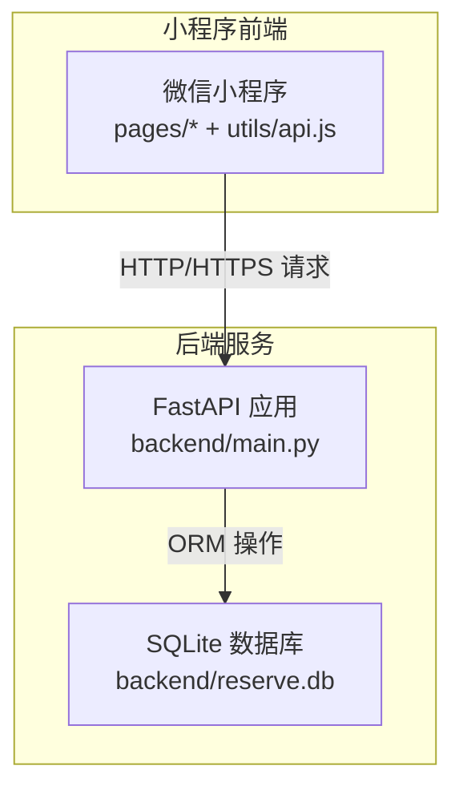
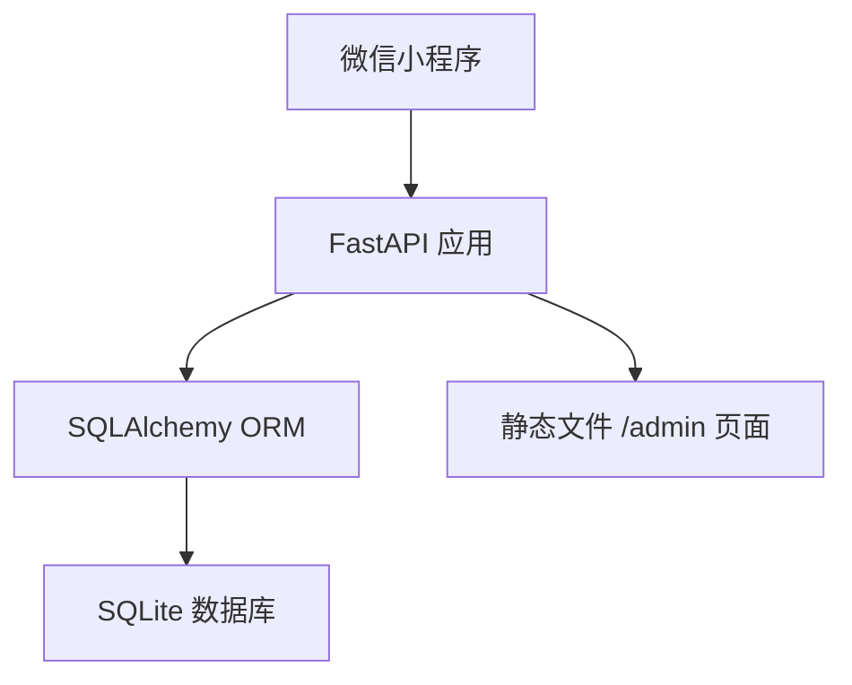
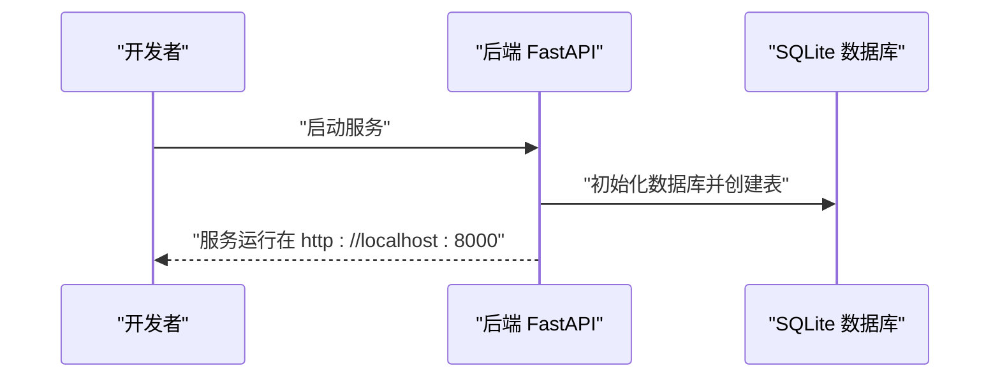
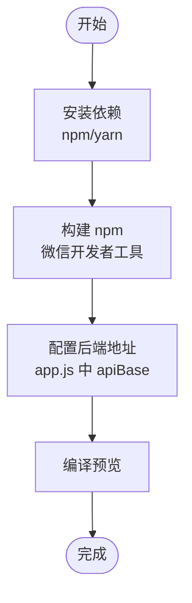
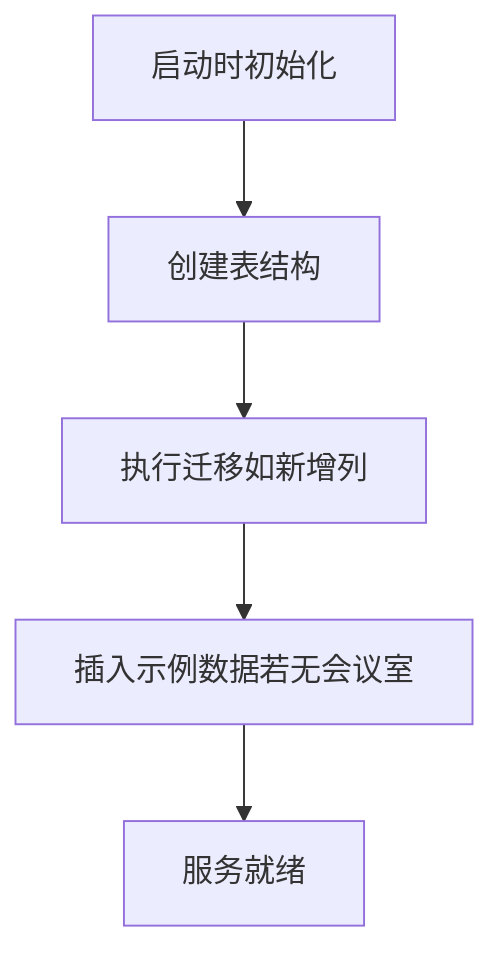
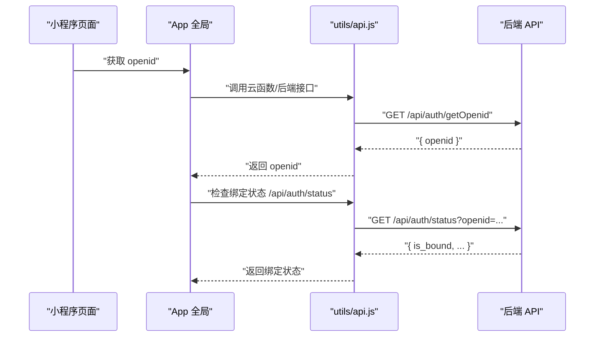
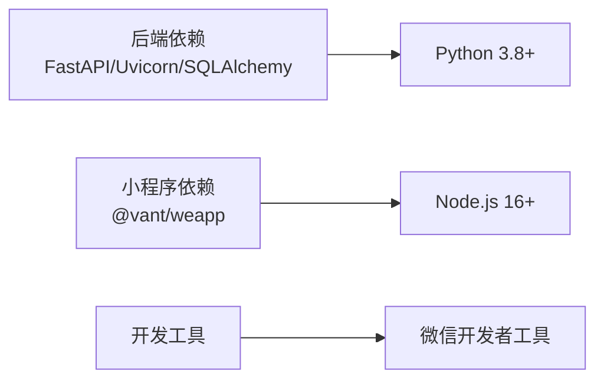

# 快速开始

<cite>
**本文引用的文件**
- [README.md](file://README.md)
- [MINIPROGRAM_DEBUG_GUIDE.md](file://docs/MINIPROGRAM_DEBUG_GUIDE.md)
- [backend/main.py](file://backend/main.py)
- [backend/requirements.txt](file://backend/requirements.txt)
- [backend/database.py](file://backend/database.py)
- [backend/models.py](file://backend/models.py)
- [miniprogram/app.js](file://miniprogram/app.js)
- [miniprogram/app.json](file://miniprogram/app.json)
- [miniprogram/package.json](file://miniprogram/package.json)
- [miniprogram/utils/api.js](file://miniprogram/utils/api.js)
</cite>

## 目录
1. [简介](#简介)
2. [项目结构](#项目结构)
3. [核心组件](#核心组件)
4. [架构总览](#架构总览)
5. [详细组件分析](#详细组件分析)
6. [依赖分析](#依赖分析)
7. [性能考虑](#性能考虑)
8. [故障排查指南](#故障排查指南)
9. [结论](#结论)
10. [附录](#附录)

## 简介
本指南面向首次接触“西安交通大学软件学院会议室预约系统”的开发者，帮助你在最短时间内完成本地开发环境搭建，启动后端 FastAPI 服务，并在微信开发者工具中安装小程序依赖、配置后端地址，最终实现本地预览与调试。文档覆盖环境要求、命令行步骤、配置说明与常见问题排查，确保你能顺利启动并运行系统。

## 项目结构
该项目采用前后端分离架构：
- 后端：FastAPI + SQLite，提供 RESTful API、Swagger 文档与管理后台页面
- 小程序：原生小程序 + Vant Weapp UI 组件库，通过 HTTP/HTTPS 与后端交互
- 部署：支持本地开发、云托管与 Nginx 反向代理部署

图表来源
- [backend/main.py:1-673](file://backend/main.py#L1-L673)
- [miniprogram/utils/api.js:1-184](file://miniprogram/utils/api.js#L1-L184)
- [backend/database.py:1-62](file://backend/database.py#L1-L62)

章节来源
- [README.md:88-131](file://README.md#L88-L131)

## 核心组件
- 后端 FastAPI 应用：提供校区、会议室、预约、认证与管理后台接口；内置 Swagger 文档与管理后台页面
- 数据库层：SQLite + SQLAlchemy，自动创建表与迁移
- 小程序前端：页面路由、UI 组件、API 封装与用户认证流程
- 开发工具链：微信开发者工具、Node.js/npm/yarn、Python 虚拟环境

章节来源
- [backend/main.py:17-673](file://backend/main.py#L17-L673)
- [backend/database.py:32-62](file://backend/database.py#L32-L62)
- [miniprogram/app.json:1-61](file://miniprogram/app.json#L1-L61)
- [miniprogram/utils/api.js:1-184](file://miniprogram/utils/api.js#L1-L184)

## 架构总览
系统采用“小程序前端 + FastAPI 后端 + SQLite 数据库”的轻量架构，支持本地开发与生产部署（Nginx + systemd）。后端通过 CORS 支持跨域，提供 Swagger 文档与管理后台页面。

图表来源
- [backend/main.py:23-30](file://backend/main.py#L23-L30)
- [backend/main.py:666-667](file://backend/main.py#L666-L667)
- [backend/database.py:15-18](file://backend/database.py#L15-L18)

## 详细组件分析

### 后端服务启动与配置
- 环境要求：Python 3.8+、pip、uvicorn
- 依赖安装：在 backend 目录执行依赖安装
- 启动服务：运行后端主程序，默认监听 0.0.0.0:8000
- 访问入口：
  - 首页导航：/（重定向至管理后台）
  - 管理后台：/admin
  - API 文档：/docs（Swagger UI）

图表来源
- [backend/main.py:38-51](file://backend/main.py#L38-L51)
- [backend/main.py:670-673](file://backend/main.py#L670-L673)
- [backend/database.py:55-62](file://backend/database.py#L55-L62)

章节来源
- [README.md:96-115](file://README.md#L96-L115)
- [backend/requirements.txt:1-5](file://backend/requirements.txt#L1-L5)

### 小程序依赖安装与预览
- 环境要求：Node.js 16+、npm/yarn
- 安装依赖：在 miniprogram 目录执行 npm/yarn 安装 Vant Weapp 组件
- 构建 npm：在微信开发者工具中执行“工具 -> 构建 npm”
- 预览流程：打开项目、关闭域名校验、编译预览

图表来源
- [MINIPROGRAM_DEBUG_GUIDE.md:117-172](file://docs/MINIPROGRAM_DEBUG_GUIDE.md#L117-L172)
- [miniprogram/package.json:1-6](file://miniprogram/package.json#L1-L6)
- [miniprogram/app.js:12-14](file://miniprogram/app.js#L12-L14)

章节来源
- [README.md:117-131](file://README.md#L117-L131)
- [MINIPROGRAM_DEBUG_GUIDE.md:69-115](file://docs/MINIPROGRAM_DEBUG_GUIDE.md#L69-L115)

### 数据库初始化与迁移
- 数据库类型：SQLite
- 初始化：启动时自动创建表并执行迁移（如新增字段）
- 数据文件：backend/reserve.db

图表来源
- [backend/database.py:55-62](file://backend/database.py#L55-L62)
- [backend/main.py:43-49](file://backend/main.py#L43-L49)

章节来源
- [backend/database.py:1-62](file://backend/database.py#L1-L62)
- [backend/models.py:1-75](file://backend/models.py#L1-L75)

### 小程序认证与 API 调用
- 认证流程：优先通过云函数获取 openid，否则回退到后端接口
- 绑定状态：检查用户是否已绑定工号/姓名，恢复登录状态
- API 封装：统一的请求方法，支持 GET/POST/DELETE，自动拼接基础地址

图表来源
- [miniprogram/app.js:44-89](file://miniprogram/app.js#L44-L89)
- [miniprogram/utils/api.js:13-41](file://miniprogram/utils/api.js#L13-L41)
- [backend/main.py:503-529](file://backend/main.py#L503-L529)

章节来源
- [miniprogram/app.js:16-127](file://miniprogram/app.js#L16-L127)
- [miniprogram/utils/api.js:76-184](file://miniprogram/utils/api.js#L76-L184)
- [backend/main.py:463-620](file://backend/main.py#L463-L620)

## 依赖分析
- 后端依赖：FastAPI、Uvicorn、SQLAlchemy、Pydantic、python-multipart
- 小程序依赖：@vant/weapp（通过 npm 安装）
- 开发工具：微信开发者工具、Node.js 16+、Python 3.8+

图表来源
- [backend/requirements.txt:1-5](file://backend/requirements.txt#L1-L5)
- [miniprogram/package.json:2-4](file://miniprogram/package.json#L2-L4)

章节来源
- [README.md:90-95](file://README.md#L90-L95)
- [backend/requirements.txt:1-5](file://backend/requirements.txt#L1-L5)
- [miniprogram/package.json:1-6](file://miniprogram/package.json#L1-L6)

## 性能考虑
- SQLite 适合中小规模数据与本地开发；生产建议结合反向代理与数据库优化策略
- 后端接口对时间线计算做了合并与空闲区间判断，注意前端传入的日期/时间参数以减少无效计算
- 小程序端尽量复用缓存与分页加载，避免一次性请求过多数据

## 故障排查指南
- 小程序请求失败
  - 检查后端是否正常运行
  - 确认域名配置 HTTPS（生产环境）
  - 在微信开发者工具中关闭域名校验（仅开发）
- 端口占用或无法访问
  - 修改后端监听端口（默认 8000），确保防火墙放行
- npm 构建失败
  - 清理 node_modules、miniprogram_npm、package-lock.json 后重新安装并构建
- 真机调试无法访问
  - 确保手机与电脑在同一 Wi-Fi；将 apiBase 改为本机局域网 IP；开放防火墙端口
- 数据库问题
  - 通过 SQLite 命令行查看/备份数据库；必要时重置数据库并重启服务

章节来源
- [README.md:594-631](file://README.md#L594-L631)
- [MINIPROGRAM_DEBUG_GUIDE.md:256-310](file://docs/MINIPROGRAM_DEBUG_GUIDE.md#L256-L310)

## 结论
按照本指南完成环境准备、后端启动与小程序依赖安装后，你可以在本地完成完整的预约系统调试与预览。遇到问题时，可依据故障排查章节逐项检查，确保开发流程顺畅。

## 附录

### 快速开始命令清单
- 启动后端
  - 进入 backend 目录
  - 安装依赖
  - 启动服务
  - 访问管理后台与 API 文档
- 启动小程序
  - 进入 miniprogram 目录
  - 安装依赖
  - 在微信开发者工具中构建 npm
  - 配置后端地址并预览

章节来源
- [README.md:96-131](file://README.md#L96-L131)