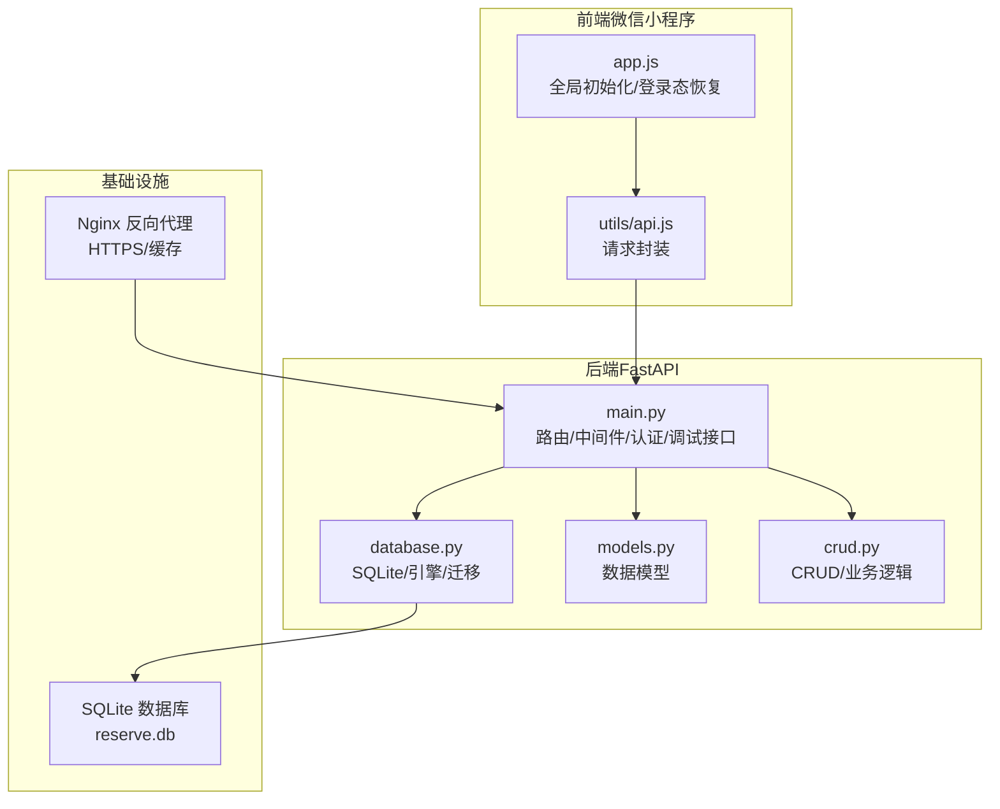
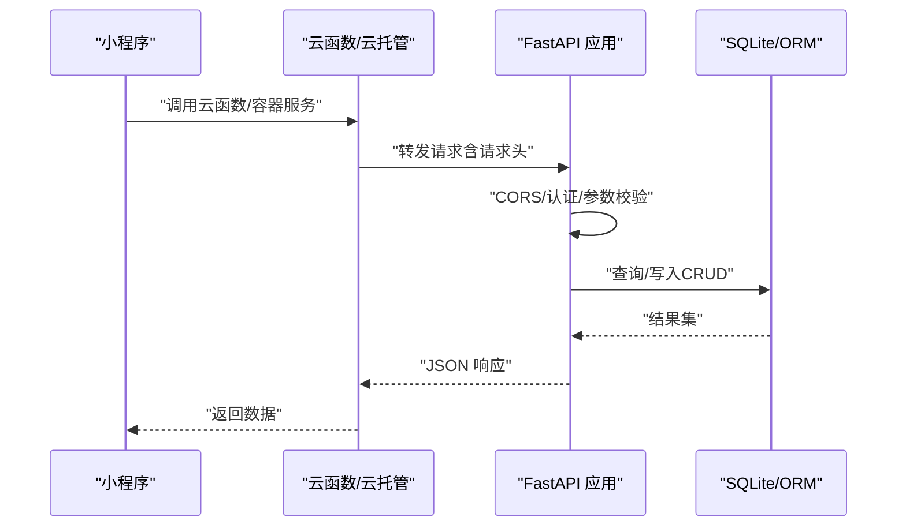
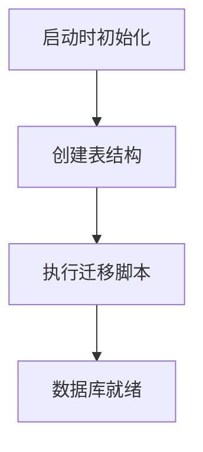
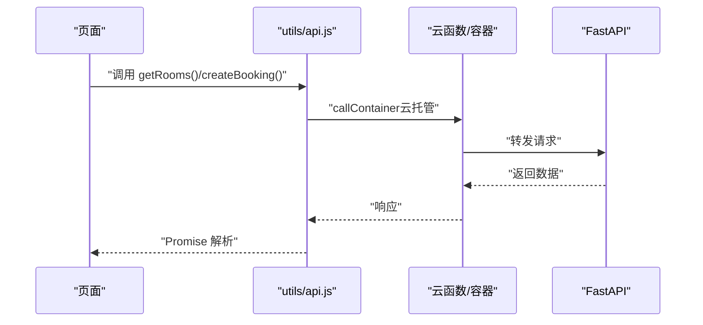
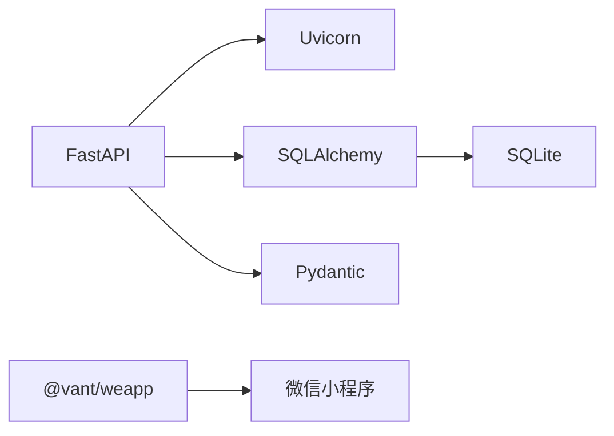

# 故障排除

<cite>
**本文引用的文件**
- [README.md](file://README.md)
- [MINIPROGRAM_DEBUG_GUIDE.md](file://docs/MINIPROGRAM_DEBUG_GUIDE.md)
- [backend/main.py](file://backend/main.py)
- [backend/database.py](file://backend/database.py)
- [backend/models.py](file://backend/models.py)
- [backend/crud.py](file://backend/crud.py)
- [backend/requirements.txt](file://backend/requirements.txt)
- [miniprogram/utils/api.js](file://miniprogram/utils/api.js)
- [miniprogram/app.js](file://miniprogram/app.js)
</cite>

## 目录
1. [简介](#简介)
2. [项目结构](#项目结构)
3. [核心组件](#核心组件)
4. [架构总览](#架构总览)
5. [详细组件分析](#详细组件分析)
6. [依赖分析](#依赖分析)
7. [性能考量](#性能考量)
8. [故障排除指南](#故障排除指南)
9. [结论](#结论)
10. [附录](#附录)

## 简介
本指南面向开发者与运维人员，提供系统化的故障诊断与解决方法，覆盖小程序请求失败、后端服务异常、数据库连接问题、域名配置错误、认证与绑定异常、网络连通性与跨域问题、以及性能问题的诊断与优化策略。文档结合仓库中的实际实现，给出可操作的排查步骤、日志分析要点、常见错误码与报错信息的解释，以及最佳实践建议。

## 项目结构
系统采用前后端分离架构：
- 前端：微信小程序（原生 + Vant Weapp UI 组件库）
- 后端：FastAPI 应用，提供 RESTful API，使用 SQLAlchemy + SQLite
- 部署：支持 Nginx 反向代理 + HTTPS；亦可使用微信云托管/云函数



图表来源
- [backend/main.py:1-673](file://backend/main.py#L1-L673)
- [backend/database.py:1-62](file://backend/database.py#L1-L62)
- [backend/models.py:1-75](file://backend/models.py#L1-L75)
- [backend/crud.py:1-343](file://backend/crud.py#L1-L343)
- [miniprogram/utils/api.js:1-184](file://miniprogram/utils/api.js#L1-L184)
- [miniprogram/app.js:1-127](file://miniprogram/app.js#L1-L127)

章节来源
- [README.md:48-73](file://README.md#L48-L73)

## 核心组件
- FastAPI 应用与路由：提供校区、会议室、预约、管理后台、认证绑定等接口，内置 CORS 与静态文件挂载。
- 数据库层：SQLite + SQLAlchemy，支持迁移脚本与示例数据初始化。
- 小程序 API 封装：统一请求封装，支持云托管与传统 HTTP 两种模式。
- 认证与绑定：基于微信 OpenID 的用户绑定机制，支持状态检查与解绑。

章节来源
- [backend/main.py:17-673](file://backend/main.py#L17-L673)
- [backend/database.py:8-62](file://backend/database.py#L8-L62)
- [backend/models.py:8-75](file://backend/models.py#L8-L75)
- [backend/crud.py:10-343](file://backend/crud.py#L10-L343)
- [miniprogram/utils/api.js:1-184](file://miniprogram/utils/api.js#L1-L184)
- [miniprogram/app.js:16-127](file://miniprogram/app.js#L16-L127)

## 架构总览
系统请求流概览（云托管/云函数场景）：
- 小程序通过云函数或直接调用后端容器服务，携带必要的请求头（如 X-WX-OPENID），后端进行认证与业务处理，最终返回 JSON 响应。



图表来源
- [miniprogram/app.js:46-89](file://miniprogram/app.js#L46-L89)
- [backend/main.py:465-513](file://backend/main.py#L465-L513)
- [backend/database.py:23-30](file://backend/database.py#L23-L30)

## 详细组件分析

### FastAPI 应用与路由
- CORS：默认允许任意源，生产环境建议限制具体域名。
- 静态文件：挂载管理后台页面与静态资源。
- 调试接口：提供数据库状态检查，便于运维排障。
- 认证：从请求头读取 X-WX-OPENID，开发环境支持模拟 openid。

```mermaid
flowchart TD
Start(["请求到达"]) --> CORS["CORS 中间件"]
CORS --> Auth["认证中间件<br/>读取 X-WX-OPENID"]
Auth --> Route{"匹配路由"}
Route --> |"/api/..."| Handler["业务处理器"]
Route --> |"/admin"|"管理页面"
Handler --> DB["数据库操作CRUD"]
DB --> Resp["返回 JSON 响应"]
```

图表来源
- [backend/main.py:23-31](file://backend/main.py#L23-L31)
- [backend/main.py:465-513](file://backend/main.py#L465-L513)
- [backend/main.py:445-461](file://backend/main.py#L445-L461)

章节来源
- [backend/main.py:17-673](file://backend/main.py#L17-L673)

### 数据库与迁移
- SQLite 路径：本地开发默认在 backend 目录，云托管通过环境变量 DATA_PATH 指定持久化目录。
- 迁移：自动检测并添加缺失列（如 bookings.subject）。
- 初始化：启动时创建表并执行迁移。



图表来源
- [backend/database.py:32-62](file://backend/database.py#L32-L62)
- [backend/database.py:55-62](file://backend/database.py#L55-L62)

章节来源
- [backend/database.py:8-62](file://backend/database.py#L8-L62)

### 小程序 API 封装与认证
- 请求封装：支持云托管与传统 HTTP 两种模式，默认使用云托管封装。
- 认证流程：优先通过云函数获取 openid，再通过后端接口检查绑定状态，恢复用户信息。
- 参数传递：支持查询参数拼接与 JSON 请求体。



图表来源
- [miniprogram/utils/api.js:13-41](file://miniprogram/utils/api.js#L13-L41)
- [miniprogram/utils/api.js:90-98](file://miniprogram/utils/api.js#L90-L98)
- [miniprogram/utils/api.js:134-143](file://miniprogram/utils/api.js#L134-L143)

章节来源
- [miniprogram/utils/api.js:1-184](file://miniprogram/utils/api.js#L1-L184)
- [miniprogram/app.js:46-119](file://miniprogram/app.js#L46-L119)

## 依赖分析
- 后端依赖：FastAPI、Uvicorn、SQLAlchemy、Pydantic、python-multipart。
- 前端依赖：Vant Weapp 组件库，需在开发者工具中构建 npm。



图表来源
- [backend/requirements.txt:1-5](file://backend/requirements.txt#L1-L5)

章节来源
- [backend/requirements.txt:1-5](file://backend/requirements.txt#L1-L5)

## 性能考量
- 数据库性能：SQLite 适合中小规模数据，建议合理索引与查询条件，避免一次性加载大量数据。
- API 响应：对高频接口（如获取会议室列表）可考虑缓存策略（如按日期/校区缓存），减少数据库压力。
- 网络传输：压缩与分页，避免一次性返回过多数据。
- 部署优化：Nginx 缓存静态资源，启用 HTTP/2/TLS 加速。

[本节为通用指导，不直接分析具体文件]

## 故障排除指南

### 一、小程序请求失败
常见症状
- 网络请求失败、无响应、或出现“请求失败”提示。
- 控制台出现 ERR_CONNECTION_REFUSED、net::ERR_INTERNET_DISCONNECTED、request:fail 等错误。

排查步骤
1. 确认后端服务已启动且监听在 0.0.0.0:8000（或自定义端口）。
2. 检查小程序端 apiBase 配置是否正确（开发环境使用本地地址或局域网 IP）。
3. 若使用云托管/云函数，确认云函数已部署并可访问。
4. 关闭域名校验仅限开发环境使用，生产必须使用 HTTPS 域名。
5. 查看 Network 面板，确认请求路径、状态码与响应体。
6. 在 utils/api.js 中添加统一错误处理与日志输出，定位失败原因。

常见错误码与解决
- ERR_CONNECTION_REFUSED：后端未启动或端口未开放。
- net::ERR_INTERNET_DISCONNECTED：网络断开或防火墙阻断。
- request:fail（域名校验失败）：关闭域名校验仅用于开发，生产需配置 HTTPS 域名。

章节来源
- [docs/MINIPROGRAM_DEBUG_GUIDE.md:256-310](file://docs/MINIPROGRAM_DEBUG_GUIDE.md#L256-L310)
- [miniprogram/utils/api.js:43-74](file://miniprogram/utils/api.js#L43-L74)

### 二、后端服务异常
常见症状
- 500 内部错误、启动失败、接口超时。
- CORS 相关错误（跨域失败）。

排查步骤
1. 查看服务日志：systemd 日志与 Nginx 错误日志。
2. 检查依赖安装：确保 requirements.txt 中依赖版本一致。
3. CORS 配置：生产环境限制 allow_origins，避免使用通配符。
4. 静态文件：确认 static/admin.html 存在，否则管理页面将提示不存在。
5. 调试接口：访问 /api/debug/db-status 检查数据库状态与数据计数。

章节来源
- [README.md:623-631](file://README.md#L623-L631)
- [backend/main.py:23-31](file://backend/main.py#L23-L31)
- [backend/main.py:445-461](file://backend/main.py#L445-L461)
- [backend/requirements.txt:1-5](file://backend/requirements.txt#L1-L5)

### 三、数据库连接问题
常见症状
- 启动时报数据库文件不可写、路径错误、迁移失败。
- 数据库文件损坏或权限不足。

排查步骤
1. 确认 SQLite 数据库文件路径：本地默认 backend/reserve.db，云托管通过 DATA_PATH 环境变量指定。
2. 检查文件权限：确保进程对 reserve.db 有读写权限。
3. 执行迁移：若缺少列（如 bookings.subject），系统会自动迁移，若失败需手动修复。
4. 备份与恢复：定期备份 reserve.db，必要时恢复。

章节来源
- [backend/database.py:8-13](file://backend/database.py#L8-L13)
- [backend/database.py:32-62](file://backend/database.py#L32-L62)
- [README.md:582-591](file://README.md#L582-L591)

### 四、域名配置错误
常见症状
- 小程序无法访问后端接口，或出现跨域错误。
- 生产环境 HTTPS 证书无效或未正确配置。

排查步骤
1. 小程序后台域名配置：在微信公众平台的“开发设置”中添加合法域名。
2. Nginx 反向代理：确保 server_name 正确，强制 HTTPS，SSL 证书有效。
3. 防火墙：开放 80/443 端口，允许外部访问。
4. Let’s Encrypt：安装并配置自动续期。

章节来源
- [README.md:374-380](file://README.md#L374-L380)
- [README.md:258-294](file://README.md#L258-L294)
- [README.md:310-320](file://README.md#L310-L320)

### 五、认证与绑定异常
常见症状
- “用户未认证或绑定已失效，请重新登录”。
- 绑定失败或重复绑定。
- 获取用户信息失败。

排查步骤
1. 获取 openid：优先通过云函数获取，失败时回退到后端 /api/auth/getOpenid。
2. 检查绑定状态：调用 /api/auth/status，确认 is_bound 与教师信息。
3. 绑定流程：校验工号与姓名，确保唯一性，避免重复绑定。
4. 解绑：管理员可调用 /api/auth/unbind 或 /api/admin/unbind/{teacher_id}。

章节来源
- [backend/main.py:465-619](file://backend/main.py#L465-L619)
- [miniprogram/app.js:46-119](file://miniprogram/app.js#L46-L119)
- [miniprogram/utils/api.js:150-170](file://miniprogram/utils/api.js#L150-L170)

### 六、网络连接测试与配置验证
- 本地联调：使用 localhost:8000，或获取本机局域网 IP 并在小程序中配置 apiBase。
- 真机调试：确保手机与电脑在同一 Wi-Fi，防火墙允许 8000 端口。
- 域名校验：开发阶段可关闭校验，发布前务必配置 HTTPS 域名。

章节来源
- [docs/MINIPROGRAM_DEBUG_GUIDE.md:175-254](file://docs/MINIPROGRAM_DEBUG_GUIDE.md#L175-L254)

### 七、日志分析与调试方法
- 后端日志：journalctl -u xjtu-reserve -f 查看服务日志；Nginx 错误日志 /var/log/nginx/error.log。
- 小程序日志：Console 面板查看控制台输出；Network 面板查看请求与响应。
- 统一日志：在 utils/api.js 中增加请求日志与错误日志，便于定位问题。

章节来源
- [README.md:623-631](file://README.md#L623-L631)
- [docs/MINIPROGRAM_DEBUG_GUIDE.md:197-211](file://docs/MINIPROGRAM_DEBUG_GUIDE.md#L197-L211)
- [miniprogram/utils/api.js:13-41](file://miniprogram/utils/api.js#L13-L41)

### 八、性能问题诊断与优化
- 数据库层面：避免全表扫描，合理使用查询条件；对高频查询建立索引。
- API 层面：对列表接口分页与缓存；减少不必要的字段返回。
- 网络层面：启用 Gzip/HTTP/2；静态资源走 CDN/Nginx 缓存。
- 部署层面：监控 CPU/内存/磁盘 IO，必要时升级硬件或拆分服务。

[本节为通用指导，不直接分析具体文件]

## 结论
本指南提供了从网络、域名、认证、数据库到性能的全链路故障排除方法。建议在日常运维中：
- 建立标准化的日志与监控体系；
- 明确开发/测试/生产的配置差异；
- 对高频接口进行缓存与限流；
- 定期备份数据库并演练恢复流程。

[本节为总结性内容，不直接分析具体文件]

## 附录

### A. 常见错误码与含义
- ERR_CONNECTION_REFUSED：后端未启动或端口未开放。
- net::ERR_INTERNET_DISCONNECTED：网络断开或防火墙阻断。
- request:fail（域名校验失败）：开发阶段关闭校验，生产需配置 HTTPS 域名。
- 401 未认证：未绑定或绑定失效，需重新绑定。
- 404 不存在：资源不存在（会议室/预约/用户）。
- 400 参数错误：时间冲突、日期非法、工作时间外等。

章节来源
- [docs/MINIPROGRAM_DEBUG_GUIDE.md:273-279](file://docs/MINIPROGRAM_DEBUG_GUIDE.md#L273-L279)
- [backend/main.py:282-342](file://backend/main.py#L282-L342)
- [backend/crud.py:102-123](file://backend/crud.py#L102-L123)

### B. 常用排查清单
- 后端
  - 服务状态：systemctl status xjtu-reserve
  - 日志：journalctl -u xjtu-reserve -f
  - 端口：ufw status，确认 80/443 开放
- 小程序
  - 域名：微信公众平台“服务器域名”配置
  - HTTPS：Let’s Encrypt 证书状态
  - 真机：同一 Wi-Fi、防火墙放行、局域网 IP 配置

章节来源
- [README.md:226-240](file://README.md#L226-L240)
- [README.md:322-331](file://README.md#L322-L331)
- [README.md:374-380](file://README.md#L374-L380)