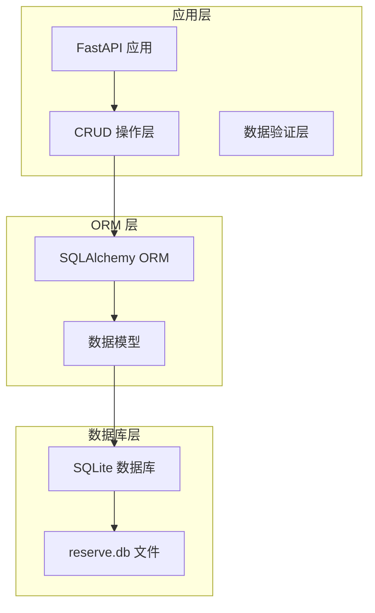
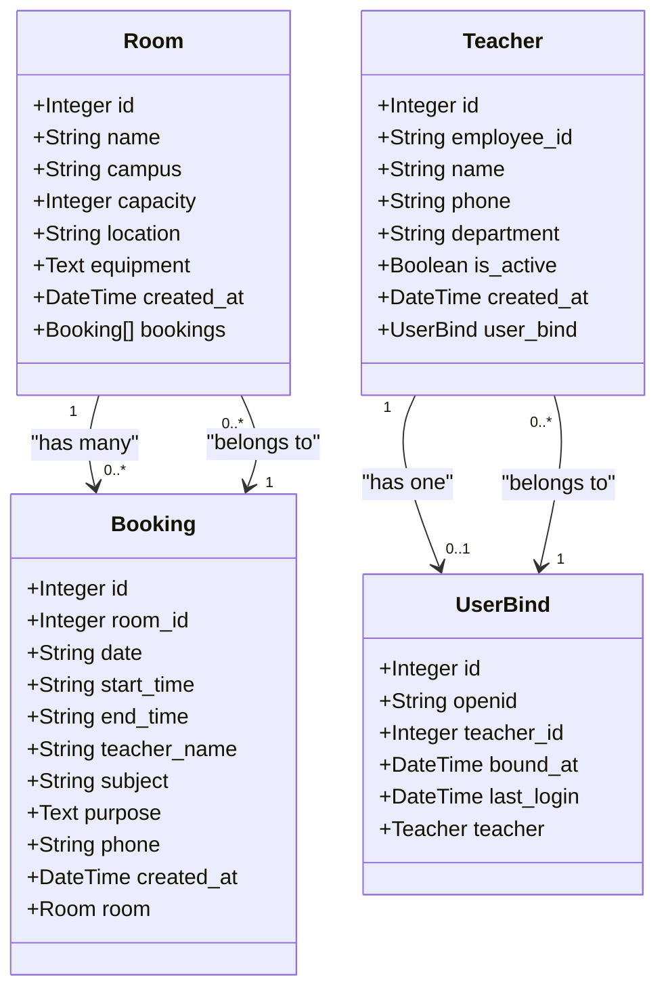
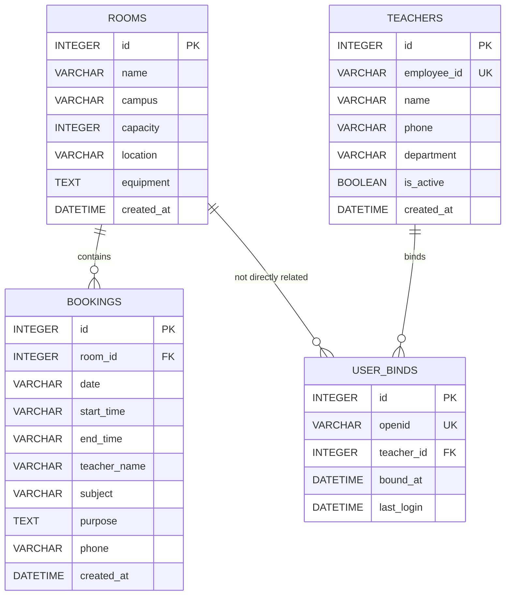
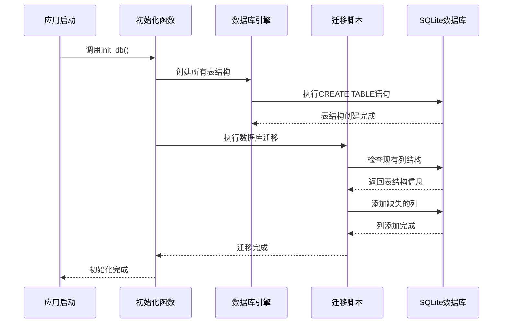
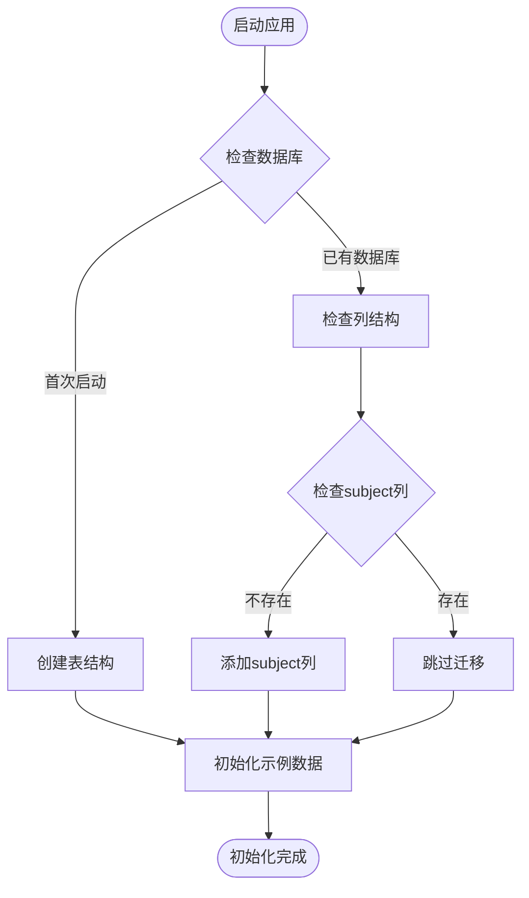
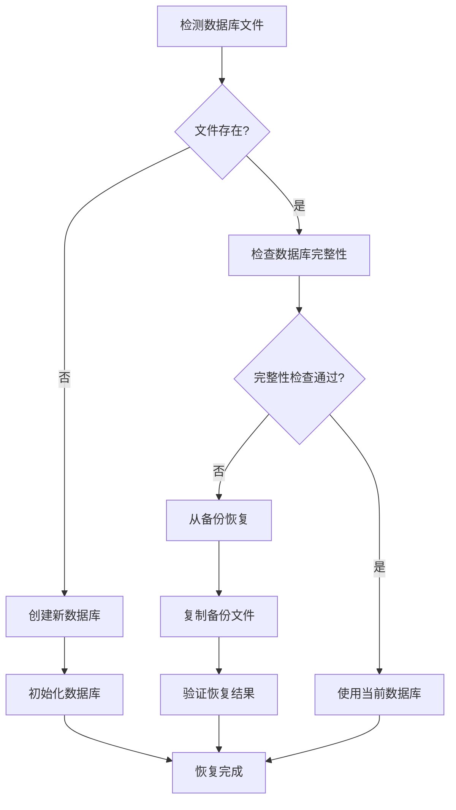
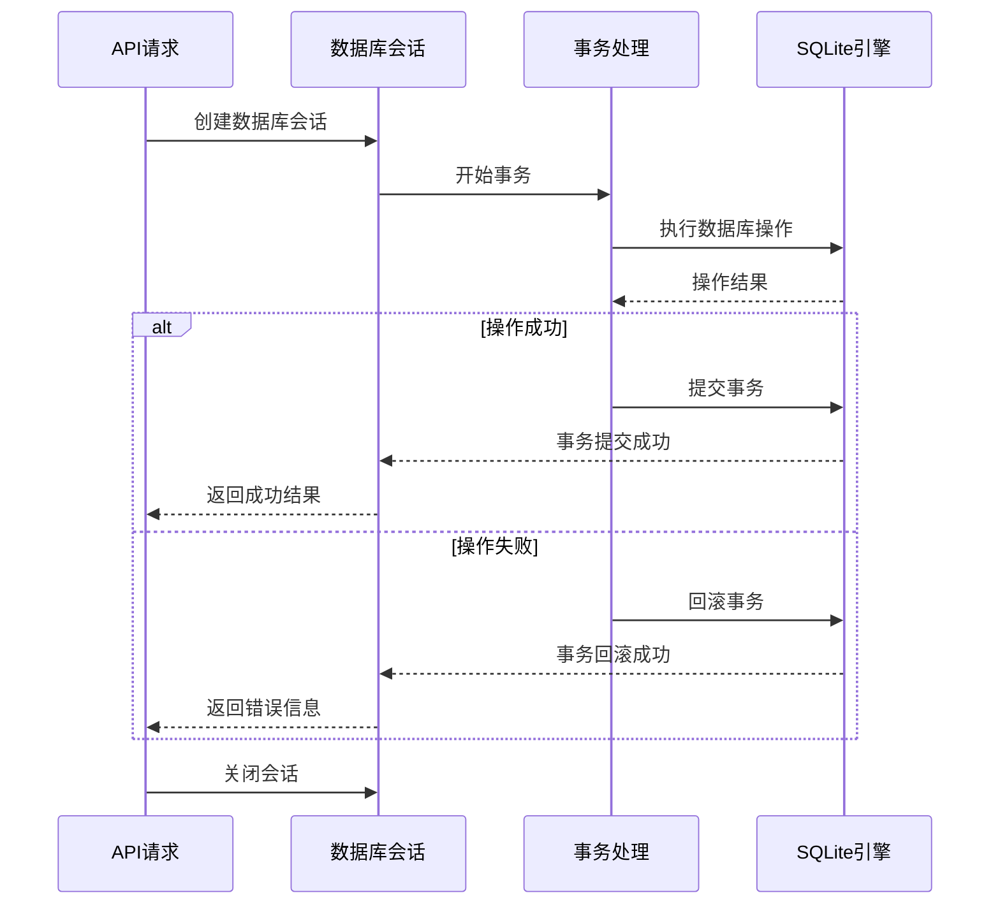

# 数据库设计

<cite>
**本文档引用的文件**
- [database.py](file://backend/database.py)
- [models.py](file://backend/models.py)
- [crud.py](file://backend/crud.py)
- [schemas.py](file://backend/schemas.py)
- [main.py](file://backend/main.py)
- [requirements.txt](file://backend/requirements.txt)
- [README.md](file://README.md)
</cite>

## 目录
1. [项目概述](#项目概述)
2. [数据库架构概览](#数据库架构概览)
3. [核心数据模型](#核心数据模型)
4. [表结构详细设计](#表结构详细设计)
5. [实体关系图](#实体关系图)
6. [索引设计](#索引设计)
7. [约束条件](#约束条件)
8. [SQLite数据库选择](#sqlite数据库选择)
9. [数据库初始化流程](#数据库初始化流程)
10. [数据迁移策略](#数据迁移策略)
11. [备份恢复方案](#备份恢复方案)
12. [查询优化](#查询优化)
13. [事务处理与并发控制](#事务处理与并发控制)
14. [性能考量](#性能考量)
15. [故障排除指南](#故障排除指南)
16. [总结](#总结)

## 项目概述

西安交通大学软件学院会议室预约系统是一个基于微信小程序的前后端分离应用，采用FastAPI + SQLite的技术架构。系统为教师提供会议室预约服务，支持多校区管理、实时状态显示和可视化预约功能。

## 数据库架构概览

系统采用SQLite作为数据库引擎，通过SQLAlchemy ORM框架进行数据访问。数据库文件位于`backend/reserve.db`，采用文件存储方式，无需独立的数据库服务进程。



**图表来源**
- [database.py:15-20](file://backend/database.py#L15-L20)
- [models.py:1-5](file://backend/models.py#L1-L5)

**章节来源**
- [database.py:1-62](file://backend/database.py#L1-L62)
- [requirements.txt:1-5](file://backend/requirements.txt#L1-L5)

## 核心数据模型

系统包含四个核心数据模型，通过关系映射实现数据完整性：



**图表来源**
- [models.py:8-75](file://backend/models.py#L8-L75)

**章节来源**
- [models.py:1-75](file://backend/models.py#L1-L75)

## 表结构详细设计

### rooms 表 - 会议室表

rooms表存储会议室的基本信息，是预约系统的核心实体之一。

| 字段名 | 数据类型 | 约束条件 | 描述 | 索引 |
|--------|----------|----------|------|------|
| id | INTEGER | PRIMARY KEY, AUTOINCREMENT | 会议室主键标识 | 主键索引 |
| name | VARCHAR(100) | NOT NULL | 会议室名称 | 无 |
| campus | VARCHAR(50) | NOT NULL | 校区代码：xingqing/chuangxin | 无 |
| capacity | INTEGER | DEFAULT 20 | 容纳人数 | 无 |
| location | VARCHAR(200) | NULLABLE | 会议室具体位置 | 无 |
| equipment | TEXT | NULLABLE | 设备配置说明 | 无 |
| created_at | DATETIME | DEFAULT CURRENT_TIMESTAMP | 创建时间戳 | 无 |

**章节来源**
- [models.py:8-22](file://backend/models.py#L8-L22)
- [README.md:529-540](file://README.md#L529-L540)

### bookings 表 - 预约记录表

bookings表记录具体的会议室预约信息，包含时间维度和业务相关信息。

| 字段名 | 数据类型 | 约束条件 | 描述 | 索引 |
|--------|----------|----------|------|------|
| id | INTEGER | PRIMARY KEY, AUTOINCREMENT | 预约记录主键 | 主键索引 |
| room_id | INTEGER | NOT NULL, FOREIGN KEY | 关联会议室ID | 外键索引 |
| date | VARCHAR(10) | NOT NULL | 预约日期 YYYY-MM-DD | 无 |
| start_time | VARCHAR(5) | NOT NULL | 开始时间 HH:MM | 无 |
| end_time | VARCHAR(5) | NOT NULL | 结束时间 HH:MM | 无 |
| teacher_name | VARCHAR(50) | NOT NULL | 预约教师姓名 | 无 |
| subject | VARCHAR(200) | NULLABLE | 会议主题 | 无 |
| purpose | TEXT | NULLABLE | 预约用途说明 | 无 |
| phone | VARCHAR(20) | NULLABLE | 联系电话 | 无 |
| created_at | DATETIME | DEFAULT CURRENT_TIMESTAMP | 创建时间戳 | 无 |

**章节来源**
- [models.py:25-42](file://backend/models.py#L25-L42)
- [README.md:541-554](file://README.md#L541-L554)

### teachers 表 - 教职工表

teachers表维护教职工白名单，用于用户认证和权限管理。

| 字段名 | 数据类型 | 约束条件 | 描述 | 索引 |
|--------|----------|----------|------|------|
| id | INTEGER | PRIMARY KEY, AUTOINCREMENT | 教职工主键 | 主键索引 |
| employee_id | VARCHAR(20) | NOT NULL, UNIQUE | 工号唯一标识 | 唯一索引 |
| name | VARCHAR(50) | NOT NULL | 姓名 | 无 |
| phone | VARCHAR(20) | NULLABLE | 联系电话 | 无 |
| department | VARCHAR(100) | NULLABLE | 所属部门 | 无 |
| is_active | BOOLEAN | DEFAULT TRUE | 是否有效状态 | 无 |
| created_at | DATETIME | DEFAULT CURRENT_TIMESTAMP | 创建时间戳 | 无 |

**章节来源**
- [models.py:44-58](file://backend/models.py#L44-L58)

### user_binds 表 - 用户绑定表

user_binds表建立微信用户与教职工的绑定关系。

| 字段名 | 数据类型 | 约束条件 | 描述 | 索引 |
|--------|----------|----------|------|------|
| id | INTEGER | PRIMARY KEY, AUTOINCREMENT | 绑定关系主键 | 主键索引 |
| openid | VARCHAR(100) | NOT NULL, UNIQUE | 微信用户OpenID | 唯一索引 |
| teacher_id | INTEGER | NOT NULL, FOREIGN KEY | 关联教职工ID | 外键索引 |
| bound_at | DATETIME | DEFAULT CURRENT_TIMESTAMP | 绑定时间 | 无 |
| last_login | DATETIME | DEFAULT CURRENT_TIMESTAMP | 最后登录时间 | 无 |

**章节来源**
- [models.py:61-75](file://backend/models.py#L61-L75)

## 实体关系图

系统采用标准的关系型数据库设计，通过外键约束保证数据完整性：



**图表来源**
- [models.py:8-75](file://backend/models.py#L8-L75)

**章节来源**
- [models.py:1-75](file://backend/models.py#L1-L75)

## 索引设计

基于查询模式和业务需求，系统采用以下索引策略：

### 主键索引
- **rooms.id**: 自动创建，用于快速定位会议室
- **bookings.id**: 自动创建，用于快速定位预约记录
- **teachers.id**: 自动创建，用于快速定位教职工
- **user_binds.id**: 自动创建，用于快速定位绑定关系

### 唯一索引
- **rooms.name**: 会议室名称唯一性约束
- **teachers.employee_id**: 工号唯一性约束
- **user_binds.openid**: 微信OpenID唯一性约束

### 外键索引
- **bookings.room_id**: 外键索引，支持房间查询
- **user_binds.teacher_id**: 外键索引，支持教职工查询

### 复合索引建议
基于业务查询模式，建议创建以下复合索引以提升查询性能：

```sql
-- 预约查询复合索引
CREATE INDEX idx_bookings_room_date ON bookings(room_id, date);
CREATE INDEX idx_bookings_date_time ON bookings(date, start_time);

-- 教职工查询复合索引  
CREATE INDEX idx_teachers_employee_name ON teachers(employee_id, name);
```

**章节来源**
- [crud.py:125-130](file://backend/crud.py#L125-L130)
- [crud.py:59-73](file://backend/crud.py#L59-L73)

## 约束条件

系统通过多种约束确保数据完整性和业务逻辑正确性：

### 非空约束
- **rooms.name**: 会议室名称不能为空
- **rooms.campus**: 校区代码不能为空
- **bookings.room_id**: 预约必须关联有效会议室
- **bookings.date**: 预约日期不能为空
- **bookings.start_time**: 开始时间不能为空
- **bookings.end_time**: 结束时间不能为空
- **bookings.teacher_name**: 预约教师姓名不能为空
- **teachers.employee_id**: 工号不能为空
- **user_binds.openid**: 微信OpenID不能为空
- **user_binds.teacher_id**: 教职工ID不能为空

### 唯一性约束
- **rooms.name**: 会议室名称唯一
- **teachers.employee_id**: 工号唯一
- **user_binds.openid**: 微信OpenID唯一

### 外键约束
- **bookings.room_id**: 引用rooms.id，级联删除
- **user_binds.teacher_id**: 引用teachers.id，级联删除

### 检查约束
- **bookings.start_time < bookings.end_time**: 结束时间必须晚于开始时间
- **bookings.date >= 当前日期**: 不允许预约历史日期
- **teachers.is_active**: 只能绑定有效的教职工

**章节来源**
- [models.py:12-38](file://backend/models.py#L12-L38)
- [crud.py:102-122](file://backend/crud.py#L102-L122)

## SQLite数据库选择

### 选择理由

1. **轻量级特性**
   - 无需独立数据库服务进程
   - 内存占用极小，适合小型应用
   - 部署简单，零配置

2. **可靠性保证**
   - ACID事务支持
   - WAL模式提供更好的并发性能
   - 文件系统级别的数据保护

3. **开发友好**
   - 内置命令行工具sqlite3
   - 支持在线备份和恢复
   - 跨平台兼容性好

4. **成本效益**
   - 开源免费
   - 维护成本低
   - 适合中小规模应用

### 文件存储方式

数据库文件采用文件存储，位置由环境变量控制：

```python
# 数据库文件路径配置
DATA_DIR = os.environ.get("DATA_PATH", os.path.dirname(__file__))
DB_PATH = os.path.join(DATA_DIR, "reserve.db")
```

### 性能特点

- **读取性能**: SQLite在顺序读取场景表现优异
- **写入性能**: WAL模式下写入性能显著提升
- **并发限制**: 单文件锁限制，不适合高并发写入场景
- **内存使用**: 内存映射文件，减少磁盘I/O

**章节来源**
- [database.py:8-13](file://backend/database.py#L8-L13)
- [README.md:67-72](file://README.md#L67-L72)

## 数据库初始化流程

系统采用自动化的数据库初始化机制：



**图表来源**
- [database.py:55-62](file://backend/database.py#L55-L62)
- [database.py:32-53](file://backend/database.py#L32-L53)

### 初始化步骤详解

1. **表结构创建**
   - 使用SQLAlchemy的`create_all()`方法
   - 自动创建所有定义的数据表
   - 包含主键、外键和约束定义

2. **数据库迁移**
   - 检查现有表结构
   - 动态添加缺失的列
   - 保持向后兼容性

3. **示例数据填充**
   - 检查是否已有会议室数据
   - 自动创建默认会议室
   - 提供系统演示所需的基础数据

**章节来源**
- [database.py:55-62](file://backend/database.py#L55-L62)
- [main.py:53-64](file://backend/main.py#L53-L64)

## 数据迁移策略

系统采用渐进式的数据库迁移策略，确保向后兼容性：

### 迁移机制设计



**图表来源**
- [database.py:32-53](file://backend/database.py#L32-L53)

### 迁移策略特点

1. **向后兼容**
   - 新增列不影响现有数据
   - 保持原有查询语句兼容
   - 逐步演进，避免破坏性变更

2. **自动化执行**
   - 应用启动时自动执行
   - 无需手动干预
   - 记录迁移状态

3. **错误处理**
   - 迁移失败不影响应用启动
   - 提供详细的错误信息
   - 支持手动修复

**章节来源**
- [database.py:32-53](file://backend/database.py#L32-L53)

## 备份恢复方案

### 备份策略

系统提供多种备份方式：

1. **文件复制备份**
```bash
# 复制数据库文件
cp backend/reserve.db backend/reserve.db.backup
```

2. **SQLite内置备份**
```bash
# 使用SQLite命令进行备份
sqlite3 backend/reserve.db ".backup 'backup.db'"
```

3. **定时备份脚本**
```bash
#!/bin/bash
# 自动备份脚本
BACKUP_DIR="/path/to/backups"
DATE=$(date +%Y%m%d_%H%M%S)
cp backend/reserve.db "${BACKUP_DIR}/reserve_${DATE}.db"
```

### 恢复流程



**图表来源**
- [README.md:582-590](file://README.md#L582-L590)

### 备份最佳实践

1. **定期备份**
   - 每日自动备份
   - 重要变更后立即备份
   - 保留多个历史版本

2. **异地存储**
   - 本地磁盘备份
   - 云端存储备份
   - 物理介质备份

3. **验证测试**
   - 定期验证备份文件完整性
   - 测试恢复流程
   - 监控备份成功率

**章节来源**
- [README.md:582-590](file://README.md#L582-L590)

## 查询优化

### 查询性能优化策略

1. **索引优化**
   - 为常用查询字段创建索引
   - 使用复合索引优化复杂查询
   - 定期分析查询计划

2. **查询语句优化**
   - 使用EXPLAIN QUERY PLAN分析
   - 避免SELECT *
   - 合理使用LIMIT和OFFSET

3. **缓存策略**
   - 缓存热点数据
   - 实现查询结果缓存
   - 使用适当的缓存失效策略

### 具体优化示例

基于系统查询模式，推荐以下优化：

```sql
-- 优化预约查询
CREATE INDEX idx_bookings_room_date_time ON bookings(room_id, date, start_time, end_time);

-- 优化时间冲突检查
CREATE INDEX idx_bookings_date_room_time ON bookings(date, room_id, start_time, end_time);

-- 优化教职工查询
CREATE INDEX idx_teachers_employee_active ON teachers(employee_id, is_active);
```

**章节来源**
- [crud.py:102-122](file://backend/crud.py#L102-L122)
- [crud.py:125-130](file://backend/crud.py#L125-L130)

## 事务处理与并发控制

### 事务管理

系统采用SQLAlchemy的事务管理机制：



**图表来源**
- [database.py:23-29](file://backend/database.py#L23-L29)

### 并发控制策略

1. **SQLite并发限制**
   - 单文件锁机制
   - 读写操作互斥
   - WAL模式改善并发

2. **应用层并发控制**
   - 使用连接池管理数据库连接
   - 合理设置超时时间
   - 实现重试机制

3. **业务层面的并发控制**
   - 时间冲突检查
   - 预约状态锁定
   - 并发更新冲突处理

**章节来源**
- [database.py:15-18](file://backend/database.py#L15-L18)
- [crud.py:102-122](file://backend/crud.py#L102-L122)

## 性能考量

### 性能瓶颈分析

1. **查询性能**
   - SQLite在大量数据时查询性能下降
   - 复杂JOIN操作可能成为瓶颈
   - 缺乏查询优化器

2. **并发性能**
   - 单文件锁限制并发写入
   - 大量读写操作影响性能
   - 内存使用随数据增长

3. **扩展性限制**
   - 数据库大小限制
   - 并发连接数限制
   - 索引数量限制

### 性能优化建议

1. **架构调整**
   - 考虑升级到PostgreSQL或MySQL
   - 实现读写分离
   - 添加缓存层

2. **查询优化**
   - 分析慢查询日志
   - 优化索引策略
   - 减少不必要的查询

3. **监控指标**
   - 数据库连接数监控
   - 查询响应时间统计
   - 磁盘空间使用率监控

## 故障排除指南

### 常见问题及解决方案

1. **数据库文件损坏**
   ```bash
   # 检查数据库完整性
   sqlite3 backend/reserve.db ". integrity_check"
   
   # 修复数据库
   sqlite3 backend/reserve.db ".recover > recovered.sql"
   ```

2. **权限问题**
   ```bash
   # 检查文件权限
   ls -la backend/reserve.db
   
   # 修复权限
   chmod 666 backend/reserve.db
   chown www-data:www-data backend/reserve.db
   ```

3. **内存不足**
   ```bash
   # 检查可用内存
   free -h
   
   # 清理数据库缓存
   sqlite3 backend/reserve.db "PRAGMA wal_checkpoint(RESTART)"
   ```

### 监控和诊断

1. **数据库状态监控**
   - 使用`.stats`命令查看数据库统计信息
   - 监控数据库文件大小
   - 跟踪查询执行时间

2. **性能诊断**
   - 分析慢查询日志
   - 监控并发连接数
   - 评估索引使用效率

**章节来源**
- [README.md:594-631](file://README.md#L594-L631)

## 总结

本数据库设计方案基于SQLite的轻量级特性和FastAPI的现代化特性，为会议室预约系统提供了可靠的数据存储解决方案。通过合理的表结构设计、完善的约束机制和自动化的初始化流程，系统能够满足中小型应用的需求。

### 设计优势

1. **部署简单**: 无需独立数据库服务，降低运维复杂度
2. **数据安全**: 文件系统级别的数据保护和备份机制
3. **开发友好**: 内置工具链完善，便于开发和调试
4. **成本效益**: 开源免费，维护成本低

### 发展建议

随着业务规模的增长，建议考虑以下演进方向：

1. **数据库升级**: 从SQLite迁移到PostgreSQL或MySQL
2. **架构优化**: 实现读写分离和分布式部署
3. **监控完善**: 建立完整的数据库监控和告警体系
4. **性能调优**: 持续优化查询性能和并发处理能力

通过持续的优化和改进，系统将能够更好地支撑业务发展和用户需求。