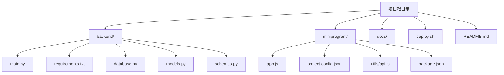
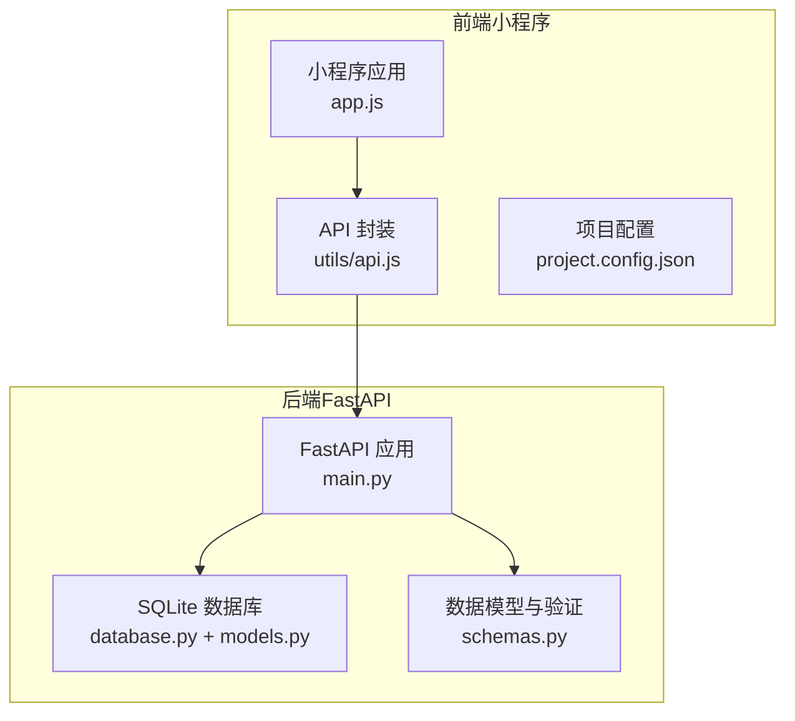
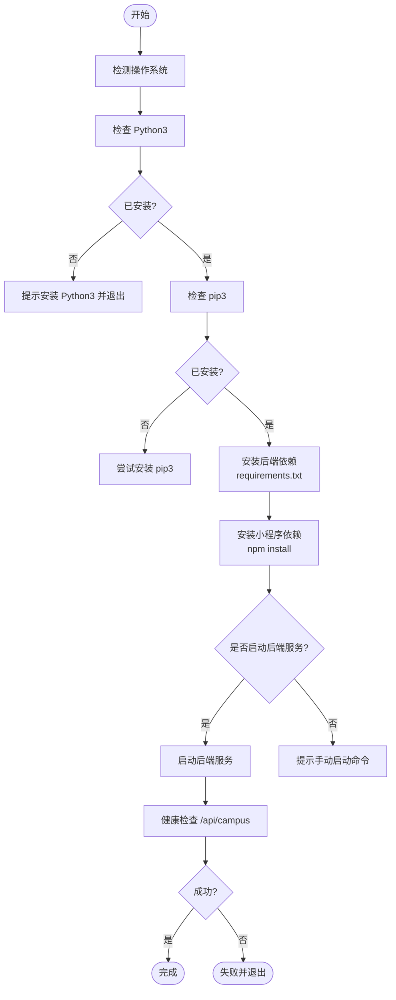
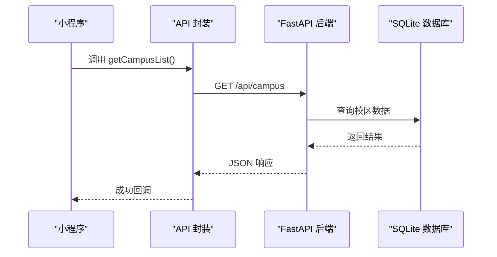
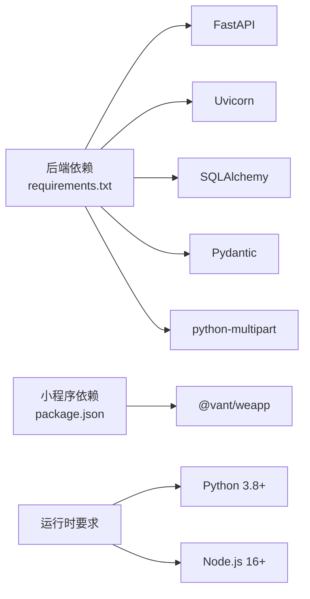

# 本地开发环境部署

<cite>
**本文档引用的文件**
- [README.md](file://README.md)
- [deploy.sh](file://deploy.sh)
- [backend/requirements.txt](file://backend/requirements.txt)
- [miniprogram/package.json](file://miniprogram/package.json)
- [backend/main.py](file://backend/main.py)
- [miniprogram/app.js](file://miniprogram/app.js)
- [miniprogram/project.config.json](file://miniprogram/project.config.json)
- [backend/database.py](file://backend/database.py)
- [backend/models.py](file://backend/models.py)
- [backend/schemas.py](file://backend/schemas.py)
- [miniprogram/utils/api.js](file://miniprogram/utils/api.js)
- [docs/MINIPROGRAM_DEBUG_GUIDE.md](file://docs/MINIPROGRAM_DEBUG_GUIDE.md)
</cite>

## 目录
1. [简介](#简介)
2. [项目结构](#项目结构)
3. [核心组件](#核心组件)
4. [架构总览](#架构总览)
5. [详细组件分析](#详细组件分析)
6. [依赖关系分析](#依赖关系分析)
7. [性能考虑](#性能考虑)
8. [故障排除指南](#故障排除指南)
9. [结论](#结论)
10. [附录](#附录)

## 简介
本指南面向希望在本地搭建并调试“西安交通大学软件学院会议室预约系统”的开发者，涵盖从环境准备、依赖安装、虚拟环境管理、后端与小程序启动，到调试技巧与常见问题排查的完整流程。系统采用前后端分离架构：后端基于 FastAPI + SQLite，前端为微信小程序（Vant Weapp 组件库），并通过统一的 API 提供服务。

## 项目结构
项目采用分层组织，后端位于 backend 目录，小程序位于 miniprogram 目录，根目录包含部署脚本与文档。

图表来源
- [backend/main.py:1-673](file://backend/main.py#L1-L673)
- [backend/requirements.txt:1-5](file://backend/requirements.txt#L1-L5)
- [backend/database.py:1-62](file://backend/database.py#L1-L62)
- [backend/models.py:1-75](file://backend/models.py#L1-L75)
- [backend/schemas.py:1-185](file://backend/schemas.py#L1-L185)
- [miniprogram/app.js:1-127](file://miniprogram/app.js#L1-L127)
- [miniprogram/project.config.json:1-59](file://miniprogram/project.config.json#L1-L59)
- [miniprogram/utils/api.js:1-184](file://miniprogram/utils/api.js#L1-L184)
- [miniprogram/package.json:1-6](file://miniprogram/package.json#L1-L6)
- [deploy.sh:1-163](file://deploy.sh#L1-L163)

章节来源
- [README.md:88-131](file://README.md#L88-L131)
- [deploy.sh:135-163](file://deploy.sh#L135-L163)

## 核心组件
- 后端服务（FastAPI）
  - 提供 RESTful API，包含校区、会议室、预约、认证与管理后台接口
  - 内置 Swagger 文档与静态页面
  - 使用 SQLAlchemy + SQLite 存储
- 小程序前端
  - 基于 Vant Weapp UI 组件库
  - 通过 utils/api.js 封装请求，支持云托管与传统 HTTP 两种模式
  - 通过 app.js 管理全局状态、用户认证与 openid 获取

章节来源
- [backend/main.py:17-673](file://backend/main.py#L17-L673)
- [backend/database.py:1-62](file://backend/database.py#L1-L62)
- [miniprogram/utils/api.js:1-184](file://miniprogram/utils/api.js#L1-L184)
- [miniprogram/app.js:1-127](file://miniprogram/app.js#L1-L127)

## 架构总览
系统采用前后端分离架构，后端提供统一 API，小程序作为前端客户端通过 HTTP/HTTPS 与后端交互。

图表来源
- [backend/main.py:1-673](file://backend/main.py#L1-L673)
- [backend/database.py:1-62](file://backend/database.py#L1-L62)
- [backend/models.py:1-75](file://backend/models.py#L1-L75)
- [backend/schemas.py:1-185](file://backend/schemas.py#L1-L185)
- [miniprogram/app.js:1-127](file://miniprogram/app.js#L1-L127)
- [miniprogram/utils/api.js:1-184](file://miniprogram/utils/api.js#L1-L184)
- [miniprogram/project.config.json:1-59](file://miniprogram/project.config.json#L1-L59)

## 详细组件分析

### 后端服务（FastAPI）启动与配置
- 端口与运行
  - 默认监听 0.0.0.0:8000，可通过修改主程序中的端口参数调整
- CORS 与静态文件
  - 支持跨域访问，挂载静态文件目录
- 数据库初始化
  - 启动时自动创建表并初始化示例数据
- API 文档
  - 自动提供 Swagger UI 文档，便于调试与测试

章节来源
- [backend/main.py:23-31](file://backend/main.py#L23-L31)
- [backend/main.py:38-51](file://backend/main.py#L38-L51)
- [backend/main.py:666-673](file://backend/main.py#L666-L673)
- [backend/database.py:55-62](file://backend/database.py#L55-L62)

### 数据库与模型
- 数据库类型与路径
  - SQLite，本地开发默认使用 backend/reserve.db；云托管通过环境变量 DATA_PATH 指定持久化目录
- 数据模型
  - Room、Booking、Teacher、UserBind 四个核心模型，定义字段与关系
- 数据迁移
  - 启动时执行迁移逻辑，确保新增列（如 bookings.subject）存在

章节来源
- [backend/database.py:8-13](file://backend/database.py#L8-L13)
- [backend/database.py:55-62](file://backend/database.py#L55-L62)
- [backend/models.py:8-75](file://backend/models.py#L8-L75)

### 小程序前端与 API 封装
- 全局状态与 openid 获取
  - 优先通过云函数获取 openid，回退到后端接口
  - 支持检查绑定状态并恢复用户信息
- API 封装
  - 支持云托管与传统 HTTP 两种请求方式，默认使用云托管
  - 提供校区、会议室、预约、认证等常用接口封装
- 项目配置
  - project.config.json 控制编译、调试与云开发环境

章节来源
- [miniprogram/app.js:44-127](file://miniprogram/app.js#L44-L127)
- [miniprogram/utils/api.js:13-74](file://miniprogram/utils/api.js#L13-L74)
- [miniprogram/utils/api.js:76-184](file://miniprogram/utils/api.js#L76-L184)
- [miniprogram/project.config.json:1-59](file://miniprogram/project.config.json#L1-L59)

### 部署脚本 deploy.sh 的使用
- 功能概览
  - 检测 Python 与 pip 环境
  - 可选创建并激活虚拟环境
  - 安装后端依赖（requirements.txt）
  - 安装小程序依赖（npm install）
  - 可选启动后端服务并进行健康检查
- 参数与行为
  - 支持 --venv 参数以创建并激活虚拟环境
  - 启动后端服务时通过 curl 检查 /api/campus 接口可用性
- 错误处理
  - 环境检测失败时给出明确提示与安装指引
  - 服务启动失败时退出并提示

图表来源
- [deploy.sh:19-28](file://deploy.sh#L19-L28)
- [deploy.sh:33-46](file://deploy.sh#L33-L46)
- [deploy.sh:48-62](file://deploy.sh#L48-L62)
- [deploy.sh:64-82](file://deploy.sh#L64-L82)
- [deploy.sh:84-99](file://deploy.sh#L84-L99)
- [deploy.sh:101-132](file://deploy.sh#L101-L132)
- [deploy.sh:135-163](file://deploy.sh#L135-L163)

章节来源
- [deploy.sh:1-163](file://deploy.sh#L1-L163)

### API 调用序列（小程序到后端）

图表来源
- [miniprogram/utils/api.js:79-81](file://miniprogram/utils/api.js#L79-L81)
- [backend/main.py:69-76](file://backend/main.py#L69-L76)
- [backend/database.py:55-62](file://backend/database.py#L55-L62)

## 依赖关系分析
- 后端依赖
  - FastAPI、Uvicorn、SQLAlchemy、Pydantic、python-multipart
- 小程序依赖
  - @vant/weapp 组件库
- 运行时要求
  - Python 3.8+、Node.js 16+（用于小程序 npm）

图表来源
- [backend/requirements.txt:1-5](file://backend/requirements.txt#L1-L5)
- [miniprogram/package.json:1-6](file://miniprogram/package.json#L1-L6)
- [README.md:90-95](file://README.md#L90-L95)

章节来源
- [backend/requirements.txt:1-5](file://backend/requirements.txt#L1-L5)
- [miniprogram/package.json:1-6](file://miniprogram/package.json#L1-L6)
- [README.md:90-95](file://README.md#L90-L95)

## 性能考虑
- 后端性能
  - 使用 Uvicorn 作为 ASGI 服务器，具备高性能异步能力
  - SQLite 适合中小规模数据，无需额外数据库服务
- 前端性能
  - Vant Weapp 组件按需使用，减少不必要的渲染
  - API 请求统一封装，减少重复逻辑

[本节为通用指导，不涉及具体文件分析]

## 故障排除指南
- 后端服务启动失败
  - 检查端口占用与权限，确认 Python 与依赖安装完成
  - 参考 README 中的常见问题与日志查看方法
- 小程序请求失败
  - 确认后端已启动且可访问
  - 检查小程序配置中的 apiBase 地址与域名校验设置
- npm 构建失败
  - 清理 node_modules、miniprogram_npm 与 package-lock.json 后重新安装
- 真机调试无法访问后端
  - 确保手机与电脑在同一 Wi-Fi，使用本机局域网 IP 替换 localhost
  - 检查防火墙是否允许 8000 端口

章节来源
- [README.md:594-631](file://README.md#L594-L631)
- [docs/MINIPROGRAM_DEBUG_GUIDE.md:256-309](file://docs/MINIPROGRAM_DEBUG_GUIDE.md#L256-L309)

## 结论
通过本指南，您可以完成从环境准备到服务启动的全流程部署，并掌握小程序与后端的调试技巧。建议在开发过程中充分利用 Swagger 文档与小程序调试器，结合日志与网络面板定位问题，逐步完善功能与体验。

[本节为总结性内容，不涉及具体文件分析]

## 附录

### 环境准备与虚拟环境
- Python 3.8+ 安装与验证
- pip 包管理器安装
- 推荐使用虚拟环境隔离依赖（venv）

章节来源
- [README.md:90-95](file://README.md#L90-L95)
- [README.md:157-173](file://README.md#L157-L173)

### 后端依赖安装
- 进入 backend 目录
- 安装 requirements.txt 中的依赖

章节来源
- [README.md:100-109](file://README.md#L100-L109)
- [backend/requirements.txt:1-5](file://backend/requirements.txt#L1-L5)

### 小程序依赖安装
- 进入 miniprogram 目录
- 安装 @vant/weapp 组件并构建 npm

章节来源
- [README.md:119-128](file://README.md#L119-L128)
- [miniprogram/package.json:1-6](file://miniprogram/package.json#L1-L6)
- [docs/MINIPROGRAM_DEBUG_GUIDE.md:105-114](file://docs/MINIPROGRAM_DEBUG_GUIDE.md#L105-L114)

### 部署脚本 deploy.sh 使用说明
- 基本用法
  - 赋权并执行：chmod +x deploy.sh && ./deploy.sh
- 参数
  - --venv：创建并激活虚拟环境后再安装后端依赖
- 行为
  - 自动检测 Python 与 pip
  - 安装后端与小程序依赖
  - 可选启动后端服务并进行健康检查

章节来源
- [deploy.sh:1-163](file://deploy.sh#L1-L163)

### 手动启动服务
- 后端
  - 进入 backend 目录，运行 python main.py
- 小程序
  - 在微信开发者工具中打开 miniprogram 目录
  - 配置 project.config.json 与 app.js 中的 apiBase
  - 构建 npm 并进行调试

章节来源
- [README.md:100-130](file://README.md#L100-L130)
- [miniprogram/project.config.json:1-59](file://miniprogram/project.config.json#L1-L59)
- [miniprogram/app.js:1-14](file://miniprogram/app.js#L1-L14)

### 调试技巧与热重载
- 小程序
  - 使用开发者工具的 Console 与 Network 面板
  - 关闭域名校验以便本地调试
  - 真机调试时使用本机局域网 IP
- 后端
  - 使用 Swagger UI 文档进行接口测试
  - 通过日志与异常信息定位问题

章节来源
- [docs/MINIPROGRAM_DEBUG_GUIDE.md:175-211](file://docs/MINIPROGRAM_DEBUG_GUIDE.md#L175-L211)
- [docs/MINIPROGRAM_DEBUG_GUIDE.md:213-253](file://docs/MINIPROGRAM_DEBUG_GUIDE.md#L213-L253)
- [backend/main.py:17-21](file://backend/main.py#L17-L21)