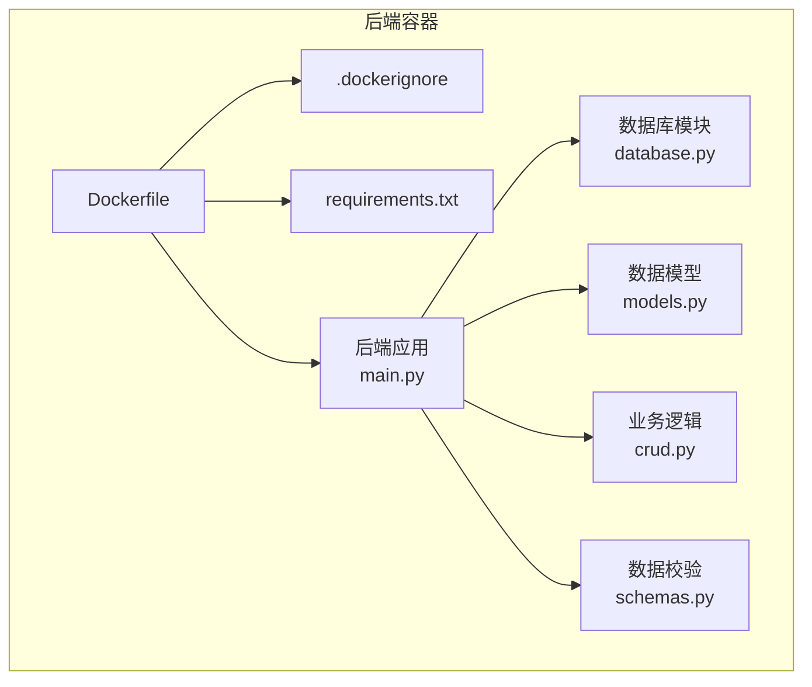
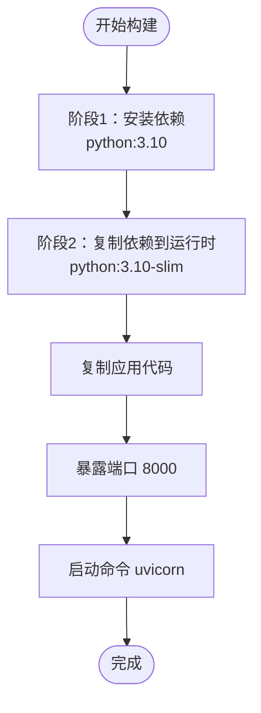
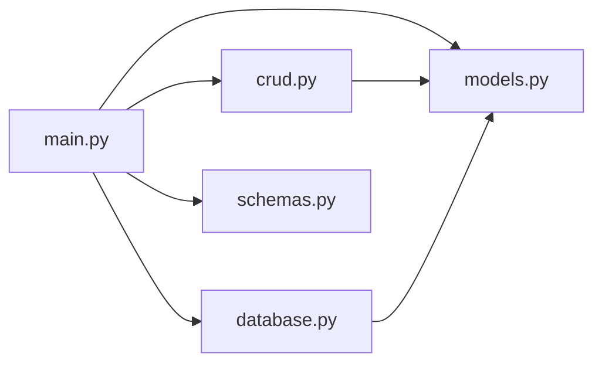

# Docker容器化部署

<cite>
**本文引用的文件**
- [backend/Dockerfile](file://backend/Dockerfile)
- [backend/.dockerignore](file://backend/.dockerignore)
- [backend/requirements.txt](file://backend/requirements.txt)
- [backend/main.py](file://backend/main.py)
- [backend/database.py](file://backend/database.py)
- [backend/models.py](file://backend/models.py)
- [backend/schemas.py](file://backend/schemas.py)
- [backend/crud.py](file://backend/crud.py)
- [README.md](file://README.md)
- [deploy.sh](file://deploy.sh)
</cite>

## 目录
1. [简介](#简介)
2. [项目结构](#项目结构)
3. [核心组件](#核心组件)
4. [架构总览](#架构总览)
5. [详细组件分析](#详细组件分析)
6. [依赖关系分析](#依赖关系分析)
7. [性能考量](#性能考量)
8. [故障排查指南](#故障排查指南)
9. [结论](#结论)
10. [附录](#附录)

## 简介
本文件面向“西安交通大学软件学院会议室预约系统”的Docker容器化部署，围绕后端服务（FastAPI + SQLite）提供从Dockerfile构建配置、多阶段构建优化、镜像层缓存策略，到容器网络、端口映射、数据卷挂载、环境变量传递的完整说明；并给出基于Docker Compose的后端服务、SQLite数据库容器、Nginx反向代理的编排思路与最佳实践。同时，深入讲解容器健康检查、日志收集、资源限制、自动重启策略，以及容器安全加固、镜像扫描、版本管理等运维要点。

## 项目结构
后端采用Python 3.10-slim基础镜像，使用pip安装依赖，复制代码并以Uvicorn运行FastAPI应用。数据库为SQLite文件，位于应用内部的data目录，生产环境建议通过环境变量指定持久化目录并挂载到宿主机或卷。



图表来源
- [backend/Dockerfile:1-21](file://backend/Dockerfile#L1-L21)
- [backend/.dockerignore:1-10](file://backend/.dockerignore#L1-L10)
- [backend/requirements.txt:1-5](file://backend/requirements.txt#L1-L5)
- [backend/main.py:1-673](file://backend/main.py#L1-L673)
- [backend/database.py:1-62](file://backend/database.py#L1-L62)
- [backend/models.py:1-75](file://backend/models.py#L1-L75)
- [backend/schemas.py:1-185](file://backend/schemas.py#L1-L185)
- [backend/crud.py:1-343](file://backend/crud.py#L1-L343)

章节来源
- [backend/Dockerfile:1-21](file://backend/Dockerfile#L1-L21)
- [backend/.dockerignore:1-10](file://backend/.dockerignore#L1-L10)
- [backend/requirements.txt:1-5](file://backend/requirements.txt#L1-L5)
- [backend/main.py:1-673](file://backend/main.py#L1-L673)
- [backend/database.py:1-62](file://backend/database.py#L1-L62)
- [backend/models.py:1-75](file://backend/models.py#L1-L75)
- [backend/schemas.py:1-185](file://backend/schemas.py#L1-L185)
- [backend/crud.py:1-343](file://backend/crud.py#L1-L343)

## 核心组件
- Dockerfile构建配置
  - 基础镜像：python:3.10-slim
  - 工作目录：/app
  - 依赖安装：复制requirements.txt并pip安装（禁用缓存）
  - 应用复制：复制全部源码
  - 数据目录：创建/app/data用于SQLite数据文件
  - 端口暴露：8000
  - 启动命令：uvicorn运行FastAPI应用，监听0.0.0.0:8000
- .dockerignore
  - 排除Python字节码、日志、.git、.vscode、.idea等，减少镜像体积与构建时间
- requirements.txt
  - 明确依赖版本，便于镜像层复用与可重复构建
- 后端应用
  - FastAPI主应用、CORS、静态文件挂载、管理后台页面
  - Uvicorn运行在0.0.0.0:8000
- 数据库
  - SQLite文件路径由环境变量DATA_PATH决定，默认在应用目录内
  - 启动时初始化数据库并执行迁移

章节来源
- [backend/Dockerfile:1-21](file://backend/Dockerfile#L1-L21)
- [backend/.dockerignore:1-10](file://backend/.dockerignore#L1-L10)
- [backend/requirements.txt:1-5](file://backend/requirements.txt#L1-L5)
- [backend/main.py:1-673](file://backend/main.py#L1-L673)
- [backend/database.py:1-62](file://backend/database.py#L1-L62)

## 架构总览
下图展示容器化部署的整体架构：后端容器承载FastAPI应用与Uvicorn，SQLite数据文件通过环境变量与数据卷实现持久化；Nginx容器作为反向代理，将HTTP/HTTPS流量转发至后端；Compose负责编排与服务发现。

```mermaid
graph TB
subgraph "宿主机"
NGINX["Nginx 反向代理容器"]
DATA_VOL["数据卷 /opt/xjtu-data"]
end
subgraph "后端服务"
APP["后端容器<br/>FastAPI + Uvicorn"]
DBFILE["SQLite 数据文件<br/>reserve.db"]
end
CLIENT["客户端浏览器/小程序"] --> NGINX
NGINX --> APP
APP --> DBFILE
DATA_VOL <- --> DBFILE
```

图表来源
- [backend/main.py:1-673](file://backend/main.py#L1-L673)
- [backend/database.py:1-62](file://backend/database.py#L1-L62)

## 详细组件分析

### Dockerfile构建配置与多阶段优化
- 单阶段构建现状
  - 基于python:3.10-slim，直接安装pip依赖并复制应用代码
  - 优点：构建简单、镜像层复用良好（requirements.txt变更触发依赖层重建）
  - 风险：镜像包含开发依赖与构建工具，体积偏大
- 多阶段构建建议
  - 阶段1（builder）：使用python:3.10作为builder，安装pip依赖到临时目录
  - 阶段2（runtime）：仅拷贝已安装的依赖到python:3.10-slim运行时镜像
  - 优势：显著减小最终镜像体积，降低攻击面
- 镜像层缓存策略
  - 将COPY requirements.txt置于COPY .之前，确保依赖变更才重建依赖层
  - 使用--no-cache-dir禁用pip缓存，避免缓存层污染
  - .dockerignore排除不必要的文件，提升构建速度与镜像体积控制



图表来源
- [backend/Dockerfile:1-21](file://backend/Dockerfile#L1-L21)

章节来源
- [backend/Dockerfile:1-21](file://backend/Dockerfile#L1-L21)
- [backend/.dockerignore:1-10](file://backend/.dockerignore#L1-L10)
- [backend/requirements.txt:1-5](file://backend/requirements.txt#L1-L5)

### 容器网络与端口映射
- 端口暴露与映射
  - 容器内端口：8000（Uvicorn监听0.0.0.0:8000）
  - 建议在Compose中将宿主机端口映射为8000或更高范围端口，避免权限问题
- 网络隔离
  - 建议创建自定义bridge网络，使后端与Nginx在同一网络内通信
  - 后端容器通过服务名访问，便于后续扩展数据库容器

章节来源
- [backend/main.py:670-673](file://backend/main.py#L670-L673)
- [backend/Dockerfile:17-18](file://backend/Dockerfile#L17-L18)

### 数据卷挂载与环境变量
- 数据持久化
  - SQLite文件默认在应用目录内，生产环境通过环境变量DATA_PATH指向持久化目录
  - 在Compose中将宿主机目录映射到容器内DATA_PATH，实现数据持久化
- 环境变量传递
  - DATA_PATH：指定SQLite数据库文件所在目录
  - 可扩展：APP_ENV、LOG_LEVEL、DATABASE_URL（如需替换为PostgreSQL/MySQL）

章节来源
- [backend/database.py:8-13](file://backend/database.py#L8-L13)
- [backend/main.py:444-460](file://backend/main.py#L444-L460)

### Docker Compose编排方案
- 服务编排思路
  - 后端服务：基于现有Dockerfile构建镜像，设置DATA_PATH并映射数据卷
  - Nginx反向代理：监听80/443，转发到后端服务（127.0.0.1:8000）
  - 数据库容器：如需替换SQLite为PostgreSQL/MySQL，新增数据库服务并配置连接字符串
- 健康检查
  - 后端：curl探测/或/docs，失败则重启
  - Nginx：探测反向代理连通性
- 日志收集
  - 容器标准输出/错误输出，结合宿主机日志轮转
  - Nginx访问/错误日志挂载到宿主机
- 资源限制
  - CPU/内存限制，防止资源争用
- 自动重启策略
  - restart: unless-stopped 或 on-failure，确保服务高可用

注：本节为概念性编排说明，未直接分析具体Compose文件，故不附加“章节来源”。

### 容器健康检查、日志与资源限制
- 健康检查
  - 后端：探测Swagger文档路径或根路径，检查HTTP状态码
  - Nginx：探测反向代理目标可达性
- 日志
  - 容器stdout/stderr日志采集，结合rsyslog或Fluent Bit
  - Nginx日志挂载到宿主机，便于审计与分析
- 资源限制
  - CPU配额、内存上限，避免单容器占用过多资源
- 自动重启
  - restart: unless-stopped，保证服务异常退出后自动恢复

注：本节为通用运维实践说明，未直接分析具体文件，故不附加“章节来源”。

### 容器安全加固、镜像扫描与版本管理
- 安全加固
  - 使用只读根文件系统、drop多余Linux能力、非root用户运行
  - 限制网络权限，仅开放必要端口
- 镜像扫描
  - 使用Trivy/Snyk等工具定期扫描镜像漏洞
  - 基于最小化运行时镜像（python:3.10-slim），降低漏洞面
- 版本管理
  - 固定基础镜像版本（如python:3.10.15-slim）
  - requirements.txt固定版本，CI中校验依赖锁一致性
  - 镜像打标签遵循语义化版本（v1.0.0、v1.0.1等）

章节来源
- [backend/Dockerfile:1-2](file://backend/Dockerfile#L1-L2)
- [backend/requirements.txt:1-5](file://backend/requirements.txt#L1-L5)

## 依赖关系分析
后端应用的模块间依赖关系如下：



图表来源
- [backend/main.py:1-673](file://backend/main.py#L1-L673)
- [backend/database.py:1-62](file://backend/database.py#L1-L62)
- [backend/models.py:1-75](file://backend/models.py#L1-L75)
- [backend/crud.py:1-343](file://backend/crud.py#L1-L343)
- [backend/schemas.py:1-185](file://backend/schemas.py#L1-L185)

章节来源
- [backend/main.py:1-673](file://backend/main.py#L1-L673)
- [backend/database.py:1-62](file://backend/database.py#L1-L62)
- [backend/models.py:1-75](file://backend/models.py#L1-L75)
- [backend/crud.py:1-343](file://backend/crud.py#L1-L343)
- [backend/schemas.py:1-185](file://backend/schemas.py#L1-L185)

## 性能考量
- 镜像体积与启动时间
  - 采用多阶段构建与.dockerignore，减少镜像体积，缩短拉取与启动时间
- 依赖层缓存
  - 将requirements.txt置于COPY .之前，提升缓存命中率
- 数据库性能
  - SQLite适用于中小规模数据；若并发较高，建议迁移到PostgreSQL/MySQL并使用连接池
- 反向代理优化
  - Nginx启用gzip、静态文件缓存、超时配置，提升响应速度

章节来源
- [backend/Dockerfile:7-12](file://backend/Dockerfile#L7-L12)
- [backend/.dockerignore:1-10](file://backend/.dockerignore#L1-L10)
- [backend/main.py:24-30](file://backend/main.py#L24-L30)

## 故障排查指南
- 后端无法启动
  - 检查端口占用与防火墙策略（8000）
  - 查看容器日志：docker logs <container-id>
- 数据丢失
  - 确认DATA_PATH环境变量与数据卷挂载正确
  - 核对SQLite文件路径与权限
- Nginx代理异常
  - 检查反向代理配置与后端服务连通性
  - 查看Nginx访问/错误日志
- 健康检查失败
  - 使用curl探测/或/docs，确认服务可用性
  - 调整健康检查间隔与超时参数

章节来源
- [backend/database.py:8-13](file://backend/database.py#L8-L13)
- [backend/main.py:670-673](file://backend/main.py#L670-L673)
- [README.md:242-330](file://README.md#L242-L330)

## 结论
本方案以现有Dockerfile为基础，结合多阶段构建、镜像层缓存优化、数据卷与环境变量配置，形成可落地的容器化部署路径。通过Compose编排后端、Nginx与数据库（可选），并配套健康检查、日志、资源限制与安全加固，可满足生产环境的稳定性与安全性需求。建议在CI中集成镜像扫描与版本管理，持续提升交付质量与可追溯性。

## 附录
- 快速部署脚本参考
  - 项目提供本地部署脚本，可用于对比容器化部署差异与验证服务可用性
- 技术栈与架构
  - 前端：微信小程序（Vant Weapp）
  - 后端：FastAPI + SQLAlchemy + SQLite
  - 反向代理：Nginx（可选）

章节来源
- [deploy.sh:1-163](file://deploy.sh#L1-L163)
- [README.md:48-84](file://README.md#L48-L84)