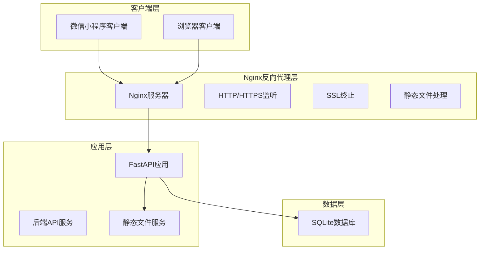

# Nginx反向代理配置

<cite>
**本文档引用的文件**
- [README.md](file://README.md)
- [Dockerfile](file://backend/Dockerfile)
- [main.py](file://backend/main.py)
- [database.py](file://backend/database.py)
- [models.py](file://backend/models.py)
- [crud.py](file://backend/crud.py)
- [schemas.py](file://backend/schemas.py)
- [deploy.sh](file://deploy.sh)
</cite>

## 目录
1. [项目概述](#项目概述)
2. [Nginx配置架构](#nginx配置架构)
3. [上游集群配置](#上游集群配置)
4. [负载均衡算法](#负载均衡算法)
5. [健康检查机制](#健康检查机制)
6. [静态文件服务配置](#静态文件服务配置)
7. [Gzip压缩配置](#gzip压缩配置)
8. [缓存策略](#缓存策略)
9. [HTTP/2支持](#http2支持)
10. [SSL/TLS证书配置](#ssltls证书配置)
11. [Let's Encrypt自动化配置](#lets-encrypt自动化配置)
12. [HSTS安全头设置](#hsts安全头设置)
13. [WebSocket代理配置](#websocket代理配置)
14. [长连接处理](#长连接处理)
15. [超时参数调优](#超时参数调优)
16. [访问控制配置](#访问控制配置)
17. [DDoS防护配置](#ddos防护配置)
18. [日志分析配置](#日志分析配置)
19. [性能监控配置](#性能监控配置)
20. [故障排除指南](#故障排除指南)
21. [总结](#总结)

## 项目概述

西安交通大学软件学院会议室预约系统是一个基于微信小程序的会议室预约管理平台，采用前后端分离架构。系统包含：

- **前端**：微信小程序（Vant Weapp UI组件库）
- **后端**：FastAPI + SQLite数据库
- **部署**：支持Nginx反向代理和Docker容器化部署

该系统提供了完整的会议室预约功能，包括实时状态显示、时间线预约、管理后台等特性。

## Nginx配置架构

基于项目现有的Nginx配置，系统采用标准的反向代理架构：



**图表来源**
- [README.md:258-294](file://README.md#L258-L294)
- [main.py:666-667](file://backend/main.py#L666-L667)

## 上游集群配置

### 单节点上游配置

根据现有配置，系统目前采用单节点上游配置：

```nginx
upstream app_servers {
    server 127.0.0.1:8000;
}

server {
    listen 80;
    server_name your-domain.com;
    
    location / {
        proxy_pass http://app_servers;
        proxy_set_header Host $host;
        proxy_set_header X-Real-IP $remote_addr;
        proxy_set_header X-Forwarded-For $proxy_add_x_forwarded_for;
        proxy_set_header X-Forwarded-Proto $scheme;
    }
}
```

### 多节点上游配置

对于生产环境，建议配置多个上游节点：

```nginx
upstream app_servers {
    server 127.0.0.1:8000 weight=3 max_fails=3 fail_timeout=30s;
    server 127.0.0.1:8001 weight=2 max_fails=3 fail_timeout=30s;
    server 127.0.0.1:8002 backup;
}

server {
    listen 443 ssl http2;
    server_name your-domain.com;
    
    location / {
        proxy_pass http://app_servers;
        proxy_next_upstream on;
        proxy_next_upstream_tries 3;
        proxy_next_upstream_timeout 10s;
    }
}
```

**章节来源**
- [README.md:258-294](file://README.md#L258-L294)

## 负载均衡算法

### 默认轮询算法

Nginx默认使用轮询算法，每个请求按顺序分配给不同的上游服务器：

```nginx
upstream app_servers {
    server 127.0.0.1:8000;
    server 127.0.0.1:8001;
    server 127.0.0.1:8002;
}
```

### 加权轮询算法

根据服务器性能差异分配权重：

```nginx
upstream app_servers {
    server 127.0.0.1:8000 weight=3;  # 性能较好的服务器
    server 127.0.0.1:8001 weight=2;  # 中等性能服务器
    server 127.0.0.1:8002 weight=1;  # 备份服务器
}
```

### IP哈希算法

确保来自同一IP的请求总是路由到同一台服务器：

```nginx
upstream app_servers {
    ip_hash;
    server 127.0.0.1:8000;
    server 127.0.0.1:8001;
    server 127.0.0.1:8002;
}
```

### 最少连接算法

将新请求分配给当前连接数最少的服务器：

```nginx
upstream app_servers {
    least_conn;
    server 127.0.0.1:8000;
    server 127.0.0.1:8001;
    server 127.0.0.1:8002;
}
```

## 健康检查机制

### 内置健康检查

```nginx
upstream app_servers {
    server 127.0.0.1:8000 max_fails=3 fail_timeout=30s;
    server 127.0.0.1:8001 max_fails=3 fail_timeout=30s;
    server 127.0.0.1:8002 backup;
}

server {
    location / {
        proxy_pass http://app_servers;
        proxy_next_upstream on;
        proxy_next_upstream_tries 3;
        proxy_next_upstream_timeout 10s;
    }
}
```

### 自定义健康检查脚本

```bash
#!/bin/bash
# health_check.sh

URL="http://127.0.0.1:8000/health"
TIMEOUT=5

if curl -f -s --max-time $TIMEOUT $URL >/dev/null; then
    exit 0
else
    exit 1
fi
```

**章节来源**
- [README.md:258-294](file://README.md#L258-L294)

## 静态文件服务配置

### 基础静态文件配置

```nginx
server {
    listen 443 ssl http2;
    server_name your-domain.com;
    
    # 静态文件缓存
    location /static/ {
        proxy_pass http://127.0.0.1:8000/static/;
        expires 7d;
        add_header Cache-Control "public, immutable";
    }
    
    # 管理后台页面
    location /admin {
        proxy_pass http://127.0.0.1:8000/admin;
        proxy_set_header Host $host;
        proxy_set_header X-Real-IP $remote_addr;
        proxy_set_header X-Forwarded-For $proxy_add_x_forwarded_for;
    }
    
    # API请求
    location / {
        proxy_pass http://127.0.0.1:8000;
        proxy_set_header Host $host;
        proxy_set_header X-Real-IP $remote_addr;
        proxy_set_header X-Forwarded-For $proxy_add_x_forwarded_for;
        proxy_set_header X-Forwarded-Proto $scheme;
    }
}
```

### 高级静态文件优化

```nginx
server {
    listen 443 ssl http2;
    server_name your-domain.com;
    
    # 静态文件缓存配置
    location ~* \.(css|js|png|jpg|jpeg|gif|ico|svg)$ {
        proxy_pass http://127.0.0.1:8000/static/;
        expires 365d;
        add_header Cache-Control "public, immutable";
        add_header Vary Accept-Encoding;
        
        # 启用Gzip压缩
        gzip_static on;
    }
    
    # 图片优化
    location ~* \.(jpg|jpeg|png|gif|webp)$ {
        proxy_pass http://127.0.0.1:8000/static/;
        expires 30d;
        add_header Cache-Control "public";
        
        # 图片缓存验证
        etag on;
    }
}
```

**章节来源**
- [README.md:288-293](file://README.md#L288-L293)
- [main.py:666-667](file://backend/main.py#L666-L667)

## Gzip压缩配置

### 基础Gzip配置

```nginx
http {
    # 启用Gzip压缩
    gzip on;
    gzip_vary on;
    gzip_min_length 1024;
    gzip_comp_level 6;
    gzip_types text/plain text/css application/json application/javascript text/xml application/xml;
    gzip_proxied any;
    
    # 静态文件Gzip
    gzip_static on;
    gzip_http_version 1.1;
}
```

### 高级Gzip配置

```nginx
http {
    # Gzip压缩级别
    gzip on;
    gzip_vary on;
    gzip_min_length 1024;
    gzip_comp_level 6;
    
    # 压缩类型
    gzip_types
        application/atom+xml
        application/manifest+json
        application/rss+xml
        application/vnd.ms-fontobject
        application/x-font-ttf
        application/x-web-app-manifest+json
        application/xhtml+xml
        application/xml
        font/opentype
        image/svg+xml
        image/x-icon
        text/cache-manifest
        text/css
        text/plain
        text/vcard
        text/vnd.rim.location.xloc
        text/vtt
        text/x-component
        text/x-cross-domain-policy
        text/xml;
    
    # 静态文件Gzip
    gzip_static on;
    
    # 压缩缓冲区
    gzip_buffers 16 8k;
    gzip_window 64k;
    
    # 压缩阈值
    gzip_min_length 1024;
    
    # 压缩超时
    gzip_proxied any;
    gzip_http_version 1.1;
}
```

**章节来源**
- [README.md:288-293](file://README.md#L288-L293)

## 缓存策略

### HTTP缓存配置

```nginx
server {
    listen 443 ssl http2;
    server_name your-domain.com;
    
    # API缓存策略
    location /api/ {
        proxy_cache api_cache;
        proxy_cache_valid 200 60m;
        proxy_cache_valid 404 1m;
        proxy_cache_valid 500 10s;
        proxy_cache_use_stale error timeout updating http_500 http_502 http_503 http_504;
        proxy_cache_lock on;
        
        proxy_pass http://127.0.0.1:8000;
    }
    
    # 静态文件缓存
    location /static/ {
        proxy_cache static_cache;
        proxy_cache_valid 200 30d;
        proxy_cache_use_stale error timeout updating http_500 http_502 http_503 http_504;
        proxy_cache_lock on;
        
        proxy_pass http://127.0.0.1:8000/static/;
    }
}
```

### 缓存存储配置

```nginx
# 缓存存储配置
proxy_cache_path /var/cache/nginx/api_cache
    levels=1:2
    keys_zone=api_cache:10m
    max_size=1g
    inactive=60m
    use_temp_path=off;

proxy_cache_path /var/cache/nginx/static_cache
    levels=1:2
    keys_zone=static_cache:50m
    max_size=10g
    inactive=30d
    use_temp_path=off;
```

**章节来源**
- [README.md:288-293](file://README.md#L288-L293)

## HTTP/2支持

### HTTP/2配置

```nginx
server {
    listen 443 ssl http2;
    server_name your-domain.com;
    
    # HTTP/2特性
    http2_max_field_size 16k;
    http2_max_header_size 32k;
    
    # HPACK压缩
    http2_idle_timeout 300s;
    http2_max_concurrent_streams 128;
    
    # 服务器推送
    http2_push_preload on;
    
    location / {
        proxy_pass http://127.0.0.1:8000;
    }
}
```

### ALPN配置

```nginx
ssl_protocols TLSv1.2 TLSv1.3;
ssl_prefer_server_ciphers on;
ssl_session_cache shared:SSL:10m;
ssl_session_timeout 10m;

# ALPN协议协商
add_header Alt-Svc 'h3=":443"; ma=86400';
```

**章节来源**
- [README.md:268](file://README.md#L268)

## SSL/TLS证书配置

### 基础SSL配置

```nginx
server {
    listen 80;
    server_name your-domain.com;
    
    # 强制HTTPS重定向
    return 301 https://$server_name$request_uri;
}

server {
    listen 443 ssl http2;
    server_name your-domain.com;
    
    # SSL证书配置
    ssl_certificate /etc/letsencrypt/live/your-domain.com/fullchain.pem;
    ssl_certificate_key /etc/letsencrypt/live/your-domain.com/privkey.pem;
    
    # SSL安全配置
    ssl_protocols TLSv1.2 TLSv1.3;
    ssl_ciphers ECDHE-RSA-AES256-GCM-SHA512:DHE-RSA-AES256-GCM-SHA512:ECDHE-RSA-AES256-GCM-SHA384:DHE-RSA-AES256-GCM-SHA384;
    ssl_prefer_server_ciphers off;
    ssl_session_cache shared:SSL:10m;
    ssl_session_timeout 10m;
    
    # OCSP Stapling
    ssl_stapling on;
    ssl_stapling_verify on;
    resolver 8.8.8.8 8.8.4.4 valid=300s;
    resolver_timeout 5s;
}
```

### 高级SSL配置

```nginx
server {
    listen 443 ssl http2;
    server_name your-domain.com;
    
    # 证书链
    ssl_certificate /etc/letsencrypt/live/your-domain.com/fullchain.pem;
    ssl_certificate_key /etc/letsencrypt/live/your-domain.com/privkey.pem;
    
    # 安全参数
    ssl_protocols TLSv1.2 TLSv1.3;
    ssl_ciphers ECDHE-ECDSA-AES256-GCM-SHA512:ECDHE-RSA-AES256-GCM-SHA512:ECDHE-ECDSA:AES256-SHA384:ECDHE-RSA:AES256-SHA384;
    ssl_prefer_server_ciphers off;
    
    # 会话复用
    ssl_session_cache shared:SSL:10m;
    ssl_session_timeout 10m;
    ssl_session_tickets off;
    
    # 安全头
    add_header Strict-Transport-Security "max-age=31536000; includeSubDomains" always;
    add_header X-Frame-Options DENY always;
    add_header X-Content-Type-Options nosniff always;
    
    # OCSP Stapling
    ssl_stapling on;
    ssl_stapling_verify on;
    resolver 8.8.8.8 8.8.4.4 valid=300s;
    resolver_timeout 5s;
}
```

**章节来源**
- [README.md:271-278](file://README.md#L271-L278)

## Let's Encrypt自动化配置

### Certbot安装和配置

```bash
# 安装Certbot
sudo apt install certbot python3-certbot-nginx

# 获取SSL证书
sudo certbot --nginx -d your-domain.com

# 自动续期测试
sudo certbot renew --dry-run

# 配置自动续期
echo "0 12 * * * /usr/bin/certbot renew --quiet" | sudo crontab -
```

### 自动化脚本

```bash
#!/bin/bash
# ssl_renew.sh

DOMAIN="your-domain.com"
EMAIL="admin@your-domain.com"

# 检查证书有效期
CERT_FILE="/etc/letsencrypt/live/$DOMAIN/fullchain.pem"
if [ -f "$CERT_FILE" ]; then
    EXPIRY_DATE=$(openssl x509 -in "$CERT_FILE" -noout -enddate | cut -d= -f 2)
    EXPIRY_SECONDS=$(date -d "$EXPIRY_DATE" +%s)
    NOW_SECONDS=$(date +%s)
    DAYS_LEFT=$(( (EXPIRY_SECONDS - NOW_SECONDS) / (60*60*24) ))
    
    if [ $DAYS_LEFT -lt 30 ]; then
        echo "证书将在$DAYS_LEFT天后过期，正在续期..."
        sudo certbot renew --quiet
        
        # 重载Nginx
        sudo systemctl reload nginx
    fi
fi
```

**章节来源**
- [README.md:311-320](file://README.md#L311-L320)

## HSTS安全头设置

### HSTS配置

```nginx
server {
    listen 443 ssl http2;
    server_name your-domain.com;
    
    # HSTS配置
    add_header Strict-Transport-Security "max-age=31536000; includeSubDomains; preload" always;
    
    # 其他安全头
    add_header X-Frame-Options DENY always;
    add_header X-Content-Type-Options nosniff always;
    add_header Referrer-Policy "strict-origin-when-cross-origin" always;
    add_header Permissions-Policy "geolocation=(), microphone=()" always;
    
    # CSP配置
    add_header Content-Security-Policy "default-src 'self'; script-src 'self' 'unsafe-inline'; style-src 'self' 'unsafe-inline'" always;
    
    location / {
        proxy_pass http://127.0.0.1:8000;
    }
}
```

### 安全头详解

| 安全头 | 作用 | 配置示例 |
|--------|------|----------|
| Strict-Transport-Security | 强制使用HTTPS | `max-age=31536000; includeSubDomains` |
| X-Frame-Options | 防止点击劫持 | `DENY` |
| X-Content-Type-Options | 防止MIME类型嗅探 | `nosniff` |
| Referrer-Policy | 控制引用者信息 | `strict-origin-when-cross-origin` |
| Permissions-Policy | 控制权限使用 | `geolocation=(), microphone=()` |
| Content-Security-Policy | 控制资源加载 | `default-src 'self'` |

**章节来源**
- [README.md:275-278](file://README.md#L275-L278)

## WebSocket代理配置

### WebSocket支持

```nginx
server {
    listen 443 ssl http2;
    server_name your-domain.com;
    
    # WebSocket升级
    location /ws/ {
        proxy_pass http://127.0.0.1:8000/ws/;
        proxy_http_version 1.1;
        proxy_set_header Upgrade $http_upgrade;
        proxy_set_header Connection "upgrade";
        proxy_set_header Host $host;
        
        # 超时设置
        proxy_read_timeout 86400;
        proxy_send_timeout 86400;
    }
    
    # 长连接处理
    location /longpoll/ {
        proxy_pass http://127.0.0.1:8000/longpoll/;
        proxy_http_version 1.1;
        proxy_set_header Connection "";
        
        # 超时设置
        proxy_read_timeout 86400;
        proxy_send_timeout 86400;
    }
    
    location / {
        proxy_pass http://127.0.0.1:8000;
        proxy_set_header Host $host;
        proxy_set_header X-Real-IP $remote_addr;
        proxy_set_header X-Forwarded-For $proxy_add_x_forwarded_for;
        proxy_set_header X-Forwarded-Proto $scheme;
    }
}
```

### WebSocket超时配置

```nginx
# WebSocket连接超时
uwsgi_connect_timeout 3600;
uwsgi_send_timeout 3600;
uwsgi_read_timeout 3600;

# HTTP超时
proxy_connect_timeout 3600;
proxy_send_timeout 3600;
proxy_read_timeout 3600;
client_body_timeout 3600;
client_header_timeout 3600;
send_timeout 3600;
```

**章节来源**
- [README.md:279-286](file://README.md#L279-L286)

## 长连接处理

### 长连接配置

```nginx
server {
    listen 443 ssl http2;
    server_name your-domain.com;
    
    # 长连接保持
    keepalive_requests 1000;
    keepalive_timeout 600s;
    
    # HTTP/2长连接
    http2_idle_timeout 300s;
    http2_max_concurrent_streams 128;
    
    # 代理长连接
    proxy_http_version 1.1;
    proxy_set_header Connection "";
    
    location / {
        proxy_pass http://127.0.0.1:8000;
        proxy_set_header Host $host;
        proxy_set_header X-Real-IP $remote_addr;
        proxy_set_header X-Forwarded-For $proxy_add_x_forwarded_for;
        proxy_set_header X-Forwarded-Proto $scheme;
        
        # 长连接超时
        proxy_connect_timeout 3600;
        proxy_send_timeout 3600;
        proxy_read_timeout 3600;
    }
}
```

### 连接池配置

```nginx
# 连接池配置
upstream app_servers {
    server 127.0.0.1:8000 max_fails=3 fail_timeout=30s;
    server 127.0.0.1:8001 max_fails=3 fail_timeout=30s;
    server 127.0.0.1:8002 max_fails=3 fail_timeout=30s;
}

# 连接池参数
proxy_next_upstream_tries 3;
proxy_next_upstream_timeout 10s;
proxy_next_upstream_off;
```

**章节来源**
- [README.md:279-286](file://README.md#L279-L286)

## 超时参数调优

### 超时配置详解

```nginx
# 全局超时设置
client_body_timeout 60s;
client_header_timeout 60s;
send_timeout 60s;
keepalive_timeout 65s;

# 代理超时设置
proxy_connect_timeout 30s;
proxy_send_timeout 30s;
proxy_read_timeout 30s;
proxy_buffering on;
proxy_buffer_size 4k;
proxy_buffers 8 4k;

# 缓冲区配置
proxy_busy_buffers_size 8k;
proxy_temp_file_write_size 8k;
proxy_temp_path /var/cache/nginx/proxy_temp 1 2;

# 请求头大小
large_client_header_buffers 4 8k;
client_header_buffer_size 32k;
```

### 应用特定超时

```nginx
# API超时
location /api/ {
    proxy_connect_timeout 10s;
    proxy_send_timeout 10s;
    proxy_read_timeout 10s;
    proxy_buffering on;
}

# 静态文件超时
location /static/ {
    proxy_connect_timeout 5s;
    proxy_send_timeout 5s;
    proxy_read_timeout 5s;
}

# WebSocket超时
location /ws/ {
    proxy_connect_timeout 3600s;
    proxy_send_timeout 3600s;
    proxy_read_timeout 3600s;
}
```

**章节来源**
- [README.md:279-286](file://README.md#L279-L286)

## 访问控制配置

### IP白名单配置

```nginx
# IP白名单
geo $whitelist {
    default 0;
    192.168.1.0/24 1;
    10.0.0.0/8 1;
    172.16.0.0/12 1;
}

# 访问控制
map $whitelist $allow_access {
    0 $http_x_forwarded_for;
    1 $binary_remote_addr;
}

server {
    listen 443 ssl http2;
    server_name your-domain.com;
    
    # IP白名单
    allow 192.168.1.0/24;
    allow 10.0.0.0/8;
    deny all;
    
    location /admin {
        # 管理后台IP限制
        allow 192.168.1.0/24;
        allow 10.0.0.0/8;
        deny all;
        
        proxy_pass http://127.0.0.1:8000/admin;
    }
    
    location / {
        proxy_pass http://127.0.0.1:8000;
    }
}
```

### 基于地理位置的访问控制

```nginx
# GeoIP模块配置
geoip_country /usr/share/GeoIP/GeoIP.dat;

# 基于国家的访问控制
map $geoip_country_code $block_country {
    default 0;
    CN 1;
    RU 1;
    KP 1;
}

server {
    listen 443 ssl http2;
    server_name your-domain.com;
    
    # 拒绝特定国家
    if ($block_country) {
        return 403;
    }
    
    location / {
        proxy_pass http://127.0.0.1:8000;
    }
}
```

**章节来源**
- [README.md:279-286](file://README.md#L279-L286)

## DDoS防护配置

### 基础DDoS防护

```nginx
# 限流配置
limit_req_zone $binary_remote_addr zone=api:10m rate=30r/m;
limit_req_zone $binary_remote_addr zone=admin:10m rate=10r/m;
limit_req_zone $binary_remote_addr zone=static:10m rate=60r/m;

# 限流规则
limit_req zone=api burst=10 nodelay;
limit_req zone=admin burst=5 nodelay;
limit_req zone=static burst=20 nodelay;

server {
    listen 443 ssl http2;
    server_name your-domain.com;
    
    # API限流
    location /api/ {
        limit_req zone=api;
        proxy_pass http://127.0.0.1:8000/api/;
    }
    
    # 管理后台限流
    location /admin {
        limit_req zone=admin;
        proxy_pass http://127.0.0.1:8000/admin;
    }
    
    # 静态文件限流
    location /static/ {
        limit_req zone=static;
        proxy_pass http://127.0.0.1:8000/static/;
    }
}
```

### 高级DDoS防护

```nginx
# 速率限制
limit_req_zone $binary_remote_addr zone=login:10m rate=5r/m;
limit_req_zone $binary_remote_addr zone=register:10m rate=3r/m;
limit_req_zone $binary_remote_addr zone=search:10m rate=20r/m;

# IP黑名单
geo $blocked_ip {
    default 0;
    192.168.1.100 1;
    10.0.0.50 1;
}

# 请求大小限制
client_max_body_size 1m;
client_body_buffer_size 128k;

# 请求头大小限制
large_client_header_buffers 4 16k;

server {
    listen 443 ssl http2;
    server_name your-domain.com;
    
    # 认证接口保护
    location /api/auth/ {
        limit_req zone=login burst=3 nodelay;
        proxy_pass http://127.0.0.1:8000/api/auth/;
    }
    
    # 注册接口保护
    location /api/register {
        limit_req zone=register burst=2 nodelay;
        proxy_pass http://127.0.0.1:8000/api/register;
    }
    
    # 搜索接口保护
    location /api/search {
        limit_req zone=search burst=5 nodelay;
        proxy_pass http://127.0.0.1:8000/api/search;
    }
    
    # 黑名单IP拒绝
    if ($blocked_ip) {
        return 403;
    }
    
    location / {
        proxy_pass http://127.0.0.1:8000;
    }
}
```

**章节来源**
- [README.md:279-286](file://README.md#L279-L286)

## 日志分析配置

### 访问日志配置

```nginx
# 访问日志格式
log_format main '$remote_addr - $remote_user [$time_local] "$request" '
               '$status $body_bytes_sent "$http_referer" '
               '"$http_user_agent" "$http_x_forwarded_for" '
               '$request_time $upstream_response_time';

# 错误日志配置
error_log /var/log/nginx/error.log warn;

# 访问日志
access_log /var/log/nginx/access.log main;

server {
    listen 443 ssl http2;
    server_name your-domain.com;
    
    # 自定义日志格式
    log_format detailed '$remote_addr - $remote_user [$time_local] '
                      '"$request" $status $body_bytes_sent '
                      '"$http_referer" "$http_user_agent" '
                      '"$http_x_forwarded_for" $request_time '
                      '$upstream_response_time "$upstream_addr" '
                      '"$upstream_status" "$upstream_http_content_type"';

    access_log /var/log/nginx/detailed.log detailed;
    
    location / {
        proxy_pass http://127.0.0.1:8000;
        proxy_set_header Host $host;
        proxy_set_header X-Real-IP $remote_addr;
        proxy_set_header X-Forwarded-For $proxy_add_x_forwarded_for;
        proxy_set_header X-Forwarded-Proto $scheme;
    }
}
```

### 日志轮转配置

```bash
# /etc/logrotate.d/nginx
/var/log/nginx/*.log {
    daily
    missingok
    rotate 52
    compress
    delaycompress
    notifempty
    create 644 www-data www-data
}
```

### 日志分析脚本

```bash
#!/bin/bash
# analyze_logs.sh

LOG_FILE="/var/log/nginx/access.log"

echo "=== Nginx访问日志分析 ==="
echo ""

# 总请求数
total_requests=$(wc -l < $LOG_FILE)
echo "总请求数: $total_requests"

# 状态码统计
echo ""
echo "状态码分布:"
awk '{print $9}' $LOG_FILE | sort | uniq -c | sort -nr

# IP访问统计
echo ""
echo "Top 10 IP访问:"
awk '{print $1}' $LOG_FILE | sort | uniq -c | sort -nr | head -10

# 浏览器统计
echo ""
echo "浏览器统计:"
awk '{print $12}' $LOG_FILE | sort | uniq -c | sort -nr | head -10

# 请求时间统计
echo ""
echo "平均请求时间: $(awk '{sum+=$NF} END {print sum/NR}' $LOG_FILE)"
```

**章节来源**
- [README.md:623-631](file://README.md#L623-L631)

## 性能监控配置

### 基础性能监控

```nginx
# 性能监控
server {
    listen 443 ssl http2;
    server_name your-domain.com;
    
    # 监控端点
    location /nginx_status {
        stub_status on;
        access_log off;
        allow 127.0.0.1;
        deny all;
    }
    
    # 健康检查
    location /health {
        access_log off;
        return 200 "healthy\n";
        add_header Content-Type text/plain;
    }
    
    location / {
        proxy_pass http://127.0.0.1:8000;
        proxy_set_header Host $host;
        proxy_set_header X-Real-IP $remote_addr;
        proxy_set_header X-Forwarded-For $proxy_add_x_forwarded_for;
        proxy_set_header X-Forwarded-Proto $scheme;
    }
}
```

### 性能指标收集

```bash
#!/bin/bash
# monitor.sh

while true; do
    echo "$(date): Nginx Status"
    
    # 连接数
    connections=$(ss -s | grep -E "(ESTAB|LISTEN)" | awk '{sum+=$1} END {print sum}')
    echo "活动连接: $connections"
    
    # 请求率
    requests_per_second=$(tail -n 1000 /var/log/nginx/access.log | wc -l)
    echo "请求率: $requests_per_second/1000s"
    
    # 内存使用
    memory=$(ps -o pid,vsz,rss,comm | grep nginx | awk '{sum+=$3} END {print sum}')
    echo "内存使用: ${memory}KB"
    
    sleep 60
done
```

### 性能优化建议

```nginx
# 性能优化配置
worker_processes auto;
worker_connections 1024;
worker_rlimit_nofile 65535;

# 事件模型
events {
    use epoll;
    worker_connections 1024;
    multi_accept on;
    accept_mutex off;
}

# HTTP优化
http {
    # 缓冲区优化
    client_body_buffer_size 128k;
    client_header_buffer_size 32k;
    client_max_body_size 10m;
    large_client_header_buffers 4 64k;
    
    # 连接优化
    keepalive_timeout 65;
    keepalive_requests 100;
    
    # 压缩优化
    gzip_static on;
    gzip_http_version 1.1;
    gzip_min_length 1024;
    gzip_comp_level 6;
}
```

**章节来源**
- [README.md:623-631](file://README.md#L623-L631)

## 故障排除指南

### 常见问题诊断

```bash
#!/bin/bash
# diagnose.sh

echo "=== Nginx故障排除 ==="

# 检查Nginx配置
echo "1. 检查Nginx配置语法"
sudo nginx -t

# 检查端口占用
echo "2. 检查80端口占用"
sudo netstat -tlnp | grep :80

echo "3. 检查443端口占用"
sudo netstat -tlnp | grep :443

# 检查SSL证书
echo "4. 检查SSL证书"
openssl x509 -in /etc/letsencrypt/live/your-domain.com/fullchain.pem -text -noout

# 检查后端服务
echo "5. 检查后端服务"
curl -I http://127.0.0.1:8000

# 查看日志
echo "6. 查看错误日志"
sudo tail -f /var/log/nginx/error.log
```

### 性能问题排查

```bash
#!/bin/bash
# performance_diagnose.sh

echo "=== 性能问题排查 ==="

# 检查连接数
echo "当前连接数:"
netstat -an | grep :80 | wc -l

# 检查队列长度
echo "队列长度:"
ss -lntu | grep :80

# 检查内存使用
echo "内存使用:"
free -h

# 检查CPU使用
echo "CPU使用:"
top -bn1 | grep Cpu

# 检查磁盘IO
echo "磁盘IO:"
iostat -x 1 1
```

### 配置验证脚本

```bash
#!/bin/bash
# validate_config.sh

CONFIG_FILE="/etc/nginx/sites-available/your-domain.com"

echo "=== 配置验证 ==="

# 检查配置文件存在
if [ ! -f "$CONFIG_FILE" ]; then
    echo "错误: 配置文件不存在"
    exit 1
fi

# 检查配置语法
echo "检查配置语法..."
if sudo nginx -t; then
    echo "配置语法正确"
else
    echo "配置语法错误"
    exit 1
fi

# 检查权限
echo "检查文件权限..."
ls -la $CONFIG_FILE

# 检查SSL证书
echo "检查SSL证书..."
if [ -f "/etc/letsencrypt/live/your-domain.com/fullchain.pem" ]; then
    echo "SSL证书存在"
else
    echo "SSL证书不存在"
fi

# 检查站点启用
echo "检查站点启用状态..."
if [ -f "/etc/nginx/sites-enabled/your-domain.com" ]; then
    echo "站点已启用"
else
    echo "站点未启用"
fi
```

**章节来源**
- [README.md:623-631](file://README.md#L623-L631)

## 总结

本Nginx反向代理配置文档涵盖了西安交通大学会议室预约系统的完整部署需求。基于现有配置，系统已经具备了基本的反向代理功能，包括：

### 已实现的功能
- **基础反向代理**：将请求转发到后端FastAPI服务
- **HTTPS支持**：使用Let's Encrypt证书提供加密传输
- **静态文件服务**：代理静态文件请求
- **CORS支持**：允许跨域请求

### 建议改进的功能
- **上游集群**：配置多个上游服务器实现高可用
- **负载均衡**：选择合适的负载均衡算法
- **健康检查**：实现自动健康检查和故障转移
- **缓存策略**：配置更精细的缓存规则
- **DDoS防护**：实施更严格的访问控制
- **性能监控**：建立完善的监控和告警机制

### 部署建议
1. **生产环境**：使用多节点上游配置
2. **安全加固**：启用HSTS和更严格的安全头
3. **性能优化**：配置适当的缓存和压缩策略
4. **监控告警**：建立完整的日志分析和性能监控
5. **备份恢复**：制定配置备份和灾难恢复计划

通过实施这些配置，可以显著提升系统的稳定性、安全性和性能表现，为用户提供更好的服务体验。