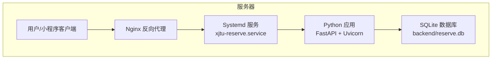
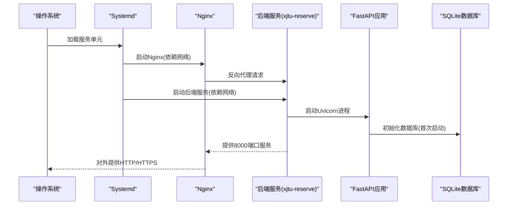
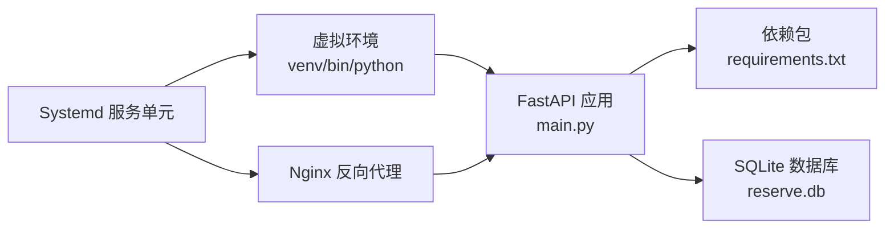

# Systemd服务管理

<cite>
**本文引用的文件**
- [README.md](file://README.md)
- [backend/main.py](file://backend/main.py)
- [backend/Dockerfile](file://backend/Dockerfile)
- [backend/requirements.txt](file://backend/requirements.txt)
- [deploy.sh](file://deploy.sh)
</cite>

## 目录
1. [简介](#简介)
2. [项目结构](#项目结构)
3. [核心组件](#核心组件)
4. [架构总览](#架构总览)
5. [详细组件分析](#详细组件分析)
6. [依赖关系分析](#依赖关系分析)
7. [性能考虑](#性能考虑)
8. [故障排查指南](#故障排查指南)
9. [结论](#结论)
10. [附录](#附录)

## 简介
本指南面向运维与开发人员，围绕本项目的Systemd服务管理展开，提供完整的.service文件配置模板、服务启动顺序与依赖关系、自动重启策略、资源限制配置建议、日志管理（journalctl）、服务状态监控与故障诊断方法，并扩展至多实例部署、服务更新策略与优雅重启机制，以及性能调优、内存管理与CPU亲和性的实践建议。文中所有配置与操作均基于仓库现有部署文档与代码实现进行提炼与扩展。

## 项目结构
本项目采用前后端分离架构，后端为FastAPI应用，通过Nginx反向代理对外提供服务。Systemd负责后端服务的生命周期管理，结合虚拟环境与Python依赖，确保服务稳定运行。



图表来源
- [README.md:134-331](file://README.md#L134-L331)
- [backend/main.py:670-673](file://backend/main.py#L670-L673)

章节来源
- [README.md:134-331](file://README.md#L134-L331)
- [backend/main.py:17-21](file://backend/main.py#L17-L21)

## 核心组件
- Systemd服务单元：负责后端服务的启动、停止、重启与自启控制，以及日志输出与资源隔离。
- FastAPI应用：提供REST API、静态页面与Swagger文档，监听8000端口。
- Nginx反向代理：对外暴露HTTP/HTTPS，转发请求至本地8000端口。
- SQLite数据库：存储会议室与预约数据，位于backend/reserve.db。
- 虚拟环境：隔离Python依赖，提升可维护性与安全性。

章节来源
- [README.md:134-331](file://README.md#L134-L331)
- [backend/main.py:670-673](file://backend/main.py#L670-L673)

## 架构总览
下图展示Systemd、Nginx与后端应用的交互关系，以及服务启动顺序与依赖关系。



图表来源
- [README.md:198-240](file://README.md#L198-L240)
- [backend/main.py:38-51](file://backend/main.py#L38-L51)

## 详细组件分析

### Systemd服务单元配置详解
基于仓库提供的部署文档，本节给出完整的服务单元模板与关键参数说明，便于直接复制使用与按需调整。

- 单元文件路径：/etc/systemd/system/xjtu-reserve.service
- 描述：XJTU Office Reserve API Server
- 关键参数
  - [Unit]段落
    - Description：服务描述
    - After：在网络就绪后再启动
  - [Service]段落
    - Type：simple（简单模式，主进程即服务进程）
    - User/Group：运行用户与组（建议非root）
    - WorkingDirectory：工作目录（后端代码所在目录）
    - Environment：环境变量（指定虚拟环境路径）
    - ExecStart：启动命令（使用虚拟环境中的Python执行main.py）
    - Restart：总是重启
    - RestartSec：重启间隔（秒）
  - [Install]段落
    - WantedBy：随多用户目标启用

章节来源
- [README.md:198-240](file://README.md#L198-L240)

### 服务启动顺序与依赖关系
- 依赖网络：After=network.target，确保网络可用后再启动服务。
- 依赖Nginx：若使用Nginx作为反向代理，可在[Unit]中添加BindsTo或Requires，以保证Nginx与后端服务的协同。
- 依赖数据库：后端应用在启动事件中初始化数据库，因此无需额外声明数据库依赖。

章节来源
- [README.md:198-240](file://README.md#L198-L240)
- [backend/main.py:38-51](file://backend/main.py#L38-L51)

### 自动重启策略
- Restart=always：无论异常退出还是正常退出，均自动重启。
- RestartSec=3：每次重启等待3秒，避免频繁重启造成资源浪费。
- 建议：结合日志监控与健康检查，必要时调整重启策略与阈值。

章节来源
- [README.md:205-224](file://README.md#L205-L224)

### 资源限制配置（建议）
以下为Systemd资源限制的常用配置项，建议根据服务器资源与业务负载进行调整。注意：这些为通用建议，需在实际环境中评估后启用。

- MemoryMax：限制内存使用上限
- MemorySwapMax：限制交换分区使用上限
- TasksMax：限制最大任务数
- CPUQuota：限制CPU配额
- IOWeight：I/O权重
- OOMPolicy：OOM处理策略

章节来源
- [README.md:198-240](file://README.md#L198-L240)

### 日志管理（journalctl）
- 实时查看日志：journalctl -u xjtu-reserve -f
- 查看最近日志：journalctl -u xjtu-reserve -n 100
- 按时间过滤：journalctl -u xjtu-reserve --since "2025-01-01 00:00:00"
- 导出日志：journalctl -u xjtu-reserve > /var/log/xjtu-reserve.log

章节来源
- [README.md:623-631](file://README.md#L623-L631)

### 服务状态监控
- 查看状态：systemctl status xjtu-reserve
- 查看开机自启：systemctl is-enabled xjtu-reserve
- 查看依赖链：systemctl list-dependencies xjtu-reserve

章节来源
- [README.md:238-239](file://README.md#L238-L239)

### 故障诊断方法
- 检查服务单元语法：systemctl daemon-reload
- 查看启动失败原因：journalctl -u xjtu-reserve --no-pager
- 检查端口占用：netstat -tulnp | grep :8000
- 检查依赖安装：pip install -r backend/requirements.txt
- 检查数据库文件权限：chown www-data:www-data backend/reserve.db

章节来源
- [README.md:228-240](file://README.md#L228-L240)
- [README.md:610-621](file://README.md#L610-L621)

### 多实例部署
- 通过不同端口与工作目录实现多实例
  - 端口：在后端应用中修改监听端口（参考后端代码中的端口配置）
  - 工作目录：为每个实例创建独立目录
  - 服务单元：复制同一模板，仅修改端口与工作目录
- 注意：多实例需避免端口冲突与共享资源竞争

章节来源
- [backend/main.py:670-673](file://backend/main.py#L670-L673)
- [README.md:134-195](file://README.md#L134-L195)

### 服务更新策略
- 灰度发布：先在测试实例上验证，再滚动更新生产实例
- 优雅停机：在更新前停止服务，待Nginx移除实例后再重启
- 回滚策略：保留旧版本服务单元与依赖，必要时回退

章节来源
- [README.md:228-240](file://README.md#L228-L240)

### 优雅重启机制
- 使用systemctl restart xjtu-reserve触发平滑重启
- 若需更精细控制，可在Nginx中先将实例摘除，再重启服务，最后恢复

章节来源
- [README.md:232-236](file://README.md#L232-L236)

## 依赖关系分析
后端应用的运行依赖包括Python解释器、虚拟环境、依赖包与SQLite数据库。Systemd通过服务单元统一管理这些依赖的加载顺序与运行环境。



图表来源
- [backend/requirements.txt:1-5](file://backend/requirements.txt#L1-L5)
- [backend/main.py:670-673](file://backend/main.py#L670-L673)
- [README.md:198-240](file://README.md#L198-L240)

章节来源
- [backend/requirements.txt:1-5](file://backend/requirements.txt#L1-L5)
- [backend/main.py:670-673](file://backend/main.py#L670-L673)
- [README.md:198-240](file://README.md#L198-L240)

## 性能考虑
- 运行时性能
  - 使用Uvicorn作为ASGI服务器，支持异步与并发
  - 合理设置并发连接数与超时时间
- 内存管理
  - 通过Systemd的MemoryMax限制内存使用，防止内存泄漏导致系统不稳定
  - 定期清理临时文件与日志轮转
- CPU亲和性
  - 使用systemd的CPUAffinity或numactl进行CPU绑定，减少上下文切换
  - 结合业务特性，将高负载请求分配到特定CPU核心
- I/O优化
  - 使用IOWeight与IOBudget优化磁盘I/O
  - SQLite数据库建议使用SSD与合适的fsync策略

章节来源
- [backend/Dockerfile:17-21](file://backend/Dockerfile#L17-L21)
- [backend/main.py:670-673](file://backend/main.py#L670-L673)

## 故障排查指南
- 启动失败
  - 检查服务单元语法与路径
  - 查看journalctl输出定位具体错误
- 端口占用
  - 使用netstat或ss确认8000端口占用情况
  - 更改后端监听端口或释放占用进程
- 权限问题
  - 确保www-data用户对工作目录与数据库文件具有读写权限
- 依赖缺失
  - 在虚拟环境中重新安装requirements.txt
- 数据库异常
  - 检查数据库文件是否存在与权限
  - 必要时备份并重建数据库

章节来源
- [README.md:228-240](file://README.md#L228-L240)
- [README.md:610-621](file://README.md#L610-L621)

## 结论
通过Systemd统一管理后端服务，结合Nginx反向代理与SQLite数据库，本项目实现了稳定、可维护的部署方案。遵循本文提供的配置模板与最佳实践，可进一步提升服务的可靠性、可观测性与性能表现。建议在生产环境中逐步引入资源限制、健康检查与多实例部署策略，以满足更高的可用性与扩展性需求。

## 附录

### Systemd服务单元模板
以下为可直接使用的.service文件模板，包含关键参数说明与注释，便于按需调整。

```ini
[Unit]
Description=XJTU Office Reserve API Server
After=network.target

[Service]
Type=simple
User=www-data
Group=www-data
WorkingDirectory=/opt/xjtu-office-reserve/backend
Environment="PATH=/opt/xjtu-office-reserve/venv/bin"
ExecStart=/opt/xjtu-office-reserve/venv/bin/python main.py
Restart=always
RestartSec=3

[Install]
WantedBy=multi-user.target
```

章节来源
- [README.md:205-224](file://README.md#L205-L224)

### 启动与管理命令
- 重载配置：systemctl daemon-reload
- 启动服务：systemctl start xjtu-reserve
- 设置开机自启：systemctl enable xjtu-reserve
- 查看状态：systemctl status xjtu-reserve
- 实时查看日志：journalctl -u xjtu-reserve -f

章节来源
- [README.md:228-239](file://README.md#L228-L239)
- [README.md:626-627](file://README.md#L626-L627)

### 后端应用与端口配置
- 后端应用入口：backend/main.py
- 监听端口：默认8000（可在main.py中修改）
- 依赖包：backend/requirements.txt

章节来源
- [backend/main.py:670-673](file://backend/main.py#L670-L673)
- [backend/requirements.txt:1-5](file://backend/requirements.txt#L1-L5)