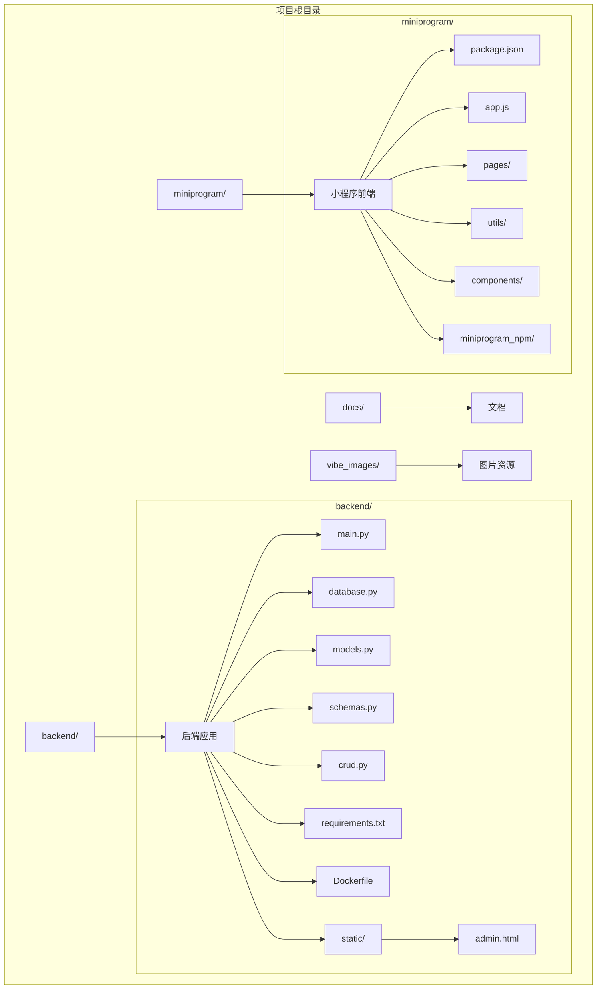
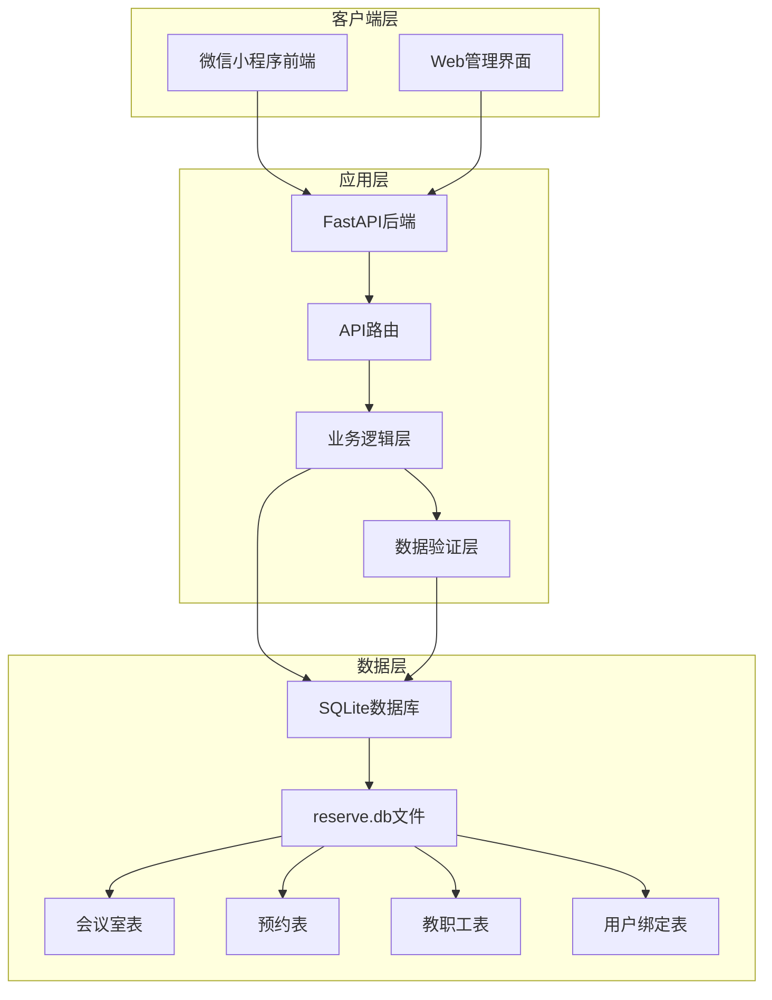
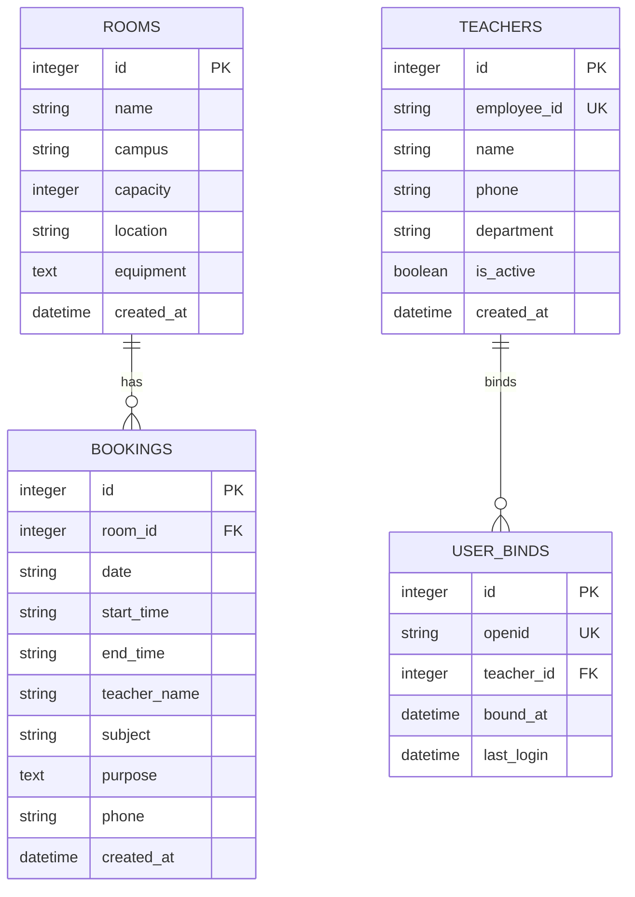
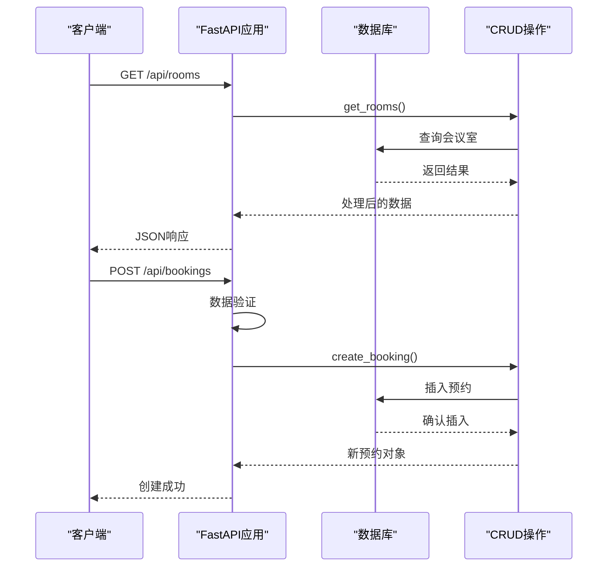
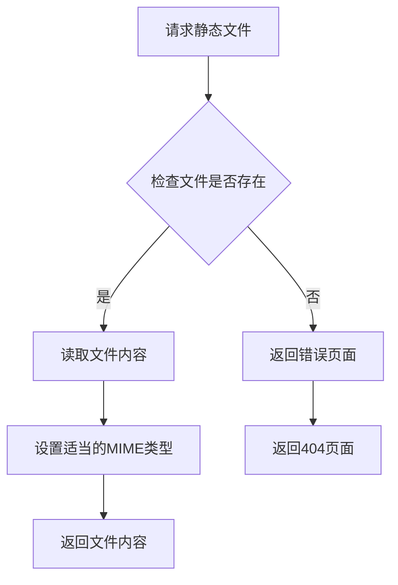
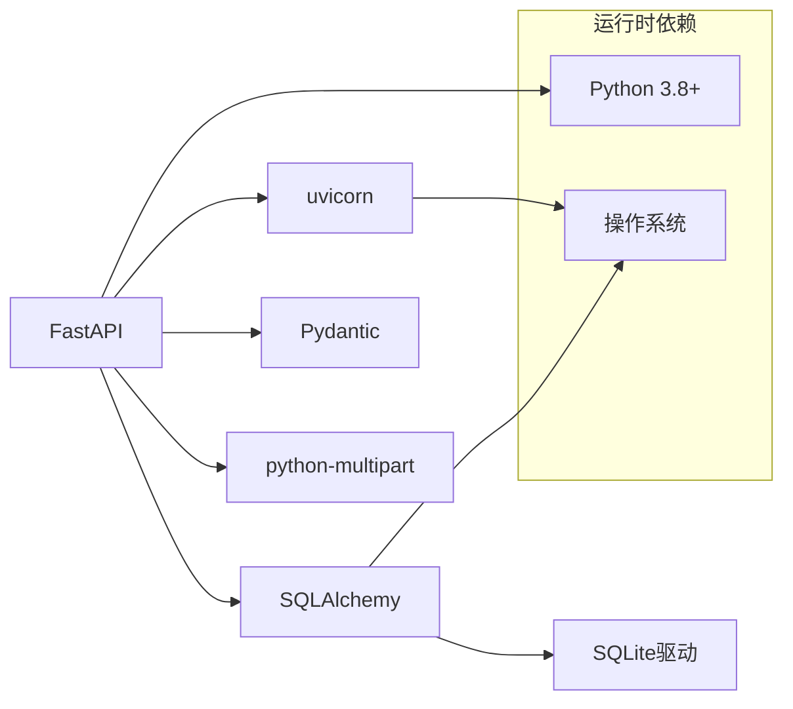

# 传统服务器部署

<cite>
**本文档引用的文件**
- [backend/main.py](file://backend/main.py)
- [backend/requirements.txt](file://backend/requirements.txt)
- [backend/database.py](file://backend/database.py)
- [backend/models.py](file://backend/models.py)
- [backend/schemas.py](file://backend/schemas.py)
- [backend/crud.py](file://backend/crud.py)
- [backend/Dockerfile](file://backend/Dockerfile)
- [backend/static/admin.html](file://backend/static/admin.html)
- [miniprogram/package.json](file://miniprogram/package.json)
- [deploy.sh](file://deploy.sh)
- [README.md](file://README.md)
- [docs/MINIPROGRAM_DEBUG_GUIDE.md](file://docs/MINIPROGRAM_DEBUG_GUIDE.md)
</cite>

## 目录
1. [简介](#简介)
2. [项目结构](#项目结构)
3. [核心组件](#核心组件)
4. [架构概览](#架构概览)
5. [详细组件分析](#详细组件分析)
6. [依赖分析](#依赖分析)
7. [性能考虑](#性能考虑)
8. [故障排除指南](#故障排除指南)
9. [结论](#结论)
10. [附录](#附录)

## 简介

西安交通大学软件学院会议室预约系统是一个基于微信小程序 + FastAPI + SQLite 的前后端分离架构项目。系统支持多校区会议室预约管理，提供实时状态显示、时间线预约、Web管理界面等功能。

本指南专注于传统服务器部署，涵盖Ubuntu/CentOS系统环境准备、Python 3.8+环境配置、pip包管理器安装、后端依赖安装、小程序依赖npm安装、后端服务启动方式、进程管理、端口配置、系统服务配置、防火墙设置、SSL证书配置、数据库初始化、静态文件配置、日志管理和错误排查方法。

## 项目结构

该项目采用前后端分离的目录结构：



**图表来源**
- [backend/main.py:1-673](file://backend/main.py#L1-L673)
- [miniprogram/package.json:1-6](file://miniprogram/package.json#L1-L6)

**章节来源**
- [backend/main.py:1-673](file://backend/main.py#L1-L673)
- [README.md:1-637](file://README.md#L1-L637)

## 核心组件

### 后端服务组件

后端采用FastAPI框架，提供RESTful API服务：

- **主应用入口**: [backend/main.py:1-673](file://backend/main.py#L1-L673)
- **数据库配置**: [backend/database.py:1-62](file://backend/database.py#L1-L62)
- **数据模型**: [backend/models.py:1-75](file://backend/models.py#L1-L75)
- **数据验证**: [backend/schemas.py:1-185](file://backend/schemas.py#L1-L185)
- **业务逻辑**: [backend/crud.py:1-343](file://backend/crud.py#L1-L343)

### 小程序前端组件

小程序采用原生开发 + Vant Weapp UI组件库：

- **依赖配置**: [miniprogram/package.json:1-6](file://miniprogram/package.json#L1-L6)
- **管理后台页面**: [backend/static/admin.html:1-800](file://backend/static/admin.html#L1-L800)

**章节来源**
- [backend/main.py:1-673](file://backend/main.py#L1-L673)
- [backend/database.py:1-62](file://backend/database.py#L1-L62)
- [backend/models.py:1-75](file://backend/models.py#L1-L75)
- [backend/schemas.py:1-185](file://backend/schemas.py#L1-L185)
- [backend/crud.py:1-343](file://backend/crud.py#L1-L343)
- [miniprogram/package.json:1-6](file://miniprogram/package.json#L1-L6)

## 架构概览

系统采用三层架构设计：



**图表来源**
- [backend/main.py:1-673](file://backend/main.py#L1-L673)
- [backend/models.py:1-75](file://backend/models.py#L1-L75)
- [backend/database.py:1-62](file://backend/database.py#L1-L62)

系统架构特点：
- **前后端分离**: 微信小程序前端与FastAPI后端完全分离
- **RESTful API**: 提供标准HTTP接口
- **CORS支持**: 支持跨域请求
- **SQLite存储**: 轻量级文件数据库，无需独立数据库服务
- **静态文件服务**: 内置静态文件托管

## 详细组件分析

### 数据库管理系统

数据库采用SQLite，具有以下特性：



**图表来源**
- [backend/models.py:1-75](file://backend/models.py#L1-L75)

数据库配置特点：
- **环境变量支持**: 通过`DATA_PATH`环境变量控制数据库文件位置
- **自动迁移**: 支持数据库结构自动迁移
- **示例数据**: 首次启动时自动创建示例数据

**章节来源**
- [backend/database.py:1-62](file://backend/database.py#L1-L62)
- [backend/models.py:1-75](file://backend/models.py#L1-L75)

### API路由系统

后端提供完整的RESTful API：



**图表来源**
- [backend/main.py:78-342](file://backend/main.py#L78-L342)
- [backend/crud.py:1-343](file://backend/crud.py#L1-L343)

主要API分组：
- **校区管理**: `/api/campus`
- **会议室管理**: `/api/rooms`
- **预约管理**: `/api/bookings`
- **管理后台**: `/api/admin/*`
- **认证系统**: `/api/auth/*`

**章节来源**
- [backend/main.py:67-620](file://backend/main.py#L67-L620)

### 静态文件服务

系统内置静态文件服务：



静态文件配置：
- **目录位置**: `backend/static/`
- **挂载路径**: `/static`
- **管理后台**: `admin.html`

**章节来源**
- [backend/main.py:32-667](file://backend/main.py#L32-L667)
- [backend/static/admin.html:1-800](file://backend/static/admin.html#L1-L800)

## 依赖分析

### 后端依赖

后端使用的主要Python包：



**图表来源**
- [backend/requirements.txt:1-5](file://backend/requirements.txt#L1-L5)

关键依赖说明：
- **FastAPI**: 现代Python Web框架，提供异步支持和自动API文档
- **Uvicorn**: ASGI服务器，用于生产环境部署
- **SQLAlchemy**: ORM框架，提供数据库抽象层
- **Pydantic**: 数据验证和序列化
- **python-multipart**: 处理multipart表单数据

**章节来源**
- [backend/requirements.txt:1-5](file://backend/requirements.txt#L1-L5)

### 小程序依赖

小程序使用Vant Weapp UI组件库：

```mermaid
graph TD
A[小程序项目] --> B[@vant/weapp]
B --> C[Vant组件]
C --> D[Button]
C --> E[Field]
C --> F[Calendar]
C --> G[Dialog]
subgraph "开发工具链"
H[Node.js 16+]
I[npm/yarn]
J[微信开发者工具]
end
A --> H
H --> I
I --> J
```

**图表来源**
- [miniprogram/package.json:1-6](file://miniprogram/package.json#L1-L6)

**章节来源**
- [miniprogram/package.json:1-6](file://miniprogram/package.json#L1-L6)

## 性能考虑

### 数据库性能优化

- **索引策略**: 关键查询字段已建立索引
- **连接池**: SQLAlchemy提供连接池管理
- **事务处理**: 合理的事务边界设计
- **查询优化**: 避免N+1查询问题

### API性能优化

- **异步处理**: FastAPI支持异步请求处理
- **缓存策略**: 可扩展的缓存机制
- **响应压缩**: 支持Gzip压缩
- **并发处理**: Uvicorn支持多进程部署

### 部署性能优化

- **静态文件缓存**: Nginx配置了静态文件缓存
- **反向代理**: 减少直接暴露Python应用的负载
- **负载均衡**: 支持多实例部署
- **监控集成**: 内置健康检查端点

## 故障排除指南

### 常见部署问题

#### 1. Python环境问题

**问题**: Python版本过低
**解决方案**:
```bash
# 检查Python版本
python3 --version

# Ubuntu/Debian安装
sudo apt update
sudo apt install python3 python3-pip python3-venv

# CentOS/RHEL安装
sudo yum install python3 python3-pip
```

#### 2. 依赖安装失败

**问题**: pip安装超时或失败
**解决方案**:
```bash
# 使用国内镜像源
pip install -r requirements.txt -i https://pypi.tuna.tsinghua.edu.cn/simple/

# 或设置代理
pip install --proxy http://proxy.server.com:port -r requirements.txt
```

#### 3. 数据库权限问题

**问题**: SQLite文件权限不足
**解决方案**:
```bash
# 设置正确的文件权限
sudo chown -R www-data:www-data backend/
sudo chmod -R 755 backend/

# 或使用当前用户
chmod -R 755 backend/
```

#### 4. 端口占用问题

**问题**: 端口8000被占用
**解决方案**:
```bash
# 检查端口占用
lsof -i :8000

# 更改端口配置
# 修改 backend/main.py 中的端口号
uvicorn.run(app, host="0.0.0.0", port=8080)
```

### 日志和监控

#### 1. 应用日志

**查看应用日志**:
```bash
# 使用systemd查看日志
sudo journalctl -u xjtu-reserve -f

# 查看最近日志
journalctl -u xjtu-reserve --since "10 minutes ago"
```

#### 2. Nginx日志

**查看Nginx错误日志**:
```bash
# 查看错误日志
sudo tail -f /var/log/nginx/error.log

# 查看访问日志
sudo tail -f /var/log/nginx/access.log
```

#### 3. 数据库日志

**检查数据库状态**:
```bash
# 连接数据库检查
sqlite3 backend/reserve.db
.tables

# 查看数据统计
SELECT COUNT(*) FROM rooms;
SELECT COUNT(*) FROM bookings;
```

### 调试技巧

#### 1. API调试

**使用curl测试API**:
```bash
# 获取校区列表
curl http://localhost:8000/api/campus

# 获取会议室列表
curl "http://localhost:8000/api/rooms?campus=xingqing&date=2024-01-15"

# 获取管理后台状态
curl http://localhost:8000/api/debug/db-status
```

#### 2. 数据库调试

**数据库备份**:
```bash
# 备份数据库
cp backend/reserve.db backend/reserve.db.backup.$(date +%Y%m%d_%H%M%S)

# 恢复数据库
cp backend/reserve.db.backup backend/reserve.db
```

**章节来源**
- [README.md:623-631](file://README.md#L623-L631)

## 结论

本部署指南提供了完整的传统服务器部署方案，涵盖了从环境准备到生产部署的各个环节。系统采用现代技术栈，具有良好的可维护性和扩展性。

关键优势：
- **技术栈成熟**: FastAPI + SQLite组合稳定可靠
- **部署简单**: 无需复杂的数据库配置
- **成本低廉**: SQLite无需独立数据库服务
- **易于扩展**: 支持容器化和微服务架构

建议的后续步骤：
1. 根据生产环境需求调整配置
2. 实施监控和告警系统
3. 建立CI/CD流水线
4. 制定备份和灾难恢复计划

## 附录

### 系统服务配置示例

#### systemd服务配置

```ini
[Unit]
Description=XJTU Office Reserve API Server
After=network.target

[Service]
Type=simple
User=www-data
Group=www-data
WorkingDirectory=/opt/xjtu-office-reserve/backend
Environment="PATH=/opt/xjtu-office-reserve/venv/bin"
ExecStart=/opt/xjtu-office-reserve/venv/bin/python main.py
Restart=always
RestartSec=3

[Install]
WantedBy=multi-user.target
```

#### Nginx反向代理配置

```nginx
server {
    listen 80;
    server_name your-domain.com;
    return 301 https://$server_name$request_uri;
}

server {
    listen 443 ssl http2;
    server_name your-domain.com;

    ssl_certificate /etc/letsencrypt/live/your-domain.com/fullchain.pem;
    ssl_certificate_key /etc/letsencrypt/live/your-domain.com/privkey.pem;
    ssl_protocols TLSv1.2 TLSv1.3;
    ssl_prefer_server_ciphers on;

    location / {
        proxy_pass http://127.0.0.1:8000;
        proxy_set_header Host $host;
        proxy_set_header X-Real-IP $remote_addr;
        proxy_set_header X-Forwarded-For $proxy_add_x_forwarded_for;
        proxy_set_header X-Forwarded-Proto $scheme;
    }

    location /static/ {
        proxy_pass http://127.0.0.1:8000/static/;
        expires 7d;
    }
}
```

### 数据库管理

#### 数据库备份脚本

```bash
#!/bin/bash
# 备份数据库
DATE=$(date +%Y%m%d_%H%M%S)
cp backend/reserve.db backend/reserve.db.backup_${DATE}

# 验证备份
if [ -f backend/reserve.db.backup_${DATE} ]; then
    echo "备份成功: reserve.db.backup_${DATE}"
else
    echo "备份失败"
fi
```

#### 数据库恢复脚本

```bash
#!/bin/bash
# 恢复数据库
if [ $# -eq 0 ]; then
    echo "使用方法: ./restore_db.sh backup_file"
    exit 1
fi

BACKUP_FILE=$1
if [ -f $BACKUP_FILE ]; then
    cp $BACKUP_FILE backend/reserve.db
    echo "数据库恢复成功"
else
    echo "备份文件不存在"
fi
```

### 环境变量配置

#### 生产环境配置

```bash
# 设置数据库目录
export DATA_PATH=/opt/xjtu-office-reserve/data

# 设置日志级别
export LOG_LEVEL=INFO

# 设置调试模式
export DEBUG=false

# 设置服务器域名
export SERVER_NAME=your-domain.com
```