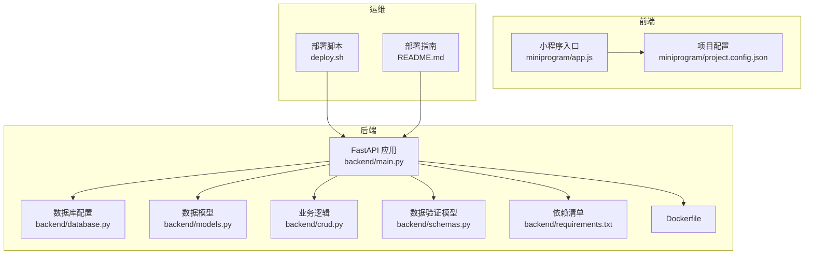
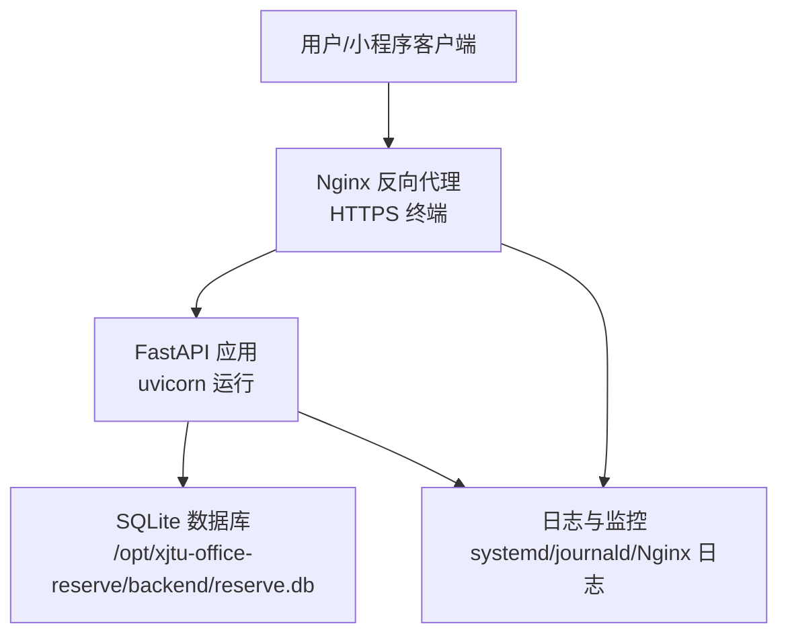
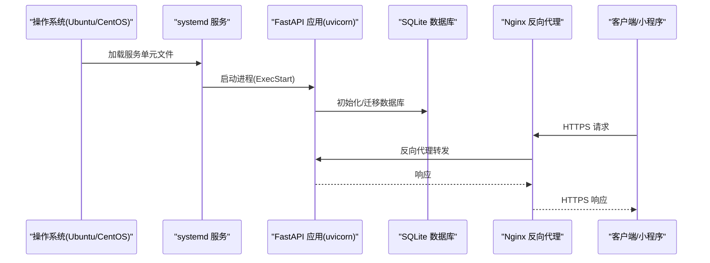
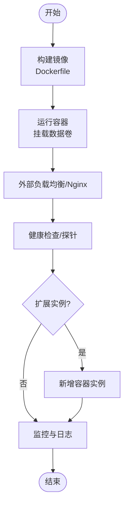
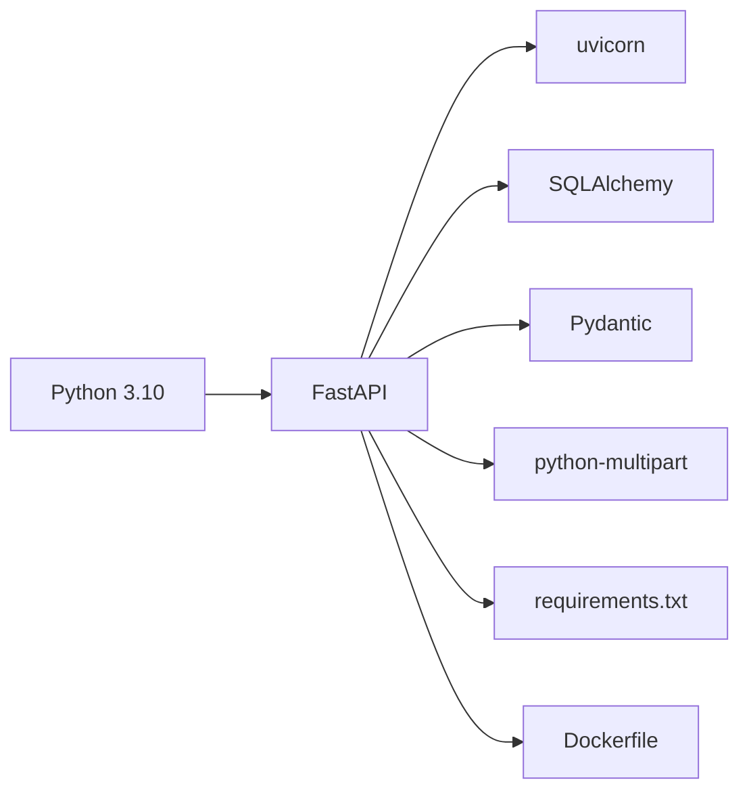

# 生产环境部署

<cite>
**本文引用的文件**
- [backend/main.py](file://backend/main.py)
- [backend/database.py](file://backend/database.py)
- [backend/models.py](file://backend/models.py)
- [backend/crud.py](file://backend/crud.py)
- [backend/schemas.py](file://backend/schemas.py)
- [backend/Dockerfile](file://backend/Dockerfile)
- [backend/requirements.txt](file://backend/requirements.txt)
- [deploy.sh](file://deploy.sh)
- [README.md](file://README.md)
- [miniprogram/app.js](file://miniprogram/app.js)
- [miniprogram/project.config.json](file://miniprogram/project.config.json)
</cite>

## 目录
1. [简介](#简介)
2. [项目结构](#项目结构)
3. [核心组件](#核心组件)
4. [架构总览](#架构总览)
5. [详细组件分析](#详细组件分析)
6. [依赖分析](#依赖分析)
7. [性能考量](#性能考量)
8. [故障排查指南](#故障排查指南)
9. [结论](#结论)
10. [附录](#附录)

## 简介
本方案面向“西安交通大学软件学院会议室预约系统”的生产环境部署，覆盖传统服务器部署与 Docker 容器化部署两类路径。内容包括服务器环境准备（Ubuntu/CentOS）、Nginx 反向代理与 SSL 证书配置、防火墙设置；深入解析 systemd 服务配置文件编写、进程守护、自动重启与日志管理；提供 Docker 镜像构建、容器运行与集群部署策略；涵盖负载均衡、数据库连接池与缓存策略、性能监控；并给出安全加固、备份恢复与灾难恢复流程建议。

## 项目结构
项目采用前后端分离架构：后端为 FastAPI 应用，使用 SQLite 作为本地数据库；前端为微信小程序；提供一键部署脚本与 Dockerfile 以支持容器化部署。

**图表来源**
- [backend/main.py:1-673](file://backend/main.py#L1-L673)
- [backend/database.py:1-62](file://backend/database.py#L1-L62)
- [backend/models.py:1-75](file://backend/models.py#L1-L75)
- [backend/crud.py:1-343](file://backend/crud.py#L1-L343)
- [backend/schemas.py:1-185](file://backend/schemas.py#L1-L185)
- [backend/requirements.txt:1-5](file://backend/requirements.txt#L1-L5)
- [backend/Dockerfile:1-21](file://backend/Dockerfile#L1-L21)
- [miniprogram/app.js:1-127](file://miniprogram/app.js#L1-L127)
- [miniprogram/project.config.json:1-59](file://miniprogram/project.config.json#L1-L59)
- [deploy.sh:1-163](file://deploy.sh#L1-L163)
- [README.md:1-637](file://README.md#L1-L637)

**章节来源**
- [README.md:1-637](file://README.md#L1-L637)
- [backend/main.py:1-673](file://backend/main.py#L1-L673)
- [backend/Dockerfile:1-21](file://backend/Dockerfile#L1-L21)
- [deploy.sh:1-163](file://deploy.sh#L1-L163)

## 核心组件
- FastAPI 应用：提供 RESTful API、Swagger 文档、CORS 支持、静态资源挂载与管理后台页面。
- 数据库层：SQLite 文件数据库，通过环境变量控制数据目录，支持迁移与初始化。
- 业务层：CRUD 操作封装，包含会议室、预约、教职工与用户绑定等核心逻辑。
- 前端：微信小程序，支持云开发与后端直连两种获取 openid 的方式。
- 运维：一键部署脚本与 Dockerfile，支持传统服务器与容器化部署。

**章节来源**
- [backend/main.py:1-673](file://backend/main.py#L1-L673)
- [backend/database.py:1-62](file://backend/database.py#L1-L62)
- [backend/crud.py:1-343](file://backend/crud.py#L1-L343)
- [backend/models.py:1-75](file://backend/models.py#L1-L75)
- [backend/schemas.py:1-185](file://backend/schemas.py#L1-L185)
- [miniprogram/app.js:1-127](file://miniprogram/app.js#L1-L127)

## 架构总览
系统采用“小程序前端 + FastAPI 后端 + SQLite 数据库”的轻量架构。生产环境推荐通过 Nginx 提供反向代理与 SSL 终端，后端通过 systemd 守护，数据库文件持久化至独立目录，结合定时备份与监控实现稳定运行。

**图表来源**
- [backend/main.py:1-673](file://backend/main.py#L1-L673)
- [backend/database.py:1-62](file://backend/database.py#L1-L62)
- [README.md:242-331](file://README.md#L242-L331)

## 详细组件分析

### 传统服务器部署（Ubuntu/CentOS）
- 环境准备
  - 安装 Python 3、pip 与 venv；创建项目目录与虚拟环境。
  - 上传代码或使用 git clone。
- 依赖安装
  - 在虚拟环境中安装 requirements.txt。
- 数据库初始化
  - 启动时自动创建表与执行迁移；数据库文件默认位于项目目录，生产建议通过环境变量指定持久化目录。
- systemd 服务配置
  - 编写服务单元文件，设置用户/组、工作目录、环境 PATH、ExecStart、Restart 策略与重启间隔。
  - 重载 systemd、启动服务、设置开机自启、查看状态。
- Nginx 反向代理与 SSL
  - 安装 Nginx，配置站点监听 80/443，强制跳转 HTTPS，开启 HTTP/2，配置 SSL 证书路径，反向代理到 127.0.0.1:8000，静态资源缓存。
  - 使用 certbot 获取并自动续期 Let’s Encrypt 证书。
- 防火墙
  - 开放 Nginx 全功能规则，检查状态。

**图表来源**
- [README.md:197-331](file://README.md#L197-L331)
- [backend/main.py:38-50](file://backend/main.py#L38-L50)
- [backend/database.py:55-62](file://backend/database.py#L55-L62)

**章节来源**
- [README.md:134-331](file://README.md#L134-L331)

### Docker 容器化部署
- 镜像构建
  - 基于 python:3.10-slim，复制 requirements.txt 并安装依赖，复制代码，创建数据目录，暴露 8000 端口，CMD 启动 uvicorn。
- 运行与持久化
  - 将宿主机目录挂载到容器内数据目录，确保数据库文件持久化。
- 集群与编排
  - 使用 docker-compose 编排单实例或多实例，结合外部 Nginx/LB 实现负载均衡；或在 Kubernetes 中以 Deployment + Service + PersistentVolumeClaim 管理。
- 安全与网络
  - 限制容器权限、只读根文件系统、最小化依赖、使用非 root 用户运行、网络隔离与只暴露必要端口。

**图表来源**
- [backend/Dockerfile:1-21](file://backend/Dockerfile#L1-L21)

**章节来源**
- [backend/Dockerfile:1-21](file://backend/Dockerfile#L1-L21)

### systemd 服务配置详解
- 关键项说明
  - [Unit]：描述服务、依赖网络。
  - [Service]：simple 类型、指定用户/组、工作目录、环境 PATH、ExecStart、Restart=always、RestartSec=3。
  - [Install]：加入多用户目标。
- 启停与状态
  - daemon-reload、start、enable、status。
- 日志管理
  - journalctl -u xjtu-reserve -f 查看实时日志；结合 journald 配置滚动与保留策略。

**章节来源**
- [README.md:197-240](file://README.md#L197-L240)

### Nginx 反向代理与 SSL
- 反代配置要点
  - 监听 80/443，强制跳转 HTTPS，配置 SSL 证书与协议，反代到 127.0.0.1:8000，静态资源缓存。
- 证书获取与续期
  - 使用 certbot 安装与获取证书，测试配置后重载 Nginx。
- 防火墙
  - 开放 Nginx Full 规则，检查状态。

**章节来源**
- [README.md:242-331](file://README.md#L242-L331)

### 数据库与缓存策略
- 数据库
  - SQLite 文件数据库，默认位于项目目录；生产建议通过环境变量 DATA_PATH 指向持久化目录，定期备份 reserve.db。
- 缓存
  - 当前未集成缓存层；如需提升高并发场景下的读性能，可在应用层引入 Redis 或本地内存缓存，并对热点数据（如会议室列表、时间线）做缓存与失效策略。

**章节来源**
- [backend/database.py:8-13](file://backend/database.py#L8-L13)
- [README.md:582-591](file://README.md#L582-L591)

### 性能监控
- 应用层
  - uvicorn 默认支持多 worker 与异步路由；结合 Nginx 的上游健康检查与限流。
- 基础设施
  - 使用 systemd-journald、Nginx error/access 日志、系统监控（CPU/内存/磁盘 IO/网络）与告警。

**章节来源**
- [backend/main.py:670-673](file://backend/main.py#L670-L673)
- [README.md:322-331](file://README.md#L322-L331)

### 安全加固
- 网络
  - 仅开放必要端口，使用 fail2ban、ufw 限制扫描与暴力破解。
- 应用
  - CORS 生产环境限制来源；HTTPS 强制；敏感日志脱敏；最小权限运行。
- 数据
  - 数据库文件权限最小化；备份加密存储；定期轮换密钥。

**章节来源**
- [backend/main.py:23-30](file://backend/main.py#L23-L30)
- [README.md:322-331](file://README.md#L322-L331)

### 备份与灾难恢复
- 备份
  - cp 或 sqlite3 .backup 备份 reserve.db；建议自动化脚本与异地存储。
- 恢复
  - 停止服务 -> 恢复数据库文件 -> 启动服务；验证 API 与管理后台可用性。
- 灾难恢复
  - 多机房/多副本部署；使用外部负载均衡与自动切换；演练恢复流程并定期验证。

**章节来源**
- [README.md:582-621](file://README.md#L582-L621)

## 依赖分析
后端依赖集中于 FastAPI、uvicorn、SQLAlchemy、Pydantic 与 python-multipart。Dockerfile 明确了镜像构建步骤与端口暴露。

**图表来源**
- [backend/requirements.txt:1-5](file://backend/requirements.txt#L1-L5)
- [backend/Dockerfile:1-21](file://backend/Dockerfile#L1-L21)

**章节来源**
- [backend/requirements.txt:1-5](file://backend/requirements.txt#L1-L5)
- [backend/Dockerfile:1-21](file://backend/Dockerfile#L1-L21)

## 性能考量
- 连接池
  - SQLAlchemy 默认连接池适用于中小规模；高并发建议评估连接数上限与超时策略。
- 静态资源
  - Nginx 缓存静态文件，减少后端压力。
- 反代与限流
  - Nginx 层限流与健康检查，保护后端免受突发流量冲击。
- 数据库
  - SQLite 适合单实例；若并发较高，建议迁移到 PostgreSQL 并启用连接池与只读副本。

[本节为通用指导，无需特定文件引用]

## 故障排查指南
- 服务无法启动
  - 检查 systemd 状态与日志：journalctl -u xjtu-reserve -f；确认虚拟环境与依赖安装正确。
- Nginx 502/504
  - 检查后端是否监听 127.0.0.1:8000；确认 uvicorn 进程存活；查看 Nginx 错误日志。
- SSL 证书问题
  - 使用 certbot --nginx -d 域名 获取证书；检查证书链与过期时间；测试自动续期。
- 数据库异常
  - 检查 reserve.db 权限与磁盘空间；必要时重置数据库并重启服务。

**章节来源**
- [README.md:623-631](file://README.md#L623-L631)

## 结论
本方案提供了从传统服务器到 Docker 容器化的完整部署路径，结合 Nginx 反代与 SSL、systemd 守护与日志、数据库持久化与备份、以及安全加固与监控建议，能够支撑系统的稳定运行与演进。建议在生产中逐步引入外部数据库、Redis 缓存与外部负载均衡，并完善自动化运维与灾备演练。

## 附录
- 一键部署脚本
  - 支持检测 Python/pip、安装后端依赖、可选虚拟环境、安装小程序依赖、启动后端服务并验证。
- 小程序配置
  - 修改 project.config.json 的 appid 与云开发环境；在 app.js 中配置后端 API 基础地址与云环境 ID。

**章节来源**
- [deploy.sh:1-163](file://deploy.sh#L1-L163)
- [miniprogram/project.config.json:1-59](file://miniprogram/project.config.json#L1-L59)
- [miniprogram/app.js:1-127](file://miniprogram/app.js#L1-L127)