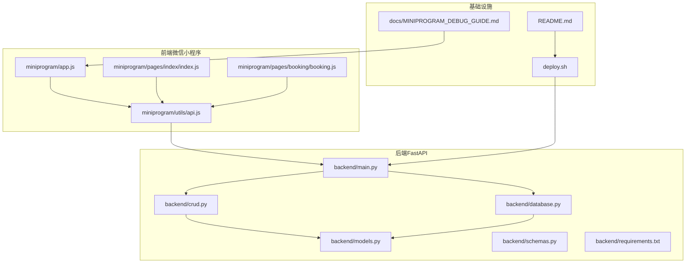
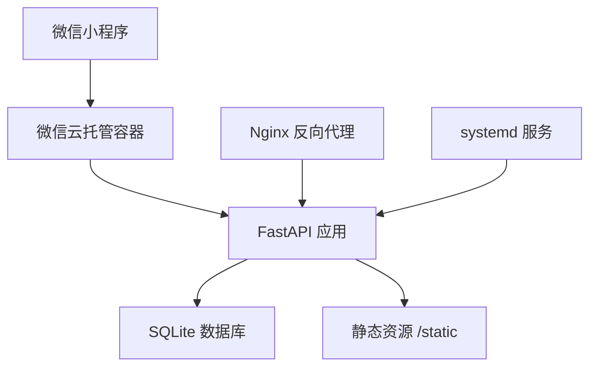
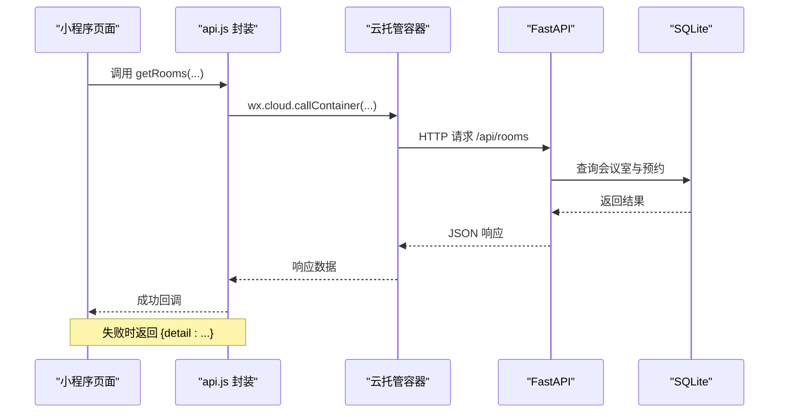
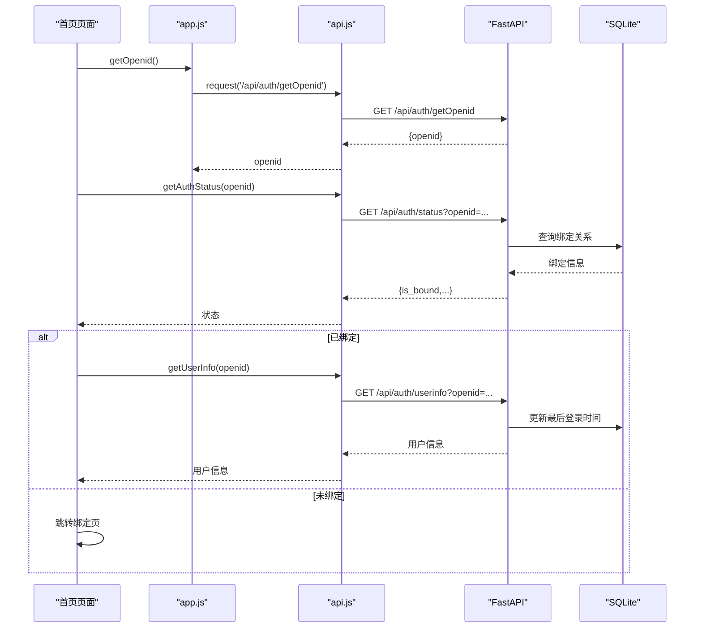
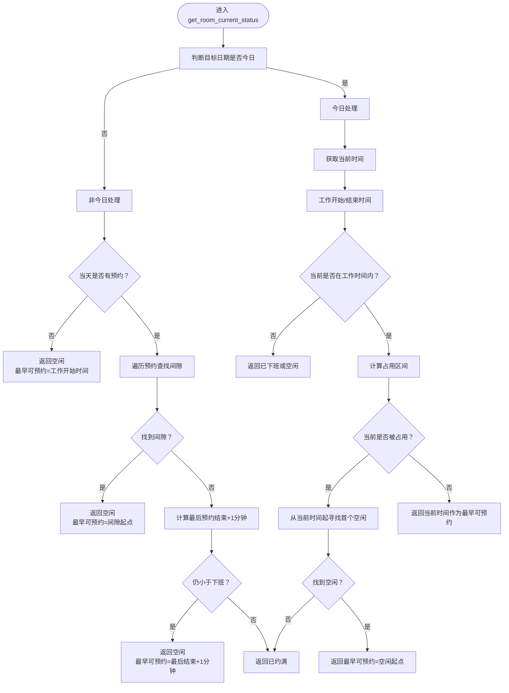

# 监控与维护

<cite>
**本文引用的文件**
- [backend/main.py](file://backend/main.py)
- [backend/database.py](file://backend/database.py)
- [backend/crud.py](file://backend/crud.py)
- [backend/models.py](file://backend/models.py)
- [backend/schemas.py](file://backend/schemas.py)
- [backend/requirements.txt](file://backend/requirements.txt)
- [miniprogram/utils/api.js](file://miniprogram/utils/api.js)
- [miniprogram/app.js](file://miniprogram/app.js)
- [miniprogram/pages/index/index.js](file://miniprogram/pages/index/index.js)
- [miniprogram/pages/booking/booking.js](file://miniprogram/pages/booking/booking.js)
- [deploy.sh](file://deploy.sh)
- [README.md](file://README.md)
- [docs/MINIPROGRAM_DEBUG_GUIDE.md](file://docs/MINIPROGRAM_DEBUG_GUIDE.md)
</cite>

## 目录
1. [简介](#简介)
2. [项目结构](#项目结构)
3. [核心组件](#核心组件)
4. [架构总览](#架构总览)
5. [详细组件分析](#详细组件分析)
6. [依赖分析](#依赖分析)
7. [性能考量](#性能考量)
8. [故障排查指南](#故障排查指南)
9. [结论](#结论)
10. [附录](#附录)

## 简介
本指南面向系统运维与开发团队，围绕“后端API服务、数据库连接、前端小程序运行状态”三大维度，提供服务健康检查、性能监控、日志管理与故障诊断的完整方案。同时覆盖定期维护任务（数据清理、索引优化、备份验证）、性能优化建议、容量规划与扩容策略，以及运维自动化脚本与应急响应流程，帮助您稳定、高效地运营会议室预约系统。

## 项目结构
系统采用前后端分离架构：后端基于 FastAPI + SQLite；前端为微信小程序。部署与运维涉及后端服务、反向代理（Nginx）、数据库文件管理、小程序域名配置与云托管对接。

图表来源
- [backend/main.py:1-673](file://backend/main.py#L1-L673)
- [backend/database.py:1-62](file://backend/database.py#L1-L62)
- [backend/crud.py:1-343](file://backend/crud.py#L1-L343)
- [backend/models.py:1-75](file://backend/models.py#L1-L75)
- [backend/schemas.py:1-185](file://backend/schemas.py#L1-L185)
- [backend/requirements.txt:1-5](file://backend/requirements.txt#L1-L5)
- [miniprogram/utils/api.js:1-184](file://miniprogram/utils/api.js#L1-L184)
- [miniprogram/app.js:1-127](file://miniprogram/app.js#L1-L127)
- [miniprogram/pages/index/index.js:1-342](file://miniprogram/pages/index/index.js#L1-L342)
- [miniprogram/pages/booking/booking.js:1-113](file://miniprogram/pages/booking/booking.js#L1-L113)
- [deploy.sh:1-163](file://deploy.sh#L1-L163)
- [README.md:1-637](file://README.md#L1-L637)
- [docs/MINIPROGRAM_DEBUG_GUIDE.md:1-396](file://docs/MINIPROGRAM_DEBUG_GUIDE.md#L1-L396)

章节来源
- [backend/main.py:1-673](file://backend/main.py#L1-L673)
- [backend/database.py:1-62](file://backend/database.py#L1-L62)
- [backend/crud.py:1-343](file://backend/crud.py#L1-L343)
- [backend/models.py:1-75](file://backend/models.py#L1-L75)
- [backend/schemas.py:1-185](file://backend/schemas.py#L1-L185)
- [backend/requirements.txt:1-5](file://backend/requirements.txt#L1-L5)
- [miniprogram/utils/api.js:1-184](file://miniprogram/utils/api.js#L1-L184)
- [miniprogram/app.js:1-127](file://miniprogram/app.js#L1-L127)
- [miniprogram/pages/index/index.js:1-342](file://miniprogram/pages/index/index.js#L1-L342)
- [miniprogram/pages/booking/booking.js:1-113](file://miniprogram/pages/booking/booking.js#L1-L113)
- [deploy.sh:1-163](file://deploy.sh#L1-L163)
- [README.md:1-637](file://README.md#L1-L637)
- [docs/MINIPROGRAM_DEBUG_GUIDE.md:1-396](file://docs/MINIPROGRAM_DEBUG_GUIDE.md#L1-L396)

## 核心组件
- 后端服务（FastAPI）：提供 RESTful API、CORS、静态资源、数据库初始化与迁移、认证与绑定接口、调试接口等。
- 数据库（SQLite）：轻量文件数据库，支持迁移与示例数据初始化。
- 前端小程序：封装云托管请求、用户认证状态检查、会议室列表与时间线展示、预约创建与取消。
- 部署脚本：一键安装依赖、启动后端服务、健康检查与提示。

章节来源
- [backend/main.py:1-673](file://backend/main.py#L1-L673)
- [backend/database.py:1-62](file://backend/database.py#L1-L62)
- [backend/crud.py:1-343](file://backend/crud.py#L1-L343)
- [miniprogram/utils/api.js:1-184](file://miniprogram/utils/api.js#L1-L184)
- [miniprogram/app.js:1-127](file://miniprogram/app.js#L1-L127)
- [deploy.sh:1-163](file://deploy.sh#L1-L163)

## 架构总览
系统采用三层架构：前端小程序通过云托管容器调用后端 API；后端使用 FastAPI 提供接口，通过 SQLAlchemy 访问 SQLite 数据库；部署层通过 Nginx 反向代理与 systemd 服务管理。

图表来源
- [backend/main.py:1-673](file://backend/main.py#L1-L673)
- [backend/database.py:1-62](file://backend/database.py#L1-L62)
- [miniprogram/utils/api.js:1-184](file://miniprogram/utils/api.js#L1-L184)
- [README.md:134-331](file://README.md#L134-L331)

## 详细组件分析

### 后端服务健康检查
- 启动与初始化：应用启动时执行数据库初始化与示例数据注入；提供调试接口用于检查数据库状态。
- 健康检查建议：
  - GET /api/campus：确认后端可用与CORS配置正确。
  - GET /api/debug/db-status：检查数据库文件路径、数据条目数量与环境变量。
  - GET /docs：Swagger UI，验证接口文档可用性。
  - GET /admin：管理后台页面，验证静态资源挂载与页面渲染。

章节来源
- [backend/main.py:38-61](file://backend/main.py#L38-L61)
- [backend/main.py:445-461](file://backend/main.py#L445-L461)
- [backend/main.py:656-667](file://backend/main.py#L656-L667)

### 数据库连接状态监控
- 连接配置：SQLite 使用文件路径，支持云托管环境通过环境变量指定持久化目录。
- 迁移与一致性：启动时执行迁移，确保新增列（如 subject）存在。
- 健康检查：调试接口返回数据库路径、数据目录、表计数等信息。

章节来源
- [backend/database.py:8-62](file://backend/database.py#L8-L62)

### 前端小程序运行状态监控
- 云托管请求封装：统一调用云托管容器，自动携带服务标识头；失败时返回统一错误对象。
- 认证状态检查：启动与每次页面显示时，向后端查询绑定状态，若未绑定则跳转绑定页。
- 网络错误降级：当服务器不可达时，使用本地缓存用户信息，保证基本可用。

章节来源
- [miniprogram/utils/api.js:13-41](file://miniprogram/utils/api.js#L13-L41)
- [miniprogram/app.js:92-119](file://miniprogram/app.js#L92-L119)
- [miniprogram/pages/index/index.js:38-90](file://miniprogram/pages/index/index.js#L38-L90)

### API 调用链与错误处理

图表来源
- [miniprogram/utils/api.js:13-41](file://miniprogram/utils/api.js#L13-L41)
- [backend/main.py:80-108](file://backend/main.py#L80-L108)
- [backend/crud.py:12-17](file://backend/crud.py#L12-L17)

### 认证与绑定流程

图表来源
- [miniprogram/app.js:46-89](file://miniprogram/app.js#L46-L89)
- [miniprogram/pages/index/index.js:92-134](file://miniprogram/pages/index/index.js#L92-L134)
- [backend/main.py:503-619](file://backend/main.py#L503-L619)
- [backend/crud.py:308-342](file://backend/crud.py#L308-L342)

### 会议室状态计算逻辑

图表来源
- [backend/crud.py:145-242](file://backend/crud.py#L145-L242)

## 依赖分析
- 后端依赖：FastAPI、Uvicorn、SQLAlchemy、Pydantic、python-multipart。
- 前端依赖：Vant Weapp UI 组件库（通过 npm 安装）。
- 部署与运维：systemd 服务、Nginx 反向代理、journalctl 日志查看、防火墙配置。

章节来源
- [backend/requirements.txt:1-5](file://backend/requirements.txt#L1-L5)
- [README.md:134-331](file://README.md#L134-L331)

## 性能考量
- 数据库性能
  - SQLite 适合中小规模数据，建议定期备份与监控磁盘空间。
  - 对高频查询（按日期、房间、教师名）建立合适索引（可在迁移阶段添加）。
- API 性能
  - 控制响应体大小，避免一次性返回大量数据。
  - 合理分页与筛选条件，减少数据库压力。
- 前端体验
  - 缓存用户信息与校区偏好，降低重复请求。
  - 网络失败时使用本地缓存降级，提升可用性。
- 部署优化
  - 使用 Nginx 反向代理，启用静态资源缓存与压缩。
  - systemd 服务自动重启，保障服务可用性。

[本节为通用指导，无需特定文件引用]

## 故障排查指南

### 后端 API 服务问题
- 服务未启动
  - 检查 systemd 服务状态与日志：journalctl -u xjtu-reserve -f。
  - 使用 curl 验证 /api/campus 是否可达。
- CORS 或跨域问题
  - 确认 CORS 配置允许前端域名或通配符。
- 数据库异常
  - 使用调试接口 /api/debug/db-status 检查数据库路径与数据量。
  - 若迁移失败，检查迁移脚本输出与权限。

章节来源
- [README.md:623-631](file://README.md#L623-L631)
- [backend/main.py:23-30](file://backend/main.py#L23-L30)
- [backend/main.py:445-461](file://backend/main.py#L445-L461)

### 数据库连接失败
- 症状：API 报错或无法查询数据。
- 排查：
  - 检查 DATA_PATH 环境变量与 reserve.db 文件权限。
  - 确认 SQLite 文件未被并发写锁占用。
  - 使用 sqlite3 命令行验证数据库完整性。

章节来源
- [backend/database.py:8-13](file://backend/database.py#L8-L13)
- [README.md:582-590](file://README.md#L582-L590)

### 前端小程序运行问题
- 网络请求失败
  - 检查 apiBase 地址、HTTPS 域名配置与云托管容器可用性。
  - 查看 Network 面板错误码与响应。
- 认证状态异常
  - 使用 /api/auth/status 核对 openid 绑定状态。
  - 若缓存丢失，使用本地降级逻辑并引导用户重新绑定。
- 真机调试
  - 确保同一 Wi-Fi、开放防火墙端口、使用本机 IP 地址。

章节来源
- [docs/MINIPROGRAM_DEBUG_GUIDE.md:175-210](file://docs/MINIPROGRAM_DEBUG_GUIDE.md#L175-L210)
- [docs/MINIPROGRAM_DEBUG_GUIDE.md:256-310](file://docs/MINIPROGRAM_DEBUG_GUIDE.md#L256-L310)
- [miniprogram/utils/api.js:13-41](file://miniprogram/utils/api.js#L13-L41)
- [miniprogram/app.js:92-119](file://miniprogram/app.js#L92-L119)

### API 响应超时
- 可能原因：数据库查询复杂、并发高、网络抖动。
- 处理建议：
  - 优化查询条件与索引。
  - 增加重试与超时阈值。
  - 使用 Nginx 限流与队列保护。

[本节为通用指导，无需特定文件引用]

## 结论
通过健康检查、日志管理与故障诊断流程，结合定期维护与性能优化策略，可显著提升系统稳定性与用户体验。建议将监控指标纳入运维体系，持续迭代以适应业务增长。

[本节为总结性内容，无需特定文件引用]

## 附录

### 常用监控与维护清单
- 健康检查
  - 后端：/api/campus、/api/debug/db-status、/docs、/admin
  - 前端：小程序页面加载、绑定状态检查、网络请求成功率
- 日志管理
  - 后端：systemd 日志、Nginx 错误日志
  - 前端：Console 日志、Network 请求日志
- 备份与恢复
  - SQLite 备份：cp backend/reserve.db backup.db
  - 迁移验证：检查 subject 列是否存在
- 性能优化
  - 建立索引（日期、房间、教师名）
  - 分页与筛选、静态资源缓存
- 扩容策略
  - 评估并发与数据量，必要时迁移到 PostgreSQL + 连接池
- 应急响应
  - 快速定位：后端日志、前端 Network、数据库状态
  - 降级策略：本地缓存、只读接口、限流

章节来源
- [README.md:582-590](file://README.md#L582-L590)
- [backend/database.py:32-53](file://backend/database.py#L32-L53)
- [README.md:623-631](file://README.md#L623-L631)
- [docs/MINIPROGRAM_DEBUG_GUIDE.md:312-368](file://docs/MINIPROGRAM_DEBUG_GUIDE.md#L312-L368)