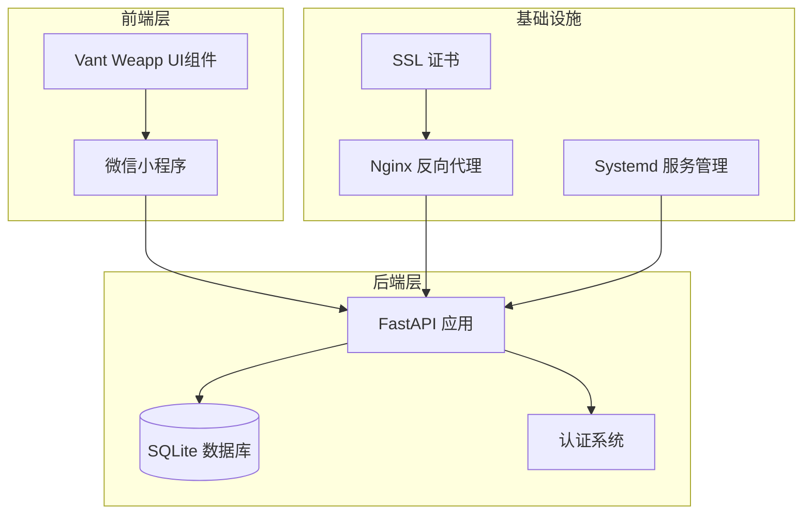
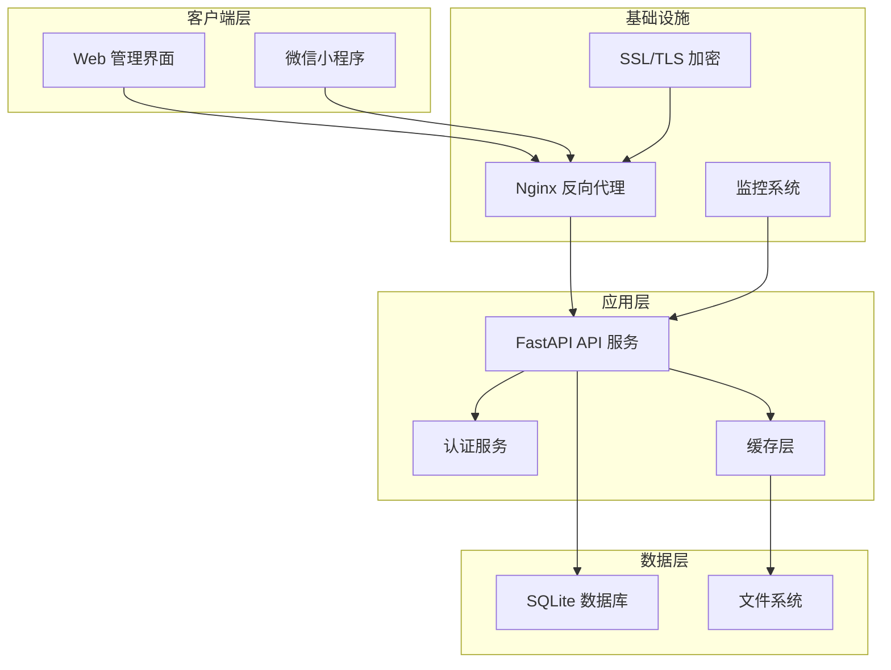
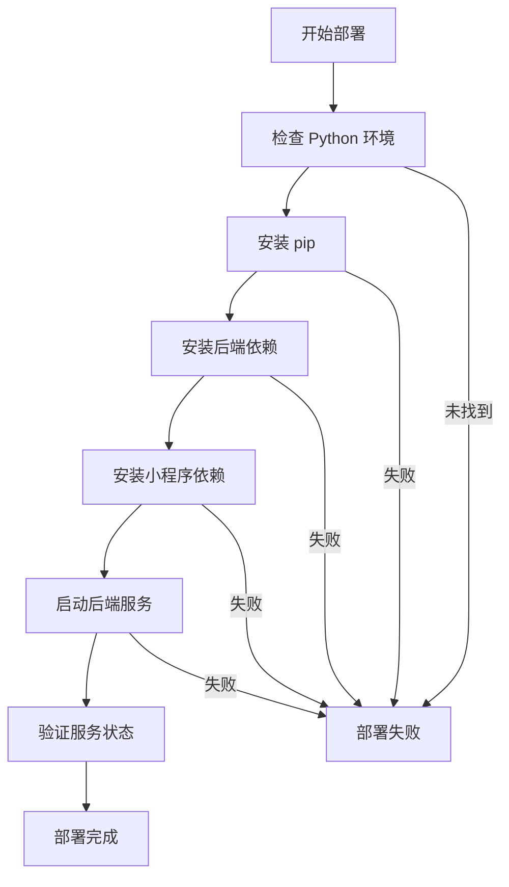
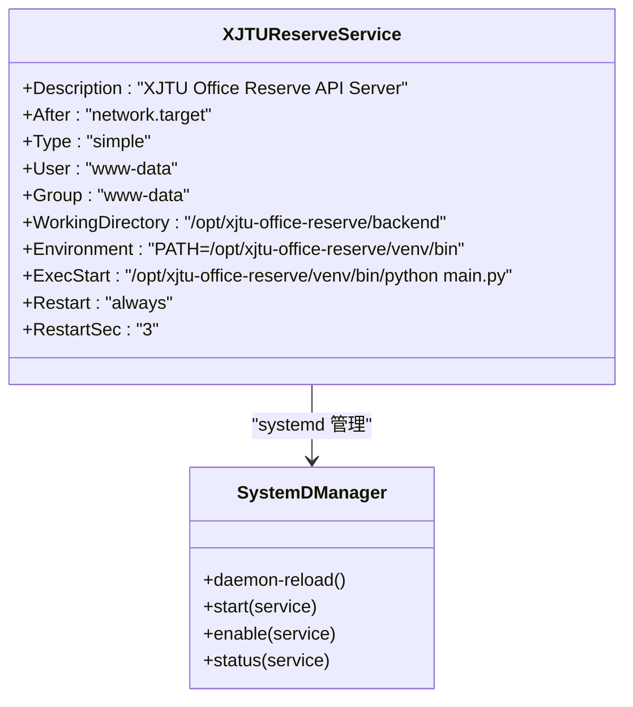
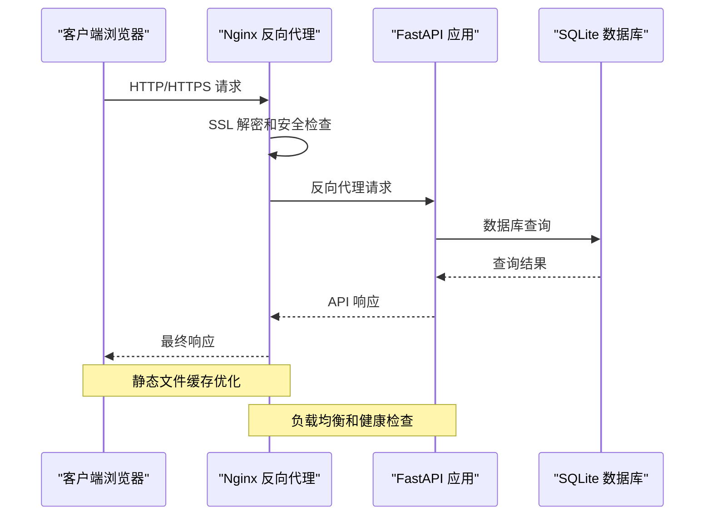
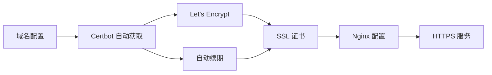
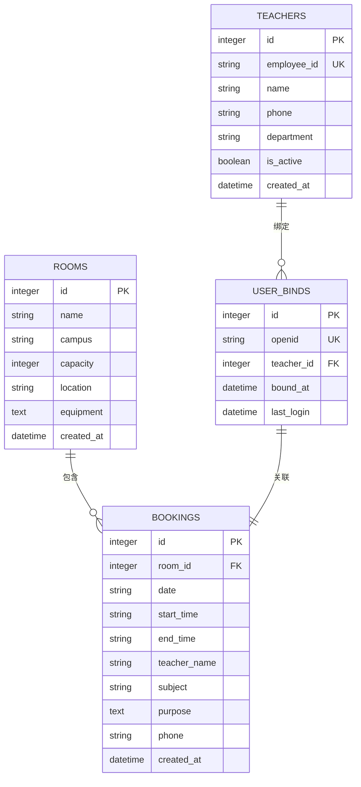
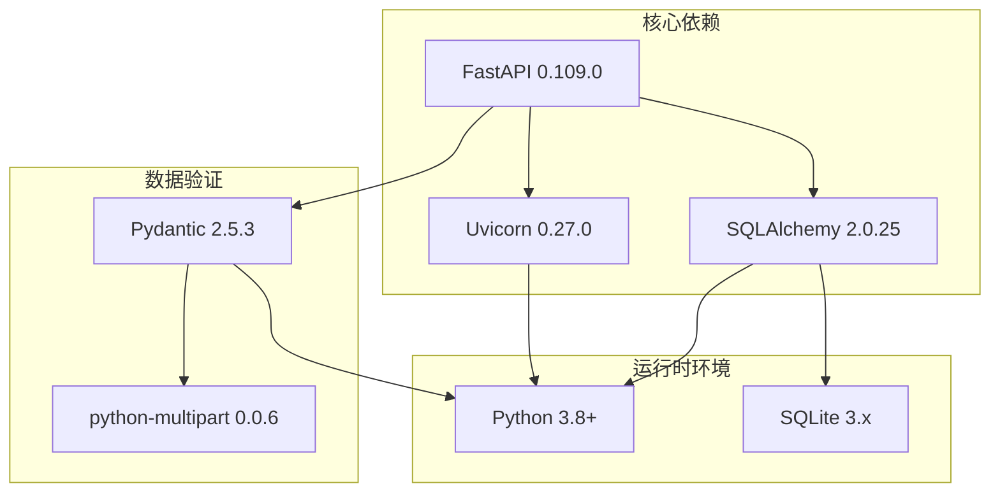
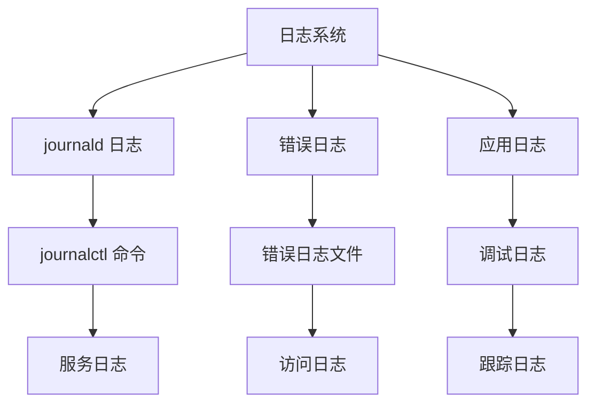

# 部署指南

<cite>
**本文档引用的文件**
- [README.md](file://README.md)
- [deploy.sh](file://deploy.sh)
- [backend/Dockerfile](file://backend/Dockerfile)
- [backend/main.py](file://backend/main.py)
- [backend/requirements.txt](file://backend/requirements.txt)
- [backend/database.py](file://backend/database.py)
- [backend/models.py](file://backend/models.py)
- [backend/crud.py](file://backend/crud.py)
- [backend/schemas.py](file://backend/schemas.py)
</cite>

## 目录
1. [简介](#简介)
2. [项目结构](#项目结构)
3. [核心组件](#核心组件)
4. [架构概览](#架构概览)
5. [详细组件分析](#详细组件分析)
6. [依赖分析](#依赖分析)
7. [性能考虑](#性能考虑)
8. [故障排除指南](#故障排除指南)
9. [结论](#结论)
10. [附录](#附录)

## 简介

西安交通大学软件学院会议室预约系统是一个基于微信小程序 + FastAPI + SQLite 的前后端分离架构系统。该系统为教师提供会议室预约服务，支持多校区管理、实时状态显示、时间线预约等功能。

本部署指南涵盖了从开发环境到生产环境的完整部署流程，包括服务器环境准备、依赖安装、服务配置、域名SSL证书配置、systemd服务配置、Nginx反向代理设置、防火墙配置、Docker容器化部署方案以及云托管部署策略。

## 项目结构

该项目采用模块化架构，主要包含以下核心组件：



**图表来源**
- [backend/main.py:1-673](file://backend/main.py#L1-L673)
- [backend/database.py:1-62](file://backend/database.py#L1-L62)

**章节来源**
- [README.md:48-85](file://README.md#L48-L85)

## 核心组件

### 后端服务架构

系统后端基于FastAPI框架构建，采用RESTful API设计，支持自动化的Swagger文档生成和CORS跨域支持。

**核心特性：**
- 实时会议室状态计算
- 时间线预约功能
- 用户认证和绑定系统
- 管理后台接口
- 数据验证和错误处理

**章节来源**
- [backend/main.py:17-31](file://backend/main.py#L17-L31)
- [backend/main.py:38-51](file://backend/main.py#L38-L51)

### 数据库设计

系统使用SQLite作为轻量级数据库，无需独立数据库服务，适合中小型应用部署。

**数据库表结构：**
- rooms: 会议室信息表
- bookings: 预约记录表  
- teachers: 教职工白名单表
- user_binds: 用户绑定关系表

**章节来源**
- [backend/models.py:8-75](file://backend/models.py#L8-L75)
- [backend/database.py:55-62](file://backend/database.py#L55-L62)

## 架构概览

系统采用三层架构设计，实现了前后端分离和模块化管理：



**图表来源**
- [backend/main.py:621-673](file://backend/main.py#L621-L673)
- [backend/database.py:15-18](file://backend/database.py#L15-L18)

## 详细组件分析

### 系统部署脚本

部署脚本提供了自动化部署流程，支持多种操作系统和部署场景。



**图表来源**
- [deploy.sh:135-163](file://deploy.sh#L135-L163)

**章节来源**
- [deploy.sh:1-163](file://deploy.sh#L1-L163)

### systemd 服务配置

系统使用systemd进行服务管理和自动启动配置。



**图表来源**
- [README.md:207-224](file://README.md#L207-L224)

**章节来源**
- [README.md:199-240](file://README.md#L199-L240)

### Nginx 反向代理配置

Nginx作为反向代理服务器，提供负载均衡、SSL终止和静态文件服务。



**图表来源**
- [README.md:258-294](file://README.md#L258-L294)

**章节来源**
- [README.md:242-330](file://README.md#L242-L330)

### SSL 证书配置

系统支持Let's Encrypt自动SSL证书管理，确保HTTPS安全传输。



**图表来源**
- [README.md:311-320](file://README.md#L311-L320)

**章节来源**
- [README.md:309-320](file://README.md#L309-L320)

### Docker 容器化部署

系统提供完整的Docker容器化解决方案，支持现代化部署和扩展。

```mermaid
graph TB
subgraph "Docker 容器"
APP[FastAPI 应用]
UVICORN[Uvicorn ASGI 服务器]
DATA[/app/data 数据卷]
end
subgraph "Docker 镜像"
BASE[Python 3.10 Slim]
DEPS[依赖包安装]
CODE[应用代码]
end
subgraph "外部存储"
HOST[宿主机目录]
VOL[数据卷映射]
end
BASE --> DEPS
DEPS --> CODE
CODE --> APP
APP --> UVICORN
DATA --> VOL
VOL --> HOST
```

**图表来源**
- [backend/Dockerfile:1-21](file://backend/Dockerfile#L1-L21)

**章节来源**
- [backend/Dockerfile:1-21](file://backend/Dockerfile#L1-L21)

### 数据库配置

系统使用SQLite数据库，支持环境变量配置和动态迁移。



**图表来源**
- [backend/models.py:8-75](file://backend/models.py#L8-L75)

**章节来源**
- [backend/database.py:8-62](file://backend/database.py#L8-L62)

## 依赖分析

系统依赖关系清晰，采用分层架构设计：



**图表来源**
- [backend/requirements.txt:1-5](file://backend/requirements.txt#L1-L5)

**章节来源**
- [backend/requirements.txt:1-5](file://backend/requirements.txt#L1-L5)

## 性能考虑

### 缓存策略

系统采用多层缓存机制优化性能：

1. **静态文件缓存**: Nginx缓存静态资源7天
2. **数据库查询缓存**: SQLite内存缓存
3. **应用层缓存**: 内存中的会议室状态缓存

### 性能优化建议

1. **数据库优化**: 
   - 使用索引优化常用查询
   - 实施连接池管理
   - 定期清理历史数据

2. **网络优化**:
   - 启用HTTP/2协议
   - 配置Gzip压缩
   - 实施CDN加速

3. **应用优化**:
   - 使用异步处理长任务
   - 实施请求限流
   - 优化数据库查询

## 故障排除指南

### 常见部署问题

**问题1: 服务无法启动**
- 检查Python版本和依赖安装
- 验证端口8000可用性
- 查看systemd服务状态

**问题2: Nginx反向代理失败**
- 检查Nginx配置语法
- 验证FastAPI服务状态
- 检查防火墙设置

**问题3: SSL证书问题**
- 验证域名DNS解析
- 检查Let's Encrypt证书状态
- 确认端口443开放

### 日志管理

系统提供完整的日志记录机制：



**章节来源**
- [README.md:623-631](file://README.md#L623-L631)

## 结论

本部署指南提供了从开发环境到生产环境的完整部署方案。系统采用现代化的技术栈和架构设计，具备良好的可维护性和扩展性。

关键优势：
- **简单易用**: 基于SQLite无需复杂数据库配置
- **安全可靠**: 完整的SSL加密和认证机制
- **易于部署**: 支持systemd、Docker等多种部署方式
- **性能优秀**: 优化的缓存策略和异步处理

建议在生产环境中实施：
1. 定期备份数据库和配置文件
2. 监控系统性能和资源使用
3. 实施安全审计和访问控制
4. 建立完善的故障恢复机制

## 附录

### 部署命令参考

**基础部署命令：**
```bash
# 安装依赖
pip install -r backend/requirements.txt

# 启动开发服务器
cd backend && python main.py

# 启动systemd服务
sudo systemctl start xjtu-reserve
sudo systemctl enable xjtu-reserve

# 验证服务状态
sudo systemctl status xjtu-reserve
```

**Docker部署命令：**
```bash
# 构建镜像
docker build -t xjtu-reserve:latest backend/

# 运行容器
docker run -d \
  --name xjtu-reserve \
  -p 8000:8000 \
  -v $(pwd)/backend/data:/app/data \
  xjtu-reserve:latest
```

**章节来源**
- [README.md:134-332](file://README.md#L134-L332)