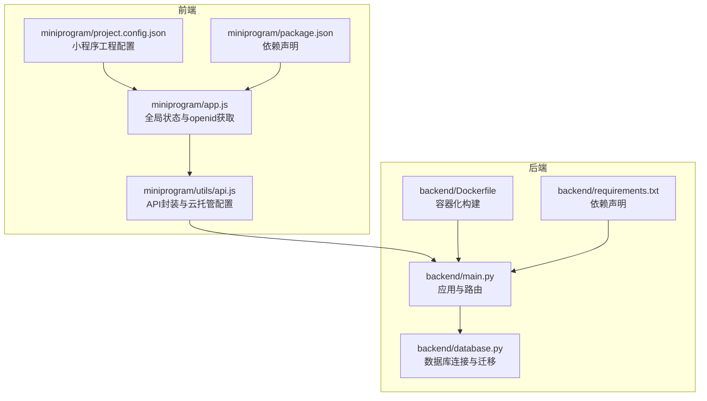
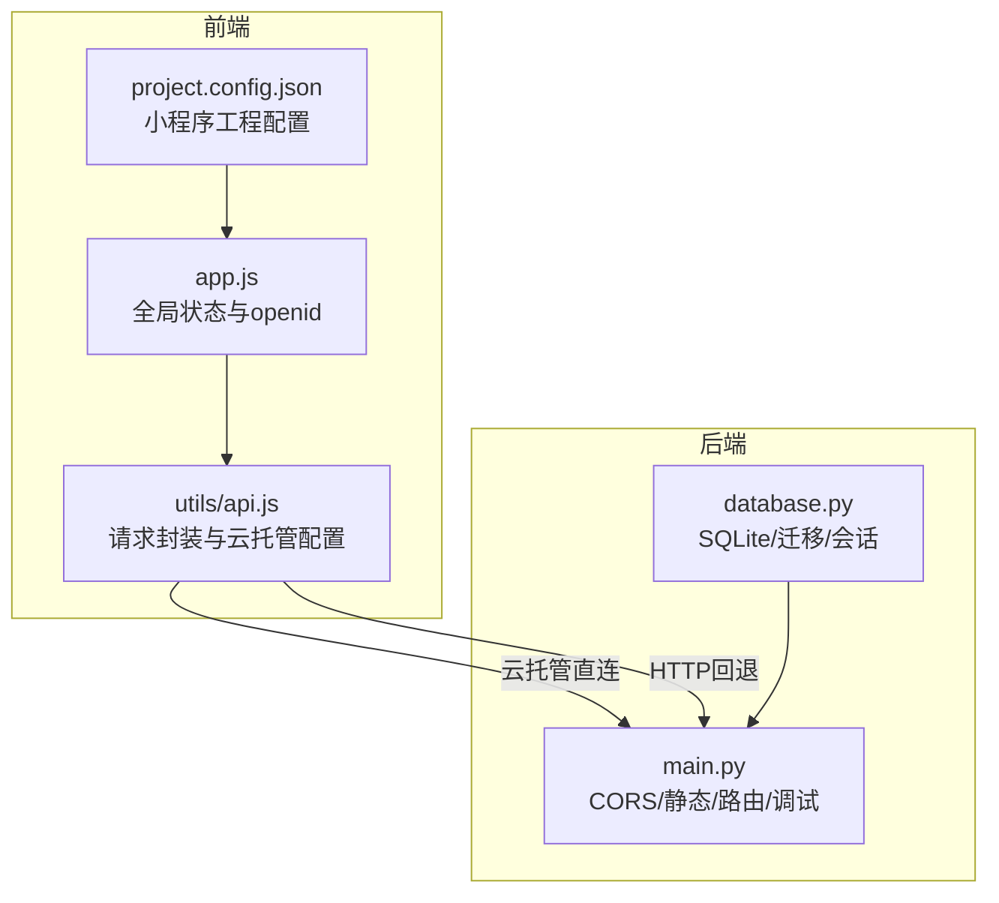
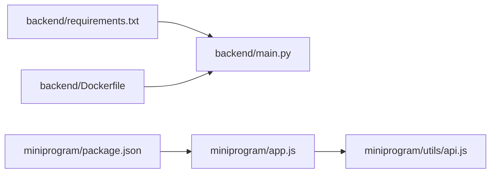

# 配置管理

<cite>
**本文引用的文件**
- [backend/main.py](file://backend/main.py)
- [backend/database.py](file://backend/database.py)
- [backend/requirements.txt](file://backend/requirements.txt)
- [backend/Dockerfile](file://backend/Dockerfile)
- [miniprogram/utils/api.js](file://miniprogram/utils/api.js)
- [miniprogram/app.js](file://miniprogram/app.js)
- [miniprogram/project.config.json](file://miniprogram/project.config.json)
- [miniprogram/package.json](file://miniprogram/package.json)
- [docs/MINIPROGRAM_DEBUG_GUIDE.md](file://docs/MINIPROGRAM_DEBUG_GUIDE.md)
</cite>

## 目录
1. [简介](#简介)
2. [项目结构](#项目结构)
3. [核心组件](#核心组件)
4. [架构总览](#架构总览)
5. [详细组件分析](#详细组件分析)
6. [依赖分析](#依赖分析)
7. [性能考量](#性能考量)
8. [故障排查指南](#故障排查指南)
9. [结论](#结论)
10. [附录](#附录)

## 简介
本指南面向系统运维与开发团队，提供一套完整的配置管理方案，覆盖后端（数据库、CORS、日志与调试）、前端（API基础URL、微信AppID、版本号）以及多环境（开发、测试、生产）的配置策略。文档同时给出配置验证方法、热更新建议、安全注意事项、配置模板与迁移、审计最佳实践，帮助团队在不同环境中稳定、安全地运行系统。

## 项目结构
本项目采用前后端分离架构：
- 后端基于 FastAPI，提供 REST API 与静态资源托管，数据库使用 SQLite 并通过环境变量实现云托管持久化。
- 前端为微信小程序，支持云托管直连与传统 HTTP 两种请求方式，配置集中在 app.js 与 utils/api.js。

图表来源
- [backend/main.py:1-673](file://backend/main.py#L1-L673)
- [backend/database.py:1-62](file://backend/database.py#L1-L62)
- [backend/requirements.txt:1-5](file://backend/requirements.txt#L1-L5)
- [backend/Dockerfile](file://backend/Dockerfile)
- [miniprogram/app.js:1-127](file://miniprogram/app.js#L1-L127)
- [miniprogram/utils/api.js:1-184](file://miniprogram/utils/api.js#L1-L184)
- [miniprogram/project.config.json:1-59](file://miniprogram/project.config.json#L1-L59)
- [miniprogram/package.json:1-6](file://miniprogram/package.json#L1-L6)

章节来源
- [backend/main.py:1-673](file://backend/main.py#L1-L673)
- [backend/database.py:1-62](file://backend/database.py#L1-L62)
- [miniprogram/app.js:1-127](file://miniprogram/app.js#L1-L127)
- [miniprogram/utils/api.js:1-184](file://miniprogram/utils/api.js#L1-L184)
- [miniprogram/project.config.json:1-59](file://miniprogram/project.config.json#L1-L59)
- [miniprogram/package.json:1-6](file://miniprogram/package.json#L1-L6)

## 核心组件
- 后端应用与中间件
  - CORS：允许跨域访问，默认允许任意源，生产环境建议收紧。
  - 静态文件：管理后台页面托管。
  - 调试接口：提供数据库状态检查。
- 数据库
  - SQLite，路径由环境变量控制；云托管时通过 DATA_PATH 实现持久化。
  - 提供迁移脚本以增强表结构。
- 小程序
  - 云托管直连：通过 wx.cloud.callContainer 发送请求，自动携带服务标识头。
  - 传统 HTTP：通过 app.globalData.apiBase 拼接完整 URL。
  - 全局状态：包含云环境 ID、当前校区、日期、用户信息与 openid。

章节来源
- [backend/main.py:23-30](file://backend/main.py#L23-L30)
- [backend/main.py:32-36](file://backend/main.py#L32-L36)
- [backend/main.py:445-461](file://backend/main.py#L445-L461)
- [backend/database.py:8-13](file://backend/database.py#L8-L13)
- [backend/database.py:32-53](file://backend/database.py#L32-L53)
- [miniprogram/utils/api.js:4-8](file://miniprogram/utils/api.js#L4-L8)
- [miniprogram/utils/api.js:43-74](file://miniprogram/utils/api.js#L43-L74)
- [miniprogram/app.js:3-14](file://miniprogram/app.js#L3-L14)

## 架构总览
下图展示配置在系统中的流转与影响范围：

图表来源
- [backend/main.py:23-30](file://backend/main.py#L23-L30)
- [backend/main.py:32-36](file://backend/main.py#L32-L36)
- [backend/database.py:8-13](file://backend/database.py#L8-L13)
- [miniprogram/utils/api.js:4-8](file://miniprogram/utils/api.js#L4-L8)
- [miniprogram/app.js:3-14](file://miniprogram/app.js#L3-L14)
- [miniprogram/project.config.json:1-59](file://miniprogram/project.config.json#L1-L59)

## 详细组件分析

### 后端配置项与修改方法
- 数据库URL
  - 说明：SQLite 路径由环境变量 DATA_PATH 控制，未设置时默认使用应用所在目录。
  - 修改：在部署环境设置 DATA_PATH，确保容器或进程拥有写权限。
  - 验证：通过调试接口查看数据库路径与数据量。
  章节来源
  - [backend/database.py:8-13](file://backend/database.py#L8-L13)
  - [backend/main.py:445-461](file://backend/main.py#L445-L461)

- CORS 设置
  - 说明：当前允许任意源，生产环境需限制具体域名。
  - 修改：调整 allow_origins 列表与允许的方法/头。
  章节来源
  - [backend/main.py:23-30](file://backend/main.py#L23-L30)

- 日志级别与调试模式
  - 说明：后端未显式设置日志级别；调试接口输出数据库状态信息。
  - 修改：可通过部署平台的日志配置或 Uvicorn 启动参数统一设置。
  - 建议：在开发环境开启更详细的日志，在生产环境保持适度。
  章节来源
  - [backend/main.py:445-461](file://backend/main.py#L445-L461)
  - [backend/main.py:670-673](file://backend/main.py#L670-L673)

- API 端点配置
  - 说明：后端提供多条业务与管理端点；静态页面与管理后台页面托管于 /static。
  - 修改：如需变更端点前缀或路由，需同步调整前端请求路径。
  章节来源
  - [backend/main.py:69-108](file://backend/main.py#L69-L108)
  - [backend/main.py:282-342](file://backend/main.py#L282-L342)
  - [backend/main.py:346-373](file://backend/main.py#L346-L373)
  - [backend/main.py:463-619](file://backend/main.py#L463-L619)
  - [backend/main.py:656-667](file://backend/main.py#L656-L667)

- 微信小程序配置（后端）
  - 说明：后端内置默认 AppID，用于兼容与演示；实际部署建议通过请求头或环境变量注入。
  章节来源
  - [backend/main.py:465-467](file://backend/main.py#L465-L467)

- 配置热更新机制
  - 说明：当前未实现运行时热加载配置；数据库迁移在启动时执行。
  - 建议：对 CORS、日志等可在容器编排层动态注入环境变量，重启容器生效。
  章节来源
  - [backend/database.py:55-62](file://backend/database.py#L55-L62)

- 配置验证方法
  - 数据库：使用调试端点检查数据库路径与数据量。
  - CORS：通过浏览器开发者工具观察跨域响应头。
  - 静态资源：访问 /admin 页面确认静态文件挂载正常。
  章节来源
  - [backend/main.py:445-461](file://backend/main.py#L445-L461)
  - [backend/main.py:656-667](file://backend/main.py#L656-L667)

- 配置安全性考虑
  - CORS：仅允许受信域名；避免使用通配符。
  - 数据库：DATA_PATH 指向的目录需具备最小权限；定期备份。
  - 证书与传输：生产环境启用 HTTPS。
  章节来源
  - [backend/main.py:23-30](file://backend/main.py#L23-L30)
  - [backend/database.py:8-13](file://backend/database.py#L8-L13)

### 前端配置项与修改流程
- API 基础 URL
  - 云托管直连：无需手动配置，自动通过 wx.cloud.callContainer 发送请求。
  - 传统 HTTP 回退：需在 app.js 的 globalData 中设置 apiBase。
  章节来源
  - [miniprogram/utils/api.js:4-8](file://miniprogram/utils/api.js#L4-L8)
  - [miniprogram/utils/api.js:43-74](file://miniprogram/utils/api.js#L43-L74)
  - [miniprogram/app.js:3-14](file://miniprogram/app.js#L3-L14)

- 微信 AppID
  - 说明：project.config.json 中包含小程序 AppID；若需切换，需同步更新云开发环境配置。
  章节来源
  - [miniprogram/project.config.json:53](file://miniprogram/project.config.json#L53)

- 版本号
  - 说明：project.config.json 中包含 libVersion 与 projectname；可按需调整。
  章节来源
  - [miniprogram/project.config.json:52](file://miniprogram/project.config.json#L52)

- 配置验证方法
  - 云托管：调用 /api/auth/getOpenid 或 /api/debug/db-status。
  - 传统 HTTP：在 app.js 中设置 apiBase 后，访问对应接口。
  章节来源
  - [backend/main.py:503-513](file://backend/main.py#L503-L513)
  - [backend/main.py:445-461](file://backend/main.py#L445-L461)
  - [miniprogram/utils/api.js:43-74](file://miniprogram/utils/api.js#L43-L74)

- 配置热更新机制
  - 说明：小程序运行时无法动态修改云托管环境与 AppID；需重新发布或通过云开发环境切换。
  - 建议：通过 CI/CD 在构建阶段注入配置，减少手工干预。
  章节来源
  - [miniprogram/project.config.json:55](file://miniprogram/project.config.json#L55)

- 配置安全性考虑
  - 云托管：严格管理服务与环境权限；避免泄露敏感头信息。
  - 传统 HTTP：确保后端启用 HTTPS；校验来源域名。
  章节来源
  - [miniprogram/utils/api.js:4-8](file://miniprogram/utils/api.js#L4-L8)
  - [backend/main.py:23-30](file://backend/main.py#L23-L30)

### 不同环境的配置文件管理策略
- 开发环境
  - 后端：使用本地 SQLite，DATA_PATH 可指向本地目录；CORS 可保持宽松；调试接口便于快速验证。
  - 前端：可使用云托管直连或本地代理；必要时启用传统 HTTP 回退。
  章节来源
  - [backend/database.py:8-13](file://backend/database.py#L8-L13)
  - [miniprogram/utils/api.js:4-8](file://miniprogram/utils/api.js#L4-L8)

- 测试环境
  - 后端：使用独立数据库与受限 CORS；启用较详细日志；定期执行迁移脚本。
  - 前端：与生产一致的云托管配置；通过测试账号验证绑定与预约流程。
  章节来源
  - [backend/database.py:32-53](file://backend/database.py#L32-L53)
  - [miniprogram/utils/api.js:4-8](file://miniprogram/utils/api.js#L4-L8)

- 生产环境
  - 后端：严格限制 CORS；启用 HTTPS；监控日志与数据库健康；定期备份。
  - 前端：固定云托管环境与 AppID；禁用调试与宽松配置。
  章节来源
  - [backend/main.py:23-30](file://backend/main.py#L23-L30)
  - [miniprogram/project.config.json:53-55](file://miniprogram/project.config.json#L53-L55)

### 配置模板与迁移
- 配置模板
  - 后端：Dockerfile 与 requirements.txt 提供基础镜像与依赖模板，可据此扩展。
  - 前端：project.config.json 与 package.json 提供工程与依赖模板。
  章节来源
  - [backend/Dockerfile](file://backend/Dockerfile)
  - [backend/requirements.txt:1-5](file://backend/requirements.txt#L1-L5)
  - [miniprogram/project.config.json:1-59](file://miniprogram/project.config.json#L1-L59)
  - [miniprogram/package.json:1-6](file://miniprogram/package.json#L1-L6)

- 配置迁移
  - 数据库迁移：启动时自动执行迁移脚本，新增缺失列。
  章节来源
  - [backend/database.py:32-53](file://backend/database.py#L32-L53)

- 配置审计最佳实践
  - 建立配置清单与变更记录；对敏感字段（如数据库路径、云托管环境）进行权限控制与最小授权；定期巡检 CORS 与日志策略。
  章节来源
  - [backend/main.py:23-30](file://backend/main.py#L23-L30)
  - [backend/database.py:8-13](file://backend/database.py#L8-L13)

## 依赖分析
后端依赖通过 requirements.txt 声明，前端依赖通过 package.json 声明；Dockerfile 用于容器化构建。

图表来源
- [backend/requirements.txt:1-5](file://backend/requirements.txt#L1-L5)
- [backend/Dockerfile](file://backend/Dockerfile)
- [miniprogram/package.json:1-6](file://miniprogram/package.json#L1-L6)
- [miniprogram/app.js:1-127](file://miniprogram/app.js#L1-L127)
- [miniprogram/utils/api.js:1-184](file://miniprogram/utils/api.js#L1-L184)

章节来源
- [backend/requirements.txt:1-5](file://backend/requirements.txt#L1-L5)
- [miniprogram/package.json:1-6](file://miniprogram/package.json#L1-L6)

## 性能考量
- 数据库性能
  - SQLite 适合中小规模场景；高并发或大数据量建议迁移到关系型数据库并启用连接池。
  - 合理索引与查询条件可降低查询耗时。
- 网络性能
  - 云托管直连可减少中间层延迟；传统 HTTP 需关注网络抖动与超时设置。
- 缓存与静态资源
  - 合理利用静态文件缓存与 CDN，减少重复下载。

## 故障排查指南
- 数据库问题
  - 现象：无法读写或迁移失败。
  - 排查：检查 DATA_PATH 权限、磁盘空间；通过调试接口确认数据库路径与数据量。
  章节来源
  - [backend/database.py:8-13](file://backend/database.py#L8-L13)
  - [backend/main.py:445-461](file://backend/main.py#L445-L461)

- CORS 问题
  - 现象：跨域请求被拒绝。
  - 排查：核对 allow_origins 列表；确认预检请求响应头。
  章节来源
  - [backend/main.py:23-30](file://backend/main.py#L23-L30)

- 小程序请求失败
  - 现象：云托管直连或传统 HTTP 均失败。
  - 排查：检查云托管环境 ID、服务名称与网络；确认后端端点可用。
  章节来源
  - [miniprogram/utils/api.js:4-8](file://miniprogram/utils/api.js#L4-L8)
  - [miniprogram/utils/api.js:43-74](file://miniprogram/utils/api.js#L43-L74)

- 调试辅助
  - 使用调试端点与日志输出定位问题；参考小程序调试指南。
  章节来源
  - [backend/main.py:445-461](file://backend/main.py#L445-L461)
  - [docs/MINIPROGRAM_DEBUG_GUIDE.md](file://docs/MINIPROGRAM_DEBUG_GUIDE.md)

## 结论
本指南提供了从后端数据库、CORS、日志与调试，到前端 API 基础 URL、微信 AppID 与版本号的全链路配置管理方法。结合多环境策略、模板与迁移、审计与安全建议，可帮助团队在不同环境下稳定运行系统，并为后续扩展与演进打下坚实基础。

## 附录
- 快速对照表
  - 后端关键配置
    - 数据库路径：DATA_PATH（环境变量）
    - CORS：allow_origins（生产环境需收紧）
    - 日志：部署平台或 Uvicorn 启动参数
    - 静态资源：/static
  - 前端关键配置
    - 云托管：env、service（utils/api.js）
    - 传统 HTTP：apiBase（app.js）
    - 小程序 AppID：project.config.json
    - 版本号：project.config.json
  章节来源
  - [backend/database.py:8-13](file://backend/database.py#L8-L13)
  - [backend/main.py:23-30](file://backend/main.py#L23-L30)
  - [miniprogram/utils/api.js:4-8](file://miniprogram/utils/api.js#L4-L8)
  - [miniprogram/app.js:3-14](file://miniprogram/app.js#L3-L14)
  - [miniprogram/project.config.json:52-55](file://miniprogram/project.config.json#L52-L55)