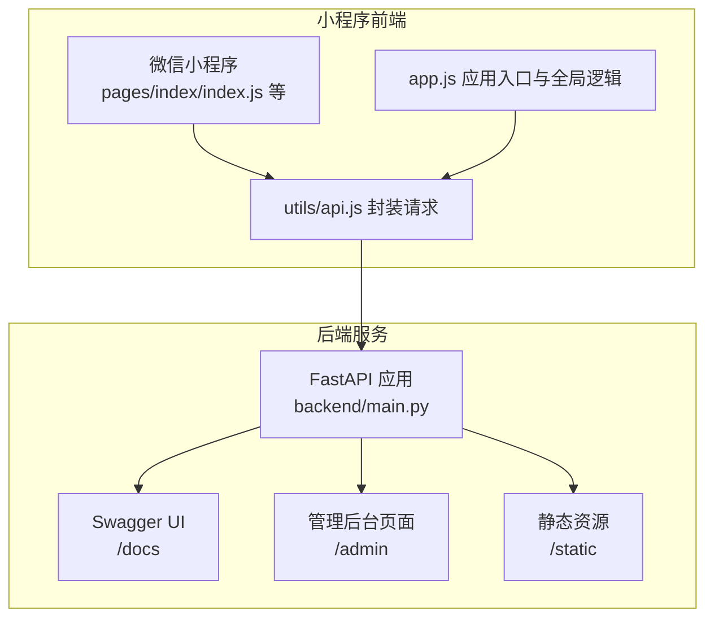
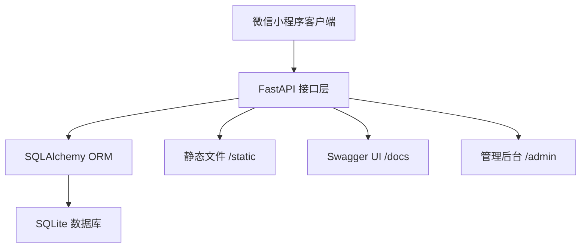
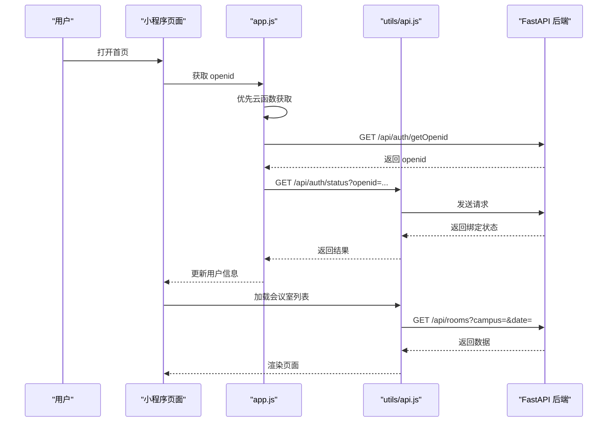

# 快速开始指南

<cite>
**本文引用的文件**
- [README.md](file://README.md)
- [backend/main.py](file://backend/main.py)
- [backend/requirements.txt](file://backend/requirements.txt)
- [miniprogram/app.json](file://miniprogram/app.json)
- [miniprogram/app.js](file://miniprogram/app.js)
- [miniprogram/utils/api.js](file://miniprogram/utils/api.js)
- [miniprogram/pages/index/index.js](file://miniprogram/pages/index/index.js)
- [docs/MINIPROGRAM_DEBUG_GUIDE.md](file://docs/MINIPROGRAM_DEBUG_GUIDE.md)
</cite>

## 目录
1. [简介](#简介)
2. [项目结构](#项目结构)
3. [核心组件](#核心组件)
4. [架构总览](#架构总览)
5. [详细组件分析](#详细组件分析)
6. [依赖分析](#依赖分析)
7. [性能考虑](#性能考虑)
8. [故障排除指南](#故障排除指南)
9. [结论](#结论)
10. [附录](#附录)

## 简介
本指南面向首次接触“西安交通大学软件学院会议室预约系统”的开发者，提供从零开始搭建本地开发环境的完整步骤，涵盖后端 FastAPI 服务与微信小程序的启动、配置与调试要点。您将学会：
- 环境要求与前置条件
- 后端服务的安装与启动
- 小程序项目的依赖安装与本地预览
- 默认访问地址与页面入口
- 常见问题排查与优化建议

## 项目结构
项目采用前后端分离架构：
- 后端：基于 FastAPI 的 REST API 服务，提供会议室、预约、认证等接口，并内置 Swagger 文档与管理后台页面
- 小程序：基于微信原生框架与 Vant Weapp 组件库，提供预约、查看、个人中心等功能

图表来源
- [backend/main.py:623-673](file://backend/main.py#L623-L673)
- [miniprogram/app.json:1-61](file://miniprogram/app.json#L1-L61)
- [miniprogram/utils/api.js:1-184](file://miniprogram/utils/api.js#L1-L184)

章节来源
- [README.md:48-86](file://README.md#L48-L86)

## 核心组件
- 后端服务
  - FastAPI 应用，提供 REST 接口、CORS 支持、静态文件挂载与 Swagger 文档
  - 默认监听端口 8000，支持本地与云托管两种运行方式
- 小程序前端
  - 页面路由与 TabBar 配置，使用 Vant Weapp 组件
  - API 封装，支持云托管与传统 HTTP 两种请求方式
  - 应用入口负责 openid 获取、绑定状态检查与用户信息恢复

章节来源
- [backend/main.py:17-31](file://backend/main.py#L17-L31)
- [backend/main.py:623-673](file://backend/main.py#L623-L673)
- [miniprogram/app.json:1-61](file://miniprogram/app.json#L1-L61)
- [miniprogram/utils/api.js:1-74](file://miniprogram/utils/api.js#L1-L74)

## 架构总览
系统采用“小程序前端 + FastAPI 后端 + SQLite 数据库”的轻量架构，后端提供自动生成的 API 文档与管理后台页面，便于开发与运维。

图表来源
- [backend/main.py:17-31](file://backend/main.py#L17-L31)
- [backend/main.py:666-673](file://backend/main.py#L666-L673)

## 详细组件分析

### 后端服务启动与配置
- 环境要求
  - Python 3.8+
  - 安装依赖：pip 安装 requirements.txt 中列出的包
- 启动方式
  - 直接运行 main.py，默认监听 0.0.0.0:8000
  - 也可通过 uvicorn 启动（main.py 内部已包含）
- 默认访问地址与页面入口
  - 系统首页导航：http://localhost:8000/
  - 预约管理界面：http://localhost:8000/booking（由首页重定向至 /admin）
  - 会议室管理界面：http://localhost:8000/admin
  - API 文档界面：http://localhost:8000/docs

章节来源
- [README.md:90-115](file://README.md#L90-L115)
- [backend/main.py:623-673](file://backend/main.py#L623-L673)

### 小程序项目配置与本地预览
- 环境要求
  - Node.js 16+（用于安装依赖）
  - 微信开发者工具
- 依赖安装
  - 在 miniprogram 目录执行 npm install 或 yarn install
  - 在开发者工具中执行「工具」→「构建 npm」
- 本地预览
  - 在开发者工具中打开 miniprogram 目录
  - 确认已关闭“域名校验”（开发阶段），点击「编译」
- 真机调试
  - 确保手机与电脑在同一 Wi-Fi；修改 app.js 中的 apiBase 为本机局域网 IP
  - 打开「预览」或「真机调试」扫码预览

章节来源
- [README.md:90-131](file://README.md#L90-L131)
- [docs/MINIPROGRAM_DEBUG_GUIDE.md:117-172](file://docs/MINIPROGRAM_DEBUG_GUIDE.md#L117-L172)

### 页面入口与路由
- 小程序页面入口与 TabBar 配置
  - pages/index/index：首页（预约入口）
  - pages/bookings/bookings：预约情况
  - pages/mybookings/mybookings：我的
  - pages/room/room：会议室详情
  - pages/booking/booking：预约表单
  - pages/bind/bind：绑定页面
- 管理后台页面
  - /admin：管理后台页面（由后端静态文件提供）

章节来源
- [miniprogram/app.json:2-43](file://miniprogram/app.json#L2-L43)
- [backend/main.py:656-664](file://backend/main.py#L656-L664)

### API 请求封装与认证流程
- API 封装
  - utils/api.js 提供统一请求封装，支持云托管与传统 HTTP 两种方式
  - 默认使用云托管请求，若需本地 HTTP，可在注释说明处切换
- 认证流程
  - app.js 提供 getOpenid() 与 checkBindStatus()，优先使用云函数获取 openid，回退到后端接口
  - 页面加载时调用 getAuthStatus() 校验绑定状态，未绑定则跳转到绑定页

图表来源
- [miniprogram/app.js:44-89](file://miniprogram/app.js#L44-L89)
- [miniprogram/utils/api.js:13-41](file://miniprogram/utils/api.js#L13-L41)
- [backend/main.py:503-529](file://backend/main.py#L503-L529)

章节来源
- [miniprogram/utils/api.js:1-184](file://miniprogram/utils/api.js#L1-L184)
- [miniprogram/app.js:16-42](file://miniprogram/app.js#L16-L42)

## 依赖分析
- 后端依赖
  - FastAPI、Uvicorn、SQLAlchemy、Pydantic、python-multipart
- 小程序依赖
  - @vant/weapp 组件库

章节来源
- [backend/requirements.txt:1-5](file://backend/requirements.txt#L1-L5)
- [miniprogram/package.json:1-6](file://miniprogram/package.json#L1-L6)

## 性能考虑
- 后端
  - 使用 SQLite 作为轻量数据库，无需额外服务进程，适合中小型应用
  - 启动时自动初始化示例数据，便于快速体验
- 小程序
  - 使用 Vant Weapp 组件提升交互体验
  - API 封装支持云托管与 HTTP 两种方式，可根据部署环境灵活切换

[本节为通用建议，不涉及具体文件分析]

## 故障排除指南
- 小程序请求失败
  - 检查后端是否已启动且监听 8000 端口
  - 确认已关闭“域名校验”（开发阶段）
  - 确认 app.js 中 apiBase 地址正确
- 真机无法访问后端
  - 确保手机与电脑在同一 Wi-Fi
  - 将 apiBase 改为本机局域网 IP
  - 检查防火墙是否允许 8000 端口
- npm 构建失败
  - 删除 node_modules、miniprogram_npm、package-lock.json 后重新安装并重新构建 npm
- 样式不生效
  - 检查 WXSS 文件是否正确引用，类名是否一致，组件是否在 app.json 中声明

章节来源
- [docs/MINIPROGRAM_DEBUG_GUIDE.md:256-309](file://docs/MINIPROGRAM_DEBUG_GUIDE.md#L256-L309)

## 结论
通过本指南，您可以快速完成本地开发环境的搭建与验证，掌握后端服务与小程序的启动、配置与调试方法。建议在本地验证无误后再进行生产部署与域名配置。

[本节为总结性内容，不涉及具体文件分析]

## 附录

### 环境要求清单
- Python 3.8+
- 微信开发者工具
- Node.js 16+

章节来源
- [README.md:90-95](file://README.md#L90-L95)

### 本地开发启动步骤
- 后端
  - 进入 backend 目录，安装依赖并启动服务
  - 默认访问地址：http://localhost:8000/
- 小程序
  - 进入 miniprogram 目录，安装依赖并构建 npm
  - 在微信开发者工具中打开项目，关闭“域名校验”，点击「编译」

章节来源
- [README.md:96-131](file://README.md#L96-L131)

### 默认访问地址与页面入口
- 系统首页导航：http://localhost:8000/
- 预约管理界面：http://localhost:8000/booking（由首页重定向至 /admin）
- 会议室管理界面：http://localhost:8000/admin
- API 文档界面：http://localhost:8000/docs

章节来源
- [README.md:37-45](file://README.md#L37-L45)
- [backend/main.py:623-673](file://backend/main.py#L623-L673)