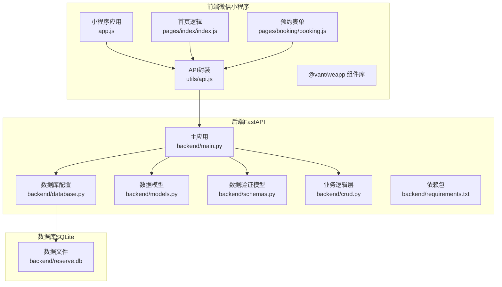
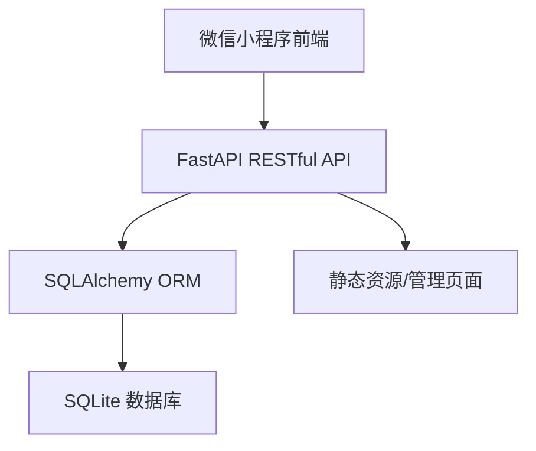
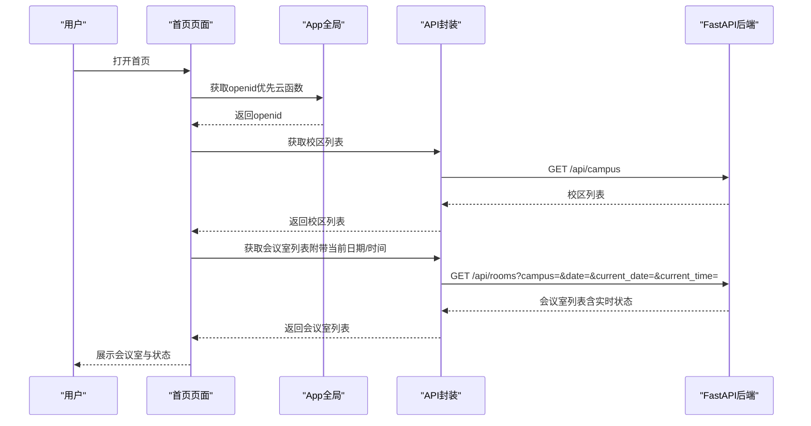
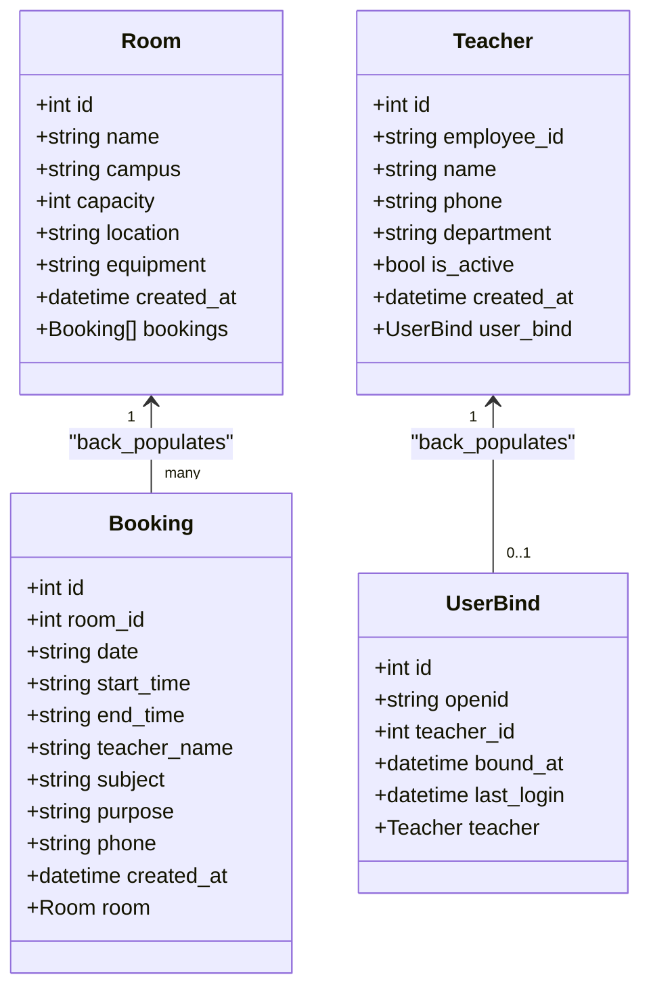
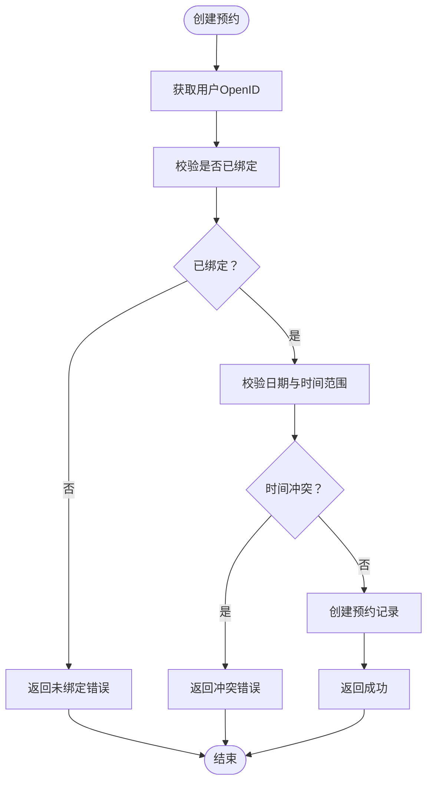
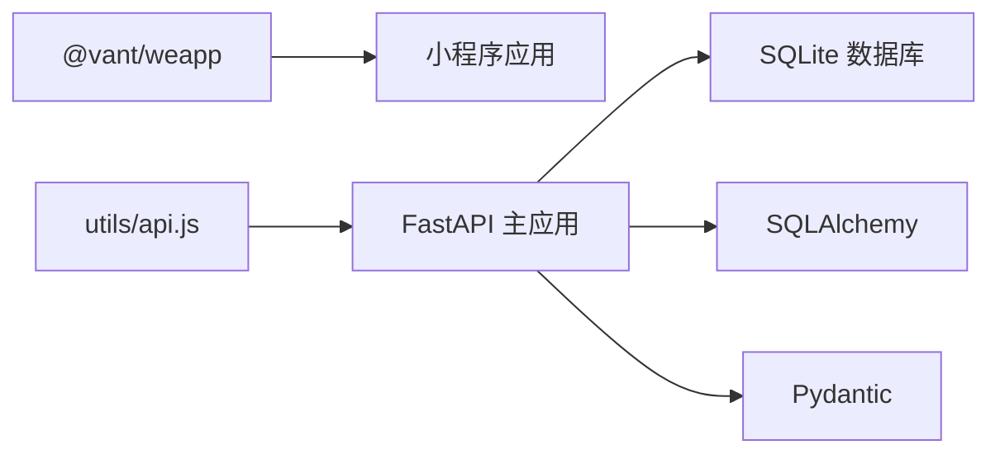

# 技术架构概览

<cite>
**本文引用的文件**
- [README.md](file://README.md)
- [backend/main.py](file://backend/main.py)
- [backend/database.py](file://backend/database.py)
- [backend/models.py](file://backend/models.py)
- [backend/schemas.py](file://backend/schemas.py)
- [backend/crud.py](file://backend/crud.py)
- [backend/requirements.txt](file://backend/requirements.txt)
- [miniprogram/app.js](file://miniprogram/app.js)
- [miniprogram/utils/api.js](file://miniprogram/utils/api.js)
- [miniprogram/pages/index/index.js](file://miniprogram/pages/index/index.js)
- [miniprogram/pages/booking/booking.js](file://miniprogram/pages/booking/booking.js)
- [miniprogram/package.json](file://miniprogram/package.json)
</cite>

## 目录
1. [简介](#简介)
2. [项目结构](#项目结构)
3. [核心组件](#核心组件)
4. [架构总览](#架构总览)
5. [详细组件分析](#详细组件分析)
6. [依赖关系分析](#依赖关系分析)
7. [性能考量](#性能考量)
8. [故障排查指南](#故障排查指南)
9. [结论](#结论)

## 简介
本系统采用前后端分离架构，以微信小程序前端与FastAPI后端为核心，结合SQLite数据库，为西安交通大学软件学院提供会议室预约服务。系统支持多校区、实时状态展示、时间线预约、Web管理界面以及微信小程序入口，具备良好的扩展性与运维友好性。

## 项目结构
项目分为两大部分：
- 前端：基于微信小程序原生框架与Vant Weapp UI组件库，负责用户交互与业务流程编排。
- 后端：基于FastAPI，提供RESTful API、自动文档生成、CORS跨域支持与数据库访问层。

**图表来源**
- [backend/main.py:1-673](file://backend/main.py#L1-L673)
- [backend/database.py:1-62](file://backend/database.py#L1-L62)
- [backend/models.py:1-75](file://backend/models.py#L1-L75)
- [backend/schemas.py:1-185](file://backend/schemas.py#L1-L185)
- [backend/crud.py:1-343](file://backend/crud.py#L1-L343)
- [backend/requirements.txt:1-5](file://backend/requirements.txt#L1-L5)
- [miniprogram/app.js:1-127](file://miniprogram/app.js#L1-L127)
- [miniprogram/utils/api.js:1-184](file://miniprogram/utils/api.js#L1-L184)
- [miniprogram/pages/index/index.js:1-342](file://miniprogram/pages/index/index.js#L1-L342)
- [miniprogram/pages/booking/booking.js:1-113](file://miniprogram/pages/booking/booking.js#L1-L113)

**章节来源**
- [README.md:48-85](file://README.md#L48-L85)
- [backend/main.py:1-673](file://backend/main.py#L1-L673)
- [backend/database.py:1-62](file://backend/database.py#L1-L62)
- [backend/models.py:1-75](file://backend/models.py#L1-L75)
- [backend/schemas.py:1-185](file://backend/schemas.py#L1-L185)
- [backend/crud.py:1-343](file://backend/crud.py#L1-L343)
- [backend/requirements.txt:1-5](file://backend/requirements.txt#L1-L5)
- [miniprogram/app.js:1-127](file://miniprogram/app.js#L1-L127)
- [miniprogram/utils/api.js:1-184](file://miniprogram/utils/api.js#L1-L184)
- [miniprogram/pages/index/index.js:1-342](file://miniprogram/pages/index/index.js#L1-L342)
- [miniprogram/pages/booking/booking.js:1-113](file://miniprogram/pages/booking/booking.js#L1-L113)

## 核心组件
- 微信小程序前端：原生框架 + Vant Weapp UI组件库，负责用户登录、校区/日期选择、会议室列表与时间线展示、预约表单提交等。
- FastAPI后端：提供RESTful API、自动Swagger文档、CORS跨域、数据库初始化与迁移、认证与绑定流程。
- SQLite数据库：轻量级文件数据库，无需独立服务，便于部署与维护。

**章节来源**
- [README.md:48-85](file://README.md#L48-L85)
- [backend/main.py:17-31](file://backend/main.py#L17-L31)
- [backend/database.py:8-13](file://backend/database.py#L8-L13)
- [miniprogram/package.json:1-6](file://miniprogram/package.json#L1-L6)

## 架构总览
系统采用典型的三层架构：
- 表现层：微信小程序前端，负责UI与交互。
- 业务层：FastAPI后端，处理业务逻辑、数据校验与API路由。
- 数据层：SQLite数据库，存储会议室、预约、教职工与绑定关系。

**图表来源**
- [backend/main.py:17-31](file://backend/main.py#L17-L31)
- [backend/database.py:15-18](file://backend/database.py#L15-L18)
- [backend/models.py:1-75](file://backend/models.py#L1-L75)
- [backend/schemas.py:1-185](file://backend/schemas.py#L1-L185)
- [backend/crud.py:1-343](file://backend/crud.py#L1-L343)
- [backend/database.py:1-62](file://backend/database.py#L1-L62)

## 详细组件分析

### 前端组件分析（微信小程序 + Vant Weapp）
- 应用入口与全局状态：在应用启动时初始化云开发、当前日期、校区偏好与用户信息缓存；提供获取openid与检查绑定状态的能力。
- API封装：统一的请求封装，支持云托管与HTTP两种模式，便于不同部署形态切换。
- 页面逻辑：
  - 首页：展示校区与日期选择、7天日期列表、会议室列表与实时状态；支持下拉刷新与日历选择。
  - 预约表单：读取全局用户信息，提交预约时附带客户端时间，确保时间判断准确性。

**图表来源**
- [miniprogram/pages/index/index.js:27-142](file://miniprogram/pages/index/index.js#L27-L142)
- [miniprogram/app.js:44-89](file://miniprogram/app.js#L44-L89)
- [miniprogram/utils/api.js:76-98](file://miniprogram/utils/api.js#L76-L98)
- [backend/main.py:67-108](file://backend/main.py#L67-L108)

**章节来源**
- [miniprogram/app.js:1-127](file://miniprogram/app.js#L1-L127)
- [miniprogram/utils/api.js:1-184](file://miniprogram/utils/api.js#L1-L184)
- [miniprogram/pages/index/index.js:1-342](file://miniprogram/pages/index/index.js#L1-L342)

### 后端组件分析（FastAPI + SQLAlchemy + SQLite）
- 应用初始化：CORS配置、静态文件挂载、启动时数据库初始化与示例数据填充。
- 数据模型与验证：使用SQLAlchemy定义实体关系，Pydantic定义请求/响应模型，确保数据一致性与类型安全。
- 业务逻辑：CRUD模块封装会议室、预约、教职工与绑定关系的操作；提供会议室状态计算与时间线生成。
- 认证与绑定：支持云托管环境下的OpenID获取与绑定校验，保障预约流程的安全性。

**图表来源**
- [backend/models.py:8-75](file://backend/models.py#L8-L75)

**图表来源**
- [backend/main.py:282-333](file://backend/main.py#L282-L333)
- [backend/crud.py:102-122](file://backend/crud.py#L102-L122)

**章节来源**
- [backend/main.py:17-673](file://backend/main.py#L17-L673)
- [backend/database.py:1-62](file://backend/database.py#L1-L62)
- [backend/models.py:1-75](file://backend/models.py#L1-L75)
- [backend/schemas.py:1-185](file://backend/schemas.py#L1-L185)
- [backend/crud.py:1-343](file://backend/crud.py#L1-L343)

### 数据库设计与迁移
- 数据库文件：位于后端目录，支持本地开发与云托管环境的数据持久化。
- 迁移策略：启动时执行数据库初始化与列迁移，确保schema演进的平滑过渡。

**章节来源**
- [backend/database.py:8-62](file://backend/database.py#L8-L62)

### API接口与文档
- RESTful设计：提供会议室、预约、教职工与绑定相关的标准接口。
- 自动文档：Swagger UI自动生成API文档，便于前后端协作与测试。
- CORS支持：允许跨域访问，满足小程序与Web管理界面的调用需求。

**章节来源**
- [backend/main.py:17-31](file://backend/main.py#L17-L31)
- [README.md:407-522](file://README.md#L407-L522)

## 依赖关系分析
- 前端依赖：Vant Weapp UI组件库，提升开发效率与用户体验。
- 后端依赖：FastAPI、SQLAlchemy、Pydantic、Uvicorn等，构成高性能、类型安全的后端生态。
- 数据库依赖：SQLite，零配置、轻量级，适合中小规模应用。

**图表来源**
- [miniprogram/package.json:1-6](file://miniprogram/package.json#L1-L6)
- [backend/requirements.txt:1-5](file://backend/requirements.txt#L1-L5)
- [backend/main.py:1-673](file://backend/main.py#L1-L673)
- [backend/database.py:1-62](file://backend/database.py#L1-L62)

**章节来源**
- [miniprogram/package.json:1-6](file://miniprogram/package.json#L1-L6)
- [backend/requirements.txt:1-5](file://backend/requirements.txt#L1-L5)

## 性能考量
- 前端：合理使用缓存与本地存储，减少重复请求；在首页与预约表单中延迟加载与分页优化。
- 后端：使用SQLAlchemy ORM提高查询效率；对高频接口进行必要的缓存与限流；数据库文件位于持久化目录，避免频繁I/O。
- 数据库：SQLite适合中小规模并发，若后续扩展可评估分库分表或引入中间件。

## 故障排查指南
- 小程序请求失败：检查后端服务是否运行、域名HTTPS配置、小程序服务器域名配置。
- 绑定状态异常：确认OpenID获取流程、后端绑定接口调用与数据库状态。
- 数据库问题：检查数据文件路径与权限，必要时进行备份与恢复。

**章节来源**
- [README.md:594-631](file://README.md#L594-L631)

## 结论
本系统以“小程序 + FastAPI + SQLite”为核心技术栈，实现了功能完备、易于部署与维护的会议室预约平台。前后端分离架构清晰，组件职责明确，具备良好的可扩展性与运维友好性。通过合理的数据模型与业务逻辑封装，系统能够稳定支撑多校区、实时状态与时间线预约等核心功能。