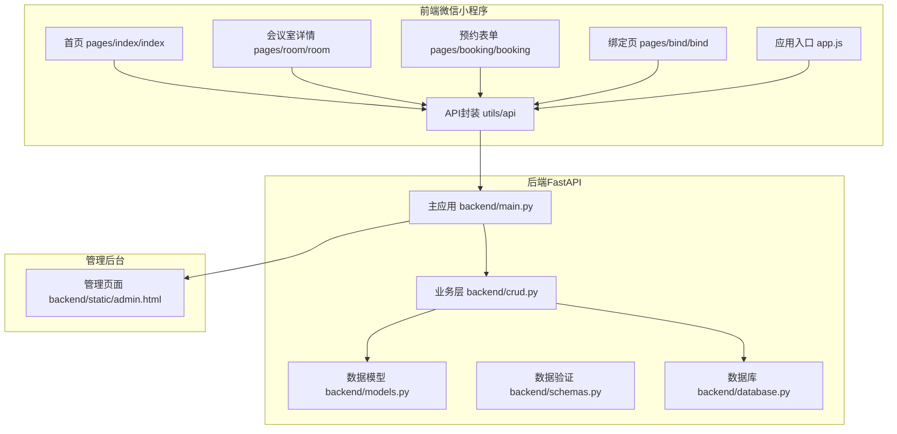
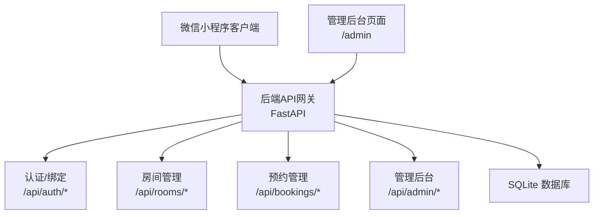
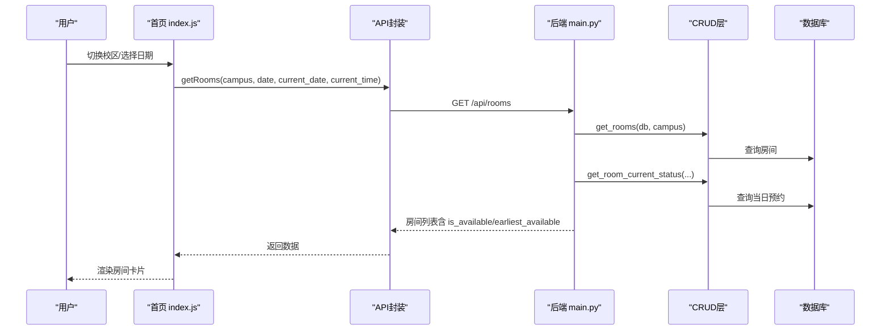
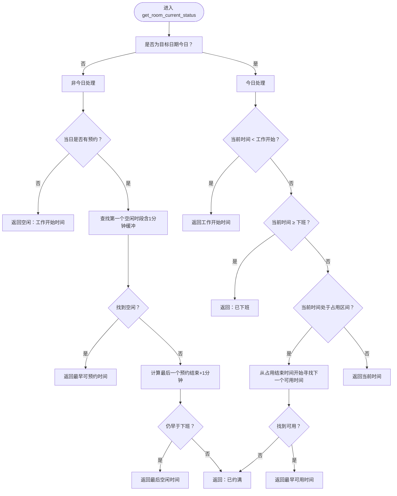
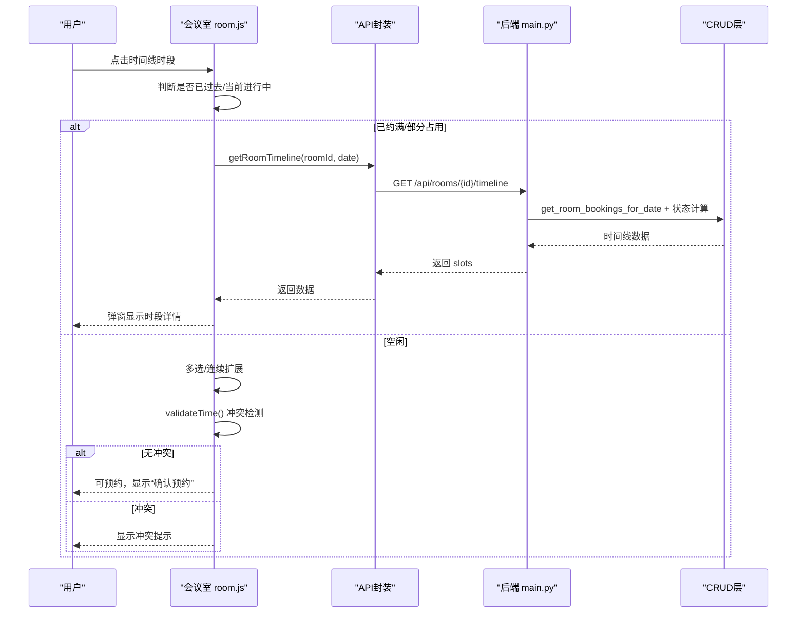
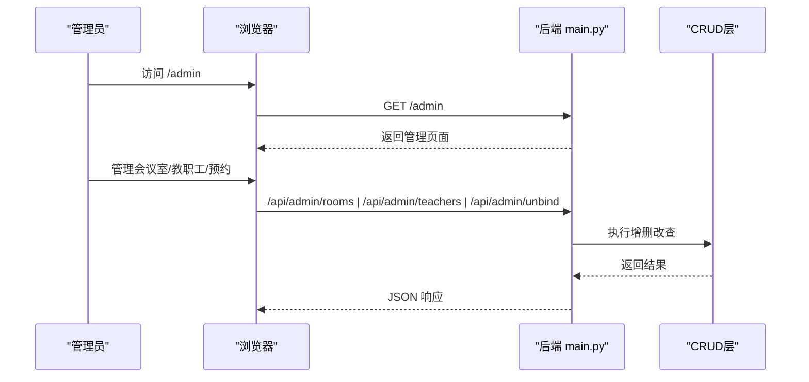
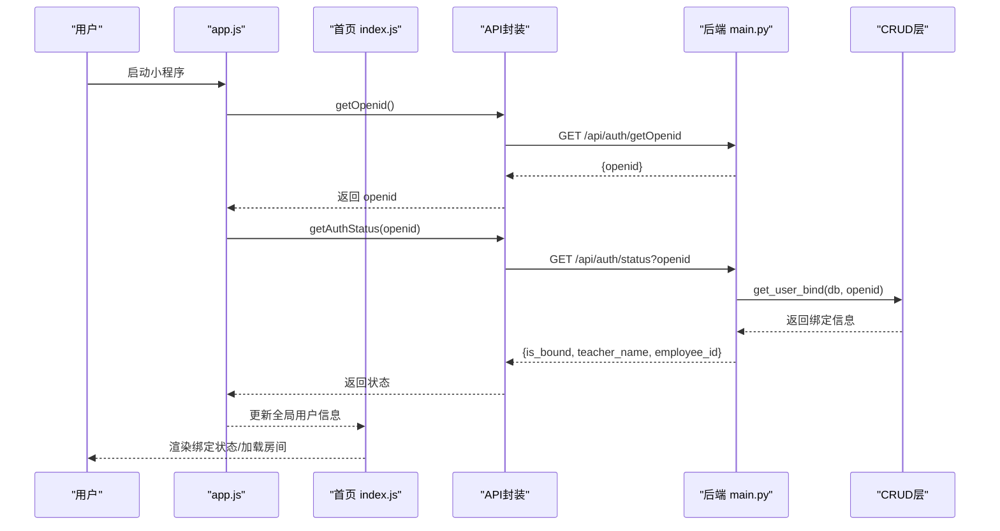
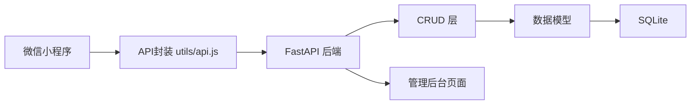

# 核心功能特性

<cite>
**本文引用的文件**
- [backend/main.py](file://backend/main.py)
- [backend/crud.py](file://backend/crud.py)
- [backend/models.py](file://backend/models.py)
- [backend/schemas.py](file://backend/schemas.py)
- [backend/database.py](file://backend/database.py)
- [backend/static/admin.html](file://backend/static/admin.html)
- [miniprogram/utils/api.js](file://miniprogram/utils/api.js)
- [miniprogram/pages/index/index.js](file://miniprogram/pages/index/index.js)
- [miniprogram/pages/index/index.wxml](file://miniprogram/pages/index/index.wxml)
- [miniprogram/pages/room/room.js](file://miniprogram/pages/room/room.js)
- [miniprogram/pages/room/room.wxml](file://miniprogram/pages/room/room.wxml)
- [miniprogram/pages/booking/booking.js](file://miniprogram/pages/booking/booking.js)
- [miniprogram/pages/bind/bind.wxml](file://miniprogram/pages/bind/bind.wxml)
- [miniprogram/app.js](file://miniprogram/app.js)
</cite>

## 目录
1. [简介](#简介)
2. [项目结构](#项目结构)
3. [核心组件](#核心组件)
4. [架构总览](#架构总览)
5. [详细组件分析](#详细组件分析)
6. [依赖分析](#依赖分析)
7. [性能考量](#性能考量)
8. [故障排查指南](#故障排查指南)
9. [结论](#结论)
10. [附录](#附录)

## 简介
本系统为“西安交大软件学院会议室预约系统”，提供多校区支持、实时状态查询、时间线预约、Web管理界面与认证绑定等核心能力。系统采用前后端分离架构：后端基于 FastAPI + SQLAlchemy，前端为微信小程序（云开发 + Vant Weapp 组件），并通过云托管容器服务提供 API；同时提供 Web 管理后台页面，便于管理员维护会议室、教职工与系统配置。

## 项目结构
- 后端（Python/FastAPI）
  - API 定义与路由：/api/campus、/api/rooms、/api/rooms/{id}/timeline、/api/bookings、/api/admin/*、/api/auth/*
  - 数据模型：Room、Booking、Teacher、UserBind
  - CRUD 层：房间、预约、教职工、绑定关系的增删改查与业务校验
  - 配置：SQLite 数据库、CORS、静态文件挂载、启动初始化示例数据
- 前端（微信小程序）
  - 页面：首页（校区/日期/房间列表）、会议室详情（时间线/多选/快速预约）、预约表单、绑定页
  - 工具：统一 API 封装，支持云托管请求与传统 HTTP 请求两种模式
  - 应用入口：全局状态（校区、日期、用户信息、openid）、登录态恢复与 openid 获取
- Web 管理后台
  - 管理端页面：/admin，包含会议室管理、教职工管理、预约查询等

图表来源
- [backend/main.py:1-673](file://backend/main.py#L1-L673)
- [backend/crud.py:1-343](file://backend/crud.py#L1-L343)
- [backend/models.py:1-75](file://backend/models.py#L1-L75)
- [backend/schemas.py:1-185](file://backend/schemas.py#L1-L185)
- [backend/database.py:1-62](file://backend/database.py#L1-L62)
- [backend/static/admin.html:1-800](file://backend/static/admin.html#L1-L800)
- [miniprogram/utils/api.js:1-184](file://miniprogram/utils/api.js#L1-L184)
- [miniprogram/pages/index/index.js:1-342](file://miniprogram/pages/index/index.js#L1-L342)
- [miniprogram/pages/room/room.js:1-657](file://miniprogram/pages/room/room.js#L1-L657)
- [miniprogram/pages/booking/booking.js:1-113](file://miniprogram/pages/booking/booking.js#L1-L113)
- [miniprogram/pages/bind/bind.wxml:1-65](file://miniprogram/pages/bind/bind.wxml#L1-L65)
- [miniprogram/app.js:1-127](file://miniprogram/app.js#L1-L127)

章节来源
- [backend/main.py:1-673](file://backend/main.py#L1-L673)
- [backend/database.py:1-62](file://backend/database.py#L1-L62)
- [backend/static/admin.html:1-800](file://backend/static/admin.html#L1-L800)
- [miniprogram/utils/api.js:1-184](file://miniprogram/utils/api.js#L1-L184)
- [miniprogram/pages/index/index.js:1-342](file://miniprogram/pages/index/index.js#L1-L342)
- [miniprogram/pages/room/room.js:1-657](file://miniprogram/pages/room/room.js#L1-L657)
- [miniprogram/pages/booking/booking.js:1-113](file://miniprogram/pages/booking/booking.js#L1-L113)
- [miniprogram/pages/bind/bind.wxml:1-65](file://miniprogram/pages/bind/bind.wxml#L1-L65)
- [miniprogram/app.js:1-127](file://miniprogram/app.js#L1-L127)

## 核心组件
- 多校区支持
  - 后端提供校区列表接口，前端首页支持校区切换，房间查询可按校区过滤
  - 房间模型包含 campus 字段，用于区分不同校区
- 实时状态查询
  - 房间列表接口返回 is_available 与 earliest_available，由后端根据当日预约与工作时间动态计算
  - 会议室时间线接口返回每30分钟时段的状态（空闲/部分占用/已约满）与最早可预约时间
- 时间线预约
  - 会议室详情页展示时间线网格，支持点击时段查看详情或快速预约
  - 多选逻辑：连续时段合并，非连续自动重选；支持手动选择起止时间并冲突检测
  - 冲突检测：相邻预约也视为冲突（1分钟缓冲），防止紧贴预约
- Web 管理界面
  - 管理后台页面提供会议室与教职工管理、预约查询等操作入口
  - 管理端 API：/api/admin/rooms、/api/admin/teachers 等
- 认证与绑定
  - 前端通过云函数或后端接口获取 openid，后端提供绑定/解绑与用户信息查询
  - 登录态恢复：应用启动与页面显示时验证绑定状态，确保安全

章节来源
- [backend/main.py:69-108](file://backend/main.py#L69-L108)
- [backend/main.py:120-246](file://backend/main.py#L120-L246)
- [backend/crud.py:145-242](file://backend/crud.py#L145-L242)
- [backend/crud.py:102-122](file://backend/crud.py#L102-L122)
- [backend/models.py:8-22](file://backend/models.py#L8-L22)
- [backend/static/admin.html:1-800](file://backend/static/admin.html#L1-L800)
- [miniprogram/utils/api.js:79-184](file://miniprogram/utils/api.js#L79-L184)
- [miniprogram/pages/index/index.js:27-342](file://miniprogram/pages/index/index.js#L27-L342)
- [miniprogram/pages/room/room.js:289-445](file://miniprogram/pages/room/room.js#L289-L445)
- [miniprogram/pages/booking/booking.js:50-97](file://miniprogram/pages/booking/booking.js#L50-L97)

## 架构总览
系统采用三层架构：前端小程序负责用户交互与状态管理；后端 FastAPI 提供 REST API 与静态资源；SQLite 存储数据。管理后台页面由后端静态文件提供，管理员通过浏览器访问。

图表来源
- [backend/main.py:17-31](file://backend/main.py#L17-L31)
- [backend/main.py:443-667](file://backend/main.py#L443-L667)
- [backend/database.py:15-29](file://backend/database.py#L15-L29)
- [backend/static/admin.html:656-667](file://backend/static/admin.html#L656-L667)

章节来源
- [backend/main.py:17-31](file://backend/main.py#L17-L31)
- [backend/database.py:15-29](file://backend/database.py#L15-L29)
- [backend/static/admin.html:656-667](file://backend/static/admin.html#L656-L667)

## 详细组件分析

### 多校区支持
- 功能要点
  - 后端提供校区列表接口，返回校区编码与名称
  - 房间查询支持按校区过滤，首页支持切换校区并刷新房间列表
  - 房间模型包含 campus 字段，用于标识所属校区
- 使用场景
  - 用户在首页选择校区后，系统仅展示该校区的会议室，并显示实时空闲状态与最早可预约时间
- 实现方式
  - 后端：/api/campus 获取校区列表；/api/rooms 支持 campus 查询参数
  - 前端：首页页面维护校区索引与日期列表，调用 API 获取房间并渲染

图表来源
- [backend/main.py:80-108](file://backend/main.py#L80-L108)
- [backend/crud.py:12-17](file://backend/crud.py#L12-L17)
- [backend/crud.py:145-242](file://backend/crud.py#L145-L242)
- [miniprogram/utils/api.js:90-98](file://miniprogram/utils/api.js#L90-L98)
- [miniprogram/pages/index/index.js:219-243](file://miniprogram/pages/index/index.js#L219-L243)

章节来源
- [backend/main.py:69-75](file://backend/main.py#L69-L75)
- [backend/main.py:80-108](file://backend/main.py#L80-L108)
- [backend/models.py:14](file://backend/models.py#L14)
- [miniprogram/pages/index/index.js:260-271](file://miniprogram/pages/index/index.js#L260-L271)
- [miniprogram/utils/api.js:90-98](file://miniprogram/utils/api.js#L90-L98)

### 实时状态查询
- 功能要点
  - 房间列表接口返回 is_available 与 earliest_available，表示当前是否空闲以及最早可预约时间
  - 会议室时间线接口返回每30分钟时段的状态与最早可预约时间，支持“部分占用”场景下的最小空闲窗口判断
- 实现细节
  - 当目标日期非今日：若第一个预约前有空闲或相邻预约间有空隙（含1分钟缓冲），则可预约；否则返回“已约满”
  - 当目标日期为今日：若当前时间早于工作开始时间，返回工作开始时间；若晚于或等于结束时间，返回“已下班”；若在占用区间内，返回占用结束后第一个可用时间；否则返回当前时间
  - 时间线算法：合并相邻占用区间，计算空闲窗口，要求至少5分钟连续空闲才视为可预约
- 使用场景
  - 用户在首页看到房间空闲状态与最早可预约时间；在会议室详情页查看具体时段的占用情况与可预约窗口

图表来源
- [backend/crud.py:145-242](file://backend/crud.py#L145-L242)

章节来源
- [backend/crud.py:145-242](file://backend/crud.py#L145-L242)
- [backend/main.py:120-246](file://backend/main.py#L120-L246)

### 时间线预约（可视化与冲突检测）
- 功能要点
  - 会议室详情页展示 08:00-22:00 的30分钟时间线网格，按状态着色（空闲/部分占用/已约满）
  - 支持点击时段查看详情弹窗，显示该时段的预约列表与最早可预约时间
  - 支持多选连续时段：从边缘连续扩展，非连续自动重选；支持手动选择起止时间
  - 冲突检测：相邻预约也视为冲突（1分钟缓冲），防止紧贴预约
- 实现细节
  - 时间线生成：遍历每30分钟区间，合并同一区间的占用，计算空闲窗口并判定状态
  - 多选逻辑：记录选中索引数组，确保只在边缘增删，保证连续性
  - 冲突检测：遍历当前时段的预约，判断与所选时间段是否有交集（含1分钟缓冲）
  - 快速预约：根据弹窗中的 earliest_available 自动填充起止时间，并考虑“正在进行中”的边界
- 使用场景
  - 用户在时间线中直观选择多个连续时间段，系统自动合并并检测冲突，最终跳转到预约表单

图表来源
- [backend/main.py:120-246](file://backend/main.py#L120-L246)
- [backend/crud.py:125-131](file://backend/crud.py#L125-L131)
- [backend/crud.py:102-122](file://backend/crud.py#L102-L122)
- [miniprogram/pages/room/room.js:289-445](file://miniprogram/pages/room/room.js#L289-L445)
- [miniprogram/utils/api.js:109-112](file://miniprogram/utils/api.js#L109-L112)

章节来源
- [backend/main.py:120-246](file://backend/main.py#L120-L246)
- [backend/crud.py:102-122](file://backend/crud.py#L102-L122)
- [backend/crud.py:125-131](file://backend/crud.py#L125-L131)
- [miniprogram/pages/room/room.js:289-445](file://miniprogram/pages/room/room.js#L289-L445)
- [miniprogram/utils/api.js:109-112](file://miniprogram/utils/api.js#L109-L112)

### Web 管理界面（管理员操作、数据统计与系统配置）
- 功能要点
  - 管理后台页面位于 /admin，提供会议室与教职工管理、预约查询等
  - 管理端 API：/api/admin/rooms、/api/admin/teachers、/api/admin/unbind 等
  - 数据统计：可通过预约查询接口按日期/校区/房间筛选，辅助统计使用率
- 使用场景
  - 管理员在后台新增/编辑/删除会议室与教职工信息，解除绑定关系，查看预约汇总
- 实现方式
  - 后端静态文件挂载 /static，/admin 路由返回管理页面
  - 管理端接口与认证无关，直接提供数据管理能力

图表来源
- [backend/main.py:656-667](file://backend/main.py#L656-L667)
- [backend/static/admin.html:1-800](file://backend/static/admin.html#L1-800)
- [backend/main.py:344-441](file://backend/main.py#L344-L441)

章节来源
- [backend/main.py:656-667](file://backend/main.py#L656-L667)
- [backend/static/admin.html:1-800](file://backend/static/admin.html#L1-L800)
- [backend/main.py:344-441](file://backend/main.py#L344-L441)

### 认证与绑定（教职工身份验证）
- 功能要点
  - 前端通过云函数或后端接口获取 openid，后端提供绑定/解绑与用户信息查询
  - 登录态恢复：应用启动与页面显示时验证绑定状态，确保安全
- 使用场景
  - 首次使用需输入工号与姓名进行身份验证；绑定成功后方可预约
- 实现方式
  - 前端：app.js 提供 getOpenid 与 checkBindStatus；页面在 onShow 时二次验证
  - 后端：/api/auth/getOpenid、/api/auth/status、/api/auth/bind、/api/auth/userinfo、/api/auth/unbind

图表来源
- [miniprogram/app.js:44-89](file://miniprogram/app.js#L44-L89)
- [miniprogram/pages/index/index.js:38-90](file://miniprogram/pages/index/index.js#L38-L90)
- [backend/main.py:503-528](file://backend/main.py#L503-L528)
- [backend/crud.py:308-342](file://backend/crud.py#L308-L342)

章节来源
- [miniprogram/app.js:44-89](file://miniprogram/app.js#L44-L89)
- [miniprogram/pages/index/index.js:38-90](file://miniprogram/pages/index/index.js#L38-L90)
- [backend/main.py:503-528](file://backend/main.py#L503-L528)
- [backend/crud.py:308-342](file://backend/crud.py#L308-L342)

## 依赖分析
- 组件耦合
  - 前端页面依赖 API 封装；API 封装依赖后端路由；后端路由依赖 CRUD 层；CRUD 层依赖数据模型与数据库
  - 管理后台页面与后端管理接口强耦合，但与业务接口相对独立
- 外部依赖
  - 云开发（云函数/云托管）用于 openid 获取与容器服务
  - Vant Weapp 组件用于小程序 UI 呈现
- 潜在风险
  - 前端与后端时间一致性：通过传递客户端当前日期与时间参数，避免服务器时间偏差
  - 相邻预约冲突：1分钟缓冲规则需严格遵循，防止紧贴预约导致冲突

图表来源
- [miniprogram/utils/api.js:13-41](file://miniprogram/utils/api.js#L13-L41)
- [backend/main.py:17-31](file://backend/main.py#L17-L31)
- [backend/crud.py:1-8](file://backend/crud.py#L1-L8)
- [backend/models.py:1-6](file://backend/models.py#L1-L6)
- [backend/database.py:15-29](file://backend/database.py#L15-L29)
- [backend/static/admin.html:656-667](file://backend/static/admin.html#L656-L667)

章节来源
- [miniprogram/utils/api.js:13-41](file://miniprogram/utils/api.js#L13-L41)
- [backend/main.py:17-31](file://backend/main.py#L17-L31)
- [backend/crud.py:1-8](file://backend/crud.py#L1-L8)
- [backend/models.py:1-6](file://backend/models.py#L1-L6)
- [backend/database.py:15-29](file://backend/database.py#L15-L29)
- [backend/static/admin.html:656-667](file://backend/static/admin.html#L656-L667)

## 性能考量
- 数据库访问
  - 房间列表与时间线查询均通过 ORM 查询，建议在高频查询场景下增加索引（如 bookings.date、bookings.room_id）
- 并发与锁
  - 预约创建涉及时间冲突检测与插入，建议在高并发场景下使用数据库事务与唯一约束，避免竞态条件
- 前端渲染
  - 时间线网格较大（14小时×2=28个时段），建议前端按需渲染与虚拟滚动优化（当前实现为全量渲染）
- 缓存策略
  - 前端可缓存校区与日期偏好，减少重复请求；用户信息可在本地缓存，结合后端二次验证

## 故障排查指南
- 绑定失败
  - 检查工号与姓名是否与数据库一致；确认未被其他微信绑定；查看后端日志与返回信息
- 预约冲突
  - 相邻预约被视为冲突（1分钟缓冲），请调整起止时间；检查时间线弹窗中的最早可预约时间
- 无法获取 openid
  - 确认云函数或后端接口可用；检查网络与云托管配置
- 今日已约满/已下班
  - 系统按工作时间与占用情况返回状态；请选择后续日期或工作时间

章节来源
- [backend/main.py:531-584](file://backend/main.py#L531-L584)
- [backend/crud.py:102-122](file://backend/crud.py#L102-L122)
- [miniprogram/pages/room/room.js:576-616](file://miniprogram/pages/room/room.js#L576-L616)
- [miniprogram/pages/index/index.js:38-90](file://miniprogram/pages/index/index.js#L38-L90)

## 结论
本系统围绕“多校区房间管理 + 实时状态 + 时间线预约 + 管理后台 + 认证绑定”构建了完整的会议室预约解决方案。通过清晰的前后端职责划分与严格的冲突检测机制，系统在易用性与可靠性之间取得平衡。建议在后续迭代中引入更细粒度的权限控制、日志审计与性能优化（如索引、缓存与虚拟滚动）。

## 附录
- 关键接口一览
  - 校区：GET /api/campus
  - 房间：GET /api/rooms、GET /api/rooms/{id}
  - 时间线：GET /api/rooms/{id}/timeline
  - 预约：GET /api/bookings、POST /api/bookings、DELETE /api/bookings/{id}
  - 管理：/api/admin/rooms、/api/admin/teachers、/api/admin/unbind
  - 认证：/api/auth/getOpenid、/api/auth/status、/api/auth/bind、/api/auth/userinfo、/api/auth/unbind
- 前端页面
  - 首页：pages/index/index
  - 会议室详情：pages/room/room
  - 预约表单：pages/booking/booking
  - 绑定页：pages/bind/bind
  - 管理后台：/admin