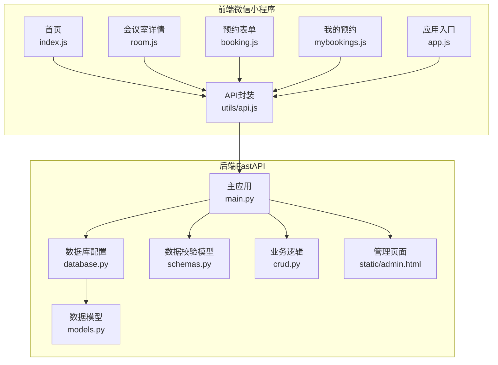
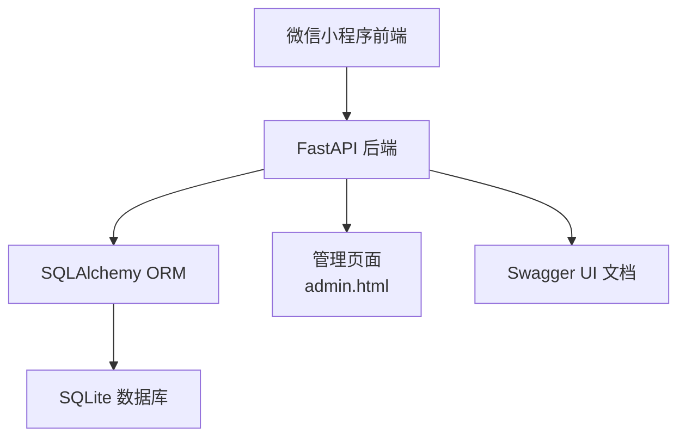
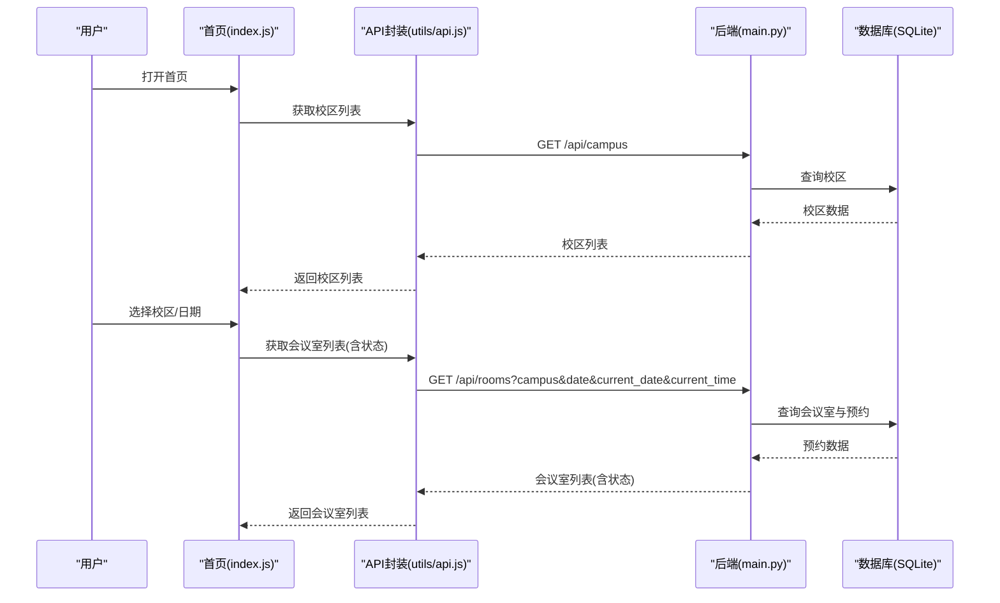
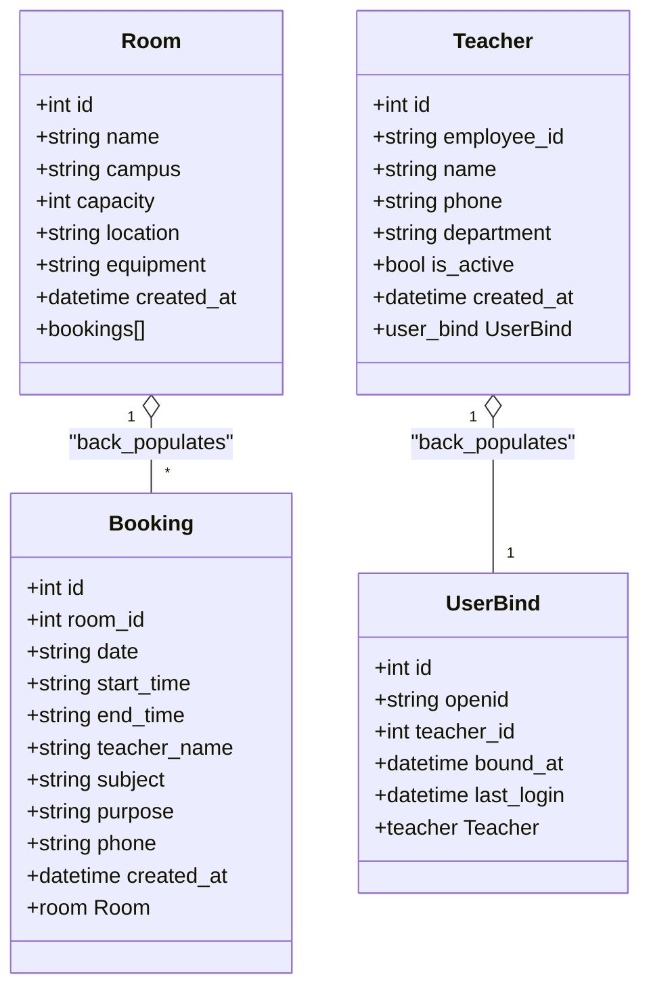
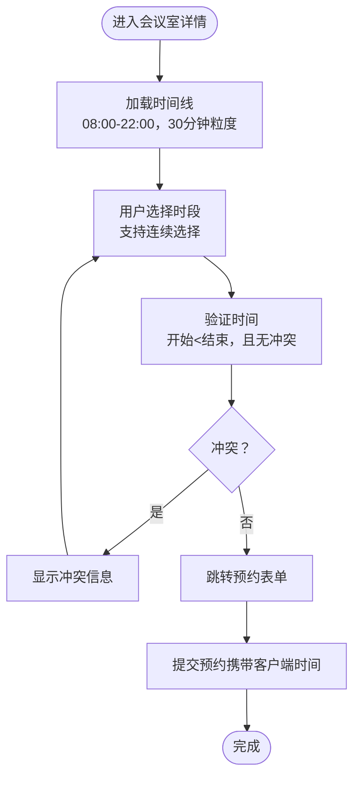
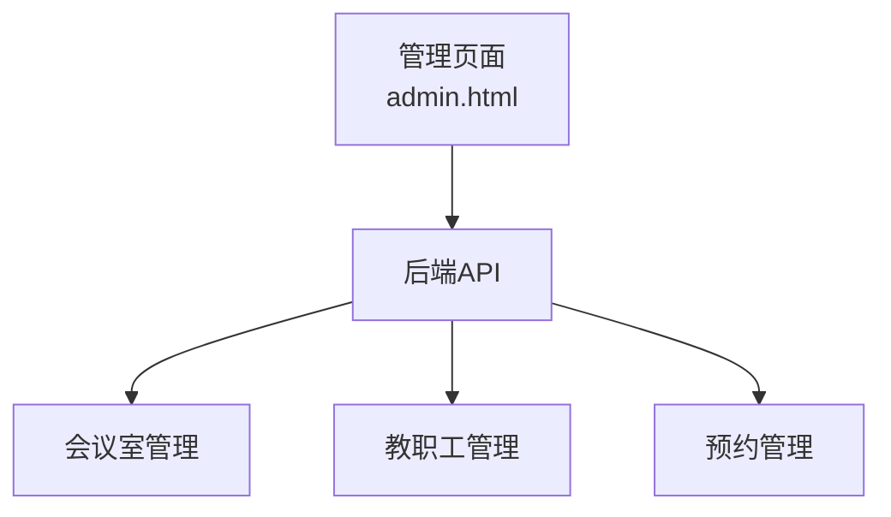
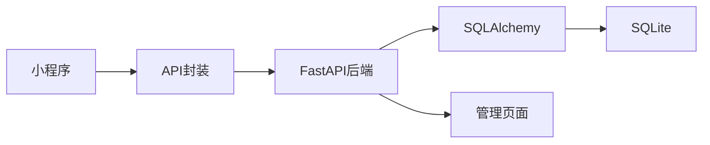

# 系统介绍

<cite>
**本文引用的文件**
- [README.md](file://README.md)
- [backend/main.py](file://backend/main.py)
- [backend/models.py](file://backend/models.py)
- [backend/schemas.py](file://backend/schemas.py)
- [backend/crud.py](file://backend/crud.py)
- [backend/database.py](file://backend/database.py)
- [backend/static/admin.html](file://backend/static/admin.html)
- [miniprogram/app.js](file://miniprogram/app.js)
- [miniprogram/utils/api.js](file://miniprogram/utils/api.js)
- [miniprogram/pages/index/index.js](file://miniprogram/pages/index/index.js)
- [miniprogram/pages/room/room.js](file://miniprogram/pages/room/room.js)
- [miniprogram/pages/booking/booking.js](file://miniprogram/pages/booking/booking.js)
- [miniprogram/pages/mybookings/mybookings.js](file://miniprogram/pages/mybookings/mybookings.js)
</cite>

## 目录
1. [简介](#简介)
2. [项目结构](#项目结构)
3. [核心组件](#核心组件)
4. [架构总览](#架构总览)
5. [详细组件分析](#详细组件分析)
6. [依赖关系分析](#依赖关系分析)
7. [性能考量](#性能考量)
8. [故障排查指南](#故障排查指南)
9. [结论](#结论)
10. [附录](#附录)

## 简介
本系统面向西安交通大学软件学院教师，提供“微信小程序 + FastAPI + SQLite”前后端分离的会议室预约解决方案。系统核心目标是：
- 支持多校区（兴庆校区、创新港校区）统一管理与预约
- 实时展示会议室状态与最早可预约时间
- 提供可视化时间线预约体验（30分钟粒度、连续时段选择、冲突检测）
- 提供Web管理界面，便于管理员维护会议室、教职工与预约数据

系统通过微信小程序前端与FastAPI后端协作，结合SQLite轻量存储，实现低成本部署与稳定运行，满足教学与科研场景下的会议室高效调度需求。

## 项目结构
系统采用模块化分层组织：
- 后端（FastAPI）：提供RESTful API、CORS跨域、数据库ORM、认证与管理接口
- 前端（微信小程序）：首页、会议室详情、预约表单、我的预约、绑定流程等页面
- 静态资源：管理后台HTML页面（admin.html），由后端提供静态文件服务

图表来源
- [backend/main.py:1-673](file://backend/main.py#L1-L673)
- [backend/database.py:1-62](file://backend/database.py#L1-L62)
- [backend/models.py:1-75](file://backend/models.py#L1-L75)
- [backend/schemas.py:1-185](file://backend/schemas.py#L1-L185)
- [backend/crud.py:1-343](file://backend/crud.py#L1-L343)
- [backend/static/admin.html:1-800](file://backend/static/admin.html#L1-L800)
- [miniprogram/app.js:1-127](file://miniprogram/app.js#L1-L127)
- [miniprogram/utils/api.js:1-184](file://miniprogram/utils/api.js#L1-L184)
- [miniprogram/pages/index/index.js:1-342](file://miniprogram/pages/index/index.js#L1-L342)
- [miniprogram/pages/room/room.js:1-657](file://miniprogram/pages/room/room.js#L1-L657)
- [miniprogram/pages/booking/booking.js:1-113](file://miniprogram/pages/booking/booking.js#L1-L113)
- [miniprogram/pages/mybookings/mybookings.js:1-201](file://miniprogram/pages/mybookings/mybookings.js#L1-L201)

章节来源
- [README.md:48-85](file://README.md#L48-L85)

## 核心组件
- 微信小程序前端
  - 首页：多校区切换、日期选择、实时会议室列表与状态
  - 会议室详情：可视化时间线（30分钟粒度）、连续时段选择、冲突检测、快速预约
  - 预约表单：提交预约、携带客户端时间用于严格的时间约束
  - 我的预约：查看与取消个人预约
  - 应用入口：用户认证与绑定状态恢复
  - API封装：统一请求、云托管/HTTP两种模式适配
- FastAPI后端
  - RESTful API：校区、会议室、预约、认证与管理接口
  - 数据模型与校验：Room/Booking/Teacher/UserBind，Pydantic模型
  - 业务逻辑：状态计算、时间冲突检测、预约创建与删除
  - 数据库：SQLite，自动迁移与初始化
  - 管理页面：admin.html，提供会议室与教职工管理
- 数据库
  - rooms、bookings、teachers、user_binds四张表，支持多校区与绑定关系

章节来源
- [miniprogram/pages/index/index.js:1-342](file://miniprogram/pages/index/index.js#L1-L342)
- [miniprogram/pages/room/room.js:1-657](file://miniprogram/pages/room/room.js#L1-L657)
- [miniprogram/pages/booking/booking.js:1-113](file://miniprogram/pages/booking/booking.js#L1-L113)
- [miniprogram/pages/mybookings/mybookings.js:1-201](file://miniprogram/pages/mybookings/mybookings.js#L1-L201)
- [miniprogram/app.js:1-127](file://miniprogram/app.js#L1-L127)
- [miniprogram/utils/api.js:1-184](file://miniprogram/utils/api.js#L1-L184)
- [backend/main.py:1-673](file://backend/main.py#L1-L673)
- [backend/models.py:1-75](file://backend/models.py#L1-L75)
- [backend/schemas.py:1-185](file://backend/schemas.py#L1-L185)
- [backend/crud.py:1-343](file://backend/crud.py#L1-L343)
- [backend/database.py:1-62](file://backend/database.py#L1-L62)
- [backend/static/admin.html:1-800](file://backend/static/admin.html#L1-L800)

## 架构总览
系统采用“小程序前端 + FastAPI后端 + SQLite数据库”的经典三层架构，前后端通过HTTP/HTTPS通信，后端提供Swagger UI文档与静态管理页面。

图表来源
- [README.md:48-85](file://README.md#L48-L85)
- [backend/main.py:17-31](file://backend/main.py#L17-L31)
- [backend/database.py:15-30](file://backend/database.py#L15-L30)

## 详细组件分析

### 微信小程序前端组件
- 首页（index.js）
  - 功能：多校区切换、日期选择（最多提前60天）、加载会议室列表与实时状态
  - 关键点：每次进入页面验证绑定状态；使用客户端时间避免服务器时间偏差
- 会议室详情（room.js）
  - 功能：可视化时间线（08:00-22:00，30分钟粒度）、连续时段选择、冲突检测、快速预约
  - 关键点：1分钟缓冲规则确保相邻预约不重叠；支持“部分占用”场景下计算最早可预约时间
- 预约表单（booking.js）
  - 功能：提交预约，携带客户端日期与时间，严格校验日期与时间边界
- 我的预约（mybookings.js）
  - 功能：按教师姓名筛选预约、状态判断（待进行/进行中/已结束）、取消预约
- 应用入口（app.js）
  - 功能：获取openid、检查绑定状态、恢复登录态
- API封装（utils/api.js）
  - 功能：封装请求方法，支持云托管与HTTP两种模式

图表来源
- [miniprogram/pages/index/index.js:199-243](file://miniprogram/pages/index/index.js#L199-L243)
- [miniprogram/utils/api.js:79-98](file://miniprogram/utils/api.js#L79-L98)
- [backend/main.py:79-108](file://backend/main.py#L79-L108)

章节来源
- [miniprogram/pages/index/index.js:1-342](file://miniprogram/pages/index/index.js#L1-L342)
- [miniprogram/pages/room/room.js:1-657](file://miniprogram/pages/room/room.js#L1-L657)
- [miniprogram/pages/booking/booking.js:1-113](file://miniprogram/pages/booking/booking.js#L1-L113)
- [miniprogram/pages/mybookings/mybookings.js:1-201](file://miniprogram/pages/mybookings/mybookings.js#L1-L201)
- [miniprogram/app.js:1-127](file://miniprogram/app.js#L1-L127)
- [miniprogram/utils/api.js:1-184](file://miniprogram/utils/api.js#L1-L184)

### FastAPI后端组件
- 主应用（main.py）
  - 功能：CORS配置、静态文件挂载、首页与管理页面路由、认证接口、管理后台接口
  - 关键点：启动时初始化数据库与示例数据；提供Swagger UI；管理页面由admin.html提供
- 数据模型（models.py）
  - 功能：定义Room、Booking、Teacher、UserBind四张表及其关系
- 数据校验（schemas.py）
  - 功能：Pydantic模型，用于请求/响应的数据验证与序列化
- 业务逻辑（crud.py）
  - 功能：查询、创建、删除会议室与预约；计算会议室当前状态；检查时间冲突
  - 关键点：1分钟缓冲规则；“部分占用”场景下计算最早可预约时间；支持今天与非今天不同策略
- 数据库（database.py）
  - 功能：SQLite引擎、会话管理、初始化与迁移

图表来源
- [backend/models.py:8-75](file://backend/models.py#L8-L75)

章节来源
- [backend/main.py:1-673](file://backend/main.py#L1-L673)
- [backend/models.py:1-75](file://backend/models.py#L1-L75)
- [backend/schemas.py:1-185](file://backend/schemas.py#L1-L185)
- [backend/crud.py:1-343](file://backend/crud.py#L1-L343)
- [backend/database.py:1-62](file://backend/database.py#L1-L62)

### 可视化时间线预约流程
系统在会议室详情页提供可视化时间线，支持连续时段选择与冲突检测。

图表来源
- [miniprogram/pages/room/room.js:289-471](file://miniprogram/pages/room/room.js#L289-L471)
- [backend/crud.py:102-122](file://backend/crud.py#L102-L122)

章节来源
- [miniprogram/pages/room/room.js:1-657](file://miniprogram/pages/room/room.js#L1-L657)
- [backend/crud.py:1-343](file://backend/crud.py#L1-L343)

### Web管理界面能力
后端提供静态管理页面（admin.html），管理员可在浏览器中：
- 查看与管理会议室（增删改）
- 查看与管理教职工（白名单、绑定状态）
- 查看预约列表与状态

图表来源
- [backend/static/admin.html:1-800](file://backend/static/admin.html#L1-L800)
- [backend/main.py:344-441](file://backend/main.py#L344-L441)

章节来源
- [backend/static/admin.html:1-800](file://backend/static/admin.html#L1-L800)
- [backend/main.py:344-441](file://backend/main.py#L344-L441)

## 依赖关系分析
- 前端依赖后端API：首页、详情、表单、我的预约均通过utils/api.js调用后端接口
- 后端依赖数据库：SQLAlchemy ORM映射至SQLite，提供CRUD与状态计算
- 认证链路：小程序通过云托管或HTTP获取openid，后端验证绑定状态，再进行预约操作

图表来源
- [miniprogram/utils/api.js:13-41](file://miniprogram/utils/api.js#L13-L41)
- [backend/main.py:469-500](file://backend/main.py#L469-L500)
- [backend/database.py:15-30](file://backend/database.py#L15-L30)

章节来源
- [miniprogram/utils/api.js:1-184](file://miniprogram/utils/api.js#L1-L184)
- [backend/main.py:1-673](file://backend/main.py#L1-L673)
- [backend/database.py:1-62](file://backend/database.py#L1-L62)

## 性能考量
- 数据库层面
  - SQLite轻量、无需独立服务，适合中小规模应用；建议定期备份数据库文件
- 接口层面
  - 会议室列表与时间线接口支持并发查询，前端使用Promise并行加载提升体验
- 前端层面
  - 时间线渲染与冲突检测在客户端完成，减少后端压力；合理使用缓存与下拉刷新优化交互

[本节为通用指导，不涉及具体文件分析]

## 故障排查指南
- 小程序请求失败
  - 检查后端是否运行、域名是否配置HTTPS、小程序后台是否配置服务器域名
- 无法获取openid
  - 检查云托管环境请求头或后端接口返回；确认小程序配置正确
- 预约失败
  - 检查日期是否超过60天、是否在工作时间范围内、是否存在时间冲突（含1分钟缓冲）
- 管理页面异常
  - 检查静态文件挂载与admin.html是否存在；确认后端CORS配置

章节来源
- [README.md:594-631](file://README.md#L594-L631)
- [backend/main.py:469-500](file://backend/main.py#L469-L500)
- [backend/crud.py:102-122](file://backend/crud.py#L102-L122)

## 结论
本系统以“微信小程序 + FastAPI + SQLite”为核心，围绕多校区会议室预约场景，提供了实时状态展示、可视化时间线预约、Web管理界面与完善的认证机制。其架构清晰、部署简单、扩展性强，能够有效支撑教学与科研场景下的会议室高效调度，具有良好的实用价值与推广前景。

[本节为总结性内容，不涉及具体文件分析]

## 附录
- 默认会议室与页面入口参考README中的说明
- API接口与数据库设计详见README对应章节

章节来源
- [README.md:20-45](file://README.md#L20-L45)
- [README.md:407-522](file://README.md#L407-L522)
- [README.md:525-591](file://README.md#L525-L591)