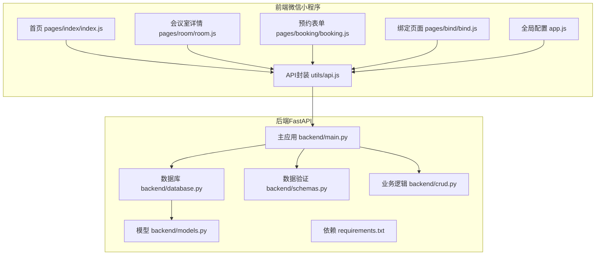
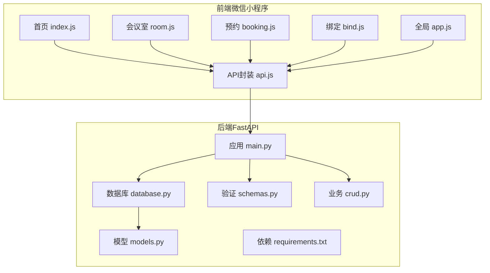
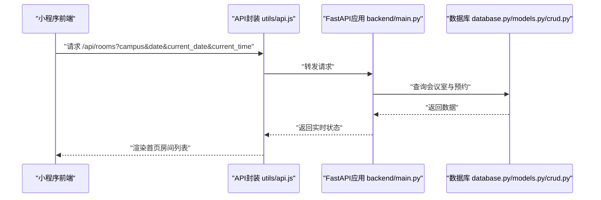
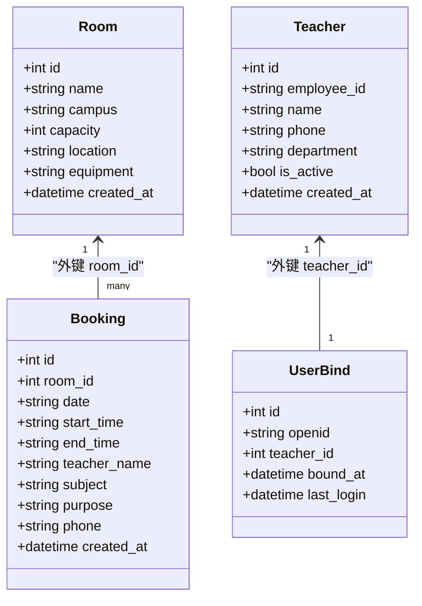
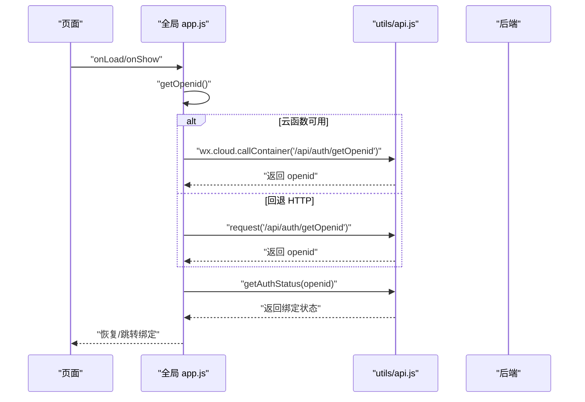
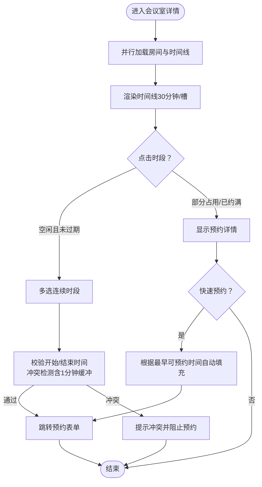
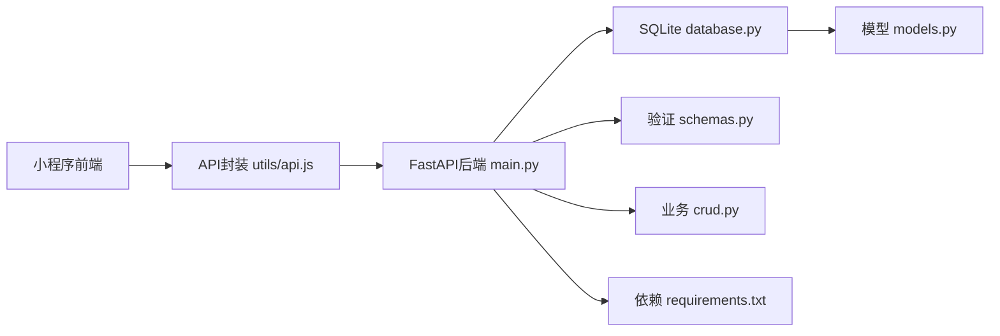

# 项目概述

<cite>
**本文引用的文件**
- [README.md](file://README.md)
- [backend/main.py](file://backend/main.py)
- [backend/models.py](file://backend/models.py)
- [backend/schemas.py](file://backend/schemas.py)
- [backend/crud.py](file://backend/crud.py)
- [backend/database.py](file://backend/database.py)
- [backend/requirements.txt](file://backend/requirements.txt)
- [miniprogram/app.js](file://miniprogram/app.js)
- [miniprogram/utils/api.js](file://miniprogram/utils/api.js)
- [miniprogram/pages/index/index.js](file://miniprogram/pages/index/index.js)
- [miniprogram/pages/room/room.js](file://miniprogram/pages/room/room.js)
- [miniprogram/pages/booking/booking.js](file://miniprogram/pages/booking/booking.js)
- [miniprogram/pages/bind/bind.js](file://miniprogram/pages/bind/bind.js)
- [miniprogram/package.json](file://miniprogram/package.json)
</cite>

## 目录
1. [项目简介](#项目简介)
2. [项目结构](#项目结构)
3. [核心组件](#核心组件)
4. [架构总览](#架构总览)
5. [详细组件分析](#详细组件分析)
6. [依赖关系分析](#依赖关系分析)
7. [性能考量](#性能考量)
8. [故障排查指南](#故障排查指南)
9. [结论](#结论)
10. [附录](#附录)

## 项目简介
本系统为西安交通大学软件学院教师提供会议室预约服务，支持多校区（兴庆校区、创新港校区）、实时状态查询、时间线可视化预约、Web 管理界面与微信小程序前端。系统采用前后端分离架构：后端基于 FastAPI 提供 RESTful API，前端基于微信小程序原生框架与 Vant Weapp UI 组件库实现，数据库使用 SQLite，具备轻量、易部署的特点。

- 多校区支持：通过“校区”字段区分不同校区的会议室资源。
- 实时状态：后端根据当前日期/时间与预约数据动态计算会议室空闲状态与最早可预约时间。
- 时间线预约：前端以 30 分钟为粒度展示时间线，支持多时段连续选择与冲突校验。
- 管理后台：提供 Web 页面与管理接口，便于管理员维护会议室与教职工信息。
- 微信小程序：教师通过小程序完成身份绑定、查询与预约。

## 项目结构
项目分为后端与前端两大模块：
- 后端（backend）：FastAPI 应用、数据库模型与 CRUD、数据验证模型、SQLite 初始化与迁移。
- 前端（miniprogram）：小程序页面、API 封装、全局状态与云托管集成。

图表来源
- [backend/main.py:1-673](file://backend/main.py#L1-L673)
- [backend/database.py:1-62](file://backend/database.py#L1-L62)
- [backend/models.py:1-75](file://backend/models.py#L1-L75)
- [backend/schemas.py:1-185](file://backend/schemas.py#L1-L185)
- [backend/crud.py:1-343](file://backend/crud.py#L1-L343)
- [backend/requirements.txt:1-5](file://backend/requirements.txt#L1-L5)
- [miniprogram/app.js:1-127](file://miniprogram/app.js#L1-L127)
- [miniprogram/utils/api.js:1-184](file://miniprogram/utils/api.js#L1-L184)
- [miniprogram/pages/index/index.js:1-342](file://miniprogram/pages/index/index.js#L1-L342)
- [miniprogram/pages/room/room.js:1-657](file://miniprogram/pages/room/room.js#L1-L657)
- [miniprogram/pages/booking/booking.js:1-113](file://miniprogram/pages/booking/booking.js#L1-L113)
- [miniprogram/pages/bind/bind.js:1-143](file://miniprogram/pages/bind/bind.js#L1-L143)

章节来源
- [README.md:1-637](file://README.md#L1-L637)
- [backend/main.py:1-673](file://backend/main.py#L1-L673)
- [backend/database.py:1-62](file://backend/database.py#L1-L62)
- [backend/models.py:1-75](file://backend/models.py#L1-L75)
- [backend/schemas.py:1-185](file://backend/schemas.py#L1-L185)
- [backend/crud.py:1-343](file://backend/crud.py#L1-L343)
- [backend/requirements.txt:1-5](file://backend/requirements.txt#L1-L5)
- [miniprogram/app.js:1-127](file://miniprogram/app.js#L1-L127)
- [miniprogram/utils/api.js:1-184](file://miniprogram/utils/api.js#L1-L184)
- [miniprogram/pages/index/index.js:1-342](file://miniprogram/pages/index/index.js#L1-L342)
- [miniprogram/pages/room/room.js:1-657](file://miniprogram/pages/room/room.js#L1-L657)
- [miniprogram/pages/booking/booking.js:1-113](file://miniprogram/pages/booking/booking.js#L1-L113)
- [miniprogram/pages/bind/bind.js:1-143](file://miniprogram/pages/bind/bind.js#L1-L143)
- [miniprogram/package.json:1-6](file://miniprogram/package.json#L1-L6)

## 核心组件
- 后端核心
  - FastAPI 应用与路由：提供校区、会议室、预约、管理后台、认证等接口。
  - 数据模型与验证：定义房间、预约、教职工、绑定关系的数据结构与约束。
  - 业务逻辑：查询会议室状态、生成时间线、冲突检测、用户绑定与认证。
  - 数据库：SQLite，支持迁移与初始化。
- 前端核心
  - 全局状态与云托管：统一获取 openid、检查绑定状态、恢复登录。
  - API 封装：封装云托管请求与传统 HTTP 请求两种模式。
  - 页面流程：首页（校区/日期/房间列表）、会议室详情（时间线/多选/冲突校验）、预约表单、绑定页。

章节来源
- [backend/main.py:67-673](file://backend/main.py#L67-L673)
- [backend/models.py:8-75](file://backend/models.py#L8-L75)
- [backend/schemas.py:7-185](file://backend/schemas.py#L7-L185)
- [backend/crud.py:10-343](file://backend/crud.py#L10-L343)
- [backend/database.py:32-62](file://backend/database.py#L32-L62)
- [miniprogram/app.js:1-127](file://miniprogram/app.js#L1-L127)
- [miniprogram/utils/api.js:1-184](file://miniprogram/utils/api.js#L1-L184)
- [miniprogram/pages/index/index.js:1-342](file://miniprogram/pages/index/index.js#L1-L342)
- [miniprogram/pages/room/room.js:1-657](file://miniprogram/pages/room/room.js#L1-L657)
- [miniprogram/pages/booking/booking.js:1-113](file://miniprogram/pages/booking/booking.js#L1-L113)
- [miniprogram/pages/bind/bind.js:1-143](file://miniprogram/pages/bind/bind.js#L1-L143)

## 架构总览
系统采用前后端分离架构，后端提供 RESTful API，前端通过云托管或传统 HTTP 与后端交互；数据库为 SQLite，支持迁移与持久化。

图表来源
- [backend/main.py:1-673](file://backend/main.py#L1-L673)
- [backend/database.py:1-62](file://backend/database.py#L1-L62)
- [backend/models.py:1-75](file://backend/models.py#L1-L75)
- [backend/schemas.py:1-185](file://backend/schemas.py#L1-L185)
- [backend/crud.py:1-343](file://backend/crud.py#L1-L343)
- [backend/requirements.txt:1-5](file://backend/requirements.txt#L1-L5)
- [miniprogram/app.js:1-127](file://miniprogram/app.js#L1-L127)
- [miniprogram/utils/api.js:1-184](file://miniprogram/utils/api.js#L1-L184)
- [miniprogram/pages/index/index.js:1-342](file://miniprogram/pages/index/index.js#L1-L342)
- [miniprogram/pages/room/room.js:1-657](file://miniprogram/pages/room/room.js#L1-L657)
- [miniprogram/pages/booking/booking.js:1-113](file://miniprogram/pages/booking/booking.js#L1-L113)
- [miniprogram/pages/bind/bind.js:1-143](file://miniprogram/pages/bind/bind.js#L1-L143)

## 详细组件分析

### 后端：FastAPI 应用与路由
- 路由分层
  - 校区接口：获取校区列表。
  - 会议室接口：获取会议室列表（含实时状态）、单个会议室详情、时间线（按 30 分钟粒度）。
  - 预约接口：获取预约列表、创建预约、取消预约。
  - 管理后台接口：会议室与教职工的增删改查、解绑等。
  - 认证接口：获取 openid、绑定/解绑、用户信息、认证状态检查。
- 实时状态与时间线
  - 会议室实时状态：结合当前日期/时间与已有预约，计算是否空闲与最早可预约时间。
  - 时间线生成：按 08:00–22:00 每 30 分钟一个槽位，合并相邻预约与 1 分钟缓冲，判断空闲区间与最早可预约时间。
- 数据验证与安全
  - 使用 Pydantic 模型进行请求/响应验证。
  - 预约创建时进行日期范围、时间冲突、工作时间等校验。
  - 认证依赖：从请求头或查询参数获取 openid，校验绑定状态。

图表来源
- [backend/main.py:67-108](file://backend/main.py#L67-L108)
- [backend/crud.py:145-242](file://backend/crud.py#L145-L242)
- [backend/database.py:1-62](file://backend/database.py#L1-L62)
- [miniprogram/utils/api.js:89-98](file://miniprogram/utils/api.js#L89-L98)
- [miniprogram/pages/index/index.js:219-243](file://miniprogram/pages/index/index.js#L219-L243)

章节来源
- [backend/main.py:67-673](file://backend/main.py#L67-L673)
- [backend/crud.py:102-242](file://backend/crud.py#L102-L242)
- [backend/database.py:32-62](file://backend/database.py#L32-L62)

### 后端：数据模型与验证
- 数据模型
  - Room：会议室，包含名称、校区、容量、位置、设备等。
  - Booking：预约，包含日期、起止时间、教师信息、用途等。
  - Teacher：教职工白名单，包含工号、姓名、部门、是否有效等。
  - UserBind：用户绑定关系，openid 与教职工 ID 关联。
- 数据验证
  - Pydantic 模型用于请求/响应的自动校验与序列化。
  - 管理接口与认证接口均有明确的输入输出结构。

图表来源
- [backend/models.py:8-75](file://backend/models.py#L8-L75)
- [backend/schemas.py:7-185](file://backend/schemas.py#L7-L185)

章节来源
- [backend/models.py:1-75](file://backend/models.py#L1-L75)
- [backend/schemas.py:1-185](file://backend/schemas.py#L1-L185)

### 前端：小程序全局与认证流程
- 全局配置
  - 云环境 ID、当前校区、当前日期、用户信息、openid 等。
  - 启动时初始化日期、读取缓存偏好、恢复登录状态。
- 认证流程
  - 优先通过云函数获取 openid；若失败回退至后端接口。
  - 检查绑定状态，若未绑定则跳转绑定页；绑定成功后缓存用户信息。
- API 封装
  - 云托管模式：通过 wx.cloud.callContainer 发送请求，自动携带服务标识头。
  - HTTP 模式：备用方案，适用于自有服务器部署。

图表来源
- [miniprogram/app.js:44-119](file://miniprogram/app.js#L44-L119)
- [miniprogram/utils/api.js:13-41](file://miniprogram/utils/api.js#L13-L41)
- [backend/main.py:503-528](file://backend/main.py#L503-L528)

章节来源
- [miniprogram/app.js:1-127](file://miniprogram/app.js#L1-L127)
- [miniprogram/utils/api.js:1-184](file://miniprogram/utils/api.js#L1-L184)
- [backend/main.py:463-528](file://backend/main.py#L463-L528)

### 前端：首页与会议室详情（时间线与多选）
- 首页
  - 展示校区与日期选择、未来 7 天日期列表、下拉刷新。
  - 调用后端接口获取会议室列表（含实时状态），支持校区筛选与日期筛选。
- 会议室详情
  - 并行加载会议室信息与时间线，展示 30 分钟粒度的占用情况。
  - 多选逻辑：支持连续时段选择，自动计算开始/结束时间，校验冲突与缓冲。
  - 快速预约：根据时间线“最早可预约时间”与相邻预约，自动推导可选区间。
  - 冲突检测：严格遵循“相邻预约需 1 分钟缓冲”的规则，防止时间重叠。

图表来源
- [miniprogram/pages/room/room.js:258-445](file://miniprogram/pages/room/room.js#L258-L445)
- [miniprogram/pages/booking/booking.js:50-97](file://miniprogram/pages/booking/booking.js#L50-L97)
- [backend/crud.py:102-131](file://backend/crud.py#L102-L131)

章节来源
- [miniprogram/pages/index/index.js:176-243](file://miniprogram/pages/index/index.js#L176-L243)
- [miniprogram/pages/room/room.js:1-657](file://miniprogram/pages/room/room.js#L1-L657)
- [miniprogram/pages/booking/booking.js:1-113](file://miniprogram/pages/booking/booking.js#L1-L113)
- [backend/crud.py:102-131](file://backend/crud.py#L102-L131)

### 前端：绑定与管理后台
- 绑定页
  - 输入工号与姓名，调用后端绑定接口，成功后缓存用户信息并跳转首页。
- 管理后台
  - Web 页面入口与管理接口（会议室、教职工、绑定关系）由后端提供，前端通过管理后台页面访问。

章节来源
- [miniprogram/pages/bind/bind.js:1-143](file://miniprogram/pages/bind/bind.js#L1-L143)
- [backend/main.py:344-441](file://backend/main.py#L344-L441)

## 依赖关系分析
- 技术栈
  - 后端：FastAPI、SQLAlchemy、Pydantic、Uvicorn、python-multipart。
  - 前端：微信小程序原生框架、Vant Weapp UI 组件库。
- 依赖关系
  - 前端通过 API 封装与后端交互；后端通过数据库模块与模型交互；CRUD 模块封装业务逻辑。
  - 数据库采用 SQLite，支持迁移与持久化，适配云托管环境的数据目录。

图表来源
- [backend/main.py:1-673](file://backend/main.py#L1-L673)
- [backend/database.py:1-62](file://backend/database.py#L1-L62)
- [backend/models.py:1-75](file://backend/models.py#L1-L75)
- [backend/schemas.py:1-185](file://backend/schemas.py#L1-L185)
- [backend/crud.py:1-343](file://backend/crud.py#L1-L343)
- [backend/requirements.txt:1-5](file://backend/requirements.txt#L1-L5)
- [miniprogram/utils/api.js:1-184](file://miniprogram/utils/api.js#L1-L184)

章节来源
- [backend/requirements.txt:1-5](file://backend/requirements.txt#L1-L5)
- [miniprogram/package.json:1-6](file://miniprogram/package.json#L1-L6)

## 性能考量
- 前端
  - 并行加载：会议室详情页面同时请求房间与时间线，减少等待时间。
  - 缓存策略：全局缓存 openid 与用户信息，降低重复请求。
  - 时间线算法：按 30 分钟粒度生成，避免过多数据传输；冲突检测与缓冲计算在前端完成，提升交互体验。
- 后端
  - 数据库：SQLite 轻量高效，适合中小规模应用；迁移脚本保证表结构演进。
  - 接口：使用 FastAPI 自动生成文档，便于调试与测试。
  - CORS：允许跨域访问，便于前端开发与部署。

## 故障排查指南
- 常见问题
  - 小程序请求失败：检查后端是否运行、域名是否配置 HTTPS、小程序后台是否配置服务器域名。
  - 端口修改：可在后端入口文件中调整监听端口。
  - 数据库重置：停止服务后删除数据库文件，重启服务会自动重建示例数据。
  - 日志查看：查看 systemd 服务日志与 Nginx 错误日志。
- 建议
  - 生产环境限制 CORS 允许源，确保安全。
  - 使用 Nginx 反向代理与 HTTPS，提升安全性与稳定性。
  - 对接云托管时，优先使用云函数获取 openid，回退到后端接口。

章节来源
- [README.md:594-631](file://README.md#L594-L631)
- [backend/main.py:604-608](file://backend/main.py#L604-L608)

## 结论
本项目以“前后端分离 + 微信小程序 + FastAPI + SQLite”为核心架构，围绕多校区会议室预约场景，提供了实时状态查询、时间线可视化预约、管理后台与认证绑定等完整能力。系统结构清晰、技术栈成熟、部署简单，既适合初学者快速上手，也为经验丰富的开发者提供了良好的扩展空间。

## 附录
- 快速开始
  - 后端：安装依赖、启动服务，默认运行在本地端口。
  - 小程序：安装 Vant Weapp 组件，使用微信开发者工具预览。
- 部署建议
  - 使用 Nginx 反向代理与 HTTPS，配置 systemd 服务开机自启。
  - 云托管环境下优先使用云函数获取 openid，确保认证流程稳定。

章节来源
- [README.md:88-131](file://README.md#L88-L131)
- [README.md:134-331](file://README.md#L134-L331)